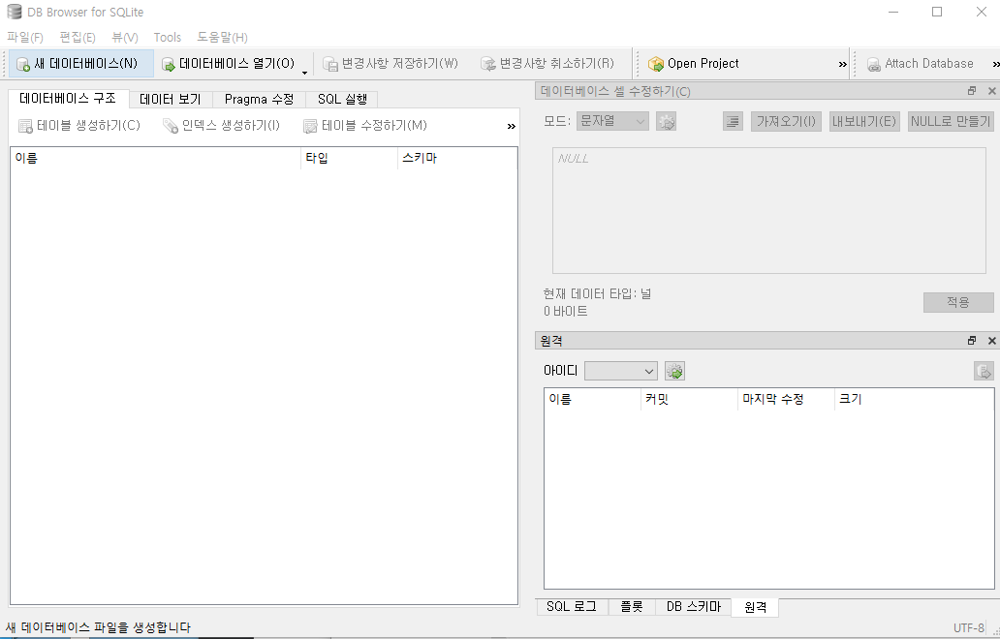

# Android DB

* 각 App 별로 별도의 Table 을 가지고 있음.
* Embedded형태로 개발된 DBMS가 내장
  * SQLite	

## SQLite

* 하나의 File로 만들어진다

  *  Database의 복사 , 이동같은 처리가 쉽다.
  * 속도가 빠르다.
  * 표준 SQL을 지원한다.

* Android DB 확인 하기 위한 [Tool](https://sqlitebrowser.org/) 이 필요

  

### DB 생성

* openOrCreateDatabase( )
  * public static SQLiteDatabase openOrCreateDatabase(File file, SQliteDatabase, CursorFactory factory)

```java
String dbName = etDBName.getText().toString();
//(Name, 읽기/쓰기(MODE_PRIVATE 는 상수로 0이다),
sqLiteDatabase = openOrCreateDatabase(dbName, MODE_PRIVATE, null);
```

* DB경로 확인

  * Device File Explower

    * 경로 - /data/data/App/database

    

### Table 생성

* sql 문 작성
* sqLiteDatabase.execSQL() 이용하여 sql적용

```java
//Table 생성
String tableName = etTableName.getText().toString();
if(sqLiteDatabase == null){
    Log.v(TAG,"DB생성 해주세요");
    return;
}else {
    //DB에 대한 reference가 존재
    //SQL을 이용해서 Database안에 Table 생성
    String sql = "CREATE TABLE IF NOT EXISTS " + tableName + "(_id INTEGER PRIMARY KEY AUTOINCREMENT, name TEXT, age INTEGER, mobile TEXT)";
    //SQL을 어떤 database에서 실행할지 결정
    sqLiteDatabase.execSQL(sql);
    Log.v(TAG,"Table생성");
}
```

### 행 추가

* 각 컬럼에 데이터 추가

```java
String name = etEmpName.getText().toString();
int age = Integer.parseInt(etEmpAge.getText().toString());
String phone = etEmpPhone.getText().toString();
if(sqLiteDatabase == null){
    Log.v(TAG,"DB 생성 해주세요");
    return;
}else {
    String sql ="INSERT INTO emp(name,age,mobile) VALUES" + "('"+name+"',"+age+",'"+phone+"')";
    sqLiteDatabase.execSQL(sql);
    Log.v(TAG,"Data Insert");
}
```

### SELECT 처리

* Select 문을 사용할떄는 sqLiteDatabase.rawQuery() 함수를 이용한다

* Cursor

  * This interface provides random read-write access to the result set returned by a database query

  

```java
String sql = "SELECT _id, name, age, mobile FROM emp";
if(sqLiteDatabase==null){
    Log.v(TAG,"DB 생성 해주세요");
    return;
}else {
    //execSQL() = select 계열이 아닌 SQL문장을 실행할떄 사용.
    //cursor 는 최초 컬럼을 가리키고 있다. 컬럼 에 포함된 데이터를 출력하기 위해서는 cursor 를 내려야하고(다음 데이터가 있으면 true 없으면 false 값을 반환)
    Cursor cursor = sqLiteDatabase.rawQuery(sql,null);
    Log.v(TAG,"empTable ="+cursor.toString());

    while (cursor.moveToNext()){
        //cursor 의 index 값이 Column을 가리킨다
        int id = cursor.getInt(0); // cursor 위치 의 컬럼
        String name1 = cursor.getString(1); //두번째 컬럼
        int age1 = cursor.getInt(2);
        String mobile = cursor.getString(3);

        String result = "레코드 : " + id + "," + name1 + "." + age1 + "," + mobile;

        tvEmpInfo.append(result+"\n");
    }
```

## SQLiteOpenHelper

* SQLiteOpenHelper 를 상속받는 class 가 있어야한다
* onOpen()
  * Database가 Open할때 호출
* onCreate()
  * Database가 존재하지 않아서 생성할떄 호출
* onUpgrade()
  * 기존 DB의 스키마를 변경하는 작업
  * 초창기 앱을 만들어서 배포할떄 DB스키마 생성 -> 앱을 업그래이드해서 다시 배포할떄 DB스키마를 다시 생성하기위해
  * 이전 DB를 drop시키고 새로운 DB를 만드는 작업

```java
class MyDatabaseHelper extends SQLiteOpenHelper{
    String TAG="MyDatabaseHelper";

    public MyDatabaseHelper(@Nullable Context context, @Nullable String dbName, @Nullable SQLiteDatabase.CursorFactory factory, int version) {
        super(context, dbName, null, version);
        //dbName으로 만든 데이터베이스가 없으면 해당 데이터베이스를 생성할떄 version 정보를 같이명시
        //onCreate() 호출 => onOpen()호출
        //db가 기존에 존재하면 onOpen() 만 호출
        //version값 이 기본 만들었을때의 version값 과 다르면 onUpgrade()호출
    }

    @Override
    public void onOpen(SQLiteDatabase db) {
        super.onOpen(db);
        //Database가 Open할때
        Log.v(TAG,"onOpen() Start");
    }

    @Override
    public void onCreate(SQLiteDatabase db) {
        //Database가 존재하지 않아서 생성할떄 호출
        Log.v(TAG,"onCreate() Start");
        //DB Create Code
        //SQL을 이용해서 Database안에 Table 생성
        String sql = "CREATE TABLE IF NOT EXISTS " +"person(_id INTEGER PRIMARY KEY AUTOINCREMENT, name TEXT, age INTEGER, mobile TEXT)";
        //SQL을 어떤 database에서 실행할지 결정
        db.execSQL(sql);
        Log.v(TAG,"Table생성");
    }

    @Override
    public void onUpgrade(SQLiteDatabase db, int oldVersion, int newVersion) {
        //기존 DB의 스키마를 변경하는 작업
        //초창기 앱을 만들어서 배포할떄 DB스키마 생성 -> 앱을 업그래이드해서 다시 배포할떄 DB스키마를 다시 생성하기위해
        //이전 DB를 drop시키고 새로운 DB를 만드는 작업
        Log.v(TAG,"onUpgrade() Start___기존에 있는 db와 version이 다를때 호출");
    }
}
```


## Content Provider

> * 보안 규정때문에 사용
>   * App은 자신의 App안에서 생성한 데이터만 사용 가능
>   * 다른 App이 가지고있는 Data의 접근 권한이 없다.
> * Content Provider 이용하면 다른 App의 데이터에 접근 가능
> * CRUD기반으로 사용됨

* 내용 제공자
* App에서 관리하는 SQLite Datebase를 다른 App이 접근할 수 있도록 해주는 기능
* Content Provider는 Android 구성요소죽의 하나의 Android System에 의해 관리된다.
* AndroidMainfest.xml 에 등록해서 사용.

1. Content Provider 생성

   * CRUD 제공

   * URI Authoritise - 다른 App이 해당 App을 찾기 위한 고유 값 (URI 형식으로 이름을 명시한다)
     * 중복이 되면 안된다
   * URI 형싱
     * content://Authority/BASE_PATH(테이블 이름)/#숫자(레코드 번호)
       * 예) content://com.exam.person.provider/person/1
   * onCreate() mehod
     * App 실행시 PersonDatabaseHelper 객체를 생성하여 DB 를 만든다

   ```java
   package com.example.androidlectureexample;
   
   import android.content.ContentProvider;
   import android.content.ContentValues;
   import android.database.Cursor;
   import android.database.sqlite.SQLiteDatabase;
   import android.net.Uri;
   import android.util.Log;
   
   public class SubContentProvider extends ContentProvider {
       String TAG = "SubContentProvider";
       SQLiteDatabase sqLiteDatabase;
       //URI 형싱 (Content Provider를 찾기 위한 특수한 문자열
       // content://Authority/BASE_PATH(테이블 이름)/#숫자(레코드 번호)
       // 예) content://com.exam.person.provider/person/1
       public SubContentProvider() {
       }
   
       @Override
       public int delete(Uri uri, String selection, String[] selectionArgs) {
           // Implement this to handle requests to delete one or more rows.
           throw new UnsupportedOperationException("Not yet implemented");
       }
   
       @Override
       public String getType(Uri uri) {
           // TODO: Implement this to handle requests for the MIME type of the data
           // at the given URI.
           throw new UnsupportedOperationException("Not yet implemented");
       }
   
       @Override
       public Uri insert(Uri uri, ContentValues values) {
           Log.v(TAG,"insert()_Start");
           //database Table 에 insert 하는 방법중 하나, SQL문을 이용하지 않음
           // values에 key, value형태로 임력할 데이터 명시. (key, null, values)
           sqLiteDatabase.insert("person",null,values);
           return uri;
       }
   
       @Override
       public boolean onCreate() {
           //App이 실행되면 호출됨
           // TODO: Implement this to initialize your content provider on startup.
           Log.v(TAG,"onCreate()_Start");
           //Database 생성및 Table 생성에 관한 Code가 나ㅏㅗ면 된다
           PersonDatabaseHelper helper = new PersonDatabaseHelper(getContext());
           //Database reference 를 획득하는 코드
           sqLiteDatabase=helper.getWritableDatabase();
           return false;
       }
   
       @Override
       public Cursor query(Uri uri, String[] projection, String selection,
                           String[] selectionArgs, String sortOrder) {
           // TODO: Implement this to handle query requests from clients.
           throw new UnsupportedOperationException("Not yet implemented");
       }
   
       @Override
       public int update(Uri uri, ContentValues values, String selection,
                         String[] selectionArgs) {
           // TODO: Implement this to handle requests to update one or more rows.
           throw new UnsupportedOperationException("Not yet implemented");
       }
   }
   
   ```

2. AndroidMainfest.xml 확인

   ```xml
   <provider
             android:name=".SubContentProvider"
             android:authorities="com.exam.person.provider"
             android:enabled="true"
             android:exported="true"
             android:readPermission="com.exam.person.provider.READ_DATABASE"
             android:writePermission="com.exam.person.provider.WRITE_DATABASE"/>
   ```

   * permission추가

   ```xml
   <permission
               android:name="com.exam.person.provider.READ_DATABASE"
               android:protectionLevel="normal"/>
   <permission
               android:name="com.exam.person.provider.WRITE_DATABASE"
               android:protectionLevel="normal"/>
   ```

3. SQLiteOpenHelper class

   * 생성자로 초기화하고 호출하면 person.db 생성 됨
   * ContentValues 객체에 데이터베이스 테이블에 맞게 자료를 입력한 후, SQLiteDatabase 클래스의 insert()메소드를 사용하여 데이터베이스에 새로운 레코드를 추가

   ```java
   package com.example.androidlectureexample;
   
   import androidx.annotation.Nullable;
   import androidx.appcompat.app.AppCompatActivity;
   
   import android.content.ContentValues;
   import android.content.Context;
   import android.database.sqlite.SQLiteDatabase;
   import android.database.sqlite.SQLiteOpenHelper;
   import android.net.Uri;
   import android.os.Bundle;
   import android.util.Log;
   import android.view.View;
   import android.widget.Button;
   import android.widget.EditText;
   import android.widget.TextView;
   
   public class ContentProviderActivity extends AppCompatActivity {
       String TAG="ContentProviderActivity";
       TextView tvEmpInfo;
       EditText etEmpName;
       EditText etEmpAge;
       EditText etEmpPhone;
       Button btnInsertInfo;
       Button btnEmpCall;
       @Override
       protected void onCreate(Bundle savedInstanceState) {
           super.onCreate(savedInstanceState);
           setContentView(R.layout.activity_content_provider);
           tvEmpInfo=findViewById(R.id.tvEmpInfo);
   
           etEmpName=findViewById(R.id.etEmpName);
           etEmpAge=findViewById(R.id.etEmpAge);
           etEmpPhone=findViewById(R.id.etEmpPhone);
   
           btnInsertInfo=findViewById(R.id.btnInsertInfo);
           btnInsertInfo.setOnClickListener(mClick);
           btnEmpCall=findViewById(R.id.btnEmpCall);
           btnEmpCall.setOnClickListener(mClick);
       }
   
       View.OnClickListener mClick = new View.OnClickListener(){
           @Override
           public void onClick(View v) {
               switch (v.getId()){
                   case R.id.btnInsertInfo:
                       //Data 입력
                       //content provider를 찾아야함 => cp를 통해 insert작업
                       String uriString = "content://com.exam.person.provider/person";
                       Uri uri = new Uri.Builder().build().parse(uriString);
                       //HashMap형테로 데이터 베이스에 입력할 데이터를 저장
                       ContentValues values = new ContentValues();
                       //put(column, value)
                       values.put("name","홍길동");
                       values.put("age",20);
                       values.put("mobile","010-5555-6666");
                       getContentResolver().insert(uri,values);
                       Log.v(TAG,"데이터 입력");
                       break;
               }
           }
       };
   }
   //1.SQLite를 이용하기 때문에 SQLiteOpenHelper class를 이용해서 DB 이용
   class PersonDatabaseHelper extends SQLiteOpenHelper{
       String TAG="PersonDatabaseHelper";
   
       public PersonDatabaseHelper(@Nullable Context context) {
           super(context, "person.db", null, 2);
       }
   
       @Override
       public void onCreate(SQLiteDatabase db) {
           Log.v(TAG,"onCreate()_Start");
           //Database가 초기에 만들어지는 시점에 Table 을 같이 만든다.
           //DB Create Code
           //SQL을 이용해서 Database안에 Table 생성
           String sql = "CREATE TABLE IF NOT EXISTS " +"person(_id INTEGER PRIMARY KEY AUTOINCREMENT, name TEXT, age INTEGER, mobile TEXT)";
           //SQL을 어떤 database에서 실행할지 결정
           db.execSQL(sql);
           Log.v(TAG,"Table생성");
       }
   
       @Override
       public void onUpgrade(SQLiteDatabase db, int oldVersion, int newVersion) {
           Log.v(TAG,"onUpgrade()_Start");
       }
   }
   ```

   

## Content Resolver

* Content Provider

```java
    @Override
    public Cursor query(Uri uri, String[] projection, String selection,
                        String[] selectionArgs, String sortOrder) {
        // 1 번쨰 인자 = table 명 ,
        // 2 번째 인자 = projection(select에서 가져올 컬렴명을 문자열로 표현)
        // 3 번째 인자 = selection(where절 조건 명시)
        // 4 번째 인자 = selection 의 In Parameter의 값
        // 5 번째 인자 = groun by
        // 6 번째 인자 = having절
        // 7 번째 인자 = wjdfuf qkdqjq
        Cursor cursor = sqLiteDatabase.query(
                "person", projection, selection, selectionArgs,null,null, sortOrder);
        return cursor;
    }
```

* Activity

```java
    //select code
    Log.v(TAG,"onClick()_DB Test");
    //1.DB 처리 기능을 제공하는 Content Provider를 찾는다
    //Content Provider를 찾기 위한 URI가 있어야한다
    String uriString1 = "content://com.exam.person.provider/person";
    Uri uri1 = new Uri.Builder().build().parse(uriString1);
    //2. uri를 이용해서 Content provider를 찾아서 특정 method를 호출
    //column을 표현하기 위한 String[]을 생성
    // select name, age, mobile from person where xxxx
    String[] columns = new String[]{"name","age","mobile"};
    //(uri, column, selection, selectionArgc, 정렬 방향)
    Cursor cursor = getContentResolver().query(
        uri1, columns, null, null,"name ASC");
    //성공하면 Database table에서 결과 record의 집합을 가져옴
    while (cursor.moveToNext()){
        String name = cursor.getString(0);
        int age = cursor.getInt(1);
        String mobile = cursor.getString(2);
        String result = "record ="+name+","+age+","+mobile+"\n";
        tvEmpInfo.append(result);
    }
```

## Android 주소록 접근


## 참고자료

[Android Developer SQLite](https://developer.android.com/reference/android/database/sqlite/SQLiteDatabase)

[Android Developer Cursor](https://developer.android.com/reference/android/database/Cursor)

[cursor](http://antdroidth.blogspot.com/2015/12/crud-sqlite-database-content-value.html)

[ContentValuse](https://androidhuman.tistory.com/210)