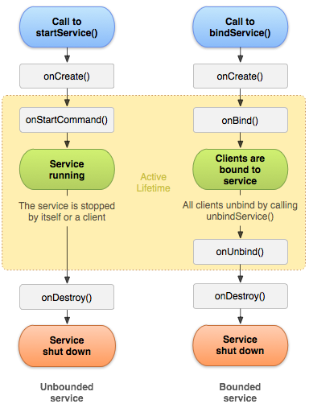

# Service

* App이 실행되었다고 해서 항싱 Activity가 보이는건 아니다
  * kakaoTalk, Mellon.....
* Service는 화면이 없는 Activity이다.
* App이 종료되면 Activiti는 종료 되지만 Service는 종료 되어도 Logic처리를 하면 Background에서 동작이 된다
  * ex) kakao
  * broadcast를 함께 해야함

## Lifcycle

* Activity
  1. onCreate()
  2. onStart()
  3. onResume()
  4. onPause90
  5. onStop90

* Service
  1. onCreate()
  2. onStartCommand()
  3. onDestroy()

 


## Service생성

* xml이 없다
* service 파일은 2가지
  * 재사용 서비스
  * 1회용 서비스
* Exported 를 Check하면 다른 App에서 해당 Service를 쓸수있게 하는 설정
* Enabled 를 Check해야 Service를 사용 할 수 있음.
* Service 객체 생성
  * onCreate() -> onStarcCommend()호출
  * Service 생성 시작할때 Service 객체가 존재하고 있으면onStartCommand()호출 된다.

```
2020-03-26 14:27:07.411 21365-21365/com.example.androidlectureexample V/ServiceLifecycleActivity: onClick_btnStartandroidx.appcompat.widget.AppCompatButton{f9516e7 VFED..C.. ...P.... 0,0-1080,126 #7f070055 app:id/btnStart}
2020-03-26 14:27:07.429 21365-21365/com.example.androidlectureexample V/SubServiceLifecycle: onCreate()==Service객체가 생성될떄 호출
2020-03-26 14:27:07.431 21365-21365/com.example.androidlectureexample V/SubServiceLifecycle: onStartCommand()==실제 서비스 동작을 수행하는 부분
2020-03-26 14:27:08.138 21365-21365/com.example.androidlectureexample D/ViewRootImpl@80e46d0[ServiceLifecycleActivity]: ViewPostIme pointer 0
2020-03-26 14:27:08.237 21365-21365/com.example.androidlectureexample D/ViewRootImpl@80e46d0[ServiceLifecycleActivity]: ViewPostIme pointer 1
2020-03-26 14:27:08.239 21365-21365/com.example.androidlectureexample V/ServiceLifecycleActivity: onClick_btnStartandroidx.appcompat.widget.AppCompatButton{f9516e7 VFED..C.. ...P.... 0,0-1080,126 #7f070055 app:id/btnStart}
2020-03-26 14:27:08.255 21365-21365/com.example.androidlectureexample V/SubServiceLifecycle: onStartCommand()==실제 서비스 동작을 수행하는 부분
```

## Service 에서 Thread 이용

* Thread를 이용해 Logic처리
* Thread run() method 한번 실행하고 다시 실행 하면 Err발생한다
  * Thread를 한번 실행되고 작업이 수행 되고나면 DEAD상태가 된다
    * DEAD상태에서 다시 실행 시킬수 있는 방법이 없다.
    * 다시 Thread를 실행 하려면 Thread를 다시 생성 해서 실행 해야한다.

```java
package com.example.androidlectureexample;

import android.app.Service;
import android.content.Intent;
import android.os.IBinder;
import android.util.Log;

public class SubServiceLifecycle extends Service {
    String TAG = "SubServiceLifecycle";
    private  Thread thread = new Thread(new Runnable() {
        @Override
        public void run() {
            //Thread가 시작되면 1초 동작하고 sleep 하고 log를 이용해 숫자 출력
            for(int i=0; i<10; i++){
                try {
                    Thread.sleep(1000);
                    Log.v(TAG,"현재 숫자=="+i);
                }catch (Exception e){
                    Log.v(TAG,e.toString());
                }
            }
        }
    });

    public SubServiceLifecycle() {
    }
    //Service객체가 생성될떄 호출
    @Override
    public void onCreate() {
        Log.v(TAG,"onCreate()==Service객체가 생성될떄 호출");
        super.onCreate();
    }
    //실제 서비스 동작을 수행하는 부분  conCreate() -> onStartCommend()
    //Service가 하는 일은 1초간격으로 1부터 시작해서 10까지 숫자를 Log로 출력 하는 로직 작성
    @Override
    public int onStartCommand(Intent intent, int flags, int startId) {
        Log.v(TAG,"onStartCommand()==실제 서비스 동작을 수행하는 부분");
        thread.start();

        return super.onStartCommand(intent, flags, startId);
    }
    //Service객체가 메모리에서 사라질때 호출
    @Override
    public void onDestroy() {
        Log.v(TAG,"onDestroy()==Service객체가 메모리에서 사라질때 호출");
        super.onDestroy();
    }

    @Override
    public IBinder onBind(Intent intent) {
        // TODO: Return the communication channel to the service.
        throw new UnsupportedOperationException("Not yet implemented");
    }
}
```

* Thread 선언 위치 를 onStartCommand() 안으로 

```java
 @Override
    public int onStartCommand(Intent intent, int flags, int startId) {
        Log.v(TAG,"onStartCommand()==실제 서비스 동작을 수행하는 부분");
        thread = new Thread(new Runnable() {
            @Override
            public void run() {
                //Thread가 시작되면 1초 동작하고 sleep 하고 log를 이용해 숫자 출력
                for(int i=0; i<10; i++){
                    try {
                        Thread.sleep(1000);
                        Log.v(TAG,"현재 숫자=="+i);
                    }catch (Exception e){
                        Log.v(TAG,e.toString());
                    }
                }
            }
        });
        //Thread가 가지고 있는 run() method가 호출
        thread.start();

        return super.onStartCommand(intent, flags, startId);
    }
```

* Thread 생성하지 않고 사용할때
  * for문이 작업 수행이 끝날떄까지 UI Thread 작업을 할수 없다

```java
@Override
    public int onStartCommand(Intent intent, int flags, int startId) {
        Log.v(TAG,"onStartCommand()==실제 서비스 동작을 수행하는 부분");
        for(int i=0; i<10; i++){
            try {
                Thread.sleep(1000);
                Log.v(TAG,"현재 숫자=="+i);
            }catch (Exception e){
                Log.v(TAG,e.toString());
            }
        }
        return super.onStartCommand(intent, flags, startId);
    }
```


학습 해야할것

App이 죽을떄 알아서 Service가 살아나게

Service에서 Acitivicy로 데이터 전달


네트워크 TCP - 체팅

IO