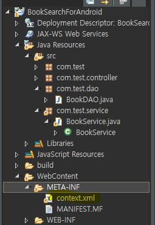

# 도서검색

## android Setting

* Network 연결
  * UI Thread(Activity)에서 작업하면 안된다
  * Thread를 활용해 동작
  * Thread와 데이터를 주고받기 위해서 Handler를 이용

1. 접속할 URL

2. Java NetWork 기능은 외부 조건으로 의해 수행이 안될수 있음

   * try,catch이 용해 예외처리 해야함

3. URL Instance생성

4. URL 객체를 이용해 접속 

5. web Application의 호출방식 설정(GET,POST)

6. 접속 확인(ResponseCode)

   * HTTP protocol로 접속할 때 접속 결과 상태 값

7. AndroidMainfaest.xml

   * 네트워크 접속위한 보안 설정

   ```xml
   <manifest xmlns:android="http://schemas.android.com/apk/res/android"
       package="com.example.androidlectureexample">
       <uses-permission android:name="android.permission.INTERNET"/>
   ```

   * HTTPS protocol(Android pie버전(Android 9)으로 넘어오면서 HTTP에서 HTTPS로 바뀜)
     * web Protocol에 대한 기본 HTTP에서 HTTPS로 변경
     * web Server가 HTTPS를 사용하고 있으면 적용 안해줘도 되지만 HTTP를 이용하면 적용시켜줘야함
       * http://localhost:8080/bookSearch/searchTitle?keyword=java
       * https://local

   ```xml
   <application
           android:usesCleartextTraffic="true"
   ```

8. 서버와의 연결객체를 이용해서 데이터 통로 설정 (=Java Stream)

   * 기본적인 연렬 객체InputStreamReader(conn.getInputStream()) 를new BufferedReader() 객체에 담아서 편의성을 높여 사용

   ```java
   BufferedReader bufferedReader = new BufferedReader(new InputStreamReader(conn.getInputStream()));
   ```

   * 서버가 보내주는 데이터를 읽어 하나의 문자열러 파싱

   ```java
   String readLine = "";
               StringBuffer responseText = new StringBuffer();
               while ((readLine=bufferedReader.readLine())!=null){
                   responseText.append(readLine);
               }
               bufferedReader.close();
   ```

9. webServer로 부터 가져온 데이터(문자열)를 자료구조화 시켜서 안드로이드에 적용

   * Json parsing library => Jackson library
   * build.gradle

   ```
   dependencies {
       implementation 'com.fasterxml.jackson.core:jackson-core:2.9.7'
       implementation 'com.fasterxml.jackson.core:jackson-annotations:2.9.7'
       implementation 'com.fasterxml.jackson.core:jackson-databind:2.9.7'
   ```

   ```java
   ObjectMapper mapper = new ObjectMapper();
               String[] resultArr = mapper.readValue(responseText.toString(),String[].class);
   ```

   

ㅠㅛ지이미지 제목 저자 가격 isbn(고유번호)


## System

> DBMS - MySQL
>
> webServer - servlet MVC2
>
> Android

### Databse

* Database - library
  * library - Book Table

1. MySQL Server 접속

```
Microsoft Windows [Version 10.0.18362.239]
(c) 2019 Microsoft Corporation. All rights reserved.

C:\Users\student\Desktop\mysql-5.6.47-winx64\lib>cd C:\Users\student\Desktop\mysql-5.6.47-winx64\bin

C:\Users\student\Desktop\mysql-5.6.47-winx64\bin>mysqld
2020-03-23 10:22:13 0 [Warning] TIMESTAMP with implicit DEFAULT value is deprecated. Please use --explicit_defaults_for_timestamp server option (see documentation for more details).
2020-03-23 10:22:13 0 [Note] --secure-file-priv is set to NULL. Operations related to importing and exporting data are disabled
2020-03-23 10:22:13 0 [Note] mysqld (mysqld 5.6.47) starting as process 10892 ...
```


### web

> WAS - Tomcat 7.0
>
> Eclipse

1. Dynamic web Project 생성

   * new project - Dynamic webproject - projectName - Context root(default는 project name)-finish
     * Context root  - web상에 프로젝트를 지칭하기 위해 사용되는 논리적 이름(한들, 특수문자 사용 X)

2. MVC pattern 으로 Web Application 구현

   * Servlet 이용해서 기능 만들기 (도서검색, 제목 검색, 등등등)

     * Web에서 동작하는 java program = Servlet

   * keyword를 입력받아 키워드가 들어있는 책을 찾아 출력

      

      

   * url mapping - 웹 프로그램을 클라이언트가 웹 상에서 지칭하기 위해 사용되는 놀리적 이름

     * "/" 로 시작

      

   * Servlet code

   ```jade
   package com.test;
   
   import java.io.IOException;
   import javax.servlet.ServletException;
   import javax.servlet.annotation.WebServlet;
   import javax.servlet.http.HttpServlet;
   import javax.servlet.http.HttpServletRequest;
   import javax.servlet.http.HttpServletResponse;
   /**
    * Servlet implementation class BookTitleSearch
    */
   @WebServlet("/searchTitile")
   public class BookTitleSearch extends HttpServlet {
   	private static final long serialVersionUID = 1L;
       /**
        * @see HttpServlet#HttpServlet()
        */
       public BookTitleSearch() {
           super();
           // TODO Auto-generated constructor stub
       }
   	/**
   	 * @see HttpServlet#doGet(HttpServletRequest request, HttpServletResponse response)
   	 */
   	protected void doGet(HttpServletRequest request, HttpServletResponse response) throws ServletException, IOException {
   			//1.입력받고
   		//2.로직처리
   		//3.출력
   		//3-1 클라이언트에 처리된 결과에 대한 종류 , 인코딩에대한 정보를 알려줌
   		//일반 문자열이 결과로 출력되고 사용하는 인코딩은 utf-8
   		response.setContentType("text/plain; charset=utf-8");
   		//3-2 클라이언트에게 결과를 보내주기 위한 데이터 통로
   		PrintWriter out = response.getWriter();
   		//3-3 데이터 통로(Stream)을 통해서 데이터 출력
   		out.print("안녕하세요");
   		out.print("두번째 인사");
   		//3-4 보낼 데이터가 다 준비되면 특정 method를 이용해서 보낸다
   		out.flush();
   		//3-5 처리가 끝나고 나면 닫아준다.
   		out.close();
   	}
   	/**
   	 * @see HttpServlet#doPost(HttpServletRequest request, HttpServletResponse response)
   	 */
   	protected void doPost(HttpServletRequest request, HttpServletResponse response) throws ServletException, IOException {
   		// TODO Auto-generated method stub
   		doGet(request, response);
   	}
   }
   ```

   * GET, POST

     * GET 

       * browser를 이용해서 URL을 입력한 후 호출
       * URL link를 클릭해서 Sevlet호출

     * POST

       * HTML <form> 에서 method를 POST를 명시하는 경우
       * 이 경우를 빼고 나마지는모두 GET방식 이다.

     * 특징

       * GET

         * 프로그램에게 데이터를 전달하기 위해서 URL을 이용 (?keyword=java)

         ```
         http://localhost:8080/bookSearch/search?keyword=java
         ```

         * 편하게 사용 가능
         * 전달하는 데이터 크기의 한계
         * 보안성이 약함

       * POST

         * Protocol의 head안에 전달하는 데이터가 포함되어 전달.
         * 전달하는 데이터의 크기에 제한이 없다.
         * 보안성이 GET방식에 비해 높다.

   * Model1 방식

     * 입력,로직,출력 코드가 하나의 method안에 작성하는것
     * 처음 작성하기 쉽고 바른 방식
     * 유지보수 X

   * Model2 방식

     * MVC

   * Transection

     * 일의 최소단위

     ```
     이체 
     --A에서 B로 5000원 이체--
     1.A계좌에 5000원이 있는지 select
     2.B계좌가 존재하는지 확인 select
     3.A계좌의 잔액에서 5000원을 차감 update
     4.B계좌의 잔액에서 5000원을 증가 update
     ```

     * 코드상에서 Transaction설정 이유

       1. DBMS에서 **ACID**를 보장 받을 수 있다.

          * ACID(atomicity, consistency, isolation, durability) - Transaction처리만 해주면DBMS에서 알아서 처리해줌

            * atomicity - all or notihing 

            ```
            예제 처럼 작업도중 3번실행중 정전이 나거나 err가 날시 1,2번 작업이 없던걸로 처리
            ```

            * consistency - DB의 일관성 보장
            * isolation - 하나의 Data를 가지고 처리할때 다른 데이터가 영향받지않음

            ```
            영화 좌석 예매 처리 할때 (동일한 자리를 동시 접근할때)
            ```

            * durability - 영구성(데이터 처리가 끝날때 저장)

* DB연결 xml파일

 

```xml
<?xml version="1.0" encoding="UTF-8"?>
<Context>
    <!-- Default set of monitored resources -->
	<WatchedResource>WEB-INF/web.xml</WatchedResource>
	<Resource type="javax.sql.DataSource" 
			  name="jdbc/mySQLDB" auth="Container"
			  username="rdata" 
			  password="rdata" 
			  driverClassName="com.mysql.jdbc.Driver"
			  url="jdbc:mysql://127.0.0.1:3306/library?characterEncoding=UTF-8" />
</Context>
```

 

* 컨텍스트 root


2. Eclipse Web Server 동작 확인


3. Android NetWork 접속 code 설정


# 참고

[Android JSON](https://dpdpwl.tistory.com/23)

[ListView 파싱](https://webnautes.tistory.com/471)