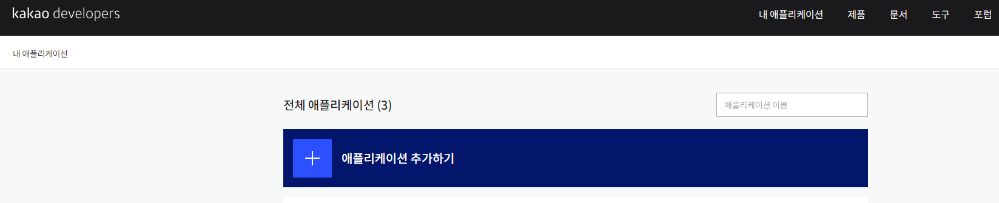
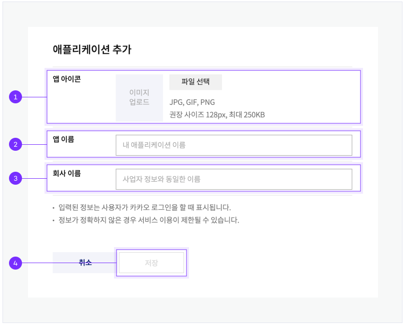
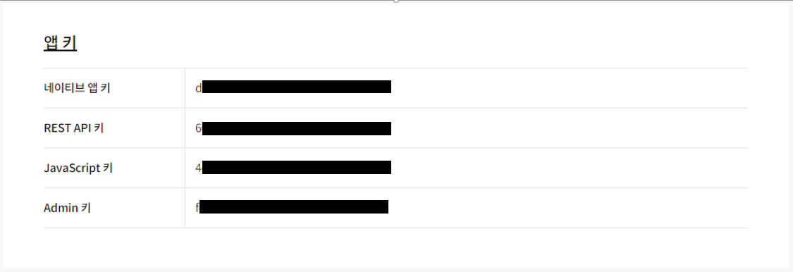
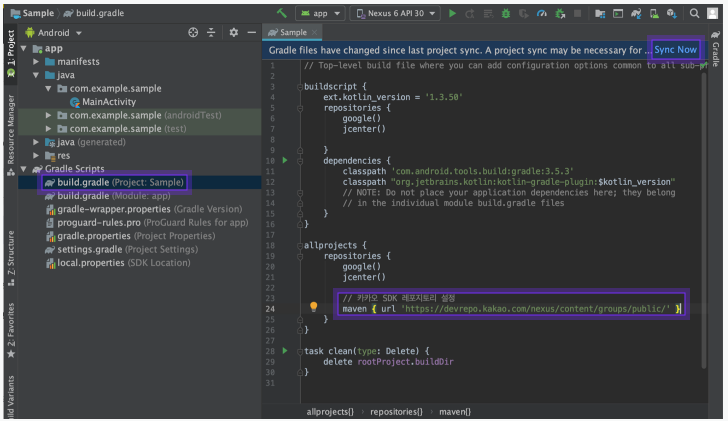
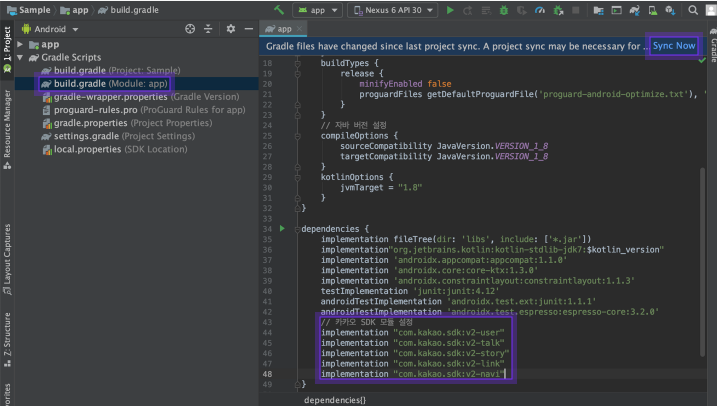
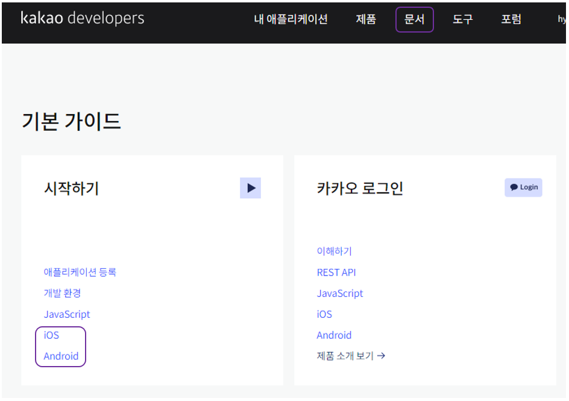
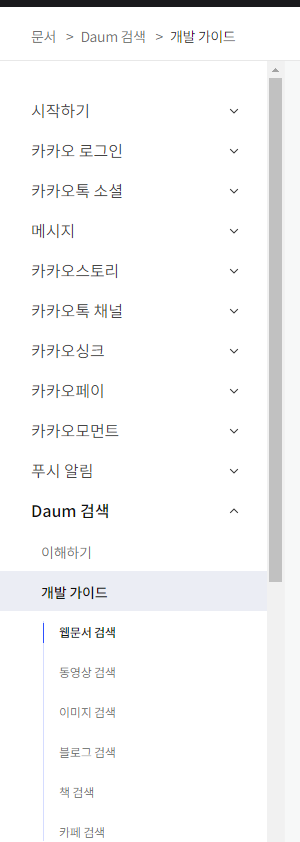

# Kakao_Developers


## 앱 키 발급

* [Kakao Developers](https://developers.kakao.com/)  - 회원가입 - 제품 - 사용할 API선택 - 시작- 애플리케이션 추가하기 - 저장

* 앱 키 생성 과정

  * 애플리케이션 추가하기

    

  * 앱 이름/ 사업자명 작성

     

    1. 앱 아이콘
    2. 앱 이름
    3. 회사 이름

  * 앱 키 생성 확인

     

    

 ## API사용

* Gradle  설정

  * 프로젠트 Gradle 설정

  ```groovy
  maven { url 'https://devrepo.kakao.com/nexus/content/groups/public/' }
  ```

  

  * 모듈 레벨의 Gradle 설정

  ```groovy
  dependencies {
    implementation "com.kakao.sdk:v2-user:2.0.5" // 카카오 로그인
    implementation "com.kakao.sdk:v2-talk:2.0.5" // 친구, 메시지(카카오톡)
    implementation "com.kakao.sdk:v2-story:2.0.5" // 카카오스토리
    implementation "com.kakao.sdk:v2-link:2.0.5" // 메시지(카카오링크)
    implementation "com.kakao.sdk:v2-navi:2.0.5" // 카카오내비
  }
  ```

  


* 개발 문서 확인
  * 문서 - API 개발 가이드 - 해당 API - API TEST / 개발 문서 확인

    * 기본 가이드

    

    * API 가이드

    ​     

    

     

  

 ## Reference

[Kakao Developers](https://developers.kakao.com/docs/latest/ko/getting-started/sdk-android)

 