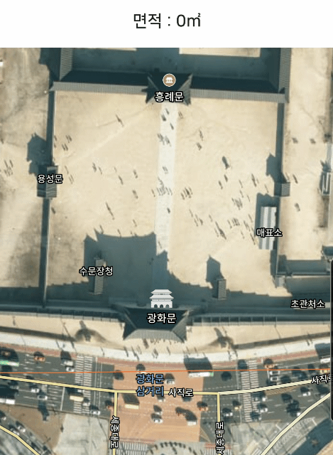
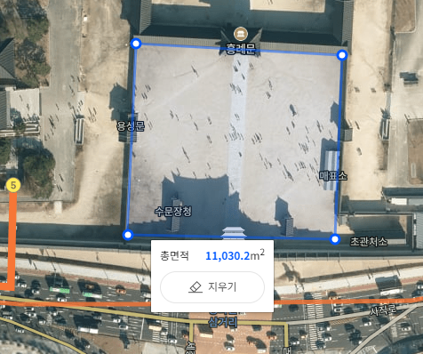

# NAVER_MAP


## 기본 코드

* 의존성

  * Gradle - 루트 프로젝트

  ```groovy
  allprojects {
      repositories {
          google()
          jcenter()
  
          // 네이버 지도 저장소
          maven {
              url 'https://navercorp.bintray.com/maps'
          }
      }
  }
  ```

  * Gradle - 앱 모듈

  ```groovy
  dependencies {
      // 네이버 지도 SDK
     	implementation 'com.naver.maps:map-sdk:3.8.0'
  }
  ```

* AndroidManifest.xml

  * name - com.naver.maps.map.CLIENT_ID
  * value - 발븝받은 클라이언트 ID를 지정

  ```xml
  <manifest>
      <application>
          <meta-data
              android:name="com.naver.maps.map.CLIENT_ID"
              android:value="YOUR_CLIENT_ID_HERE" />
      </application>
  </manifest>
  ```


* Image

 

* Basic Code

  * main.xml

  ```xml
  <?xml version="1.0" encoding="utf-8"?>
  <LinearLayout xmlns:android="http://schemas.android.com/apk/res/android"
    android:layout_width="match_parent"
    android:layout_height="match_parent"
    android:orientation="vertical">
    <RelativeLayout
      android:layout_width="match_parent"
      android:layout_height="match_parent">
      <com.naver.maps.map.MapView
        android:id="@+id/map_view"
        android:layout_width="match_parent"
        android:layout_height="match_parent"
        android:layout_below="@id/search_layout" />
      <androidx.recyclerview.widget.RecyclerView
        android:id="@+id/search_text_recycler_view"
        android:layout_width="match_parent"
        android:layout_height="wrap_content"
        android:layout_below="@id/search_layout" />
    </RelativeLayout>
  </LinearLayout>
  ```

  * MainActivity

  ```java
  public class MainActivity extends AppCompatActivity {
      
      @BindView(R.id.map_view)
    	MapView mMapView;
      
      @Override
      protected void onCreate(Bundle savedInstanceState) {
          super.onCreate(savedInstanceState);
          setContentView(R.layout.activity_main);
  
          mMapView.getMapAsync(this);
  
  	}
      @Override
    	public void onMapReady(@NonNull NaverMap naverMap) {
      // 네이버 지도 Ready
          setMarker(naverMap,37.478088,126.881517);
    	}
      
      private void setMarker(
          @NonNull NaverMap naverMap, 
          Double latitude, 
          Double longitude){
          
      	Marker marker = new Marker();
      	InfoWindow infoWindow = new InfoWindow();
          marker.setPosition(new LatLng(latitude, longitude));
          //원금감 표시
          marker.setIconPerspectiveEnabled(true);
         
          marker.setCaptionColor(R.color.color_ffffff);
          marker.setCaptionTextSize(9);
          marker.setMap(naverMap);
  		//Marker Touch Event
          marker.setOnClickListener(new Overlay.OnClickListener() {
            	@Override
            	public boolean onClick(@NonNull Overlay overlay) {
              	Timber.i("MARKER");
                  //InfoWindow 호출
                  infoWindow.setAdapter(
                      new InfoWindow.DefaultTextAdapter(
                          getActivity().getApplication()) {
              		@NonNull
              		@Override
              		public CharSequence getText(@NonNull InfoWindow infoWindow) {
                			return "InfoWindow";
              		}
            		});
            		infoWindow.open(marker);
              	return false;
            	}
          });
    	}
      
       /**
   * Naver Map Polygon Overlay
     *
     * @param naverMap
     */
    private void setPolygonOverlay(@NonNull NaverMap naverMap) {
      //Naver Map Polygon Overlay
      PolygonOverlay polygonOverlay = new PolygonOverlay();
  
      List<LatLng> latLngs = new ArrayList<>();
  
      for (int i = 0; i < areaPointList.size(); i++) {
        latLngs.add(new LatLng(Double.parseDouble(areaPointList.get(i).getLat()), Double.parseDouble(areaPointList.get(i).getLng())));
      }
  
      polygonOverlay.setCoords(latLngs);
      polygonOverlay.setColor(Color.parseColor("#26F95959"));
      polygonOverlay.setOutlineColor(Color.RED);
      polygonOverlay.setOutlineWidth(5);
      polygonOverlay.setMap(naverMap);
  
      polygonList.add(polygonOverlay);
  
      if (polygonList.size() > 1) {
        Timber.i("remove polygonOverlay");
        polygonList.get(0).setMap(null);
        polygonList.remove(0);
      }
  
      //polygon Click Event
      polygonOverlay.setOnClickListener(new PolygonOverlay.OnClickListener() {
        @Override
        public boolean onClick(@NonNull Overlay overlay) {
          Timber.i("PolygonOverlay");
          return false;
        }
      });
    }
  }
  ```
  
  

## 좌표값을 이용한 면적 계산

* 면적 계산 이미지

   

* Naver Map 면적 측정 이미지(https://map.naver.com/)

   

* 네이버 지도의 onMapClick() 이벤트를 이용해 좌표 값을 얻는다.

```java
@Override
public void onMapReady(@NonNull NaverMap naverMap) {
    mNaverMap = naverMap;
    // 네이버 지도 Ready

    //Camera Move
    try {
        naverMap.moveCamera(CameraUpdate.scrollTo(new LatLng(mLat, mLng)));
        naverMap.moveCamera(CameraUpdate.zoomTo(mZoom));
    } catch (Exception e) {
        naverMap.moveCamera(CameraUpdate.scrollTo(new LatLng(37.566680, 126.978406)));
        naverMap.moveCamera(CameraUpdate.zoomTo(13));
    }
    UiSettings uiSettings = naverMap.getUiSettings();
    //Map Ypte
    naverMap.setMapType(NaverMap.MapType.Hybrid);
    //zoom button
    uiSettings.setZoomControlEnabled(false);
    //scale bar
    uiSettings.setScaleBarEnabled(false);
    //map tilt
    uiSettings.setTiltGesturesEnabled(false);
    //베어링 degree
    uiSettings.setRotateGesturesEnabled(false);
    //Naver Logo Click
    uiSettings.setLogoClickEnabled(false);

    mNaverMap.setOnMapClickListener(new NaverMap.OnMapClickListener() {
        @Override
        public void onMapClick(@NonNull PointF pointF, @NonNull LatLng latLng) {
            Timber.i("=========latLng.latitude= %s", latLng.latitude);
            Timber.i("=========latLng.longitude= %s", latLng.longitude);
            setMarker(mNaverMap, latLng.latitude, latLng.longitude, R.drawable.i_round2);

            mLatLngList.add(new LatLng(latLng.latitude, latLng.longitude));
            if (mLatLngList.size() > 2) {

                if (mPolyLineList.size() > 1) {
                    for (PolylineOverlay polylineOverlay : mPolyLineList) {
                        polylineOverlay.setMap(null);
                    }
                    mPolyLineList.clear();
                }
                for (PolygonOverlay polygonOverlay : mPolygonList) {
                    polygonOverlay.setMap(null);
                }
                mPolygonList.clear();
                setPolygonOverlay(mNaverMap, mLatLngList);
            }
            if (mLatLngList.size() > 1 && mLatLngList.size() < 3) {
                Timber.i("=-========");
                setPolyLine(mNaverMap, mLatLngList);
            }
        }
    });
}

```

* PolygonOver  를 그려주는 Method

```java

/**
   * set polygon
   *
   * @author khh
   * @since 1/7/21
   **/
private void setPolygonOverlay(@NonNull NaverMap naverMap, List<LatLng> mLatLngList) {
    //Naver Map Polygon Overlay
    PolygonOverlay polygon = new PolygonOverlay();
    polygon.setCoords(mLatLngList);
    polygon.setColor(Color.parseColor("#50FF7B00"));
    polygon.setOutlineWidth(10);
    polygon.setOutlineColor(getColor(R.color.color_FF7B00));
    polygon.setMap(naverMap);
    mPolygonList.add(polygon);
    polygon.setOnClickListener(new Overlay.OnClickListener() {
        @Override
        public boolean onClick(@NonNull Overlay overlay) {
            return false;
        }
    });

    double result = computeArea(mLatLngList);
    Timber.i("===SIZE RESULT===" + roofSize);
    DecimalFormat decimalFormat = new DecimalFormat("###,###.##");
    roofSize = decimalFormat.format(result);
    mResultRoofSizeTextView.setText(roofSize);
}


/**
   * setPolyLine
   * Reference - https://navermaps.github.io/android-map-sdk/guide-ko/5-2.html
   *
   * @author khh
   * @since 1/7/21
   **/
private void setPolyLine(@NonNull NaverMap naverMap, List<LatLng> mLatLngList) {
    PolylineOverlay polyline = new PolylineOverlay();
    polyline.setCoords(mLatLngList);
    polyline.setWidth(10);
    polyline.setColor(getColor(R.color.color_FF7B00));
    polyline.setMap(naverMap);
    mPolyLineList.add(polyline);
}

private void setMarker(@NonNull NaverMap naverMap,
                       Double latitude,
                       Double longitude,
                       int image) {
    Timber.i("=======================setMarker=======================");
    Marker marker = new Marker();
    marker.setPosition(new LatLng(latitude, longitude));
    //원금감 표시
    marker.setIconPerspectiveEnabled(true);
    //아이콘 지정
    marker.setIcon(OverlayImage.fromResource(image));
    //마커 표시 위치 오프 (왼쪽 위가 (0, 0), 오른쪽 아래가 (1, 1)인 비율로 표현)
    marker.setAnchor(new PointF(0.5f, 0.5f));
    marker.setMap(naverMap);

    mMarkers.add(marker);
}
```

* 좌표 값을 받아 면적을 계산해주는 Method

```java
/**
   * 좌표를 이용한 면적 게산
   * Returns the area of a closed path on Earth.
   *
   * @param path A closed path.
   * @return The path's area in square meters.
   *
   * @author khh
   * @since 1/18/21
  **/
public double computeArea(List<LatLng> path) {
    return abs(computeSignedArea(path));
}
/**
   *
   * Returns the signed area of a closed path on Earth. The sign of the area may be used to
   * determine the orientation of the path.
   * "inside" is the surface that does not contain the South Pole.
   *
   * @param path A closed path.
   * @return The loop's area in square meters.
   *
   * @author khh
   * @since 1/18/21
  **/
public double computeSignedArea(List<LatLng> path) {
    //EARTH_RADIUS = 6378137
    return computeSignedArea(path, EARTH_RADIUS);
}
public double computeSignedArea(List<LatLng> path, double radius) {
    int size = path.size();
    if (size < 3) {
        return 0;
    }
    double total = 0;
    LatLng prev = path.get(size - 1);
    double prevTanLat = tan((PI / 2 - toRadians(prev.latitude)) / 2);
    double prevLng = toRadians(prev.longitude);
    // For each edge, accumulate the signed area of the triangle formed by the North Pole
    // and that edge ("polar triangle").
    for (LatLng point : path) {
        double tanLat = tan((PI / 2 - toRadians(point.latitude)) / 2);
        double lng = toRadians(point.longitude);
        total += polarTriangleArea(tanLat, lng, prevTanLat, prevLng);
        prevTanLat = tanLat;
        prevLng = lng;
    }
    return total * (radius * radius);
}
private static double polarTriangleArea(double tan1, double lng1, double tan2, double lng2) {
    double deltaLng = lng1 - lng2;
    double t = tan1 * tan2;
    return 2 * atan2(t * sin(deltaLng), 1 + t * cos(deltaLng));
}
```


## Reference

[https://navermaps.github.io/android-map-sdk/guide-ko/1.html](https://navermaps.github.io/android-map-sdk/guide-ko/1.html)

