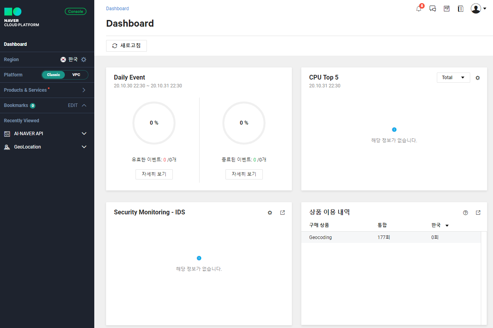
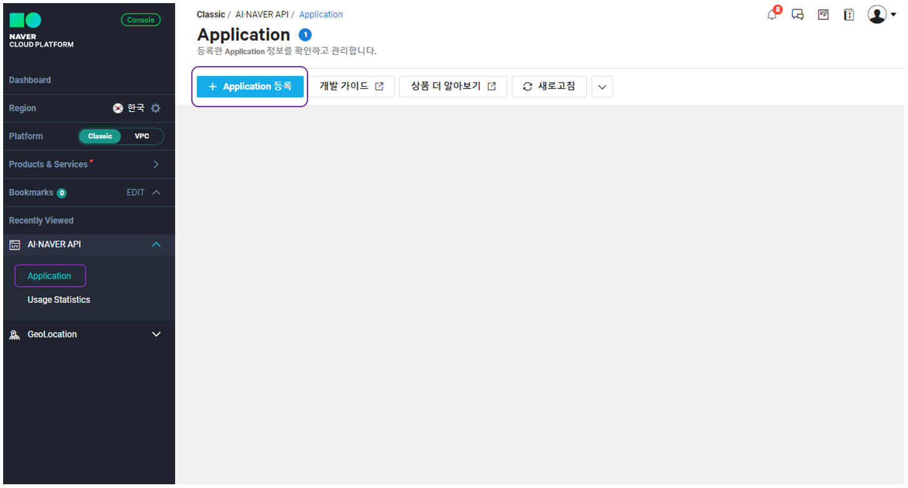
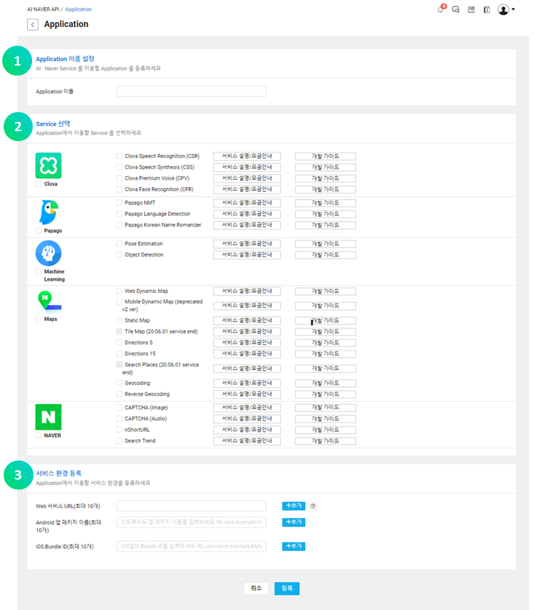
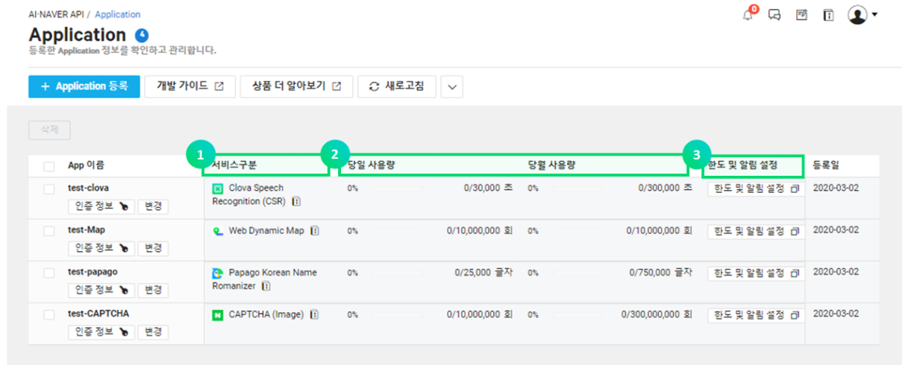
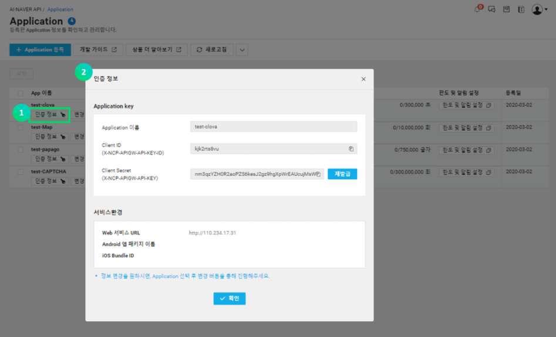

# Naver_open_api

* Application 등록하기

  * Application이 정상적으로 등록 되면 Application하나당 유일한 Client Secret값이 생성 된다
  * API를 호출할 때 HTTP해더에 Client ID와 Client Secret 값을 포함해 전성해야 호출 가능

  

* Application 등록 방법

  * 콘솔 메뉴 - AI-NAVER API - Application 메뉴 선택 - 약관 동의 - Application 등록 진행

    * 콘솔 화면

      

    * Application 메뉴

      

    * Application 등록

      

      1. 약관동의 후 나타나는 화면에서 Application 이름을 입려
      2. 사용하려는 Service 선택
      3. 서비스 환경 정보 입력
         * Application의 환경 정보 입력
         * 서비스 URL은 복수 선택 가능,  Android 앱 패키지나 iOS Bundle ID는 각각 하나씩만 등록이 가능
         * 환경별 세부 입력 사항
           * 서비스 URL: '[http://'로](http://xn--'-ky7m/) 시작되는 웹 서비스 URL을 입력합니다. URL 이름으로 localhost는 사용할 수 없으며, [http://127.0.0.1](http://127.0.0.1/) 형식으로 입력하셔야 합니다. 10 개까지 입력 가능하며, 서비스 URL과 이용하는 웹의 정보가 다른 경우 인증이 실패할 수 있다
           * http와 https는 구분하지 않는다
           * www는 빼고 입력해 주세요(예: [http://naver.com](http://naver.com/)).
           * 서브 도메인이 있으면 대표 도메인명만 입력해 주세요(예: [http://naver.com](http://naver.com/)).
           * 하이브리드 앱은 location.href 객체 출력 값을 입력(예: file://로컬 URL).
           * Android 앱 패키지 이름: Android 애플리케이션의 경우만 해당하며, 앱의 패키지 이름을 정확히 입력합니다. 등록된 패키지 이름과 이용하는 앱의 패키지 이름이 다른 경우 인증이 실패할 수 있다.
           * iOS Bundle ID: iOS 애플리케이션의 경우만 해당하며, 등록된 Bundle ID와 이용하는 앱의 정보가 다른 경우 인증이 실패할 수 있다.

    * Application 등록 확인

      * Application List

        

      * 인증 정보

        

      * Application Key

        - Client ID (X-NCP-APIGW-API-KEY-ID): 인증을 위한 ID과 같은 값으로 헤더 또는 쿼리 스트링에 'X-NCP-APIGW-API-KEY-ID'로 입력
        - Client Secret (X-NCP-APIGW-API-KEY): 인증을 위한 SecretKey 비밀번호와 같은 성격이며, 헤더 또는 쿼리 스트링에 'X-NCP-APIGW-API-KEY'로 입력

      * 서비스 환경

        - Web URL: Web SDK를 사용하기 위하여 필수로 입력해야 하는 값
        - Android 패키지 이름: Android SDK를 사용하기 위하여 필수로 입력해야 하는 값
        - iOS Bundle ID: iOS SDK를 사용하기 위하여 필수로 입력해야 하는 값

      

    * Basic Code

    ```java
    public class APIClient {
      private static Retrofit retrofit = null;
    
      public static Retrofit getClient() {
        HttpLoggingInterceptor interceptor = new HttpLoggingInterceptor();
        interceptor.setLevel(HttpLoggingInterceptor.Level.BODY);
    
        OkHttpClient client = new OkHttpClient.Builder().addInterceptor(interceptor).build();
    
        retrofit = new Retrofit.Builder()
            .baseUrl("https://naveropenapi.apigw.ntruss.com/")
            .addConverterFactory(GsonConverterFactory.create())
            .client(client)
            .build();
    
        return retrofit;
      }
    }
    
    
    public interface APIInterface {
      @GET("map-geocode/v2/geocode")
      Call<GeoCodeModel> map_geo_code(
          @Header("X-NCP-APIGW-API-KEY-ID") String id,
          @Header("X-NCP-APIGW-API-KEY") String key,
          @Query("query") String localName);
    }
    
    
    private void geoCodeAPI(String addressName) {
      apiInterface = APIClient.getClient().create(APIInterface.class);
      Call<GeoCodeModel> call = apiInterface.map_geo_code(
          "X-NCP-APIGW-API-KEY-ID",
          "X-NCP-APIGW-API-KEY",
          addressName);
      call.enqueue(new Callback<GeoCodeModel>() {
        @Override
        public void onResponse(Call<GeoCodeModel> call, Response<GeoCodeModel> response) {
       
        }
    
        @Override
        public void onFailure(Call<GeoCodeModel> call, Throwable t) {
    
        }
      });
    }
    ```

    


## Reference

[NAVER CLOUD PLATRORM](https://docs.ncloud.com/ko/naveropenapi_v3/application.html)