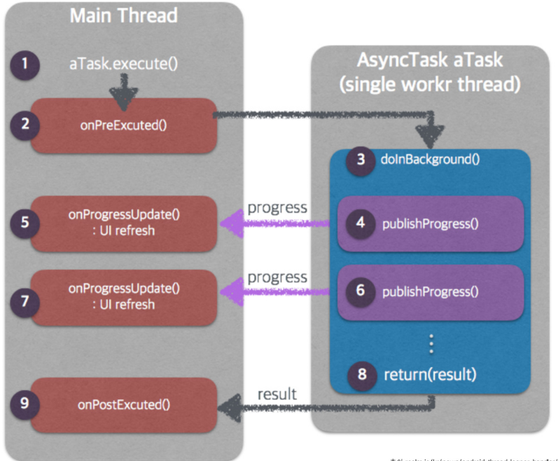
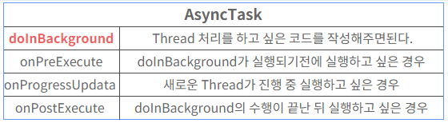
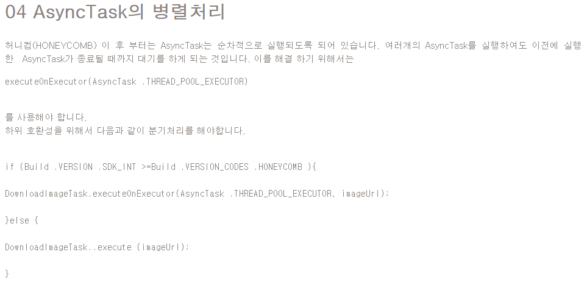

# AsyncTask





* AsyncTask 예제

```java
public class JSONTASK extends AsyncTask<String,Void,String> {
    //<시작파라미터,진행상태,서버로받은데이터를 리턴할때사용하는타입>

    @Override
    protected String doInBackground(String... params) {
	//background에서 동작한다는메소드 
    //...은 파라미터가 배열처럼 넘어온다는 뜻 한개도될수있고 여러개될수도있음(가변적)
        Log.d("시작","합니다");        
        String result=null;

        try {
            String url = params[0];
            String Body = params[1];
            URL URLObject = new URL(url);
            HttpURLConnection Conn = (HttpURLConnection)URLObject.openConnection();

            Conn.setReadTimeout(100000); //10초동안 서버로부터 반응없으면 에러
            Conn.setConnectTimeout(15000); //접속하는 커넥션 타임 15초동안 접속안되면 접속안되는 것으로 간주 (ms)

        
            Conn.setRequestMethod("POST"); //송수신할때, post방식으로 선언(get방식,delete방식등도 있음)
            Conn.setRequestProperty("Accept-Charset", "UTF-8"); // Accept-Charset ����. //character set을 utf-8로 선언
            Conn.setRequestProperty("Content-Type", "application/x-www-form-urlencoded"); //서버로 보내는 패킷이 어떤타입인지 선언
            //폼테그방식

            Conn.setDoInput(true); //안드로이드가 서버로부터 받는거를 트루
            Conn.setDoOutput(true); //안드로이드가 서버로 보내는거를 트루

            OutputStream OutStream = Conn.getOutputStream();
            OutStream.write(Body.getBytes("utf-8"));//Body는 서버로보낼 스트링값등을 설정하는 것

            int resCode = Conn.getResponseCode(); // connect, send http reuqest, receive htttp request
            System.out.println ("code = "+ resCode);


            InputStreamReader InputStream = new InputStreamReader(Conn.getInputStream(), "UTF-8");//InputStreamReader는 서버로부터 안드로이드로 받아오는 데이터 흐름을 읽어주는 클래스
            BufferedReader Reader = new BufferedReader(InputStream);
            StringBuilder Builder = new StringBuilder();//스트링을 만들어주는데 유용하게쓰이는 클래스
            String ResultStr; //저장할 공간

            while ((ResultStr = Reader.readLine()) != null) {//(중요)서버로부터 한줄씩 읽어서 문자가 없을때까지 넣어줌
                Builder.append(ResultStr + "\n"); //읽어준 스트링값을 더해준다.
            }
            //result = Builder.toString();//빌더를 차곡차곡쌓아서 result에 넣는다.
            //Toast.makeText(this.Parent, Body.toString(), Toast.LENGTH_LONG).show();

            result = Builder.toString();
        } catch (Exception e) {
            e.printStackTrace();
        }
        return result;
    }
```


## 결과값 얻는 방법

> AsyncTask의 DoInBackground의 리턴값으로 얻어올 수 있다.
>
> 위의 예시처럼 하면, 
>
> long result = new DownloadFilesTask().execute(url1, url2, url3).get();
>
> 으로 하면된다!!! 무려 execute 하고 난 후에 get을 하면 얻어올수 잇다

* 비동기식을 이용
* AsyncTask class 를 상속받는 class Code 구현
  * AsyncTask<시작파라미터,진행상태,서버로받은데이터를 리턴할때사용하는타입>

```java
 private class DownloadFilesTask extends AsyncTask<URL, Integer, Long> {
     protected Long doInBackground(URL... urls) {
         int count = urls.length;
         long totalSize = 0;
         for (int i = 0; i < count; i++) {
             totalSize += Downloader.downloadFile(urls[i]);
             publishProgress((int) ((i / (float) count) * 100));
             // Escape early if cancel() is called
             if (isCancelled()) break;
         }
         return totalSize;
     }

     protected void onProgressUpdate(Integer... progress) {
         setProgressPercent(progress[0]);
     }

     protected void onPostExecute(Long result) {
         showDialog("Downloaded " + result + " bytes");
     }
 }
```

* Activity 에서 AsyncTask class 호출

```java
 new DownloadFilesTask().execute(url1, url2, url3)
```

* Asynctask 실행. url값을 String파라미터로 넘겨주고 doinbackground메소드에서 받는다.



## 참고자료

[Hanlder, AsynTask 비교](https://www.androidpub.com/1340505)

[AsyncTask JsonObject 전달](https://94chan0.tistory.com/4)

[AsyncTask](https://itmining.tistory.com/7)

[stack overflow](https://stackoverflow.com/questions/15719942/get-json-in-asynctask-android)

[AsyncTask Basic](https://whereisusb.tistory.com/25)