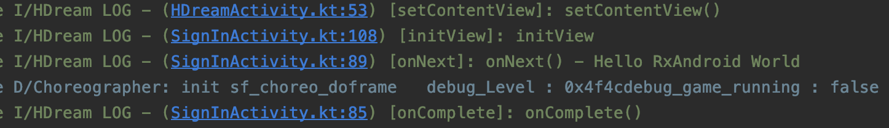

# RxKotlin

> * Reactive java
> * Reactive programming 을 java에서 구현한 프로그래밍 라이브러리
> * 프로그램 자신의 주변 환경과 끊임없이 상호작용을 하는데 프로그램이 주도하는 것이 아니라 환경이 변하면 이벤트를 받아 동작
> * 데이터 흐름을 먼저 정의하고 데이터가 변경되었을때 연관되는 함수나 메서드가 업데이트 되는 방식
> * 옵저버블(Observalbe)
> * 서브스크라이버(Subscriber)

## Observalbe

* Consumer가 소비하는 값을 생성하는 역할
* Consuber들은 Observable에 구독을 신청하고, Observable은 값을 생성한 후에 Consumer들에게 push 방식으로 값을 전달
* 주요 이벤트
  * onNext(item T) - 값을 전달할때 호출하여 값을 넘겨줌
  * onError(e: Throwable) - 에러가 발생하면 호출
  * onSubscribe(d: Disposble) - 구독을 신청하면 호출
    * 이때 넘어오는 Disposable 객체는 Observer가 구독을 해제할때 사용
  * onComplete() - 가지고 있는 값을 모두 전달하면 호출함.

### Observable 생성

* create

```kotlin
override fun onCreate(savedInstanceState: Bundle?) {
    super.onCreate(savedInstanceState)
    Timber.i("onCreate")

    setContentView(R.layout.activity_sign_in)

    val source = Observable.create<String> { it ->
        it.onNext("Hello RxAndroid World")
        it.onComplete()
    }
    source.subscribe(observer)
}


var observer = object : DisposableObserver<String>() {
    override fun onComplete() {
        Timber.i("onComplete()")
    }

    override fun onNext(t: String) {
        Timber.i("onNext() - $t")
        mUserIdEditText.setText(t)
    }

    override fun onError(e: Throwable) {
        Timber.i("onError() - $e")
    }
}
```



