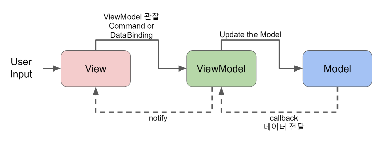

# MVVM 

> 아키텍처 패턴
>
> Model View ViewModel

* 하나의 소프트웨어를 최대한 기능적으로 작은 단위로 나누어 테스트가 쉽고 큰 프로젝트도 상대적으로 관리하기 좋은구조
* 모든 입력들은 VIew로 전달된다
* ViewModel은 입력에 해당하는 Presentation Logic을 처리하여 View에 데이터를 전달
* VIewModel은 View를 따로 참조하지 않기 때문에 독립적이며 ViewModel과 View는 1:n의 관계이다
* VIew는 자신이 이용할 ViewModel을 선택해 데이터를 바인딩하여 업데이트를 받게된다.
* Model이 상태 및 데이터가 변경되면 해당하는 VIewModel을 이요하는 View가 자동으로 업데이트가 된다.
* 마지막으로 ViewModel은 View를 나타내기 위한 Model이자, View의 Presentation Logic을 처리한니다.

## MVVM 구조

1. View
   * View는 Acticity나 Fragment같은 화면에 표현되는 레이아웃을 청의한다.
   * VIew는 기본족으로 데이터를 보여주기만 해야 해서 비지니스로직을 포함하지 않지만 UI 변경과 관련된 일부 로직은 표함될 수 있음
     * Android 는 다른 플랫폼과 다르게 Lifecycle이라는 순서를 가지고 있기 떄문
   * **VIew는 VIewModel을 관찰하고 있다가 상태 변화가 전달되면 화면을 갱신해야 함.**
2. VIewModel
   * VIew와 Model 사이의 매개체 역할을 함.
   * **모든 VIew와 관련된 비즈니스 로직은 이 곳에 들어가게 되며 데이터를 잘 가공해서VIew에서 뿌리기 쉬운 Model로 바꾸는 역할을 함.**
   * VIew와 ViewModel은 MVP와는 다르게 1:n의 관계를 가질 수 있으며 여러 개의 Fragment가 하나의 ViewModel을 가질 수 있음.
   * VIewModel은 VIew가 Data Binding할 수 있는 속성과 명령으로 구성되어 있음.
3. Model
   * MVC의 Model과 역할은 동일함.
   * DataModel이라고도 하며 DB, Network, SharedPreference 등 다양한 데이터 소스로부터 필요한 데이터를 준비함.
   * VIewModel에서 데이터를 가져갈 수 있게 데이터를 준비하고 그에 대한 **이벤트**를 보냄.

## 장점

* **Model과 VIew사이, ViewModel과 VIew 사이의 의존성이 없으므로** 유닛 테스트가 더쉬워지며 MVP패턴에서처럼 테스트를 위한 가상 뷰를 만들 필요 없이, 테스트할 떄 모델이 변경되는 시점에 옵저버블 변수가 제대로 설정됐는지 확인하면 된다.
* Databinding라이브러리를 이용함으로써 서로 간의 의존성을 낮추고, 유닛 테스트를 더욱 쉽게 작성할 수 있고UI 코드는 네이티브 코드에 관여하지 않아도 된다.
* 중복되는 코드를 모듈화 할 수 있다.

## 단점

* VIew가 변수와 표현식 모두에 Bindig될 수 있으므로 시간이 지남에 따라 관계없는 Presentation Logic이 늘어나고 이를 보완하기 위해 XML에 코트를 추가하게 된다
  * 난해하게 코드가 증가되면 유지보수 단계에서 어려움을 겪을 수 있다.

## Reference

[안드로이드 아키텍처 패턴]([https://velog.io/@jojo_devstory/%EC%95%88%EB%93%9C%EB%A1%9C%EC%9D%B4%EB%93%9C-%EC%95%84%ED%82%A4%ED%85%8D%EC%B2%98-%ED%8C%A8%ED%84%B4-MVVM%EC%9D%B4-%EB%AD%98%EA%B9%8C](https://velog.io/@jojo_devstory/안드로이드-아키텍처-패턴-MVVM이-뭘까))

[아키텍처 컴포넌트](https://blog.yena.io/studynote/2019/03/16/Android-MVVM-AAC-1.html)

[MVVM예제 Code]([https://medium.com/@jsuch2362/android-%EC%97%90%EC%84%9C-mvvm-%EC%9C%BC%EB%A1%9C-%EA%B8%B4-%EC%97%AC%EC%A0%95%EC%9D%84-82494151f312](https://medium.com/@jsuch2362/android-에서-mvvm-으로-긴-여정을-82494151f312))

