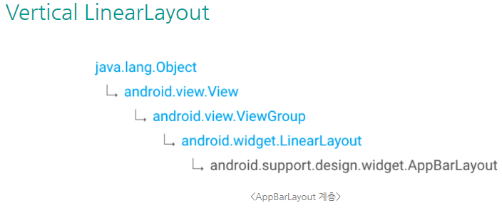
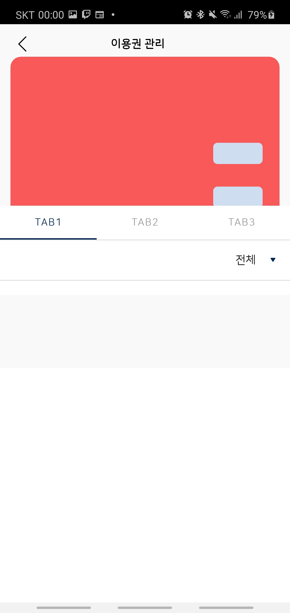
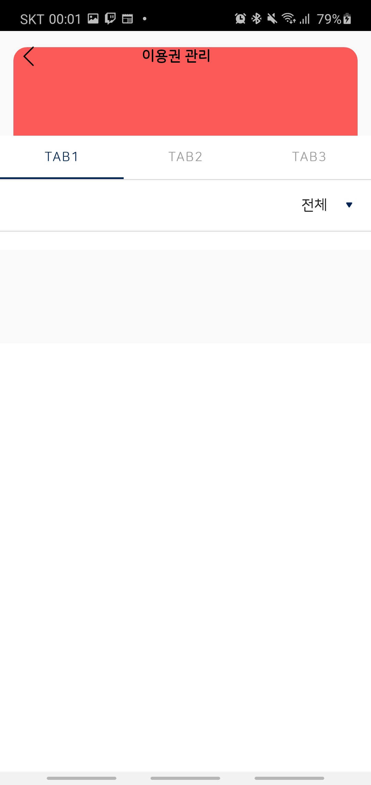
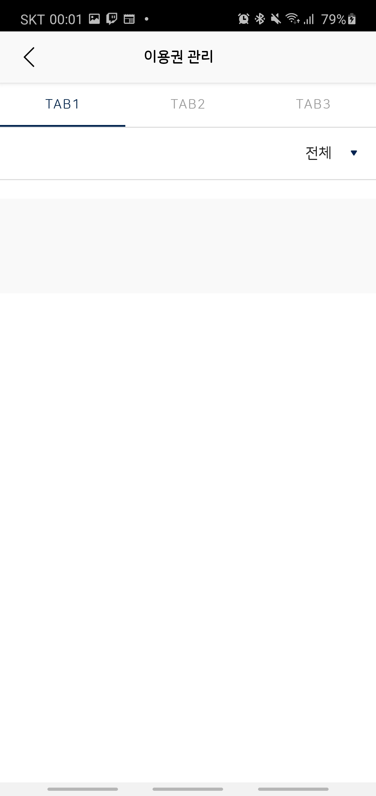

# CollapsingToolbarLayout

> * 닫혔다, 열렸다 하는 안드로이드의 ActionBar이다
> * [CollapsingToolbarLayout 은 AppBarLayout 의  child 로 사용 해야 한다](https://blog.naver.com/pistolcaffe/221016672922)


* AppBarLayout 계층



* Image

  

  


* xml
  * </CollapsingToolbarLayout> 태그를 </AppBarLayout> 태그로 감싸고 있어야한다.

```xml
<?xml version="1.0" encoding="utf-8"?>
<LinearLayout xmlns:android="http://schemas.android.com/apk/res/android"
    android:layout_width="match_parent"
    android:layout_height="match_parent"
    xmlns:app="http://schemas.android.com/apk/res-auto"
    android:orientation="vertical">

    <com.google.android.material.appbar.AppBarLayout
        android:id="@+id/scroll_view"
        android:layout_width="match_parent"
        android:layout_height="wrap_content"
        android:background="@color/color_f9f9f9">
        <com.google.android.material.appbar.CollapsingToolbarLayout
            android:id="@+id/toolbar_layout"
            android:layout_width="match_parent"
            android:layout_height="wrap_content"
            android:fitsSystemWindows="true"
            app:contentScrim="@color/color_f9f9f9"
            app:layout_scrollFlags="scroll|exitUntilCollapsed">
            <LinearLayout
                android:layout_width="match_parent"
                android:layout_height="wrap_content"
                android:orientation="vertical"
                android:background="@color/color_f9f9f9"
                app:layout_collapseMode="parallax"
                app:layout_collapseParallaxMultiplier="0.8"
                app:layout_scrollFlags="scroll|enterAlways|enterAlwaysCollapsed"
                android:layout_marginTop="50dp"
                android:layout_marginBottom="40dp">
                <com.github.florent37.shapeofview.shapes.RoundRectView
                    android:layout_width="match_parent"
                    android:layout_height="64dp"
                    android:layout_marginLeft="15dp"
                    android:layout_marginRight="15dp"
                    app:shape_roundRect_topLeftRadius="15dp"
                    app:shape_roundRect_topRightRadius="15dp"
                    android:layout_marginTop="30dp">
                    <RelativeLayout
                        android:layout_width="match_parent"
                        android:layout_height="match_parent"
                        android:background="@color/colorPrimary">
                    </RelativeLayout>
                </com.github.florent37.shapeofview.shapes.RoundRectView>
                <com.github.florent37.shapeofview.shapes.RoundRectView
                    android:layout_width="match_parent"
                    android:layout_height="242dp"
                    android:layout_marginLeft="15dp"
                    android:layout_marginRight="15dp"
                    app:shape_roundRect_bottomLeftRadius="15dp"
                    app:shape_roundRect_bottomRightRadius="15dp">
                    <RelativeLayout
                        android:layout_width="match_parent"
                        android:layout_height="match_parent"
                        android:background="@color/color_ffffff">
                    </RelativeLayout>
                </com.github.florent37.shapeofview.shapes.RoundRectView>
            </LinearLayout>
        </com.google.android.material.appbar.CollapsingToolbarLayout>
    </com.google.android.material.appbar.AppBarLayout>
    
    <LinearLayout
        android:layout_width="match_parent"
        android:layout_height="match_parent"
        android:orientation="vertical"
        app:layout_behavior="@string/appbar_scrolling_view_behavior">
    </LinearLayout>
    
</LinearLayout>
```


* layout_scrollFlags 속성
  * ExitUntilCollapsed 
    * Toolbar만 남기고 다 올림
    * 최상단까지 가면 CollapsingToolbarLayout 전체가 내려오기 시작
  * enterAlways 
    * Toolbar도 같이 다 올라감
    * 스크롤 즉시 CollapsingToolbarLayout 전체가 내려오기 시작
  * enterAlwaysCollapsed 
    * Toolbar도 같이 다올림/
    * 최상단까지 가면CollapsingToolbarLayout 전체가 내려오기 시작


## Reference

[https://freehoon.tistory.com/38](https://freehoon.tistory.com/38)

