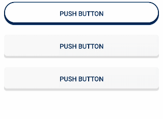

# Custom Push Button

> * Selector 를 이용한 버튼 효과 적용



* main.xml

```xml
<com.hdream.template.activity.utils.VariableGravityButton
        android:id="@+id/chip0_push_button"
        android:layout_width="match_parent"
        android:layout_height="50dp"
        android:background="@drawable/selector_push_button_round_view"
        android:layout_alignParentRight="true"
        android:text="PUSH BUTTOn"
        android:textColor="@color/colorPrimary"
        android:layout_marginTop="20dp"
        app:layout_constraintTop_toBottomOf="@+id/user_list_button"/>
```

* Selector

```xml
<?xml version="1.0" encoding="utf-8"?>
<selector xmlns:android="http://schemas.android.com/apk/res/android">
    <item android:state_pressed="false">
        <layer-list>
            <item 
                  android:drawable="@drawable/chip_round_rec_view_shadow" 
                  android:top="4dp"/>
            <item 
                  android:drawable="@drawable/chip_round_rec_view_face" 
                  android:bottom="4dp"/>
        </layer-list>
    </item>

    <item android:state_pressed="true">
        <layer-list>
            <item 
                  android:drawable="@drawable/chip_round_rec_view_shadow" 
                  android:top="4dp"/>
            <item 
                  android:drawable="@drawable/chip_round_rec_view_face" 
                  android:top="4dp"
                  android:bottom="1dp" />
        </layer-list>
    </item>
</selector>
```

* chip_round_rec_view_face
  * the button face

```xml
<?xml version="1.0" encoding="utf-8"?>
<selector xmlns:android="http://schemas.android.com/apk/res/android">
    <item>
        <!-- Button foreground -->
        <shape xmlns:android="http://schemas.android.com/apk/res/android">
            <solid android:color="@color/color_ffffff" />
            <stroke
                android:width="2dp"
                android:color="@color/colorPrimary" />
            <padding
                android:left="1dp"
                android:right="1dp"
                android:bottom="1dp"
                android:top="1dp" />
            <corners android:radius="25dp" />
        </shape>
    </item>
</selector>
```

* chip_round_rec_view_face
  * effect part of button

```xml
<?xml version="1.0" encoding="utf-8"?>
<selector xmlns:android="http://schemas.android.com/apk/res/android">
    <item>
        <shape>
            <solid android:color="@color/colorPrimary" />
            <corners android:radius="25dp" />
        </shape>
    </item>
</selector>
```


* 위에처럼  xml을 정의하고 실행하면 버튼 이미지는 움직이고 버튼 안의 Text는 고정 되어있다. 그래서 AppCompatButton을 상속받은 Class를 만들어주고 setPressed() 함수에서 Text의 padding값을 설정한다.

```kotlin
class VariableGravityButton : AppCompatButton {
    constructor(context: Context?) : super(context!!) {}
    constructor(context: Context?, attrs: AttributeSet?) :super(
        context!!,
        attrs
    ) {}

    constructor(context: Context?, attrs: AttributeSet?,defStyle: Int) :super(
        context!!, 
        attrs, 
        defStyle
    ) {}

    override fun setPressed(pressed: Boolean) {
        if (pressed != isPressed) {
            val topPadding = if (pressed) 15 else 0
            setPadding(0, topPadding, 0, 0)
        }
        super.setPressed(pressed)
    }
}
```

