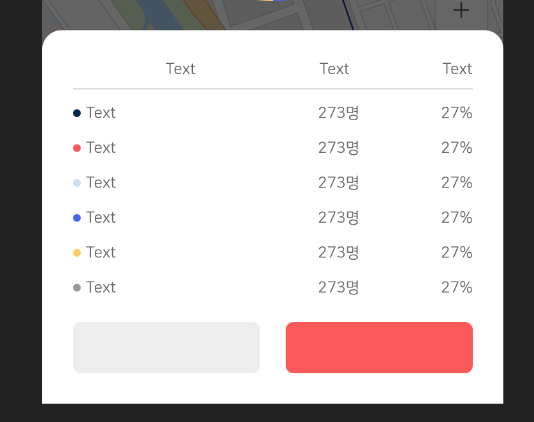

# Custom_Dialog

> * Android Custom Dialog
> * Dialog Animation


* xml

```xml
<?xml version="1.0" encoding="utf-8"?>
<RelativeLayout xmlns:android="http://schemas.android.com/apk/res/android"
  android:layout_width="match_parent"
  android:layout_height="match_parent"
  xmlns:app="http://schemas.android.com/apk/res-auto">

  <androidx.appcompat.widget.AppCompatTextView
    android:id="@+id/area_name_text_view"
    android:layout_width="match_parent"
    android:layout_height="wrap_content"
    android:text="Custom Dialog"
    android:textSize="20dp"
    android:textColor="@color/color_222222"
    android:fontFamily="@font/nanumsquareroundb"
    android:gravity="center"
    android:layout_alignParentTop="true"
    android:layout_marginTop="70dp"/>

  <com.github.mikephil.charting.charts.PieChart
    android:id="@+id/info_pie_chart"
    android:layout_width="match_parent"
    android:layout_height="200dp"
    android:layout_marginTop="14dp"
    android:layout_below="@+id/area_name_text_view"/>

  <com.github.florent37.shapeofview.shapes.RoundRectView
    android:id="@+id/info_round_rect_view"
    android:layout_width="match_parent"
    android:layout_height="wrap_content"
    app:shape_roundRect_topRightRadius="15dp"
    app:shape_roundRect_topLeftRadius="15dp"
    android:layout_alignParentBottom="true">
    <LinearLayout
      android:layout_width="match_parent"
      android:layout_height="match_parent"
      android:background="@color/color_ffffff"
      android:orientation="vertical"
      android:paddingLeft="24dp"
      android:paddingRight="24dp">

      <LinearLayout
        android:layout_width="match_parent"
        android:layout_height="wrap_content"
        android:orientation="horizontal"
        android:layout_marginBottom="8dp"
        android:layout_marginTop="24dp">
        <androidx.appcompat.widget.AppCompatTextView
          android:layout_width="0dp"
          android:layout_height="wrap_content"
          android:layout_weight="7"
          android:text="Text"
          android:textSize="12dp"
          android:textColor="@color/color_666666"
          android:gravity="center"/>
        <androidx.appcompat.widget.AppCompatTextView
          android:layout_width="0dp"
          android:layout_height="wrap_content"
          android:layout_weight="3"
          android:text="Text"
          android:textSize="12dp"
          android:textColor="@color/color_666666"
          android:gravity="center"/>
        <androidx.appcompat.widget.AppCompatTextView
          android:layout_width="0dp"
          android:layout_height="wrap_content"
          android:layout_weight="3"
          android:text="Text"
          android:textSize="12dp"
          android:textColor="@color/color_666666"
          android:gravity="right"/>
      </LinearLayout>
      <LinearLayout
        android:layout_width="match_parent"
        android:layout_height="1dp"
        android:background="@color/color_dddddd"
        android:layout_marginBottom="12dp"/>

      <LinearLayout
        android:layout_width="match_parent"
        android:layout_height="wrap_content"
        android:orientation="horizontal"
        android:layout_gravity="center_horizontal">
        <com.github.florent37.shapeofview.shapes.RoundRectView
          android:id="@+id/tag_color_00"
          android:layout_width="6dp"
          android:layout_height="6dp"
          app:shape_roundRect_topLeftRadius="3dp"
          app:shape_roundRect_bottomLeftRadius="3dp"
          app:shape_roundRect_bottomRightRadius="3dp"
          app:shape_roundRect_topRightRadius="3dp"
          android:layout_marginRight="4dp"
          android:layout_gravity="center">
          <RelativeLayout
            android:layout_width="match_parent"
            android:layout_height="match_parent"
            android:background="@color/color_002554">
          </RelativeLayout>
        </com.github.florent37.shapeofview.shapes.RoundRectView>
        <androidx.appcompat.widget.AppCompatTextView
          android:id="@+id/range00_text_view"
          android:layout_width="0dp"
          android:layout_height="wrap_content"
          android:layout_weight="7"
          android:text="Text"
          android:textSize="12dp"
          android:textColor="@color/color_666666"
          android:fontFamily="@font/nanumsquareroundr" />
        <androidx.appcompat.widget.AppCompatTextView
          android:id="@+id/range00_value_text_view"
          android:layout_width="0dp"
          android:layout_height="wrap_content"
          android:layout_weight="3"
          android:gravity="center"
          android:fontFamily="@font/nanumsquareroundr"
          android:text="273명"
          android:textColor="@color/color_666666"
          android:textSize="12dp" />
        <androidx.appcompat.widget.AppCompatTextView
          android:id="@+id/range00_value_ratio_text_view"
          android:layout_width="0dp"
          android:layout_height="wrap_content"
          android:layout_weight="3"
          android:gravity="right"
          android:fontFamily="@font/nanumsquareroundr"
          android:text="27%"
          android:textColor="@color/color_666666"
          android:textSize="12dp" />
      </LinearLayout>

      <LinearLayout
        android:layout_width="match_parent"
        android:layout_height="wrap_content"
        android:orientation="horizontal"
        android:layout_gravity="center_horizontal"
        android:layout_marginTop="14dp">
        <com.github.florent37.shapeofview.shapes.RoundRectView
          android:id="@+id/tag_color_01"
          android:layout_width="6dp"
          android:layout_height="6dp"
          app:shape_roundRect_topLeftRadius="3dp"
          app:shape_roundRect_bottomLeftRadius="3dp"
          app:shape_roundRect_bottomRightRadius="3dp"
          app:shape_roundRect_topRightRadius="3dp"
          android:layout_marginRight="4dp"
          android:layout_gravity="center">
          <RelativeLayout
            android:layout_width="match_parent"
            android:layout_height="match_parent"
            android:background="@color/color_F95959">
          </RelativeLayout>
        </com.github.florent37.shapeofview.shapes.RoundRectView>
        <androidx.appcompat.widget.AppCompatTextView
          android:id="@+id/range01_text_view"
          android:layout_width="0dp"
          android:layout_height="wrap_content"
          android:layout_weight="7"
          android:text="Text"
          android:textSize="12dp"
          android:textColor="@color/color_666666"
          android:fontFamily="@font/nanumsquareroundr" />
        <androidx.appcompat.widget.AppCompatTextView
          android:id="@+id/range01_value_text_view"
          android:layout_width="0dp"
          android:layout_height="wrap_content"
          android:layout_weight="3"
          android:gravity="center"
          android:fontFamily="@font/nanumsquareroundr"
          android:text="273명"
          android:textColor="@color/color_666666"
          android:textSize="12dp" />
        <androidx.appcompat.widget.AppCompatTextView
          android:id="@+id/range01_value_ratio_text_view"
          android:layout_width="0dp"
          android:layout_height="wrap_content"
          android:layout_weight="3"
          android:gravity="right"
          android:fontFamily="@font/nanumsquareroundr"
          android:text="27%"
          android:textColor="@color/color_666666"
          android:textSize="12dp" />
      </LinearLayout>

      <LinearLayout
        android:layout_width="match_parent"
        android:layout_height="wrap_content"
        android:orientation="horizontal"
        android:layout_gravity="center_horizontal"
        android:layout_marginTop="14dp">
        <com.github.florent37.shapeofview.shapes.RoundRectView
          android:id="@+id/tag_color_02"
          android:layout_width="6dp"
          android:layout_height="6dp"
          app:shape_roundRect_topLeftRadius="3dp"
          app:shape_roundRect_bottomLeftRadius="3dp"
          app:shape_roundRect_bottomRightRadius="3dp"
          app:shape_roundRect_topRightRadius="3dp"
          android:layout_marginRight="4dp"
          android:layout_gravity="center">
          <RelativeLayout
            android:layout_width="match_parent"
            android:layout_height="match_parent"
            android:background="@color/color_CEDDEF">
          </RelativeLayout>
        </com.github.florent37.shapeofview.shapes.RoundRectView>
        <androidx.appcompat.widget.AppCompatTextView
          android:id="@+id/range02_text_view"
          android:layout_width="0dp"
          android:layout_height="wrap_content"
          android:layout_weight="7"
          android:text="Text"
          android:textSize="12dp"
          android:textColor="@color/color_666666"
          android:fontFamily="@font/nanumsquareroundr" />
        <androidx.appcompat.widget.AppCompatTextView
          android:id="@+id/range02_value_text_view"
          android:layout_width="0dp"
          android:layout_height="wrap_content"
          android:layout_weight="3"
          android:gravity="center"
          android:fontFamily="@font/nanumsquareroundr"
          android:text="273명"
          android:textColor="@color/color_666666"
          android:textSize="12dp" />
        <androidx.appcompat.widget.AppCompatTextView
          android:id="@+id/range02_value_ratio_text_view"
          android:layout_width="0dp"
          android:layout_height="wrap_content"
          android:layout_weight="3"
          android:gravity="right"
          android:fontFamily="@font/nanumsquareroundr"
          android:text="27%"
          android:textColor="@color/color_666666"
          android:textSize="12dp" />
      </LinearLayout>

      <LinearLayout
        android:layout_width="match_parent"
        android:layout_height="wrap_content"
        android:orientation="horizontal"
        android:layout_gravity="center_horizontal"
        android:layout_marginTop="14dp">
        <com.github.florent37.shapeofview.shapes.RoundRectView
          android:id="@+id/tag_color_03"
          android:layout_width="6dp"
          android:layout_height="6dp"
          app:shape_roundRect_topLeftRadius="3dp"
          app:shape_roundRect_bottomLeftRadius="3dp"
          app:shape_roundRect_bottomRightRadius="3dp"
          app:shape_roundRect_topRightRadius="3dp"
          android:layout_marginRight="4dp"
          android:layout_gravity="center">
          <RelativeLayout
            android:layout_width="match_parent"
            android:layout_height="match_parent"
            android:background="@color/color_4666EC">
          </RelativeLayout>
        </com.github.florent37.shapeofview.shapes.RoundRectView>
        <androidx.appcompat.widget.AppCompatTextView
          android:id="@+id/range03_text_view"
          android:layout_width="0dp"
          android:layout_height="wrap_content"
          android:layout_weight="7"
          android:text="Text"
          android:textSize="12dp"
          android:textColor="@color/color_666666"
          android:fontFamily="@font/nanumsquareroundr" />
        <androidx.appcompat.widget.AppCompatTextView
          android:id="@+id/range03_value_text_view"
          android:layout_width="0dp"
          android:layout_height="wrap_content"
          android:layout_weight="3"
          android:gravity="center"
          android:fontFamily="@font/nanumsquareroundr"
          android:text="273명"
          android:textColor="@color/color_666666"
          android:textSize="12dp" />
        <androidx.appcompat.widget.AppCompatTextView
          android:id="@+id/range03_value_ratio_text_view"
          android:layout_width="0dp"
          android:layout_height="wrap_content"
          android:layout_weight="3"
          android:gravity="right"
          android:fontFamily="@font/nanumsquareroundr"
          android:text="27%"
          android:textColor="@color/color_666666"
          android:textSize="12dp" />
      </LinearLayout>

      <LinearLayout
        android:layout_width="match_parent"
        android:layout_height="wrap_content"
        android:orientation="horizontal"
        android:layout_gravity="center_horizontal"
        android:layout_marginTop="14dp">
        <com.github.florent37.shapeofview.shapes.RoundRectView
          android:id="@+id/tag_color_04"
          android:layout_width="6dp"
          android:layout_height="6dp"
          app:shape_roundRect_topLeftRadius="3dp"
          app:shape_roundRect_bottomLeftRadius="3dp"
          app:shape_roundRect_bottomRightRadius="3dp"
          app:shape_roundRect_topRightRadius="3dp"
          android:layout_marginRight="4dp"
          android:layout_gravity="center">
          <RelativeLayout
            android:layout_width="match_parent"
            android:layout_height="match_parent"
            android:background="@color/color_FCCA65">
          </RelativeLayout>
        </com.github.florent37.shapeofview.shapes.RoundRectView>
        <androidx.appcompat.widget.AppCompatTextView
          android:id="@+id/range04_text_view"
          android:layout_width="0dp"
          android:layout_height="wrap_content"
          android:layout_weight="7"
          android:text="Text"
          android:textSize="12dp"
          android:textColor="@color/color_666666"
          android:fontFamily="@font/nanumsquareroundr" />
        <androidx.appcompat.widget.AppCompatTextView
          android:id="@+id/range04_value_text_view"
          android:layout_width="0dp"
          android:layout_height="wrap_content"
          android:layout_weight="3"
          android:gravity="center"
          android:fontFamily="@font/nanumsquareroundr"
          android:text="273명"
          android:textColor="@color/color_666666"
          android:textSize="12dp" />
        <androidx.appcompat.widget.AppCompatTextView
          android:id="@+id/range04_value_ratio_text_view"
          android:layout_width="0dp"
          android:layout_height="wrap_content"
          android:layout_weight="3"
          android:gravity="right"
          android:fontFamily="@font/nanumsquareroundr"
          android:text="27%"
          android:textColor="@color/color_666666"
          android:textSize="12dp" />
      </LinearLayout>

      <LinearLayout
        android:layout_width="match_parent"
        android:layout_height="wrap_content"
        android:orientation="horizontal"
        android:layout_gravity="center_horizontal"
        android:layout_marginTop="14dp">
        <com.github.florent37.shapeofview.shapes.RoundRectView
          android:id="@+id/tag_color_05"
          android:layout_width="6dp"
          android:layout_height="6dp"
          app:shape_roundRect_topLeftRadius="3dp"
          app:shape_roundRect_bottomLeftRadius="3dp"
          app:shape_roundRect_bottomRightRadius="3dp"
          app:shape_roundRect_topRightRadius="3dp"
          android:layout_marginRight="4dp"
          android:layout_gravity="center">
          <RelativeLayout
            android:layout_width="match_parent"
            android:layout_height="match_parent"
            android:background="@color/color_999999">
          </RelativeLayout>
        </com.github.florent37.shapeofview.shapes.RoundRectView>
        <androidx.appcompat.widget.AppCompatTextView
          android:id="@+id/range05_text_view"
          android:layout_width="0dp"
          android:layout_height="wrap_content"
          android:layout_weight="7"
          android:text="Text"
          android:textSize="12dp"
          android:textColor="@color/color_666666"
          android:fontFamily="@font/nanumsquareroundr" />
        <androidx.appcompat.widget.AppCompatTextView
          android:id="@+id/range05_value_text_view"
          android:layout_width="0dp"
          android:layout_height="wrap_content"
          android:layout_weight="3"
          android:gravity="center"
          android:fontFamily="@font/nanumsquareroundr"
          android:text="273명"
          android:textColor="@color/color_666666"
          android:textSize="12dp" />
        <androidx.appcompat.widget.AppCompatTextView
          android:id="@+id/range05_value_ratio_text_view"
          android:layout_width="0dp"
          android:layout_height="wrap_content"
          android:layout_weight="3"
          android:gravity="right"
          android:fontFamily="@font/nanumsquareroundr"
          android:text="27%"
          android:textColor="@color/color_666666"
          android:textSize="12dp" />
      </LinearLayout>

      <LinearLayout
        android:layout_width="match_parent"
        android:layout_height="40dp"
        android:orientation="horizontal"
        android:layout_marginTop="20dp"
        android:layout_marginBottom="24dp">
        <com.github.florent37.shapeofview.shapes.RoundRectView
          android:id="@+id/show_info_round_rect_view"
          android:layout_width="0dp"
          android:layout_height="match_parent"
          android:layout_weight="10"
          android:layout_marginRight="10dp"
          app:shape_roundRect_topLeftRadius="6dp"
          app:shape_roundRect_bottomRightRadius="6dp"
          app:shape_roundRect_bottomLeftRadius="6dp"
          app:shape_roundRect_topRightRadius="6dp">
          <RelativeLayout
            android:layout_width="match_parent"
            android:layout_height="match_parent"
            android:background="@color/color_eeeeee">
            <androidx.appcompat.widget.AppCompatTextView
              android:layout_width="wrap_content"
              android:layout_height="wrap_content"
              android:textSize="14dp"
              android:textColor="@color/color_666666"
              android:fontFamily="@font/nanumsquareroundr"
              android:layout_centerInParent="true"/>
          </RelativeLayout>
        </com.github.florent37.shapeofview.shapes.RoundRectView>

        <com.github.florent37.shapeofview.shapes.RoundRectView
          android:id="@+id/apply_report_round_rect_view"
          android:layout_width="0dp"
          android:layout_height="match_parent"
          android:layout_weight="10"
          android:layout_marginLeft="10dp"
          app:shape_roundRect_topLeftRadius="6dp"
          app:shape_roundRect_bottomRightRadius="6dp"
          app:shape_roundRect_bottomLeftRadius="6dp"
          app:shape_roundRect_topRightRadius="6dp">
          <RelativeLayout
            android:layout_width="match_parent"
            android:layout_height="match_parent"
            android:background="@color/color_F95959">
            <androidx.appcompat.widget.AppCompatTextView
              android:layout_width="wrap_content"
              android:layout_height="wrap_content"
              android:textSize="14dp"
              android:textColor="@color/color_ffffff"
              android:fontFamily="@font/nanumsquareroundr"
              android:layout_centerInParent="true"/>
          </RelativeLayout>
        </com.github.florent37.shapeofview.shapes.RoundRectView>

      </LinearLayout>

    </LinearLayout>

  </com.github.florent37.shapeofview.shapes.RoundRectView>
</RelativeLayout>
```

* Java Code

```java
public class CustomDialog {
  private Context context;
  private Dialog dialog;

  RoundRectView mShowInfoRoundRectView;
  RoundRectView mApplyReportRoundRectView;

  public CustomDialog(Context context){
    this.context = context;
    dialog = new Dialog(context);
    dialog.requestWindowFeature(Window.FEATURE_NO_TITLE);
    dialog.getWindow().setBackgroundDrawable(new ColorDrawable(Color.TRANSPARENT));
    dialog.setContentView(R.layout.dialog_map_info);
    //Animation 설정
    dialog.getWindow().setWindowAnimations(R.style.DialogAnimation);
    //dialog 크기 설정
    WindowManager.LayoutParams params = dialog.getWindow().getAttributes();
    params.width = WindowManager.LayoutParams.MATCH_PARENT;
    dialog.setCancelable(false);
    dialog.getWindow().setAttributes(params);

    mShowInfoRoundRectView = dialog.findViewById(R.id.show_info_round_rect_view);
    mApplyReportRoundRectView = dialog.findViewById(R.id.apply_report_round_rect_view);

    //dialog 뒤로가기
    dialog.setOnKeyListener(new Dialog.OnKeyListener() {
      @Override
      public boolean onKey(DialogInterface dialogInterface, int keyCode, KeyEvent keyEvent) {
        if (keyCode == KeyEvent.KEYCODE_BACK){
          dismiss();
        }
        return true;
      }
    });

  }
  public void setDialog(){
    show();
  }
  public void mClickListener(View.OnClickListener clickListener){
    mShowInfoRoundRectView.setOnClickListener(clickListener);
    mApplyReportRoundRectView.setOnClickListener(clickListener);
  }
  public void show(){
    dialog.show();
  }
  public void dismiss() {
    dialog.dismiss();
  }
  
}
```


* Dialog 효과

  * styles.xml

  ```xml
  <resources>
  	<style name="DialogAnimation">
      	<item name="android:windowEnterAnimation">@anim/animation_zoom_in</item>
      	<item name="android:windowExitAnimation">@anim/animation_zoom_out</item>
    	</style>
  </resources>
  ```

  * zoom_in_xml

  ```xml
  <?xml version="1.0" encoding="utf-8"?>
  <set xmlns:android="http://schemas.android.com/apk/res/android"
    android:duration="300">
    <scale
      android:fromXScale="0.8"
      android:fromYScale="0.8"
      android:pivotX="50%p"
      android:pivotY="50%p"
      android:toXScale="1.0"
      android:toYScale="1.0" />
  
    <alpha
      android:fromAlpha="0.0"
      android:toAlpha="1.0" />
  </set>
  ```

  * zoom_out_xml

  ```xml
  <?xml version="1.0" encoding="utf-8"?>
  <set xmlns:android="http://schemas.android.com/apk/res/android"
    android:duration="300">
    <scale
      android:fromXScale="1.0"
      android:fromYScale="1.0"
      android:pivotX="50%p"
      android:pivotY="50%p"
      android:toXScale="0.8"
      android:toYScale="0.8" />
    <alpha
      android:fromAlpha="1.0"
      android:toAlpha="0.0" />
  </set>
  ```

  

* Image

 


## Reference

[https://dev-ssam.tistory.com/6](https://dev-ssam.tistory.com/6)