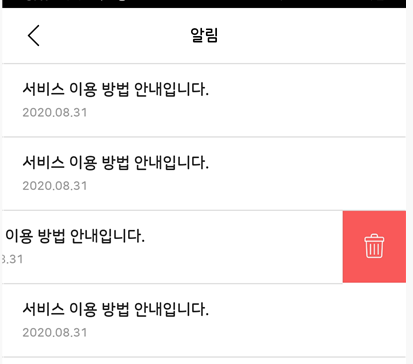
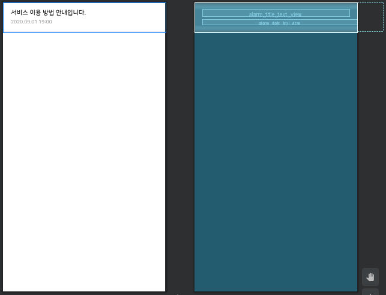

# EasySwipeMenuLayout

> * RecyclerView 항목을 스와이프하면 삭제버튼이 나타나게 된다
>   * 삭제 버튼을 누르게되면 목록이서 삭제가 된다


* image

 

 

* recycler_vIew_item.xml
  * 스와이프로 보여줄 view를 **EasySwipeMenuLayout로 감싸준다**

```xml
<LinearLayout xmlns:android="http://schemas.android.com/apk/res/android"
  android:layout_width="match_parent"
  android:layout_height="wrap_content"
  xmlns:app="http://schemas.android.com/apk/res-auto"
  android:orientation="vertical">

  <com.guanaj.easyswipemenulibrary.EasySwipeMenuLayout
    android:id="@+id/swipe_menu_layout"
    android:layout_width="match_parent"
    android:layout_height="wrap_content"
    app:contentView="@+id/content"
    app:rightMenuView="@+id/right_menu">
    <RelativeLayout
      android:id="@+id/content"
      android:layout_width="match_parent"
      android:layout_height="wrap_content">
      <LinearLayout
        android:id="@+id/content_linear_layout"
        android:layout_width="match_parent"
        android:layout_height="wrap_content"
        android:orientation="vertical"
        android:layout_alignParentLeft="true">
        <androidx.appcompat.widget.AppCompatTextView
          android:id="@+id/alarm_title_text_view"
          android:layout_width="match_parent"
          android:layout_height="wrap_content"
          android:text="서비스 이용 방법 안내입니다."
          android:textSize="16dp"
          android:textColor="@color/color_222222"
          android:fontFamily="@font/nanumsquareroundb"
          android:layout_marginLeft="20dp"
          android:layout_marginTop="17dp"
          android:layout_marginBottom="8dp"
          android:layout_marginRight="20dp" />
        <androidx.appcompat.widget.AppCompatTextView
          android:id="@+id/alarm_date_text_view"
          android:layout_width="match_parent"
          android:layout_height="wrap_content"
          android:text="2020.09.01 19:00"
          android:textSize="12dp"
          android:textColor="@color/color_999999"
          android:fontFamily="@font/nanumsquareroundb"
          android:layout_marginLeft="20dp"
          android:layout_marginBottom="17dp" />
      </LinearLayout>
      <LinearLayout
        android:layout_width="match_parent"
        android:layout_height="1dp"
        android:background="@color/color_dddddd"
        android:layout_below="@+id/content_linear_layout"/>
    </RelativeLayout>

    <RelativeLayout
      android:id="@+id/right_menu"
      android:layout_width="65dp"
      android:layout_height="wrap_content">
      <androidx.appcompat.widget.AppCompatImageView
        android:id="@+id/alarm_delete_image_view"
        android:layout_width="wrap_content"
        android:layout_height="wrap_content"
        android:src="@drawable/delete_i_tresh" />
    </RelativeLayout>

  </com.guanaj.easyswipemenulibrary.EasySwipeMenuLayout>
</LinearLayout>
```

* main.xml

```xml
<LinearLayout
xmlns:android="http://schemas.android.com/apk/res/android" android:layout_width="match_parent"
android:layout_height="match_parent"
android:orientation="vertical">

  <androidx.recyclerview.widget.RecyclerView
    android:id="@+id/alarm_recycler_view"
    android:layout_width="match_parent"
    android:layout_height="wrap_content"
    android:background="@color/color_ffffff">
  </androidx.recyclerview.widget.RecyclerView>

</LinearLayout>
```

* MainActivity

```java
public class MainActivity extends AppCompatActivity {
    
    @BindView(R.id.alarm_recycler_view)
	RecyclerView mAlarmRecyclerView;

	private AlarmAdapter mAlarmAdapter;
	private ArrayList<BaseModel> baseModels = new ArrayList<>();
    
	 @Override
    protected void onCreate(Bundle savedInstanceState) {
        super.onCreate(savedInstanceState);
        setContentView(R.layout.activity_main);
        
        initAlarmAdapter();
        
    }

    public void initAlarmAdapter(){
        //TEST DATA//
        baseModels.add(new BaseModel());
        baseModels.add(new BaseModel());
        baseModels.add(new BaseModel());
        baseModels.add(new BaseModel());

        mAlarmAdapter = new AlarmAdapter(R.layout.row_alarm,baseModels);
        mAlarmRecyclerView.setLayoutManager(
            new LinearLayoutManager(mActivity, LinearLayoutManager.VERTICAL, false));
        mAlarmRecyclerView.setAdapter(mAlarmAdapter);

        /**
        * Alarm 삭제
        */
        mAlarmAdapter.setOnItemChildClickListener(
            new AlarmAdapter.OnItemChildClickListener() {
          @Override
          public void onItemChildClick(
          BaseQuickAdapter adapter, View view, int position) {
            if (view.getId() == R.id.alarm_delete_image_view) {
                baseModels.remove(position);
                mAlarmAdapter.setNewData(baseModels);
            }
          }
       });
    }
}
```

* RecyclerVIewAdapter

```java
public class AlarmAdapter extends BaseQuickAdapter<BaseModel, BaseViewHolder> {

  AlarmAdapter(int layoutResId, @Nullable List<BaseModel> baseModel) {
    super(layoutResId, baseModel);
  }

  @Override
  protected void convert(BaseViewHolder helper, BaseModel item) {
    helper.setText(R.id.alarm_title_text_view, "서비스 이용 방법 안내입니다.");
    helper.setText(R.id.alarm_date_text_view, "2020.08.31");
	/*
	* Touched Event를 하기 위해 아래 code처럼 작성해 줘야한다.
	*/
    helper.addOnClickListener(R.id.alarm_delete_image_view);
  }
}
```

