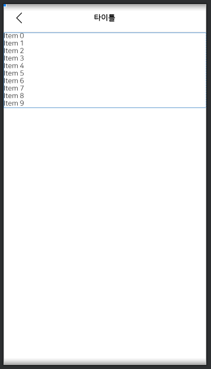

# Include

> * 레이아웃을 효율적으로 재사용할 수 있다.
> * 다른 레이아웃을 현재 레이아웃 내에 삽입하여 사용한다.


* image
  * include를 사용하여 toolbar 재사용

 

* main.xml
  * <include/> 태그를 활용하여 toolbar_back.xml를 재사용한다

```xml
<LinearLayout
  xmlns:android="http://schemas.android.com/apk/res/android"      android:layout_width="match_parent"
  android:layout_height="match_parent"
  android:orientation="vertical">

  <include layout="@layout/toolbar_back"/>

  <androidx.recyclerview.widget.RecyclerView
    android:id="@+id/alarm_recycler_view"
    android:layout_width="match_parent"
    android:layout_height="wrap_content"
    android:background="@color/color_ffffff">
  </androidx.recyclerview.widget.RecyclerView>

</LinearLayout>
```

* toolbar_back.xml
  * 재사용할 레이아웃을 xml파일로 만들고 레이아웃을 정의한다.

```xml
<?xml version="1.0" encoding="utf-8"?>
<com.google.android.material.appbar.AppBarLayout
  xmlns:android="http://schemas.android.com/apk/res/android"
  xmlns:app="http://schemas.android.com/apk/res-auto"
  android:id="@+id/app_bar"
  android:layout_width="match_parent"
  android:layout_height="wrap_content"
  android:background="@color/color_ffffff"
  app:elevation="0dp">
  <LinearLayout
    android:layout_width="match_parent"
    android:layout_height="wrap_content"
    android:orientation="vertical">
    <androidx.appcompat.widget.Toolbar
      android:id="@+id/toolbar"
      style="@style/ToolBarPrimary"
      android:layout_width="match_parent"
      android:layout_height="?android:attr/actionBarSize"
      app:titleTextAppearance="@style/ToolbarTitleText">
      <androidx.appcompat.widget.AppCompatImageView
        android:id="@+id/back_button"
        android:layout_width="wrap_content"
        android:layout_height="wrap_content"
        android:layout_marginLeft="20dp"
        android:minWidth="0dp"
        android:minHeight="0dp"
        android:src="@drawable/btn"
        android:stateListAnimator="@null" />
      <androidx.appcompat.widget.AppCompatTextView
        android:id="@+id/toolbar_title"
        android:layout_width="wrap_content"
        android:layout_height="wrap_content"
        android:layout_gravity="center"
        android:fontFamily="@font/nanumsquareroundb"
        android:text="타이틀"
        android:textColor="@color/color_000000"
        android:textSize="16dp" />
    </androidx.appcompat.widget.Toolbar>
    <LinearLayout
      android:layout_width="match_parent"
      android:layout_height="1dp"
      android:background="@color/color_dddddd" />
  </LinearLayout>

</com.google.android.material.appbar.AppBarLayout>
```

