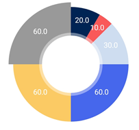

# MPAndroidChart

* Gradle

```java
repositories {
    maven { url 'https://jitpack.io' }
}

dependencies {
    implementation 'com.github.PhilJay:MPAndroidChart:v3.1.0'
}
```


## PieChart

* image

 

* XML
  * layout_height 값을 임의로 정하였다.
    * wrap_content 로 설정하면 차트가 작게 표시되어 보이지 않는다

```xml
<?xml version="1.0" encoding="utf-8"?>
<LinearLayout xmlns:android="http://schemas.android.com/apk/res/android"
  android:layout_width="match_parent"
  android:layout_height="match_parent"
  xmlns:app="http://schemas.android.com/apk/res-auto"
  android:orientation="vertical">
    <com.github.mikephil.charting.charts.PieChart
        android:id="@+id/pie_chart"
        android:layout_width="match_parent"
        android:layout_height="185dp"
        android:layout_marginTop="14dp"/>
<LinearLayout/>
```

* Activity

```java
public class MainActivity extends AppCompatActivity {
    
    @BindView(R.id.pie_chart)
	PieChart pieChart;

	private AlarmAdapter mAlarmAdapter;
	private ArrayList<BaseModel> baseModels = new ArrayList<>();
    
	 @Override
    protected void onCreate(Bundle savedInstanceState) {
        super.onCreate(savedInstanceState);
        setContentView(R.layout.activity_main);

        setPieChart(pieChart);
    }
    
	private void setPieChart(PieChart mPieChart){
        //
        ArrayList<PieEntry> entries = new ArrayList<>();

        entries.add(new PieEntry(20F));
        entries.add(new PieEntry(10F));
        entries.add(new PieEntry(30F));
        entries.add(new PieEntry(60F));
        entries.add(new PieEntry(60F));
        entries.add(new PieEntry(60F));

        PieDataSet pieDataSet = new PieDataSet(entries, "Results");

        //pieChart colors//
        pieDataSet.setColors(
            ContextCompat.getColor(this,R.color.color_002554),
            ContextCompat.getColor(this,R.color.color_F95959),
            ContextCompat.getColor(this,R.color.color_CEDDEF),
            ContextCompat.getColor(this,R.color.color_4666EC),
            ContextCompat.getColor(this,R.color.color_FCCA65),
            ContextCompat.getColor(this,R.color.color_999999));

        Legend legend = mPieChart.getLegend();
        //X-Values List Delete
        legend.setEnabled(false);
        //Description text setting
        Description description = new Description();
        description.setText("");
        mPieChart.setDescription(description);

        PieData data = new PieData(pieDataSet);
        //개체에 포함 된 모든 DataSet에 대해 사용자 지정 IValueFormatter를 설정
        data.setValueFormatter(new PercentFormatter(mPieChart));
        //차트에 보여지는 text설정
        data.setValueTextSize(11f);
        data.setValueTextColor(Color.WHITE);

        mPieChart.setData(data);
  	}
}
```


## HorizontalBarChart

* image

 

* xml

```xml
<?xml version="1.0" encoding="utf-8"?>
<LinearLayout xmlns:android="http://schemas.android.com/apk/res/android"
  android:layout_width="match_parent"
  android:layout_height="match_parent"
  xmlns:app="http://schemas.android.com/apk/res-auto"
  android:orientation="vertical">
   <com.github.mikephil.charting.charts.HorizontalBarChart
            android:id="@+id/household_horizontal_bar_chart"
            android:layout_width="match_parent"
            android:layout_height="120dp"
            android:background="@android:color/white" />
<LinearLayout/>
```

* Activity

```java
public class MainActivity extends AppCompatActivity {
    
    @BindView(R.id.horizontal_bar_chart)
  	HorizontalBarChart mHorizontalBarChart;

	private AlarmAdapter mAlarmAdapter;
	private ArrayList<BaseModel> baseModels = new ArrayList<>();
    
	@Override
    protected void onCreate(Bundle savedInstanceState) {
        super.onCreate(savedInstanceState);
        setContentView(R.layout.activity_main);

        setHorizontalBarChart(mHorizontalBarChart);
    }
    
	/**
    * HorizontalBarChart
    */
    private void setHorizontalBarChart(HorizontalBarChart horizontalBarChart){
        
        ArrayList<BarEntry> values = new ArrayList<>();
        values.add(new BarEntry(0f, 80));
        values.add(new BarEntry(1f, 50));
        values.add(new BarEntry(2f, 20));
        values.add(new BarEntry(3f, 60));
        values.add(new BarEntry(4f, 60));
        values.add(new BarEntry(5f, 60));
        values.add(new BarEntry(6f, 60));
        
        BarDataSet barDataSet = new BarDataSet(values, "Tenses");
        barDataSet.setColors(
            ContextCompat.getColor(this,R.color.color_002554),
            ContextCompat.getColor(this,R.color.color_F95959),
            ContextCompat.getColor(this,R.color.color_4666EC),
            ContextCompat.getColor(this,R.color.color_CEDDEF),
            ContextCompat.getColor(this,R.color.color_FCCA65),
            ContextCompat.getColor(this,R.color.color_999999),
            ContextCompat.getColor(this,R.color.color_77D9A8));
        
		ArrayList<String> xValues = new ArrayList<>();
        xValues.add("일반 회사원");
        xValues.add("군인");
        xValues.add("경찰");
        xValues.add("공무원");
        xValues.add("자영업자");
        xValues.add("전문직");
        xValues.add("그 외");
		
        //차트 좌측에 표시할 데이터를 설정한다.
        XAxis xl = horizontalBarChart.getXAxis();
        xl.setPosition(XAxis.XAxisPosition.BOTTOM);
        xl.setDrawGridLines(false);
        xl.setEnabled(true);
        xl.setDrawAxisLine(false);
        xl.setGranularity(1F); //setGranularity() 값으로 x축 Range를 설정할 수 있다.
        xl.setValueFormatter(new IndexAxisValueFormatter(xValues));
		
        YAxis yl = horizontalBarChart.getAxisLeft();
        yl.setDrawAxisLine(true);
        yl.setDrawGridLines(true);

        YAxis yr = horizontalBarChart.getAxisRight();
        yr.setDrawAxisLine(true);
        yr.setDrawGridLines(false);

        BarData barData = new BarData(barDataSet);
        barDataSet.setDrawValues(true);
        barData.addDataSet(barDataSet);
        barData.setDrawValues(true);

        // Display it as a percentage
        barData.setValueFormatter(new PercentFormatter());

        horizontalBarChart.setData(barData);

        //Hide grid line
        horizontalBarChart.getAxisLeft().setEnabled(false);
        horizontalBarChart.getAxisRight().setEnabled(false);
        // Hide graph description
        horizontalBarChart.getDescription().setEnabled(false);
        horizontalBarChart.getLegend().setEnabled(false);

        horizontalBarChart.invalidate();
    }
}
```


## Reference

[https://medium.com/hongbeomi-dev/mpandroidchart-%EB%9D%BC%EC%9D%B4%EB%B8%8C%EB%9F%AC%EB%A6%AC%EB%A5%BC-%ED%99%9C%EC%9A%A9%ED%95%9C-chart-%EC%82%AC%EC%9A%A9%ED%95%98%EA%B8%B0-kotlin-93c18ae7568e](https://medium.com/hongbeomi-dev/mpandroidchart-%EB%9D%BC%EC%9D%B4%EB%B8%8C%EB%9F%AC%EB%A6%AC%EB%A5%BC-%ED%99%9C%EC%9A%A9%ED%95%9C-chart-%EC%82%AC%EC%9A%A9%ED%95%98%EA%B8%B0-kotlin-93c18ae7568e)