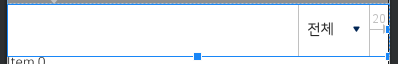
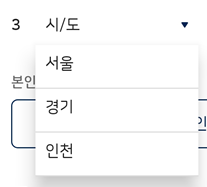
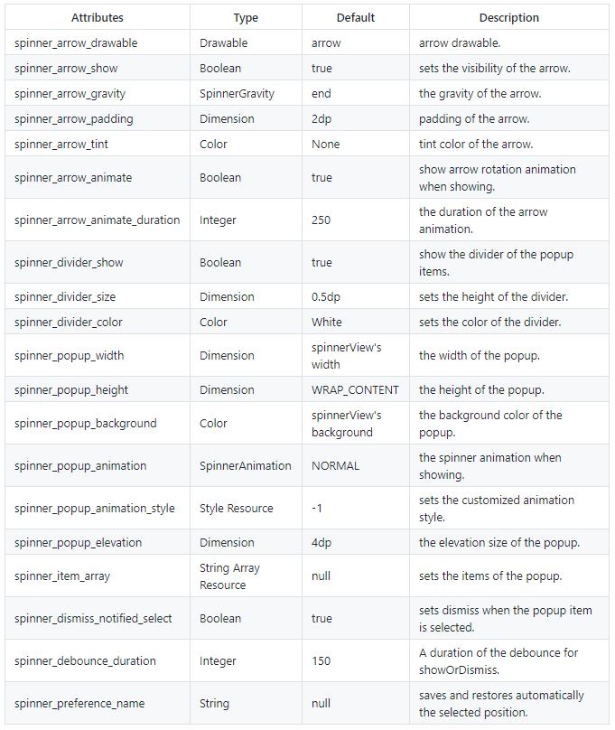

# PowerSpinner

> * 항목을 선택할 UI에 적용한다.

## Basic Code

* 의존성

  * Gradle - Module

  ```groovy
  implementation 'androidx.core:core-ktx:1.0.1'
  implementation 'org.jetbrains.kotlin:kotlin-stdlib-jdk7:1.3.10'
  
  //POWER Spinner
  implementation 'com.github.skydoves:powerspinner:1.0.9'
  // POWER Spinner (If your project using Java, add a below dependency code.)
  implementation "org.jetbrains.kotlin:kotlin-stdlib-jdk7:kotlin_version"         
  ```

  * Gradle - project

  ```groovy
  dependencies {
      classpath 'org.jetbrains.kotlin:kotlin-gradle-plugin:1.3.10'
  }
  ```


* xml

```xml
<com.skydoves.powerspinner.PowerSpinnerView
    android:id="@+id/news_list_spinner"
    android:layout_width="wrap_content"
    android:layout_height="56dp"
    android:background="@color/color_ffffff"
    android:gravity="center"
    android:hint="전체"
    android:textColor="@color/color_222222"
    android:textColorHint="@color/color_222222"
    android:textSize="16dp"
    android:padding="10dp"
    app:spinner_arrow_drawable="@drawable/arrow_dropdown"
    app:spinner_arrow_padding="20dp"
    app:spinner_arrow_gravity="end"
    app:spinner_divider_color="@color/color_dddddd"
    app:spinner_divider_show="true"
    app:spinner_divider_size="1dp"
    app:spinner_item_array="@array/information"
    app:spinner_popup_animation="dropdown"
    app:spinner_popup_background="@color/color_ffffff"
    app:spinner_popup_elevation="14dp"
    android:layout_alignParentRight="true"
    android:layout_marginRight="20dp"/>
```

* strings.xml
  * app:spinner_item_array="@array/item_list"
    * PowerSpinner Item에 들어갈 항목을 "strings.xml" 에 작성한다.

```xml
<string-array name="item_list">
    <item>서울</item>
    <item>경기</item>
    <item>인천</item>
  </string-array>
```


* Image

 

 


* Activity
  * mPowerSpinner.setOnSpinnerItemSelectedListener()
    * 스피너의 아이템 클릭시 호출된다
  * mPowerSpinner.setSpinnerOutsideTouchListener()
    * 스피너 이외 화면을 터치하면 호출되며, 스피너가 종료된다.

```java
public class MainActivity extends AppCompatActivity {
    
    @BindView(R.id.news_list_spinner)
  	PowerSpinnerView mPowerSpinner;
    
    @Override
    protected void onCreate(Bundle savedInstanceState) {
        super.onCreate(savedInstanceState);
        setContentView(R.layout.activity_main);
        
        mPowerSpinner.setOnSpinnerItemSelectedListener(
            new OnSpinnerItemSelectedListener<String>() {
            @Override
            public void onItemSelected(int i, String s) {
                Timber.i("Spinner: %s", s);
            }
        });

        mPowerSpinner.setSpinnerOutsideTouchListener(
            new OnSpinnerOutsideTouchListener() {
            @Override
            public void onSpinnerOutsideTouch(
                @NotNull View view, 
                @NotNull MotionEvent motionEvent) {
                mNewsListSpinner.dismiss();
            }
        });
	}
}
```


## PowerSpinnerView Attrivutes




## Reference

[https://github.com/skydoves/PowerSpinner](https://github.com/skydoves/PowerSpinner)