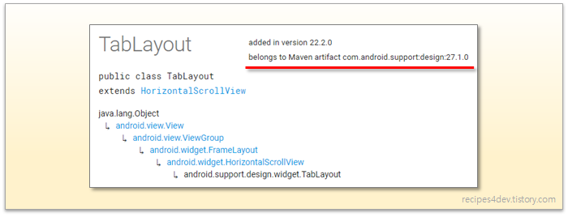
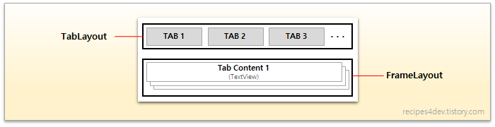
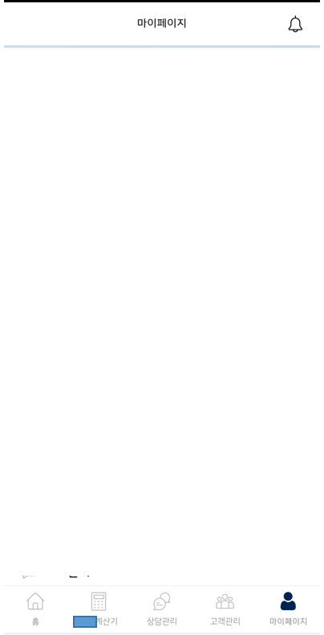

# TabLayout&viewPager






## 레이아웃 구성

* XML

```xml
<RelativeLayout xmlns:android="http://schemas.android.com/apk/res/android"
  android:layout_width="match_parent"
  android:layout_height="match_parent"
  xmlns:app="http://schemas.android.com/apk/res-auto"
  android:orientation="vertical">
  <rocateer.finaltor.utils.SwipeViewPager
    android:id="@+id/main_view_pager"
    android:layout_width="match_parent"
    android:layout_height="match_parent"
    android:layout_above="@+id/main_tab_layout"/>

  <LinearLayout
    android:layout_width="match_parent"
    android:layout_height="1dp"
    android:layout_above="@id/main_tab_layout"
    android:background="@color/color_eeeeee" />

  <com.google.android.material.tabs.TabLayout
    android:id="@+id/main_tab_layout"
    android:layout_width="match_parent"
    android:layout_height="60dp"
    android:layout_alignParentBottom="true"
    android:layout_gravity="center"
    android:background="@color/color_ffffff"
    app:tabGravity="fill"
    app:tabIconTint="@color/color_00000000"
    app:tabIconTintMode="src_atop"
    app:tabIndicatorHeight="0dp"
    app:tabMode="fixed"
    app:tabTextAppearance="@style/TabLayoutStyle"
    app:tabTextColor="@color/color_999999">
    <com.google.android.material.tabs.TabItem
      android:layout_width="wrap_content"
      android:layout_height="wrap_content"
      android:icon="@drawable/menu_1_off"
      android:text="홈" />
    <com.google.android.material.tabs.TabItem
      android:layout_width="wrap_content"
      android:layout_height="wrap_content"
      android:icon="@drawable/loan_menu_2_off"
      android:text="대출계산기"/>
    <com.google.android.material.tabs.TabItem
      android:layout_width="wrap_content"
      android:layout_height="wrap_content"
      android:icon="@drawable/loan_menu_3_off"
      android:text="상담관리"/>
    <com.google.android.material.tabs.TabItem
      android:layout_width="wrap_content"
      android:layout_height="wrap_content"
      android:icon="@drawable/loan_menu_4_off"
      android:text="고객관리"/>
    <com.google.android.material.tabs.TabItem
      android:layout_width="wrap_content"
      android:layout_height="wrap_content"
      android:icon="@drawable/loan_menu_5_off"
      android:text="마이페이지"/>
  </com.google.android.material.tabs.TabLayout>


</RelativeLayout>
```


## 텝레이아웃 이벤트 처리

* Activity

```java
public class MainActivity extends AppCompatActivity {

    @BindView(R.id.main_tab_layout)
    TabLayout mMainTabLayout;
    
    @Override
    protected void onCreate(Bundle savedInstanceState) {
        super.onCreate(savedInstanceState);
        setContentView(R.layout.activity_main);

        mMainTabLayout.getTabAt(0).setIcon(R.drawable.loan_menu_1_on);
        mMainTabLayout.getTabAt(1).setIcon(R.drawable.loan_menu_2_off);
        mMainTabLayout.getTabAt(2).setIcon(R.drawable.loan_menu_3_off);
        mMainTabLayout.getTabAt(3).setIcon(R.drawable.loan_menu_4_off);
        mMainTabLayout.getTabAt(4).setIcon(R.drawable.loan_menu_5_off);

        MainTabPagerAdapter mTabPagerAdapter =
            new MainTabPagerAdapter(getSupportFragmentManager(), this);
            mMainViewPager.setAdapter(mTabPagerAdapter);
            mMainViewPager.setOffscreenPageLimit(5);
            mMainViewPager.addOnPageChangeListener
                (new TabLayout.TabLayoutOnPageChangeListener(mMainTabLayout));
            mMainViewPager.setPagingEnabled(false);

        mMainTabLayout.setOnTabSelectedListener(
            new TabLayout.OnTabSelectedListener() {
            @Override
            public void onTabSelected(TabLayout.Tab tab) {
                if (tab.getPosition() == 0){
                    tab.setIcon(R.drawable.loan_menu_1_on);
                }else if (tab.getPosition() == 1){
                    tab.setIcon(R.drawable.loan_menu_2_on);
                }else if (tab.getPosition() == 2){
                    tab.setIcon(R.drawable.loan_menu_3_on);
                }else if (tab.getPosition() == 3){
                    tab.setIcon(R.drawable.loan_menu_4_on);
                }else if (tab.getPosition() == 4){
                    tab.setIcon(R.drawable.loan_menu_5_on);
                }
                mMainViewPager.setCurrentItem(tab.getPosition());

            }
            @Override
            public void onTabUnselected(TabLayout.Tab tab) {
                if (tab.getPosition() == 0){
                    tab.setIcon(R.drawable.loan_menu_1_off);
                    
                }else if (tab.getPosition() == 1){
                    tab.setIcon(R.drawable.loan_menu_2_off);
                }else if (tab.getPosition() == 2){
                    tab.setIcon(R.drawable.loan_menu_3_off);
                }else if (tab.getPosition() == 3){
                    tab.setIcon(R.drawable.loan_menu_4_off);
                }else if (tab.getPosition() == 4){
                    tab.setIcon(R.drawable.loan_menu_5_off);
                }
            }

            @Override
            public void onTabReselected(TabLayout.Tab tab) {

            }
        });
	}
    //Move Fragment
    public void moveToFragment(){
      mMainTabLayout.getTabAt(2).select();
      mMainViewPager.setCurrentItem(2);
    }
}


```

* TabPagerAdapter
  * getItem() 메셔드에서 포지션 값을 인자로 받아 해당 포지션(tab)별 Fragment 호출

```java
public class LoanMainTabPagerAdapter extends FragmentStatePagerAdapter {

  private MActivity mActivity;

  private FragmentA fragmentA;
  private FragmentB fragmentB;
  private FragmentC fragmentC;
  private FragmentD fragmentD;
  private FragmentE fragmentE;

  public LoanMainTabPagerAdapter(
      FragmentManager fragmentManager
      ,MActivity mActivity){
    super(fragmentManager);
    this.mActivity = mActivity;
  }

  @Override
  public Fragment getItem(int position) {
    switch (position){
      case 0:
        fragmentA = new FragmentA(mActivity);
        return fragmentA;
      case 1:
        fragmentB = new FragmentB(mActivity);
        return fragmentB;
      case 2:
        fragmentC = new FragmentC();
        return fragmentC;
      case 3:
        fragmentD = new FragmentD();
        return fragmentD;
      case 4:
        fragmentE = new FragmentE();
        return fragmentE;
    }
    return null;
  }

  @Override
  public int getCount() {
    return 5;
  }
}

```


## select() 함수

* Java Code 에서 tab 선택
  * getTabAt(Index) - 이동하고자 하는 Fragment Index를 설정한다.

```java
TabLayout tabLayout = (TabLayout) findViewById(R.id.tabs);
TabLayout.Tab tab = tabLayout.getTabAt(Index);
tab.select();
```

* [참고](https://hee96-story.tistory.com/52)
* select 함수를 사용하지 않고 Fragment를 이동하는 방법
  * TabLayout 객체를 생성한 Activity에 아래와 같이 Method를 만들어 호출하여 사용한다.

```java
//Move Fragment
public void moveToFragment(){
  mMainTabLayout.getTabAt(2).select();
  mMainViewPager.setCurrentItem(2);
}
```


## 실행 화면

 