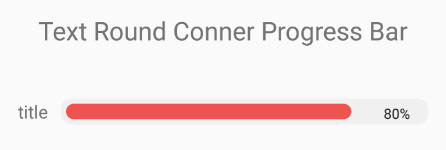

# TextRoundCornerProgressBar


* 의존성

  * Gradle - Module

    ```groovy
    dependencies{
        implementation 'com.akexorcist:round-corner-progress-bar:2.1.1'
    }
    ```

* Image



* xml

```xml
<?xml version="1.0" encoding="utf-8"?>
<LinearLayout
    xmlns:android="http://schemas.android.com/apk/res/android"
    xmlns:app="http://schemas.android.com/apk/res-auto"
    xmlns:tools="http://schemas.android.com/tools"
    android:layout_width="match_parent"
    android:layout_height="match_parent"
    tools:context=".MainActivity"
    android:orientation="vertical">
    <TextView
        android:layout_width="match_parent"
        android:layout_height="wrap_content"
        android:text="Text Round Conner Progress Bar"
        android:textSize="20dp"
        android:gravity="center"
        android:layout_margin="20dp"/>
    <LinearLayout
        android:layout_width="match_parent"
        android:layout_height="wrap_content"
        android:orientation="horizontal"
        android:gravity="center"
        android:layout_margin="20dp">
        <androidx.appcompat.widget.AppCompatTextView
            android:layout_width="wrap_content"
            android:layout_height="match_parent"
            android:text="title"
            android:gravity="center"/>
        <com.akexorcist.roundcornerprogressbar.TextRoundCornerProgressBar
            android:id="@+id/text_round_corner_progress_bar"
            android:layout_width="wrap_content"
            android:layout_height="20dp"
            app:rcAnimationEnable="false"
            app:rcBackgroundColor="@color/sample_progress_background"
            app:rcBackgroundPadding="4dp"
            app:rcMax="100"
            app:rcProgress="50"
            app:rcProgressColor="@color/sample_progress_primary"
            app:rcRadius="10dp"
            app:rcTextInsideGravity="start"
            app:rcTextOutsideGravity="end"
            app:rcTextPositionPriority="outside"
            app:rcTextProgress="50%"
            app:rcTextProgressSize="11dp"
            app:rcTextProgressColor="@color/sample_progress_text_color"
            android:layout_marginLeft="10dp"/>
    </LinearLayout>
</LinearLayout>
```


* Activity

```java
public class MainActivity extends AppCompatActivity {

    @BindView(R.id.text_round_corner_progress_bar)
    TextRoundCornerProgressBar mProgressBar;

    @Override
    protected void onCreate(Bundle savedInstanceState) {
        super.onCreate(savedInstanceState);
        setContentView(R.layout.activity_main);
        ButterKnife.bind(this);
        
        mProgressBar.setProgress(80);
        mProgressBar.setProgressText("80%");
    }
}
```


## Reference

[https://github.com/akexorcist/RoundCornerProgressBar](https://github.com/akexorcist/RoundCornerProgressBar)