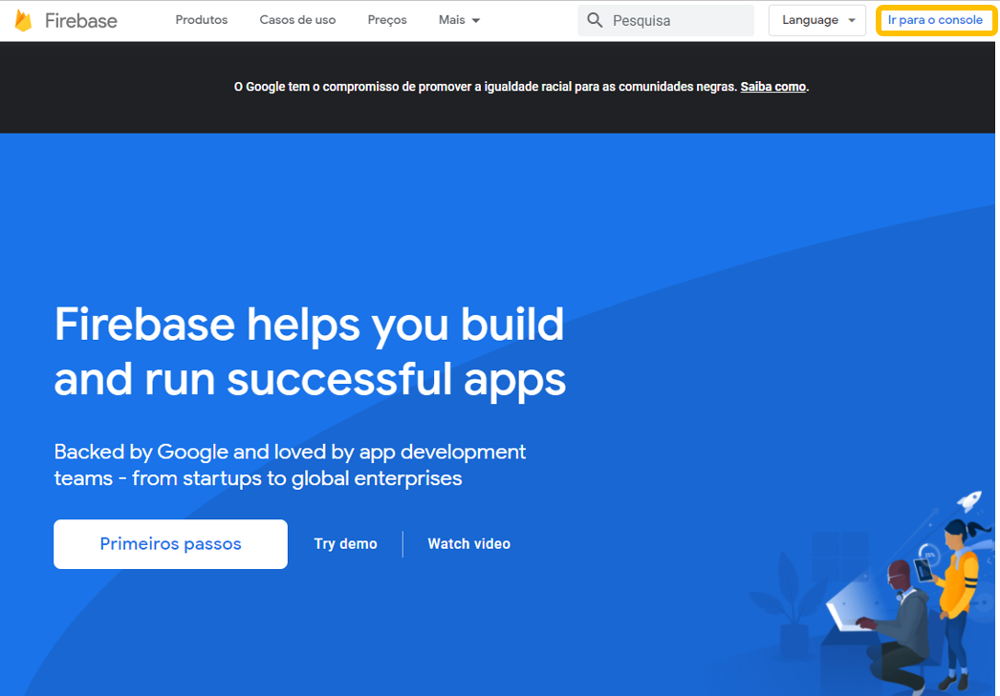
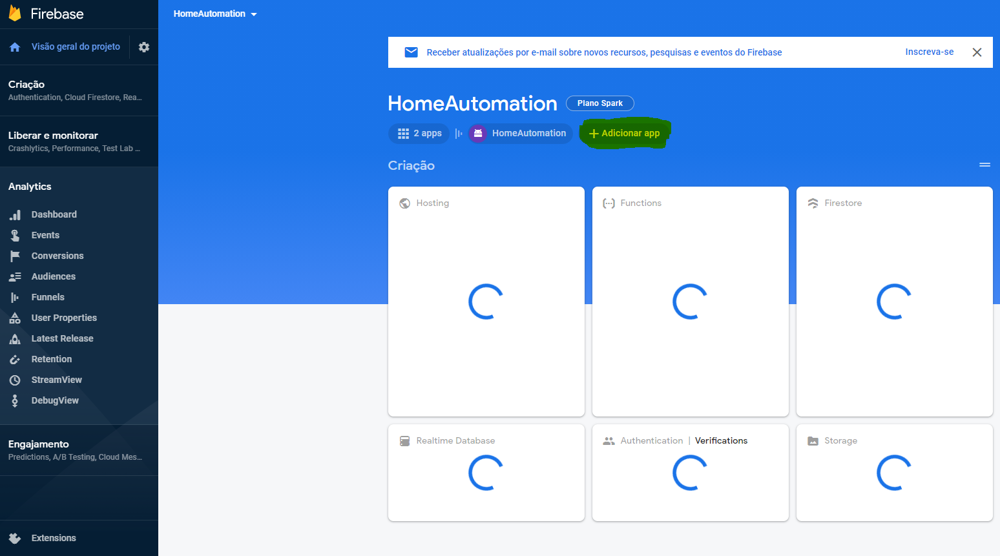
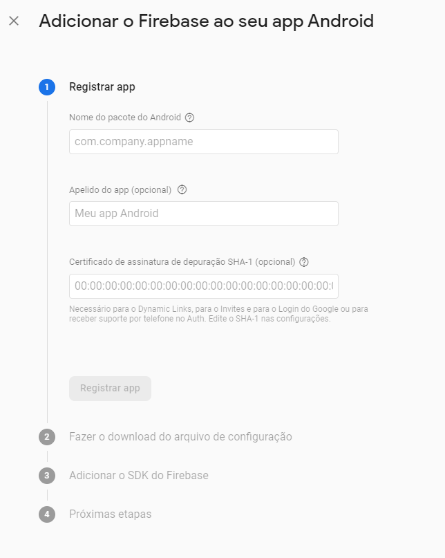
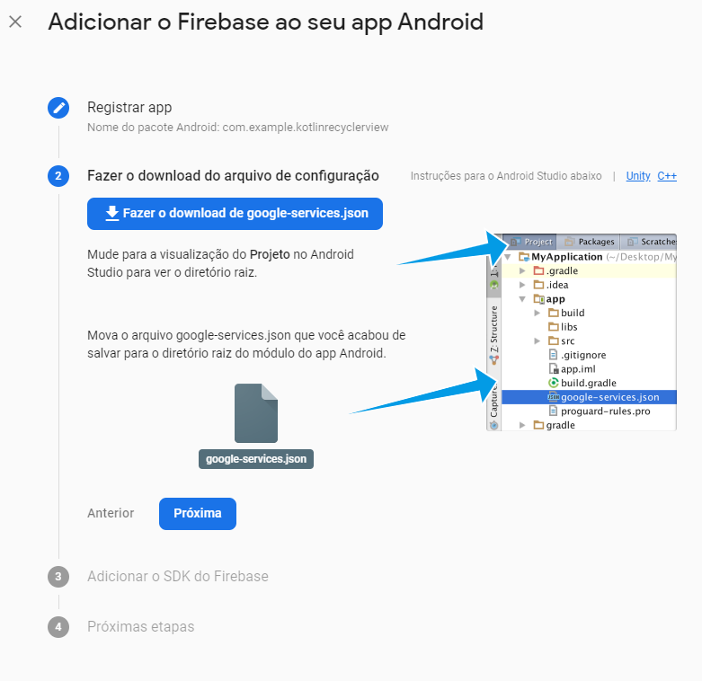
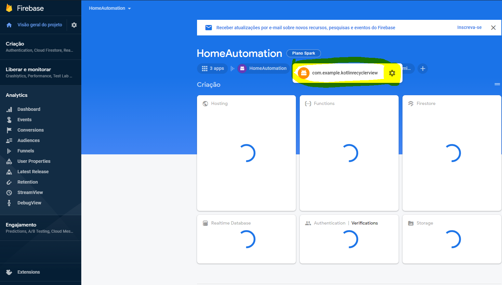
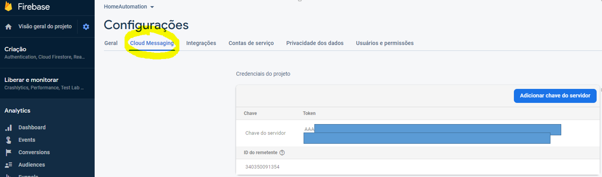

# FirebaseMessagingService

## Android code

* build.gradle9module)

```
apply plugin: 'com.android.application'
// Add this line
apply plugin: 'com.google.gms.google-services'

dependencies {
  // Import the Firebase BoM
  implementation platform('com.google.firebase:firebase-bom:26.2.0')

  // Add the dependency for the Firebase SDK for Google Analytics
  // When using the BoM, don't specify versions in Firebase dependencies
  implementation 'com.google.firebase:firebase-analytics'

  // Add the dependencies for any other desired Firebase products
  // https://firebase.google.com/docs/android/setup#available-libraries
}
```

* build.gradle(project)

```
buildscript {
  repositories {
    // Check that you have the following line (if not, add it):
    google()  // Google's Maven repository
  }
  dependencies {
    ...
    // Add this line
    classpath 'com.google.gms:google-services:4.3.4'
  }
}

allprojects {
  ...
  repositories {
    // Check that you have the following line (if not, add it):
    google()  // Google's Maven repository
    ...
  }
}
```


* AndroidManifest.xml

  * <application  FirebaseMessage Service 를 추가한다.

  ```xml
  <application 
      ...
      <service
            android:name=".utils.FBMessagingService"
            android:exported="false">
            <intent-filter>
              <action android:name="com.google.firebase.MESSAGING_EVENT" />
            </intent-filter>
          </service>
  
          <meta-data
            android:name="com.google.firebase.messaging.default_notification_channel_id"
            android:value="notify_001" />
  
          <meta-data
            android:name="com.google.firebase.messaging.default_notification_icon"
            android:resource="@drawable/ic_launcher" />
  
          <meta-data
            android:name="com.google.firebase.messaging.default_notification_color"
            android:resource="@color/colorPrimary" />
  ```

  * 푸시알림이 왔을 때 기본 아이콘 및 생상을 설정

  ```xml
  <meta-data
    android:name="com.google.firebase.messaging.default_notification_icon"
    android:resource="@drawable/ic_launcher" />
  <meta-data
    android:name="com.google.firebase.messaging.default_notification_color"
    android:resource="@color/colorPrimary" />
  ```

* FirebaseMessgingService code

```java
public class FBMessagingService extends FirebaseMessagingService {
    public static int current_ID = 0;
    public AlarmModel mAlarmModel;

    @Override
    public void onMessageReceived(RemoteMessage remoteMessage) {
        Timber.i("Remote message test");

        PowerManager powerManager = (PowerManager) getSystemService(Context.POWER_SERVICE);
        @SuppressLint("InvalidWakeLockTag") PowerManager.WakeLock wakeLock = powerManager.newWakeLock(PowerManager.SCREEN_DIM_WAKE_LOCK | PowerManager.ACQUIRE_CAUSES_WAKEUP, "TAG");
        wakeLock.acquire(3000);

        if (remoteMessage.getData().size() > 0) {
            Timber.i(remoteMessage.getData().toString());

            Bundle bundle = new Bundle();
            bundle.putString("data", remoteMessage.getData().toString());

            mAlarmModel = new AlarmModel();
            mAlarmModel.setTitle(remoteMessage.getData().get("title"));
            mAlarmModel.setMsg(remoteMessage.getData().get("msg"));
            mAlarmModel.setIndex(remoteMessage.getData().get("index"));
            mAlarmModel.setBoard_idx(remoteMessage.getData().get("board_idx"));
            mAlarmModel.setNotice_idx(remoteMessage.getData().get("notice_idx"));
            sendNotification(mAlarmModel);
            /**
             * Foreground, Background 별 알림 처리
             *
             * @author khh
             * @since 2021-01-05
             **/
            if (foregrounded()) {
                Timber.i("=======Foreground Message=======");
                sendNotification(mAlarmModel);
            } else {
                Timber.i("=======Background Message=======");
                sendBackgroundNotification(mAlarmModel, "data");
            }
        } else {
            AlarmModel alarmModel = new AlarmModel();
            alarmModel.setTitle(remoteMessage.getData().get("title"));
            alarmModel.setMsg(remoteMessage.getData().get("msg"));
            alarmModel.setIndex(remoteMessage.getData().get("index"));
            alarmModel.setBoard_idx(remoteMessage.getData().get("board_idx"));
            sendNotification(alarmModel);
        }
    }

    /**
     * Notification 발송.
     *
     * @author khh
     * @since 2021-01-05
     **/
    private void sendNotification(AlarmModel alarmModel) {
        NotificationCompat.Builder mBuilder = new NotificationCompat.Builder(this, "notify_001");

        Bitmap rawBitmap = BitmapFactory.decodeResource(getResources(), R.drawable.ic_launcher);

        mBuilder.setSmallIcon(getNotificationIcon());
        mBuilder.setBadgeIconType(NotificationCompat.BADGE_ICON_NONE);
        mBuilder.setLargeIcon(rawBitmap);
        mBuilder.setContentTitle("MyApp");
        mBuilder.setContentText(alarmModel.getMsg());
        mBuilder.setPriority(Notification.PRIORITY_HIGH);
        mBuilder.setColor(getResources().getColor(R.color.colorPrimary));
        mBuilder.setAutoCancel(true);
        NotificationCompat.BigTextStyle bigText = new NotificationCompat.BigTextStyle();
        bigText.setBigContentTitle(alarmModel.getTitle());
        bigText.bigText(alarmModel.getMsg());
        mBuilder.setStyle(bigText);

        Uri uri = RingtoneManager.getDefaultUri(RingtoneManager.TYPE_NOTIFICATION);
        mBuilder.setSound(uri);
        long[] v = {500, 1000};
        mBuilder.setVibrate(v);

        NotificationManager mNotificationManager = (NotificationManager) getSystemService(Context.NOTIFICATION_SERVICE);

        if (Build.VERSION.SDK_INT >= Build.VERSION_CODES.O) {
            @SuppressLint("WrongConstant")
            NotificationChannel channel = new NotificationChannel("notify_001", "알림", NotificationManager.IMPORTANCE_DEFAULT);
            mNotificationManager.createNotificationChannel(channel);
        } else {

        }

        /**
         * Inddx별 화면 이동 처리
         *
         * @author khh
         * @since 2021-01-05
         **/
        if (alarmModel.getIndex().equals("106") || alarmModel.getIndex().equals("107")) {
            Intent noticeBoardActivity = NoticeBoardActivity.getStartIntent(this);
            PendingIntent pendingIntent = PendingIntent.getActivity(this, 0, noticeBoardActivity, PendingIntent.FLAG_UPDATE_CURRENT);
            mBuilder.setContentIntent(pendingIntent);
        } else if (alarmModel.getIndex().equals("104")) {
            Intent moveOrder = new Intent(Constants.MOVE_ORDER);
            PendingIntent pendingIntent = PendingIntent.getBroadcast(this, 0, moveOrder, PendingIntent.FLAG_CANCEL_CURRENT);
            mBuilder.setContentIntent(pendingIntent);
        } else if (alarmModel.getIndex().equals("110")) {
            Intent moveOrder = new Intent(Constants.MOVE_MY_PAGE);
            PendingIntent pendingIntent = PendingIntent.getBroadcast(this, 0, moveOrder, PendingIntent.FLAG_CANCEL_CURRENT);
            mBuilder.setContentIntent(pendingIntent);
        } else {
            Intent mainActivity = MainActivity.getStartIntent(this);
            PendingIntent pendingIntent = PendingIntent.getActivity(this, 0, mainActivity, PendingIntent.FLAG_UPDATE_CURRENT);
            mBuilder.setContentIntent(pendingIntent);
        }

        mNotificationManager.notify(current_ID, mBuilder.build());

    }

    /**
     * Background Nodification
     *
     * @author khh
     * @since 2021-01-05
     **/
    private void sendBackgroundNotification(AlarmModel alarmModel, String data) {

        NotificationCompat.Builder mBuilder = new NotificationCompat.Builder(this, "notify_001");

        Bitmap rawBitmap = BitmapFactory.decodeResource(getResources(), R.drawable.ic_launcher);

        mBuilder.setSmallIcon(getNotificationIcon());
        mBuilder.setBadgeIconType(NotificationCompat.BADGE_ICON_NONE);
        mBuilder.setLargeIcon(rawBitmap);
        mBuilder.setContentTitle("MyApp");
        mBuilder.setContentText(alarmModel.getMsg());
        mBuilder.setPriority(Notification.PRIORITY_DEFAULT);
        mBuilder.setColor(getResources().getColor(R.color.colorPrimary));
        mBuilder.setAutoCancel(true);
        NotificationCompat.BigTextStyle bigText = new NotificationCompat.BigTextStyle();
        bigText.setBigContentTitle(alarmModel.getTitle());
        bigText.bigText(alarmModel.getMsg());
        mBuilder.setStyle(bigText);

        Timber.i("=================백그라운드 알림=============== %s", alarmModel);
        //IntroActivity 엑티비티에 Alarm object를 전달해 앱 실행시 Index값을 확인하여 화면 이동. 
        Intent introAlarmActivity = IntroActivity.getStartIntent(this, data, alarmModel);
        PendingIntent pendingIntent = PendingIntent.getActivity(this, 0, introAlarmActivity, PendingIntent.FLAG_UPDATE_CURRENT);
        mBuilder.setContentIntent(pendingIntent);

        Uri uri = RingtoneManager.getDefaultUri(RingtoneManager.TYPE_NOTIFICATION);
        mBuilder.setSound(uri);
        long[] v = {500, 1000};
        mBuilder.setVibrate(v);

        NotificationManager mNotificationManager =
                (NotificationManager) getSystemService(Context.NOTIFICATION_SERVICE);

        if (Build.VERSION.SDK_INT >= Build.VERSION_CODES.O) {
            @SuppressLint("WrongConstant")
            NotificationChannel channel = new NotificationChannel("notify_001", "알림", NotificationManager.IMPORTANCE_DEFAULT);
            mNotificationManager.createNotificationChannel(channel);
        } else {

        }
        mNotificationManager.notify(current_ID, mBuilder.build());
    }


    private int getNotificationIcon() {
        boolean useWhiteIcon = (android.os.Build.VERSION.SDK_INT >= android.os.Build.VERSION_CODES.LOLLIPOP);
        return useWhiteIcon ? R.drawable.ic_launcher : R.drawable.ic_launcher;
    }
    
    /**
     * Background Check
     * 
     * @author khh
     * @since 2021-01-05
     **/
    public boolean foregrounded() {
        ActivityManager.RunningAppProcessInfo appProcessInfo = new ActivityManager.RunningAppProcessInfo();
        ActivityManager.getMyMemoryState(appProcessInfo);
        return (appProcessInfo.importance == IMPORTANCE_FOREGROUND || appProcessInfo.importance == IMPORTANCE_VISIBLE);
    }
}
```


## Firebase Notification

1. console 이동

   

2. Adicionar app - android

   

3. 프로젝트 정보

   

   * 패키지 name
   * Apelido do 앱 
   * SHA- 1 key 확인
     * 저장소 비밀번호가 없으면 Enter

   ```
   C:\Users\com>cd .android
   
   C:\Users\com\.android>keytool -list -v -keystore debug.keystore
   키 저장소 비밀번호 입력:
   ```

4. google-services.json 파일 저장

   * project - app 경로에 저장

   

5. 생성 확인

   

6. 설정 - Token key 확인

   


