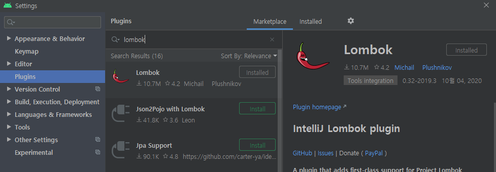

# Lombok

> * Java의 전형적인 Boilerplate code들을 업애주는 Annotation기반 라이브러리


## Setting

* build.gradel(app)

```groovy
compileOnly 'org.projectlombok:lombok:1.18.12'
annotationProcessor 'org.projectlombok:lombok:1.18.12'
```

* Android Studio IDE 플러그인 설치

  * Settings - Plugins - Browse Repositories - lombok검색 - Install

  

## Basic Code

* VO.class

  ```java
  @Data
  public class TestVO{
    private String name;
    private String age;
  }
  ```

* @Data

  * @ToString, @EqualsAndHashCode, @Getter, @Setter, @RequiredArgsConstructor를 모두 생성 하기 때문에 사용에 주의가 필요

* @Getter, @Setter

  ```java
  public class SimpleVO { 
    @Getter private final String name; 
    @Getter @Setter private int age; 
    
    public SimpleVO(String name) { 
    	this.name = name; 
    } 
  }
  ```


## Reference

[https://beomseok95.tistory.com/242](https://beomseok95.tistory.com/242)