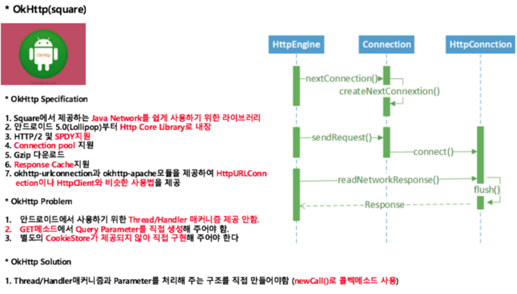

# OkHttp3

> * 기존 안드로이드에서 네트워크를 구현 시 Thread의 개념을 적용하고 여러 메소드를 오버라으 해야 하는 방식의 AsyncTask를 사용 하였다.
>   * 내부적으로 AsyncTask에서 구현해야 했던 Thread개념이 적용되어 있고 기존에 쓰였던 HttpUrlConnection Class의 기능을 확장해서 특화된 Request, Response의 Class들을 제공

##  장점

1. Interceptor 처리하는 것이 편하다
   1. Apllication Interceptors
      * Application과 OKHttp 사이에 Request, Response정보를 intercept하여 추가적으로 처리
   2. Network Interceptors
      * Network와 OKHttp사이에  Requests, Responses 정보를 intercept하여 추가적으로 처리
2. 기본 설정값 : OKHttp는 강력한 기본값들이 잘 설정되어 있음
3. Retofit은 OkHttp위에서 돈다.

## Reference

[Github - Okhttp3 오픈소스](https://github.com/square/okhttp)

[Android - OkHttp3 / Web Server 연동](https://m.blog.naver.com/PostView.nhn?blogId=scw0531&logNo=220829952304&proxyReferer=https:%2F%2Fwww.google.com%2F)

