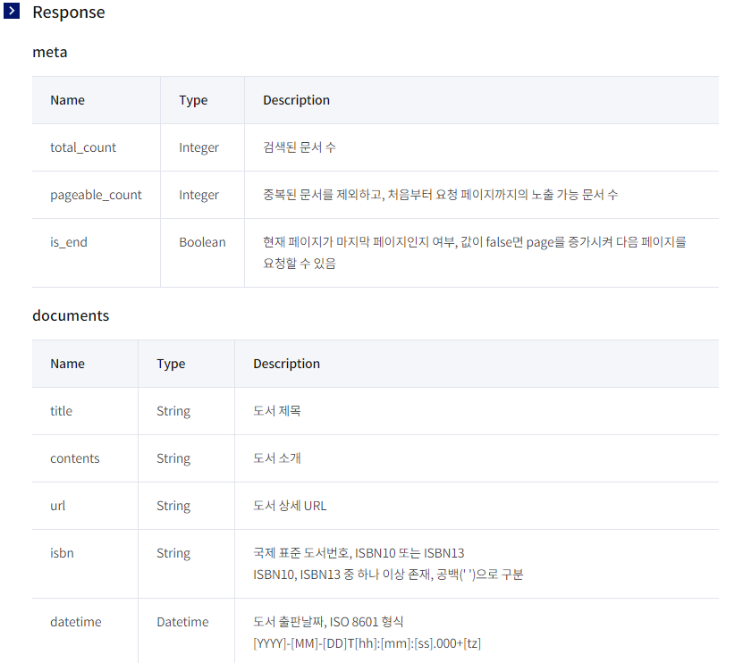

# RETROFIT2

* http 서버통신을 쉽게 사용할 수 있게 해주는 Android Library
* HTTP call 을 단순화

* Build.gradle

```java
implementation 'com.squareup.retrofit2:retrofit:2.4.0'
implementation 'com.google.code.gson:gson:2.8.0'	
implementation 'com.squareup.retrofit2:converter-gson:2.4.0'
implementation 'com.squareup.retrofit2:converter-scalars:2.4.0'
```


* 자동적으로 JSON응답을 사전에 정의된 POJO를 통해 직렬화 할 수 있다.
* JSON을 직렬화 하기 위해서는 먼저 Gson converter가 필요하다


## Kakao API 활용한 문제





* KakaoRetorofit Interface
  * Annotation을 통해 HTTP request 를 작성

```java
public interface KakaoRetrofit {
    @GET("v3/search/book?target=title")
    Call<DocumentList> getDocument(
        @Header("Authorization") String kakaoAK,
        @Query("query") String keyword);
}
```

* APIClient.class
  * getClient() 메서드는 Retrofit 인터페이스를 설정할 때마다 호출 한다.

```java
public class APIClient {

    public static Retrofit retrofit = null;

    public static Retrofit getClient() {
        HttpLoggingInterceptor interceptor = new HttpLoggingInterceptor();
        interceptor.setLevel(HttpLoggingInterceptor.Level.BODY);
        OkHttpClient client = new OkHttpClient.Builder().addInterceptor(interceptor).build();

        retrofit = new Retrofit.Builder()
                .baseUrl("https://dapi.kakao.com")
                .addConverterFactory(GsonConverterFactory.create())
                .client(client)
                .build();
        return retrofit;
    }
}
```

* MainActivity

```java
 /**
         * RETROFIT2 이요한 REST API Response and Request
         */
String kakaoAK = "KakaoAK xxxxxxxxxxxxxxx";
String keyword = "JAVA";

kakaoRetrofit = APIClient.getClient().create(KakaoRetrofit.class);
Call<DocumentList> callDocumentList = kakaoRetrofit.getDocument(kakaoAK, keyword);
callDocumentList.enqueue(new Callback<DocumentList>() {
    @Override
    public void onResponse(Call<DocumentList> call, Response<DocumentList> response) {
        Log.v(TAG,"retrofit_onResponse=="+response.code());
        Log.v(TAG,"retrofit_onResponse=="+call.request().toString());
        Log.v(TAG,"retrofit_response.body().size()=="+response.body().documents.size());
        Log.v(TAG,"retrofit_response.body()_documents.get(0).getAuthors()=="+response.body().documents.get(0).getAuthors());
        documents = response.body().documents;
        Log.v(TAG,"retrofit_documents=="+documents.get(0).getAuthors());
        //initData(keyword);
        //documentListR = (List<SearchData>) response.body();
        //                Log.v(TAG,"retrofit_response=="+documentListR.get(0).toString());
    }
    @Override
    public void onFailure(Call<DocumentList> call, Throwable t) {
        Log.v(TAG,"retrofit_onFailure=="+t.toString());
        Log.v(TAG,"retrofit_onFailure=="+call.request().toString());
    }
});
```


## ERR 처리

> Retrofit2 Android: Expected BEGIN_ARRAY but was BEGIN_OBJECT at line 1 column 2 path $

* [참고_Stack overflow](https://stackoverflow.com/questions/36177629/retrofit2-android-expected-begin-array-but-was-begin-object-at-line-1-column-2)

* Response 로 넘어온 데이터가 List 가 아닌 객체로 넘어와 에러발생

  * getData 메서드의 반환 타입을 List로 해서 에러가 발생하였다

  ```java
  //Error Code//
  public interface KakaoRetrofit {
      @GET("v3/search/book?target=title")
      Call<List<SearchData>> getData(
          @Header("Authorization") String kakaoAK,
          @Query("query") String keyword);
  }
  
  //수정 코드//
  public interface KakaoRetrofit {
      @GET("v3/search/book?target=title")
      Call<DocumentList> getDocument(
          @Header("Authorization") String kakaoAK,
          @Query("query") String keyword);
  }
  ```

  

# 참고사이트

[Retrofit](https://square.github.io/retrofit/)

[RETROFIT2](https://jongmin92.github.io/2018/01/29/Programming/android-retrofit2-okhttp3/)

[Retrofit2 Example](https://falinrush.tistory.com/5)

[kakaoAPI_MAP](https://youngest-programming.tistory.com/163)

[jsonschema2pojo](http://www.jsonschema2pojo.org/)

[REST API](https://medium.com/@joycehong0524/android-studio-retrofit2-%EA%B8%B0%EB%B3%B8-%EC%82%AC%EC%9A%A9%EB%B2%95-retrofit-%EC%9D%98%EB%AC%B8%EC%A0%90-%ED%92%80%EC%96%B4%ED%97%A4%EC%B9%98%EA%B8%B0-%EC%8A%A4%EC%95%95-f150db436add)


```kotlin

```

