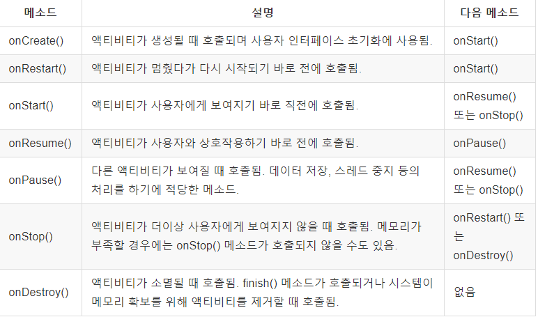

# Android Start

## AndroidManifest.xml

* 엡 전반에 대한 설정

```xml
<?xml version="1.0" encoding="utf-8"?>
<manifest xmlns:android="http://schemas.android.com/apk/res/android"
    package="com.example.firstapp">

    <application
        android:allowBackup="true"
        android:icon="@mipmap/ic_launcher"
        android:label="@string/app_name"
        android:roundIcon="@mipmap/ic_launcher_round"
        android:supportsRtl="true"
        android:theme="@style/AppTheme">
        <activity android:name=".MainActivity">  App실행시 가장 처음 열리는 화면
            <intent-filter>
                <action android:name="android.intent.action.MAIN" />

                <category android:name="android.intent.category.LAUNCHER" />
            </intent-filter>
        </activity>
    </application>

</manifest>
```


## MainActivity

```java
package com.example.firstapp;

import androidx.appcompat.app.AppCompatActivity;

import android.os.Bundle;

public class MainActivity extends AppCompatActivity {

    //Callback Method 특정 시점이 되면 android system에 의해서 자동적으로 호출 =>해당 class에 instance가 생성될떄
    @Override
    protected void onCreate(Bundle savedInstanceState) {
        super.onCreate(savedInstanceState); //상위 class method 호출
        setContentView(R.layout.activity_main); //activity 화면구성, xml파일이름은 무조건 소문자여야한다
    }
}

```

* 화면구성 방법
  * java code로 widget component를 생성해서 화면에 붙이는 방식
  * xml 파일을 이용해서 화면구성
    * 표현과 구성을 관리

## repository

* res
  * drawable - application내에서 사용하는 그림 파일 저장 공간
  * layout - Activity에서 사용할 xml 파일들의 저장 공간
  * mipmup - launcher icon과 같은 이미지 자원(App icon)
  * value - 문자열이나 컬러와 같은 다양한 자원에 대한 정보를 저장

## Logcat

* Log.i
* Log.v

## activity_main.xlm

```xml
<?xml version="1.0" encoding="utf-8"?>
<androidx.constraintlayout.widget.ConstraintLayout xmlns:android="http://schemas.android.com/apk/res/android"
    xmlns:app="http://schemas.android.com/apk/res-auto"
    xmlns:tools="http://schemas.android.com/tools"
    android:layout_width="match_parent"
    android:layout_height="match_parent"
    tools:context=".MainActivity">

    <TextView
        android:layout_width="wrap_content"
        android:layout_height="wrap_content"
        android:text="군만두"
        app:layout_constraintBottom_toBottomOf="parent"
        app:layout_constraintLeft_toLeftOf="parent"
        app:layout_constraintRight_toRightOf="parent"
        app:layout_constraintTop_toTopOf="parent" />

</androidx.constraintlayout.widget.ConstraintLayout>
```

* VIew Group 
  * Button, TextView, ImageView, View 들을 크기와 위치를 조절해서 설정

## Activity LifeCycle

 

* 사용자에 의해 이벤트가 발생되면 상태가 변하고 call back method가 호출된다
  1. Activity는 class상태로 존재
  2. Activity가 화면에 나타나려면 객체화 해야한다.
  3. onCreate() method가 callback된다.
  4. onStart() method가 callback되면 activity의 초기화 작업을 한다.
  5. activity가 foreground로 나타나면서 사용자와 interaction에 가능
  6. onResume() method가 callback된다
  7. Activity의 산태가 Running상태가 된다.
  8. Activity의 일부문이 보이지 않는 상태가 된다(Pause상태)
  9. Pause산태가 되면 onPause() method가 callback된다
  10. Activity의 전체가 완전히 가려져서 보이지 않는 산태가 된다(Stop)
  11. Stop산태가 되면 onStop() method가 callback된다
  12. 만약 Stop상태에서 다시 Running산태가 되면 onReSart() ->onStart() ->onResume()순서로 호출
  13. 사용하고 있는 activity를 종료하게되면 killed산태로 진입, 진입하기 전에 onDestory() method를 callback

 

