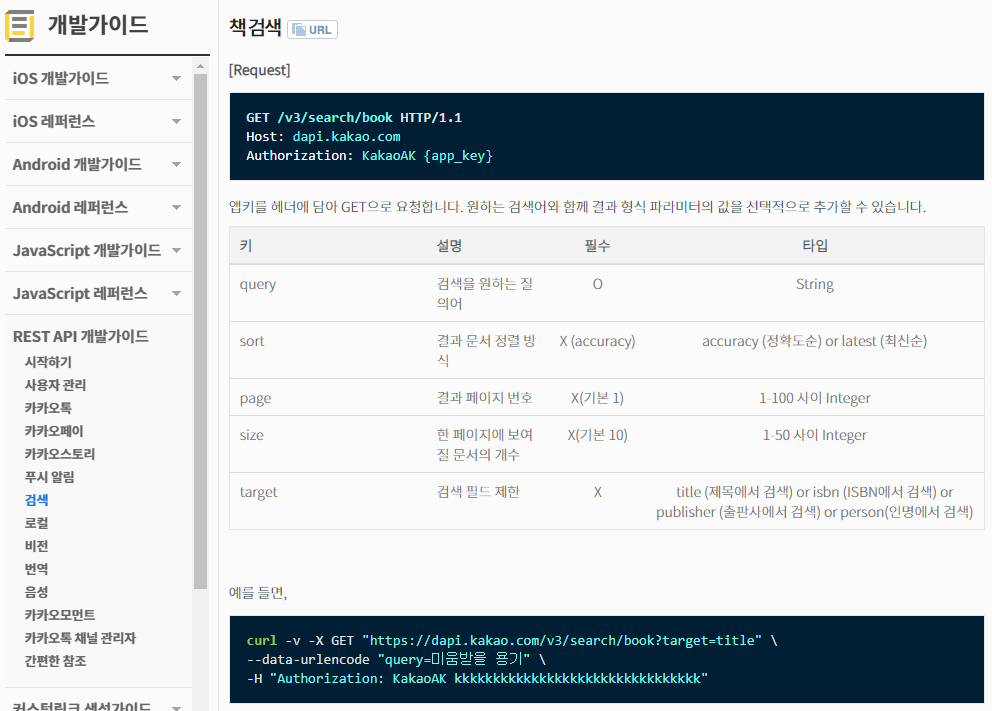

# OPNE API

> Daum 도서 API
>
> 도서검색

1. Activity 생성
   * EditText - 책 검색용
   * Button - 검색 호출
2. Service 시작
   * Network를 통해 KAKAO가 제공하는 OPNE API호출
     * 호출 방법 확인
     * JSON으로 결과를 받음
     * JSON을 처리해서 원하는 결과를 뽑아야함.
       * JACKSON library를 이용
   * 도서정보에서 책 제목 추출
   * Activity로 책 제목 전달
3. Activity - Service로부터 받은 정보를 ListView로 출력


* Kakao Developer

  *  App개설

    * App이름, 화시이름 작성
    * 개발가이드 - REST API개발 가이드 - 검색 - 책검색

  * RestAPI KEY 값 할당

    




## JSON 을 객체로 변환해서 원하는 Data로 출력

* 도서검색 API 도서정보 JSON 형태
  * JSON 문자열을 documents key값을 이용해서 객체화시켜 책 정보들을 얻어와야함
    * documents를 key값으로 해서 뒤에 책 데이터만 겍체 형테로 얻어오고 다시 문자열로 변환
    * JSON -> 객체  -> JSON형태로

```
documents:[{책 정보1},{책 청보2},{책 정보3},...] 형식으로 JSON을 얻어옴
```

```json
//JSON형태 하나의 책 정보//
HTTP/1.1 200 OK
Content-Type: application/json;charset=UTF-8
{
  "meta": {
    "is_end": true,
    "pageable_count": 9,
    "total_count": 10
  },
  "documents": [
    {
      "authors": [
        "기시미 이치로",
        "고가 후미타케"
      ],
      "contents": "인간은 변할 수 있고, 누구나 행복해 질 수 있다. 단 그러기 위해서는 ‘용기’가 필요하다”고 말한 철학자가 있다. 바로 프로이트, 융과 함께 ‘심리학의 3대 거장’으로 일컬어지고 있는 알프레드 아들러다. 『미움받을 용기』는 아들러 심리학에 관한 일본의 1인자 철학자 기시미 이치로와 베스트셀러 작가인 고가 후미타케의 저서로, 아들러의 심리학을 ‘대화체’로 쉽고 맛깔나게 정리하고 있다. 아들러 심리학을 공부한 철학자와 세상에 부정적이고 열등감 많은",
      "datetime": "2014-11-17T00:00:00.000+09:00",
      "isbn": "8996991341 9788996991342",
      "price": 14900,
      "publisher": "인플루엔셜",
      "sale_price": 13410,
      "status": "정상판매",
      "thumbnail": "https://search1.kakaocdn.net/thumb/R120x174.q85/?fname=http%3A%2F%2Ft1.daumcdn.net%2Flbook%2Fimage%2F1467038",
      "title": "미움받을 용기",
      "translators": [
        "전경아"
      ],
      "url": "https://search.daum.net/search?w=bookpage&bookId=1467038&q=%EB%AF%B8%EC%9B%80%EB%B0%9B%EC%9D%84+%EC%9A%A9%EA%B8%B0"
    },
    ...
  ]
}
```

* API로 부터 데이터 받아오기
  * JSON형테의 책 데이터
  * 데이터를 가져오는 연결통로를 이용해서 한 줄 한줄로 넘어 오는 데이터를 StringBuffer type로 저장

```java
//접속 성공시
//접속이 성공하면 결과 데이터를 JSON으로 보내주게 되고 해당 데이터를 읽어옴
//데이터 연결통로 (Stream)을 읽어서 데이터를 읽어온다
BufferedReader bufferedReader = new BufferedReader(new InputStreamReader(con.getInputStream()));
            String line ;
            StringBuffer stringBuffer = new StringBuffer();

            //반복적으로 서버가 보내주는 데이터 읽어옴 (통로를 통해 받아오는게 null이 아닐때까지 일거온다)
            while ((line = bufferedReader.readLine())!=null){
                //서버에서 받아오는 한줄 한줄을 stringBuffer에 저장
                stringBuffer.append(line);
            }
```

* JACKSON

```java
 //documents:"[{책 정보1},{책 청보2},{책 정보3},...]"  형태로 된 JSON을 처리해서 documents라고 되어있는key값으에 대해 Value값을 객체화 해서 가져와야함
//Jackson library를 이용해서 처리
ObjectMapper mapper = new ObjectMapper();
//stringBuffer.toString()를 읽어서 객체화 할지
//Json을 읽어서 documents 를 key로 설정하고 최상위 객체인 Object type 으로 책 정보들을 객체화 할거다.
Map<String,Object> map = mapper.readValue(stringBuffer.toString(), new TypeReference<Map<String,Object>>() {});
Object jsonObject = map.get("documents");
//jsonObject => "[{책 정보1},{책 청보2},{책 정보3},...]"
//위에서 얻은 객체를 다시 JSON 문자열로 변환
String jsonString = mapper.writeValueAsString(jsonObject);
//jsonString => "[{책 정보1},{책 청보2},{책 정보3},...]" 형태로 변환
```

* JSON 을 객체 type으로 변화

```java
 Map<String,Object> map = mapper.readValue(stringBuffer.toString(), new TypeReference() {
                @Override
                public int compareTo(Object o) {
                    return 0;
                }
            }
```

* 위 형테를 제네릭 형으로 code를 바꿔준다

```java
Map<String,Object> map = mapper.readValue(stringBuffer.toString(), new TypeReference<Map<String,Object>>() {});
```

* 객체를 JSON 문자열로 변화

```java
//위에서 얻은 객체를 다시 JSON 문자열로 변환
String jsonString = mapper.writeValueAsString(jsonObject);
//jsonString => "[{책 정보1},{책 청보2},{책 정보3},...]" 형태로 변환
```

* 결과 화면


* VO 객체를 만들어야한다

