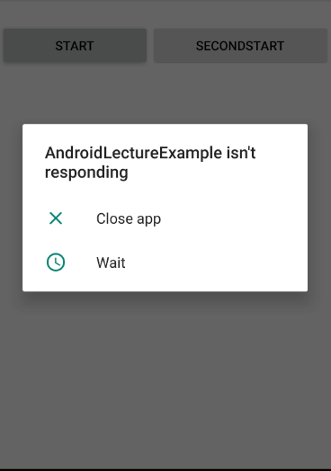

# Multi Thread

## Multiprocessing

* Task(일,작업)를 실행하는 core(Processor)가 2개 이상인 경우

## Multi Tasking

* 하나의 core가 시분할(time slicing)기법을 이용해서 여러개의 Task를 동시에 수행되는 것처럼 보이게 하는 것.

## Multi Threading

* 하나의 Task를 여러개의 sub Task로 분할해서 동시간대에 실행되는 것처럼 만드는 것.
* 다수의 작업을 각 작업마다 core가 붙어 동작을 하는것(=분할 작업)
  * Multi Threading를 하지 않으면 순차적으로 데이터를 처리해야하기 때문에 성능과 시간이 비효율적이다.
* Thread - 독립적인 실행 흐름.

## Thread 

* Thread사용 되는 상황

  1. 대용량의 데이터를 분산해서 처리해야 하는경우
  2. 다수의 클라이언트를 처리하는 서버 프로그램

* Java Program

  * main() 이 종료되면 프로그램종료
    * 단일 Thread

  

### Thread객체 생성

1. 상속
   * start() method
     * non blocking method
2. Interface

```java
package com.test;

public class ThreadTest {
	
	//프로그램은 해당 프로그램에서 사용되는 모든 Thread가 종료되는 시점에 프로그램이 종료.
	//Java에서 Thread는 Instance(객체) 로 존재한다  =>Thread를 만들기 위해 class가 존재한다 =>Thread.class
	public static void main(String[] args) {
		//1.thread instance 생성
		Thread thread = new MyThread();
		//2.start() method실행
		thread.start(); //non blocking method, 해당 Thread가 언제 실행 될지는 모른다 (JVM이 알아서 할당해서 처리해줌)
		
		Thread runnable = new Thread(new MyRunnable());
		runnable.start();
		
	}
}

class MyThread extends Thread{
	@Override
	public void run() {
		super.run();
		System.out.println("MyThread");
	}
}

class MyRunnable implements Runnable{
	@Override
	public void run() {
		System.out.println("MyRunnable");
	}
}
```

# Android Thread

## ANR

> Application Not Responding

* ANR 발생
  * 사용자와의 Interaction이 중지
  * Activity가 Block된 것 처럼 보임
* NetWork와 관련된 작업은  Activity 에서 하면 안된다. 
  * DB 처리
  * Big Data 처리
* Activity는 하나의 Thread이다
  * UI Thread
  * backThread를 이용해서 처리해야한다.

 

```java
public class ANRActivity extends AppCompatActivity {
    TextView tv_01;
    Button btnStart;
    Button btnSecond;
    @Override
    protected void onCreate(Bundle savedInstanceState) {
        super.onCreate(savedInstanceState);
        setContentView(R.layout.activity_anr);

        tv_01=findViewById(R.id.tv_01);
        btnStart = findViewById(R.id.btnStart);
        btnStart.setOnClickListener(mClic);
        btnSecond = findViewById(R.id.btnSecond);
        btnSecond.setOnClickListener(mClic);
    }

    View.OnClickListener mClic = new View.OnClickListener(){
        @Override
        public void onClick(View v) {
            switch (v.getId()){
                case R.id.btnStart:
                    //오랜시간 연산이 수행됨
                    long sum = 0;
                    for(long i=0; i<100000000000L ; i++){
                        sum += i;
                    }
                    Log.v("ANRActivity","sum====="+sum);
                    break;
                case R.id.btnSecond:
                    //Toast Massage 호출
                    Toast.makeText(getApplicationContext(),"얍얍",Toast.LENGTH_LONG).show();
                    break;
            }
        }
    };
}
```

## Runnable

* Runnable 를implements 하는 Inner class 이용

* 오래 작업하는 연산 처리를  MyRunnable 클레스에서 수행하게 함

  * ```java
    Thread myRunnable = new Thread(new MyRunnable());
    myRunnable.start();
    ```

* 오래걸리는 연산 처리를 Multi Thread를 이용하여 Activity를 자유롭게함.

```java
public class CounterLogActivity extends AppCompatActivity {
    TextView tv_01;
    Button btnStart;
    Button btnSecond;

    @Override
    protected void onCreate(Bundle savedInstanceState) {
        super.onCreate(savedInstanceState);
        setContentView(R.layout.activity_counter_log);

        tv_01=findViewById(R.id.tv_01);
        btnStart = findViewById(R.id.btnStart);
        btnStart.setOnClickListener(mClick);
        btnSecond = findViewById(R.id.btnSecond);
        btnSecond.setOnClickListener(mClick);
    }

    View.OnClickListener mClick = new  View.OnClickListener(){
        @Override
        public void onClick(View v) {
            switch (v.getId()){
                case R.id.btnStart:
                    Log.v("CounterLogActivity","onClick btnStart====="+btnStart);
                    //Thread만들어 실행
//                    MyRunnable myRunnable = new MyRunnable();
//                    Thread thread = new Thread(myRunnable);
//                    thread.start();
                    Thread myRunnable = new Thread(new MyRunnable());
                    myRunnable.start();

                    break;
                case R.id.btnSecond:
                    Log.v("CounterLogActivity","onClick btnSecond====="+btnSecond);
                    Toast.makeText(getApplicationContext(),"엽엽",Toast.LENGTH_SHORT).show();
                    break;
            }
        }
    };

    public class MyRunnable implements  Runnable{
        @Override
        public void run() {
            long sum = 0;
            for(long i=0; i<10000000000L ; i++){
                sum += i;
            }
            Log.v("CounterLogActivity","sum====="+sum);
        }
    }
}

```


## Thread Safe

* Android UI component는 thread safe하지 않는다
* Android UI component는 오직 UI Thread에 의해서만 제어되야 한다
* 화면제어는 오직 UI Thread에 의해서만(Activity)제어할수 있다
* **외부 Thread(UI Thread가 아닌)에서 UI component를 직접 제어할 수 없다.**

* 잘못된 예시

```java
    public class CounterRunnable implements  Runnable{
        @Override
        public void run() {
            Log.v("CounterRunnable","???????????");
            //숫자를 더해가면서 progressBar를 진행
            long sum = 0;
            for(long i=0; i<10000000000L ; i++){
                sum += i;
                if(i % 100000000 == 0) {
                    Log.v("CounterRunnable","ifififififififi");
                    long loop = i / 100000000;
                    pbCounter.setProgress((int)loop);
                }
            }
            tv_01.setText("합계="+sum);
            Log.v("CounterLogActivity","sum====="+sum);
        }
    }
```

## Handler

* Activity와 Thread간에 통신(Magssage전달 방식)
  * Activity가 화면을 제어
* 메세지를 전달받아서 로직처리하는 method2개를 주로 사용.
* Bundle

```java
public class CounterHandlerActivity extends AppCompatActivity {
    TextView tv_01;
    Button btnStart;
    Button btnSecond;
    ProgressBar pbCounter;
    Handler handler;

    @Override
    protected void onCreate(Bundle savedInstanceState) {
        super.onCreate(savedInstanceState);
        setContentView(R.layout.activity_counter_handler);

        pbCounter=findViewById(R.id.pbCounter);
        tv_01=findViewById(R.id.tv_01);
        btnStart = findViewById(R.id.btnStart);
        btnStart.setOnClickListener(mClick);
        btnSecond = findViewById(R.id.btnSecond);
        btnSecond.setOnClickListener(mClick);
        //데이터를 주고받는 역할을 수행하는 Handler객체 생성
        handler = new Handler(){
            @Override
            public void handleMessage(@NonNull Message msg) {
                super.handleMessage(msg);
                //받은 데이터를 이용해 화면 처리
                Bundle bundle = msg.getData();
                String count = bundle.getString("count");
                pbCounter.setProgress(Integer.parseInt(count));
            }
        };
        //연산시작이라는 버튼을 클릭했을 때 로직처리하는 Thread를 생성
    }

    TextView.OnClickListener mClick = new TextView.OnClickListener(){
        @Override
        public void onClick(View v) {
            switch (v.getId()){
                case R.id.btnStart:
                    Log.v("CounterLogActivity","onClick btnStart====="+btnStart);
                    //Thread 생성
                    //Thread에게 Activity와 데이터 통신을 할 수 있는 handler객체를 전달.
//                    HandlerThread h = new HandlerThread(handler);
//                    Thread handlerThread = new Thread(h);
//                    handlerThread.start();

                    Thread handlerThread = new Thread(new HandlerThread(handler));
                    handlerThread.start();

                    break;
                case R.id.btnSecond:
                    Log.v("CounterLogActivity","onClick btnSecond====="+btnSecond);
                    Toast.makeText(getApplicationContext(),"엽엽",Toast.LENGTH_SHORT).show();
                    break;
            }
        }
    };
}
//로직 처리를 담당하는 Thread를 위한 Runnable interface구현한 class
class HandlerThread implements Runnable{
    private  Handler handler;

    HandlerThread(Handler handler) {
        this.handler = handler;
    }

    @Override
    public void run() {
        long sum = 0;
        for(long i=0; i<10000000000L ; i++){
            sum += i;
            if(i % 100000000 == 0) {
                Log.v("CounterRunnable","ifififififififi");
                long loop = i / 100000000;
                Bundle bundle = new Bundle();
                bundle.putString("count",String.valueOf(loop));
                Message msg = new Message();
                msg.setData(bundle);
                handler.sendMessage(msg);
            }
        }
    }
}
```

