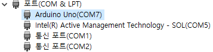
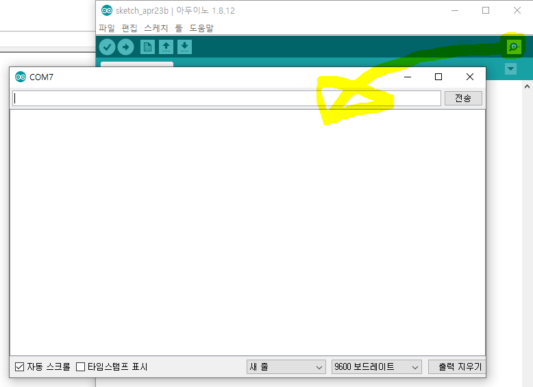
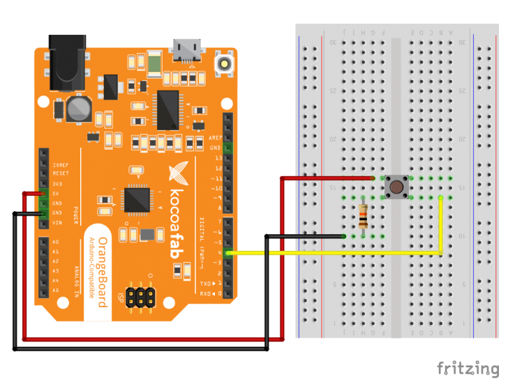

# Arduino

> 5G - Cloud 시대(PC에서 다운로드 하지 않고 cloud server에서 통신을 가지고 프로그램 이용 할 수 있다.)

* Arduino 는 이탈리아어 이다.
* 이탈리아에서 만든 Open Sourse Hardware
* Arduino는 Micro-Controller이며, 이식된 Code를 수행하는 장치.
* 직역으로 강한친구, 절친한 친구 이다
* IoT와 맞물려 있어 각광을 받기 시작
  * 일반적인 사물에 통신장비를 결합하고 고도의 통신기술을 이용하여 특별한 작업을 수행하는 장비 
* 컴퓨터가 아니기 때문에, OS설치나 기타 응용프로그램을 설치할 수 없다.
  * 르즈베리파이(single board computer) OS, 응용프로그램 설치 가능하다 
* 라떼팬더(single board computer) 와 Arduino 를 연결해 사용.

* 사물인터넷을 구현하기 위해서 그 안에 들어가는 Controller가 가져야하는 조건
  1. 저렴한 가격
  2. 프로그램 작성과 프로그램 이식이 쉬워야 한다.
  3. 센서와 액추에이터를 쉽게 사용할 수 있어야 한다.
* Arduino Version
  * Uno - 가장 대표적인 version
  * Mega - 크기가 크며, 복잡한 처리를 할 수 있는 version 이다
  * mini -  크기가 작은 version
  * 이 외 다양한 version 들이 존재하며 목적에 맞게 선택해 사용 해야 한다.

## 구조

* Sensor  -  일반적으로 주위환경에 대한 정보 수집
  * 거리, 습도, 거리, 밝기, 등 다양한 Sensor존재
* Actuator - 활동을 할 수 있도록 도와주는 전자 부품 존재
  * LED, Motor, Spicker
* 저항 - 전기를 열로 바꿔주는 전자 부품

* Uno의 경우 Digital이라고 표현된 곳이 있다.

  * 디지털 핀은 총 13개가 존재
    * 0,1 번 pin은 Serial통신에 사용되기 때문에 사용을 지양한다.

* PC 와 직렬 통신을 한다

   

## Setting

* Arduino IDE [다운로드](https://www.arduino.cc/en/Main/Donate)
* 홈 - 보드 - Version 선택(Uno)
* 홈 - 포트 -Arduino와 연결된 포트(Arduino Uno(COM7)) 선택

## IDE

* 기본 생성 함수
  * setup() - 실행시 최초 1회 호출
    * 설정 정보
  * loop() -  setup() 함수 실행 후 내부에서 지속적으로 반복 수행
    * 실행 Logic

```c
// 실행시 최초 1회 호출
void setup() {
  // put your setup code here, to run once:

}
// setup() 실행 후 내부에서 지속적으로 반복 수행
void loop() {
  // put your main code here, to run repeatedly:

}
```

### 기본 예제

* 기본 Test 예제 

  * Board LED를 1초 간격으로 ON/OFF
  * Uno Board에 기본 LED 는 Pin13 과 연결이 되어있다

  ```c
  void setup() {
    // put your setup code here, to run once:
    //13pin을 출력 용도로 설정
    pinMode(13, OUTPUT);
  }
  void loop() {
    // put your main code here, to run repeatedly:
    digitalWrite(13, HIGH); // Pin13 5V 인가
    delay(1000); // 1sec delay
    digitalWrite(13, LOW); // Pin 13 0V
    delay(1000);
  }
  ```

* Serial Port Comunication

  * PC 와 Serial 통신 확인 
  * 시리얼 모니터 - Debug 목적으로 주로 사용
  * 보드레이트
    * 높을수록 전송 속도가 빠르다
    * 보드레이트 값이 같아야 통신이 가능하다

   

  * (Arduino --data--> PC)

  ```c
  void setup() {
    // put your setup code here, to run once:
    // serial port이용한 통신
    Serial.begin(9600);
  }
  
  void loop() {
    // 1초 간격으로 Serial Port 를 통해서 Data 전달 (Arduino --data--> PC)
    Serial.println("Hello World!!");
    delay(1000);
  }
  ```

  * (PC --data--> Arduino)

  ```c
  void setup() {
    // put your setup code here, to run once:
    // serial port이용한 통신
    Serial.begin(9600);
    pinMode(13, OUTPUT);
  }
  
  void loop() {
    // Serial port로 전송되는 데이터를 받아온다
    // Serial port를 통해서 들어오는 데이터가 있으면
    if(Serial.available()){
      char c = Serial.read();
      if(c=='A'){  // A를 입력하면 '\'가 위에 딸아 붙어서 else처리를 하면 1초 켜진뒤 else가 실행되 LED가 꺼진다
        digitalWrite(13, HIGH);
        delay(1000);
      }else if(c=='B'){
        digitalWrite(13, LOW);
        delay(1000);
      }
    }
  }
  ```

* 스위치를 이용한 LED ON/OFF
  * 스위치를 Full-Down 회로 이용해 구성

```c
void setup() {
  // put your setup code here, to run once:
  //13pin을 출력 용도로 설정
  pinMode(13, OUTPUT);
  pinMode(8, INPUT);
}

void loop() {
  // put your main code here, to run repeatedly:
  //setup() 후에 반복적으로 호출
  int value = digitalRead(8);

  if(value==HIGH){
    digitalWrite(13, HIGH);
  }else{
    digitalWrite(13, LOW);
  }
}
```



