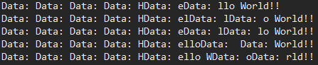

# Serial Communication

* Serial Port
  * 하나의 통신 통로를 이용
  * 물리적 I/O 단자 가 하나만 존재하면 된다
* Parallel Port
  * 다중의 통신 통로를 이용
  * 물리적 I/O 단자가 많아야 사용 가능함
    * 소형화 하기 어렵고 Arduino 단가가 올라감

## Eclipse

* Java Library 사용
  * rxtxSerial.dll
    * JAVA_HOME 경로에 bin폴더 안에 **동적Library**파일 넣는다
    * ex) C:\Program Files\Java\jdk1.8.0_231\bin
  * RXTXcomm.jar
    * Eclipse - Project -  Properties - Java build path - library - add JARs - jar 파일(RXTXcomm.jar) 경로찾아 t선택 - Apply

### BASIC 프로그램

* 프로그램 Code

  1. Serial Communication을 하기위한 COM port 설정

   

  ```java
  //port사용을 문자열로 받아옴 - Arduino 와 연결된 port number
  portIdentifier = CommPortIdentifier.getPortIdentifier("COM7");
  ```

  2. 포트가 사용되고 있는지 확인 

     * isCurrentlyOwned() - 다른곳에서 사용되고있는지 확안하는 함수
     * Port객체 사용 - open(String, Integer)

     ```java
     CommPort commPort = portIdentifier.open("PORT_OPEN",2000);
     ```

     * 객체 통신 타입 확인

       * comm Port 객체가 Serial Port  인지 확인

       * Object casting (Serial Port가.가지는 Method이용 하기위해 형변환)

       * 보드레이트 설정 setSerialPortParams(보드레이트, 1, 2, 3 )

         * 보드레이트는 Arduino보드와 맞춰 준다
         * 1,2,3 은 Serial Port가 가지고 있는 상수값 사용

         ```java
         if(commPort instanceof SerialPort) {
             // 포트 설정(통신 속도 설정)
             //SerialPort가 가지고 있는 메소드를 이용하기위해 commPort를 케스팅 형변환
             SerialPort serialPort = (SerialPort)commPort;
             //(보드레이트, , , )
             serialPort.setSerialPortParams(
                 9600, SerialPort.DATABITS_8, SerialPort.STOPBITS_1, SerialPort.PARITY_NONE);
         }else {
             //ParallelPort 인경우
             System.out.println("Serial Port만 이용 가능");
         }
         ```

       * Data Communication

         * Thread 를 이용해 Stream 사용
         * read() 가 Arduino 로부터 byte로 데이터("Hello World!!")를 받아오는데 라인이 통으로 전송되는게 아니다
           * read() 가 몇개의 byte(글자)를 받아 오는지 모르기 때문에 문자열을 처리할떄 주의 해야한다.

         ```java
         // 데이터 통신을 하기 위해 Stream을 연다
         // byte단위로 데이터가 전달된다
         InputStream in = serialPort.getInputStream();
         OutputStream out = serialPort.getOutputStream();
         //Thread를 이용해서 Arduino 로부터 들어오는 Data Receive
         Thread thread = new Thread(new Runnable() {
             @Override
             public void run() {
                 // byte type 1024 한번에 받을 size
                 byte[] buffer = new byte[1024];
                 int len=-1; // 현제 몇 byte를 받앗는지 담을 변수
                 try {
                     while((len = in.read(buffer)) != -1) {
                         // buffer 안에 0부텃히작해서 len 만큼
                         System.out.print("Data: "+new String(buffer,0,len));
                     }
                 } catch (Exception e) {
                     System.out.println(e);
                 }
             }
         });
         thread.start();
         ```

         * 출력 화면

          

### Event 처리 프로그램

* Event 처리 하여 Data 받아오기
  * SerialPortEventListener Interface를 상복받는 Class 생성
    * serialEvent() 추상 method 후촐하여 사용

* Main Class

```java
CommPortIdentifier portIdentifier;
try {
    portIdentifier = CommPortIdentifier.getPortIdentifier("COM7");
    if (portIdentifier.isCurrentlyOwned()) {
        System.out.println("포트 사용중");
    } else {
        CommPort commPort = portIdentifier.open("PORT_OPEN", 2000);
        if (commPort instanceof SerialPort) {
            SerialPort serialPort = (SerialPort) commPort;
            serialPort.setSerialPortParams(9600, SerialPort.DATABITS_8, SerialPort.STOPBITS_1,
                                           SerialPort.PARITY_NONE);
            InputStream in = serialPort.getInputStream();
            OutputStream out = serialPort.getOutputStream();
            // Event처리를 통해서 데이터 읽어온다
            serialPort.addEventListener(new Exam02_SerialListener(in)); // InputStream을 넘겨줘서  Exam02_SerialListener 에서 사용
            serialPort.notifyOnDataAvailable(true); // 데이터가 들어왔을때 알려주는 method

        } else {
            System.out.println("Serial Port만 이용 가능");
        }
    }
} catch (Exception e) {
    System.out.println(e);
}
```

* SerialPortEventListener Class

```java
public class Exam02_SerialListener implements SerialPortEventListener{
	InputStream in;
	
	//Construction injection
	Exam02_SerialListener(InputStream in){
		this.in = in;
	}
	
	@Override
	public void serialEvent(SerialPortEvent arg0) {
		//SerialPortEvent.DATA_AVAILABLE 데이터가 들어온 이벤트
		if(arg0.getEventType() == SerialPortEvent.DATA_AVAILABLE) {
			try {
				int size = in.available(); // in 데이터가 있냐고 물어보는 함수 return값이 데이터에 크기이다 
				byte[] data = new byte[size];
				in.read(data,0,size); //data 안에 0 부터 size크기 까지
				
				System.out.println("Receive Data: "+ new String(data)); 
				// 위 코드는 System.out.print("Data: "+new String(buffer,0,len)); 와 달리 data에 size가 결정됫기떄문에 data만 명시해준다
			} catch (Exception e) {
				
			}
		}
	}
}
```


## Arduino

* RX
* TX

* code

```c
void setup() {
  // put your setup code here, to run once:
  // serial port이용한 통신
  Serial.begin(9600);
}

void loop() {
  // put your main code here, to run repeatedly:
  Serial.println("Hello World!!");
  delay(1000);
}
```

