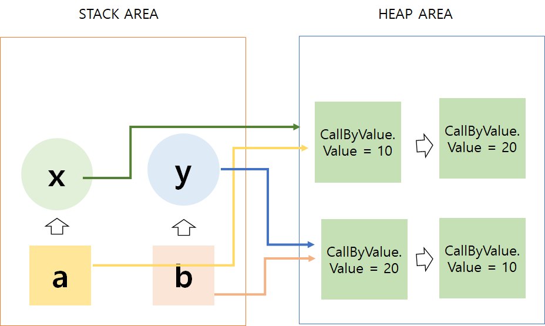

# CallByValue 와 CallByReference

> 함수 호출방법
>
> 1. Call by value - 값에 의한 호출
> 2. Call by reference - 참조에 의한 호출
## Call by Value
* **Call by value는 메서드 호출 시에 사용되는 인자의 메모리에 저장되어 있는 값(value)을 복사하여 보낸다.**
* 값에 의한 호출
* 함수에 매게 변수를 복사해서 처리
* 복사해서 처리하기 때문에 원래의 값이 보존된다.
* 복사하기 때문에 메모리량이 늘어난다.

```java
public class CallByValue {
    public static void swap(int x, int y){
        int temp = x;
        x = y;
        y = x;
    }

    public static void main(String[] args) {
        int a = 10;
        int b = 20;
        System.out.println(" 호출 전 : a = " + a + " b = " + b);
        swap(a,b);
        System.out.println(" 호출 후 : a = " + a + " b = " + b);
    }
}
```
> 결과
> 호출 전 : x = 10 y = 20
> 호출 후 : x = 10 y = 20

*`main()` 에 선언된 변수 a와 b가 메모리에 할당된다.
* `swap()` 메서드 호출 시 할당 된 메모리 주소가 아닌 메모리에 담겨져 있던 값만 복사되어 x와 y의 메모리 주소에 담겨지게 된다.
* `swap()` 메서드가 수행하는 동안 사용되는 변수는 `main()`에 존재하는 a,b가 아닌 **새로 생성된** x,y이기 때문에 수행 후에도 값에 변화가 없다.

## Call by Reference
* **Call by reference는 메서드 호출 시에 사용되는 인자가, 값이 아닌 주소(Address)를 넘겨줌으로써, 주소를 참조(Reference)하여 데이터를 변경할 수 있다.**
* 참조에 의한 호출
* 인자로 받은 값의 주소를 참조해 직접 값에 영향을 주는 것
* 복사하지 않고 직접 참조를 하기 때문에 빠르다.
* 직접 참조를 하기 때문에 원래 값이 영향을 받는다.

```java
public class CallByReference {
    int value;
    CallByReference(int value) {
        this.value = value;
    }

    public static void swap(CallByReference x, CallByReference y) {
        int temp = x.value;
        x.value = y.value;
        y.value = x.value;
    }

    public static void main(String[] args) {

        CallByReference a = new CallByReference(10);
        CallByReference b = new CallByReference(20);

        System.out.println(" 호출 전 : a = " + a.value + " b = " + b.value);
        swap(a, b);
        System.out.println(" 호출 후 : a = " + a.value + " b = " + b.value);
    }
}
```
> 결과
> 호출 전 : a = 10 b = 20
> 호출 후 : a = 20 b = 10


* `stack area`에는 객체들이 저장되고 `Heap Area`에는 값들이 저장된다.
* 메서드를 호출했을 때 주소 값을 복사 해서 넘긴다.
* 값이 변경될 때 x와 y가 가지고있는 주소 값을 통해서 value의 값을 변경한다.
    * 같은 주소값을 가진 a뫄b의 값이 변경된 것처럼 보여진다.