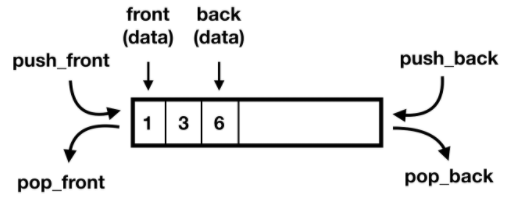

# Deque

> * 덱은 양쪽 끝에 삽입과 삭제가 모두 가능한 자료구조의 형태
> * 두 개의 포인터를 사용하여, 양쪽에서 삭제와 삽입을 발생 시킬 수 있다.
> * Queue와 Stack을 합친 형태로 생각할 수 있다.



* 덱의 함수
  * push_front - 덱의 앞에 데이터를 넣음
  * push_back - 덱의 뒤에 데이터를 넣음
  * pop_front - 덱의 압페서 데이터를 뺌
  * pop_back - 덱의 뒤에서 데이터를 뺌
  * front - 덱의 가장 앞에 있는 데이터
  * back - 덱의 가장 뒤에 있는 데이터
* Code

```java

```


