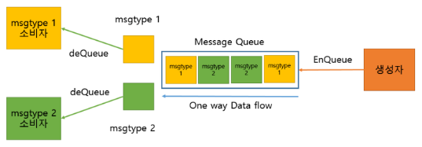
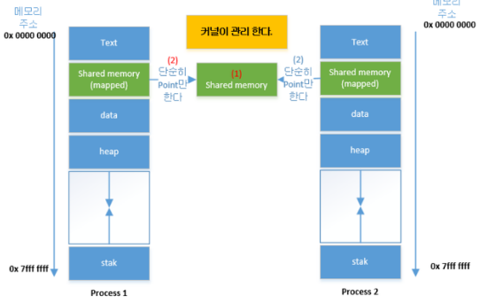
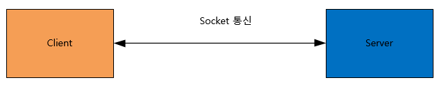

# IPC

> Instructions Per Cycle - 1사이클당 명령어 처리 횟수

## PIPE

1. 정의
   * 익명의 PIPE를 통해서 동일한 PPID를 가진 프로세스들 간에 **단방향 통신**
2. 구조
   * FIFO
   * 생성된 PIPE에 대하여 Write 또는 Read만 가능
3. 사용
   * 부모 자식 프로세스간 통신 할떄 사용
   * 쌍방향 통신을 위해서는 Write용 PIPE하나 Read PIPE하나 씩 만들어야 한다.
     * read와 write가 기본적으로block모드로 작동하기 때문에 프로세스가 read대기중이라면 read가 끝나기 전전에는 write를 할수가 없게 된다

 

## Named PIPE

1. 정의
   * 이름을 가진 PIPE를 통해서 프로세스들 간에 **단방향 통신**
   * 서로 다른 프로세스들이 PIPE와 이름만 알면 통신이 가능
2. 구조
   * FIFO
   * 생성된 PIPE에 대하여 Write 또는 Read만 가능
3. 사용
   * 연관이 전혀 없는 프로세스간 통신을 할때
   * 쌍방향 통신을 위해서는 Write용 PIPE하나 Read PIPE하나 씩 만들어야 한다.
     * read와 write가 기본적으로block모드로 작동하기 때문에 프로세스가 read대기중이라면 read가 끝나기 전전에는 write를 할수가 없게 된다

 

## Message Queue

1. 정의

   * 메모리를 사용한 PIPE

   * 구조체 기반으로 통신
     * 구조체 : 하나 이상의 변수를 묶어서 좀 더 편리하게 사용할 수 있도록 도와주는 도구

2. 구조

   * FIFO
   * msgtype에 따라 다른 구조체를 가져올수 있따.

3. 사용

   * 프로세스간 다양한 통신을 할 떄 사용
   * 커널에서 제공하는 Message queue 이기에 Enqueue 하는데 제한이 있다.
     * Enqueue : 데이터를 입력하는 함수
     * Dequeue : 데이터를 출려하는 함수

1. * * Dequeue : 데이터를 출려하는 함수

!

## Shared Memory

1. 정의
   * 시스템 상의 공유 메모리를 통해 통신
2. 구조
   * 일정한 크기의 메모리를 프로세스간에 공유 하는 구조
   * 공유 메모리는 커널에서 관리한다.
   * 단순히 공유 메모리르 point함으로써 프로세스에서 사용되는 메모리가 증가되지는 않는다.
3. 사용
   * 프로세스간 Read,Write를 모두 필요로 할떄
   * 프로세스간의 사용 할때 **메모리 크기가 동일해야 한다.**

 

## Memory Map

1. 정의
   * 파일을 프로세스의 메모리에 일정 부분 맵핑 시켜 사용
2. 구조
3. 사용
   * 파일로 대용량 데이터를 공유 할 때 사용
   * FILE IO가 느릴떄 사용
   * 대부분 운영 체제에서는 프로세스를 실행할 때 실행 파일의 각 세그먼틀르 메모리에 사상하기 위해 메모리 맵 파일을 이용
   * write시기는 프로세스의 페이지가 메모리에에서 내려갈 때만 Write된다. 
     *  이렇게 때문에 메모리와 file Sync가 안맞을수 도있다.
     * IA-32 기반 시스템에서 하나의 프로세스에서 PAE 기술을 사용하지 않고 사용 가능한 최대 크기는 4GB로 제한된다
     * 메모리 맵 파일은 파일의 크기를 바꿀 수는 없으며 메모리 맵 파일을 사용하기 이전, 또는 이후에만 파일의 크기를 바꿀 수 있다.

 

## Socket

1. 정의
   * 네트워크 소켓통신을 사용한 데이터 공유
2. 구조
   * 구조네트워크 소켓을 이용하여 Client -Server 구조로 데이터 통신
3. 사용
   * 원격에서 프로세스간 데이터를 공유할떄
   * 네트워크 프로그래밍이 가능해야함
   * 데이터 세그먼트 처리를 잘 해야한다

 

   

