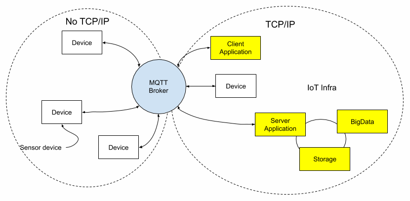

# MQTT

> * MQTT(Message Queue for Telemetry Transport)는 M2M 또는 IoT 기기와 G/W의 연동을 위해 정의된 프로토콜입니다.
> * IoT를 위해서 낮은 전력, 낮은 대역폭 환경에서도 사용할 수 있도록 설계

## MQTT 특징

* MQTT 프로토콜은 메시지를 발생(publishing) 하고 , 관심 있는 주제를 구독(subscribe)하는 것을 기본 원칙으로 한다

* Publisher과 Subscriber은 모두 **Broker**에 대한 클라이언트로 작동한다

**Connection Oriented**
\* MQTT broker와 연결을 요청하는 client는 TCP/IP socket 연결을 한 후 명시적으로 종료하거나 network 사정에 의해 연결이 끊어질 때까지 연결 상태를 유지합니다.
\* Topic에 발행된 message와 연결상태 확인을 위한 live(heart-beat)를 항상 유지된 연결을 통해 전달하게 됩니다.
\* 연결 상태를 유지하는 것은 물론이고 연결이 끊어진 경우 재접속 등의 지원을 위한 자체 기능을 보유하고 있습니다.

**Topic 그리고 발행(publication) / 구독(subscription)**
\* 개설된 Topic에 message를 발행하면 해당 Topic을 구독하는 client 들에게 message를 전송합니다.
\* 따라서 one to multi 또는 one to one message 전송을 모두 지원할 수 있습니다.

**QoS(Quality of Service)는 0, 1, 2 세단계를 지원**
\* 0 : 최대 1회 전송. Topic을 통해 message를 전송할 뿐 꼭 받으리라는 보장은 안해줍니다.
\* 1 : 최소 1회 전송. 혹시 구독하는 client가 message를 받았는지 불확실하면 정해진 횟수만큼 재전송합니다. (계속 주는 건 좋은데 중복의 위험이 ;;;)
\* 2 : 등록된 client는 요구된 message를 정확히 한 번 수신할 수 있도록 보장합니다.

**다양한 개발언어의 다양한 클라이언트가 지원**
\* C는 물론이며 JAVA, Node.js, Python 등등 여러 종류의 개발언어로 Broker/Client Library가 존재합니다.
\* 대부분 유료의 경우 QoS-2까지 지원하고 보통은 QoS-1까지 지원합니다.

**각각의 Action에 따른 Notification**
\* Client의 연결, 연결해제, 구독, 발행 등등의 event에 대해서 MQTT broker가 대응할 수 있도록 해줍니다.

##  Reference

[MQTT](https://woowabros.github.io/experience/2017/08/11/ost_mqtt_broker.html)

[우아한형제들](https://woowabros.github.io/experience/2017/08/11/ost_mqtt_broker.html)