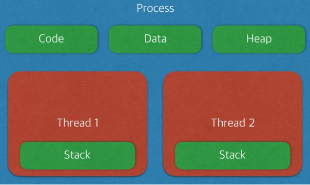

# 프로세스&스레드

> * 프로세스 - 프로그램을 메모리 상에서 실행중인 작업(자신만의 고유 공간과 자원을 할당받아 사용하는 작업의 단위.)
> * 스레드 - 프로세스 안에서 실행되는 여러 흐름 단위(다른 스레드와 프로세스의 자원과 공간을 공유하면서 사용.)

* 프로세스마다 최소 1개의 스레드 소유(메인 스레드 포함)

* 프소세스는 각각 별도의 주소공간 할당 (독립적)
  * Code - 코드 자체를 구성하는 메모리 영역 (프로그램 영역)
  * Data - 전역변수, 정적변수, 배열 등 (초기화된 데이터)
  * Heap - 동적 할당 시 사용 (new(), mallock(),등)
  * Stack - 지역번수, 배개변수, 리턴 값 (임시 메모리 영역)
* 스레드는 Stack만 따로 할당 받고 나머지 영역은 서로 공유
* 하나의 프로세스가 생성될 때, 기본적으로 하나의 스레드 같이 생성
* **프로세스는 자신만의 고유 공간과 자원을 할당받아 사용**하는데 반해, **스레드는 다른 스레드와 공간, 자원을 공유하면서 사용**

## 멀티프로세스

> * 하나의 컴퓨터에 여러 CPU 장착
>   * 하나 이상의 프로세스들을 동시에 처리 (병렬)

* 장점
  * 안정성 - 메모리 침범 문제를 OS차원에서 해결
* 단점
  * 각각 독립된 메모리 영역을 같고 있어, 작업량이 많을 수록 오버해드 발상
  * Context Switching 으로 인한 성능 저하
* Context Switching 
  * 프로세스의 상태 정보를 저장하고 복원하는 일련의 과정
  * 동작 중인 프로세스가 대기하면서 해당 프로세스의 상태를 보관하고, 대기하고 있던 다음 순번의 프로세스가 동작하면서 이전에 보관했던 프로세스 상태를 복구하는 과정

## 멀티 스레드

> * 하나의 응용 프로그램에서 여러 스레드를 구성해 각 스레드가 하나의 작업을 처리하는 것
> * **스레드들이 공유 메모리를 통해 다수의 작업을 동시에 처리하도록 해줌**

* 장점
  * 독립적인 프로세스에 비해 공유 메모리만큼의 사간, 자원 손실이 감소 
  * 전역 변수와 정적 변수에 대한 자료 공유 가능
* 단점
  * 안정성 문제
  * 하나의 스레드가 데이터 공간을 망가뜨리면, 모든 스레드가 작동 불능 상태가 된다
    * 공유 메모리를 같기 때문에 문제 발생
    * 하나의 스레드가 공유 데이터 값을 경병하는 시점에 다른 스레드가 그 값을 읽으려할 때 발생 => Critical Section 기법을 통해 대비 해야함

​	

## Thread safe

* 멀티스레드 환경에서 여러 스레드가 동시에 한의 객체 및 변수에 접근할 때, 으도한 대로 동작하는 것을 말한다.(이러한 상황을 "Thread-safe 하다" 라고 표현)
* Thread-safe 하게 구현
  * 공유 자원에 접근하는 임계영역을 동기화 기법으로 제어해줘야한다(=상호배제)
  * 동기하 기법으로는 뮤텍스나 세마포어가 존재
* Reentrant
  * 재진입셩이라는 의미로, 여러 함수가 Reentrant하다는 것으 여러 스레드가 동시에 저근해도 언제나 같은 실행 결과를 보장한다는 의미
  * 이를 만족하기 위해서 해당 서브루틴에서는 공유자원을 사용하지 않으면 된다.
    * 정적(전역) 변수를 사용하거나 변환하면 안되고 호출 시 제공된 매개변수만으로 동작해야 한다.

**Q. 스택을 스레드마다 독립적으로 할당하는 이유?**

스택은 함수 호출시 전달되는 인자, 복귀 주소값 및 함수 내에서 선언하는 변수 등을 저장하기 위해 사용되는 메모리 공간.

스택 메모리 공간이 독립적이라는 것은 독립적인 함수 호출이 가능함을 의미하고 이는 독립적인 실행 흐름이 추가된다는 것이다. 따라서 스레드의 정의에 따라 독립적인 실행 흐름을 추가하기 위한 최소 조건으로 독립된 스택을 할당하는 것이다.

**Q. PC 레지스터를 스레드마다 독립적으로 할당하는 이유?**

PC 값은 스레드가 명령어의 어디까지 수행했는지를 나타내게 된다. 스레드는 CPU를 할당받았다가 스케줄러에 의해 다시 선점당한다. 그렇기 때문에 명령어가 연속적으로 수행되지 못하고 어느 부분까지 수행했는지 기억할 필요가 있다. 따라서 PC 레지스터를 독립적으로 할당한다.

**Q. 멀티 프로세스 대신 멀티 스레드를 사용하는 이유?**

- 프로그램을 여러 개 키는 것보다 하나의 프로그램 안에서 여러 작업을 해결하는 것이 더욱 효율적이기 때문이다.
- **프로세스를 생성하여 자원을 할당하는 시스템 콜이 줄어들어 자원을 효율적으로 관리할 수 있다.**
- Context Switching시, 캐시 메모리를 비울 필요가 없기 때문에 비용이 적고 더 빠르다.-> 스레드는 Stack 영역만 초기화하면 되기 때문이다.
- 스레드는 프로세스 내의 메모리를 공유하기 때문에 데이터 전달이 간단하므로 IPC에 비해 비용이 적고 더 빠르다. -> 스레드는 프로세스의 Stack 영역을 제외한 모든 메모리를 공유하기 때문이