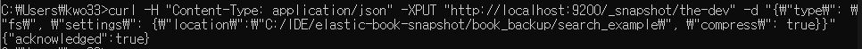

# Elasticsearch

## Setting

### elasticsearch.yml 설정

* 설정 파일 위치
  * [elasticsearch디렉토리]\config\elasticsearch.yml
    * elasticsearch.yml 을 열고 아래 항목을 수정한다(설정 항목들이 주석처리 되어있어 주석을 풀고 수정한다.)
* 설정 항목 정보
  * cluster.name - 여러 노드를 묶기 위한 클러스트명
  * node.name - 인덱스 경로 (default - /paht/to/data)
  * path.logs - 노드와 클러스터에서 생성되는 로그 저장 경로 (default -  /path/to/logs)
  * path.repo - 인덱스를 백업하기 위한 스냅숏 경로
  * network.host - 특정 IP만 접근 허용하기 위한 설정
    * 모든 IP허용할 경우 0.0.0.0 으로 설정한다.
  * http.port - Elasticsearch API 호출을 위한 포트 번호 (default - 9200)
  * transport.tcp.port - 엘라스틱서치 클라이언트가 접근할 수 있는 TCP 포트 (default - 9300)
  * discovery.zen.minimum_master_nodes - 마스터 노드의 선출 기준이 되는 노드수 지정
  * node.master - 마스터 노드로써 동장 여부 (true/false)
  * node.data - 데이터 노드로써 동작 여부 (true/false)

### snapshot 만들기

* 테스트 파일

  * elasticsearch.yml 파일 내 path.repo에 snapshot 데이터의 위치를 선언한다.
    (여기서는 C:/IDE/elastic-book-snapshot/book_backup/search_example와 C:/IDE/elastic-book-snapshot/book_backup/agg_example)search_example 폴더의 내용은 the-dev, agg_example 폴더의 내용은 web-log라는 이름으로 snapshot을 생성한다.

  ```
  path.repo: ["C:/IDE/elastic-book-snapshot/book_backup/search_example", "C:/IDE/elastic-book-snapshot/book_backup/agg_example"]
  ```

  * Elasticsearch Started확인

  ```
  [2021-02-04T22:33:56,715][INFO ][o.e.h.AbstractHttpServerTransport] [javacafe-node1] publish_address {127.0.0.1:9200}, bound_addresses {127.0.0.1:9200}, {[::1]:9200}
  [2021-02-04T22:33:56,718][INFO ][o.e.n.Node               ] [javacafe-node1] started
  ```

  * 결과 확인

    * elasticsearch가 실행중인 창을 닫지 않고 새로 cmd실행 후 snapshot 추가 명령어  실행하여 결과 확인

    ```
    curl -H "Content-Type: application/json" -XPUT "http://localhost:9200/_snapshot/the-dev" -d "{\"type\": \"fs\", \"settings\": {\"location\":\"C:/IDE/elastic-book-snapshot/book_backup/search_example\", \"compress\": true}}"
    ```

    

    * elasticsear 실행중인 cmd

    

  

  * snapshot 추가 명렁어 (cmd창에서 확인 명령어 실행) 결과 확인

  ```
  curl -XGET "http://localhost:9200/_snapshot/_all"
  
  C:\Users\kwo33>curl -XGET "http://localhost:9200/_snapshot/_all"
  {"the-dev":{"type":"fs","settings":{"compress":"true","location":"C:/IDE/elastic-book-snapshot/book_backup/search_example"}}}
  
  C:\Users\kwo33>curl -XGET "http://localhost:9200/_snapshot/the-dev/_all"
  {"snapshots":[{"snapshot":"movie-search","uuid":"Kz5k4fusS7KBZy55wLeZ0Q","version_id":6040399,"version":"6.4.3","indices":["movie_search"],"data_streams":[],"include_global_state":false,"state":"SUCCESS","start_time":"2019-03-23T16:01:04.910Z","start_time_in_millis":1553356864910,"end_time":"2019-03-23T16:01:05.342Z","end_time_in_millis":1553356865342,"duration_in_millis":432,"failures":[],"shards":{"total":5,"failed":0,"successful":5}}]}
  ```

  ### snapshot 복구

  * 생성한 snapshot 확인

  ```
  -XGET "http://localhost:9200/_snapshot/the-dev/_all?pretty"
  ```

  ```
  C:\Users\kwo33>curl -XGET "http://localhost:9200/_snapshot/the-dev/_all?pretty"
  {
    "snapshots" : [
      {
        "snapshot" : "movie-search",
        "uuid" : "Kz5k4fusS7KBZy55wLeZ0Q",
        "version_id" : 6040399,
        "version" : "6.4.3",
        "indices" : [
          "movie_search"
        ],
        "data_streams" : [ ],
        "include_global_state" : false,
        "state" : "SUCCESS",
        "start_time" : "2019-03-23T16:01:04.910Z",
        "start_time_in_millis" : 1553356864910,
        "end_time" : "2019-03-23T16:01:05.342Z",
        "end_time_in_millis" : 1553356865342,
        "duration_in_millis" : 432,
        "failures" : [ ],
        "shards" : {
          "total" : 5,
          "failed" : 0,
          "successful" : 5
        }
      }
    ]
  }
  ```

  * "indices" 안 index명과 동일한 index가 있다면 먼저 삭제
    * 동일한 index가 있어서 삭제한 경우,
      * { "acknowledged" : true}
    * index가 없으면 404데러가 리턴된다

  ```
  curl -XDELETE "http://localhost:9200/movie_search"
  ```

  ```
  C:\Users\kwo33>curl -XDELETE "http://localhost:9200/movie_search"
  {"error":{"root_cause":[{"type":"index_not_found_exception","reason":"no such index [movie_search]","resource.type":"index_or_alias","resource.id":"movie_search","index_uuid":"_na_","index":"movie_search"}],"type":"index_not_found_exception","reason":"no such index [movie_search]","resource.type":"index_or_alias","resource.id":"movie_search","index_uuid":"_na_","index":"movie_search"},"status":404}
  ```

  * snapshot 복구

  ```
  curl -H "Content-Type: application/json" -XPOST "http://localhost:9200/_snapshot/the-dev/movie-search/_restore"
  ```

  ```
  C:\Users\kwo33>curl -H "Content-Type: application/json" -XPOST "http://localhost:9200/_snapshot/the-dev/movie-search/_restore"
  {"accepted":true}
  ```

  

  