# Hadoop

> BigData 저장(분산) 처리 시스템
>
> HDFS(HADDOP DISTRIBUTED FILE SYSTEM)

1. 1개 컴퓨터(vm) - single node 운영
2. 다수(4개) 컴퓨터 - multi clustering node 운영


## bigdata

1. volume - 데이터 생성 주기가 빠르다.
2. velocity - 저장, 처리속도 빠르다.
3. variety - sns(각종 형태 : 비정형 데이터)

# Setting

1. vm/linux 설치
2. jdk 설치 
3. hadoop 설치

## VM 생성(master)

> 2GB/ 1 / 20gb /NAT / ISO
>
> jdk 설치 (root 계정 에서 설치)
>
> hadoop 설치 (hadoop 계정에서 설치)
>
> net ip - 192.16.111.110 으로 설정

* create - name(master) - 설치경로(C:\hadoop\master)  

[http://archive.kernel.org/](http://archive.kernel.org/centos-vault/7.0.1406/isos/x86_64/)

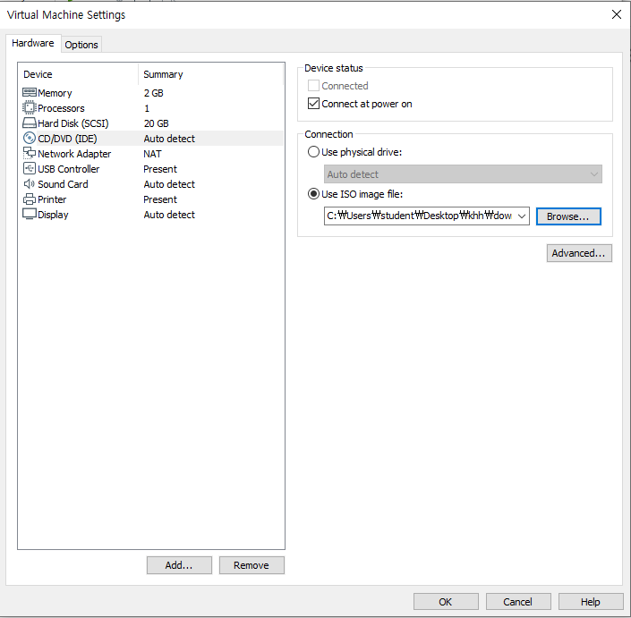  

>  centSO7.iso 파일 경로 설정
>
> 위 홈페이지에서 다운로드된 iso 파일 경로 지정해주기
>
> play로 vm1실행하고 위에써 선택후 엔터 하면 아래 화면이 뜬다.

### Linux설치

 

> 언어 선택후 다음 넘기고 키보드 click 하면 아래 화면 생성

* play - 언어 설정 -키보드방식 - 소프트웨어 파티션 - 네트워크 설정
  * 언어 - 최기 한국어 
  * 키보드 방식 - 영어(미국) 추가, 영어를 최상위로
  * 파티션 swep 을 2G 지정 , 남은 저종공간 추가(/ 로 선택)
  * 네트워크 설정

* 설정변경후 암호설정 root 계정 (root / password)
* 사용자 생성 (hadoop / hadoop)

 

 

 

> VMware, VMwraro Virtual 5두번 click 

 

​	VMware, VMware VirtualS 를 두번 클릭해서 선택 해야한다

 

* swap - 여유 공간으로 가져가겠다.

 

> 변경이 끝난후 설치 시작 버튼을 click 한다.

 

 

비밀번호(root계정) - password

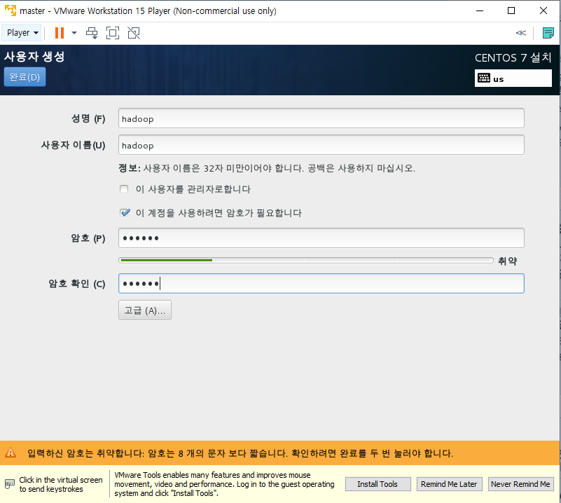 

계정 생성 - hadoop / hadoop

kdump 화면에서 kdump를 활성화하시겠습니까를 체크 해제후 다음으로 넘긴다.

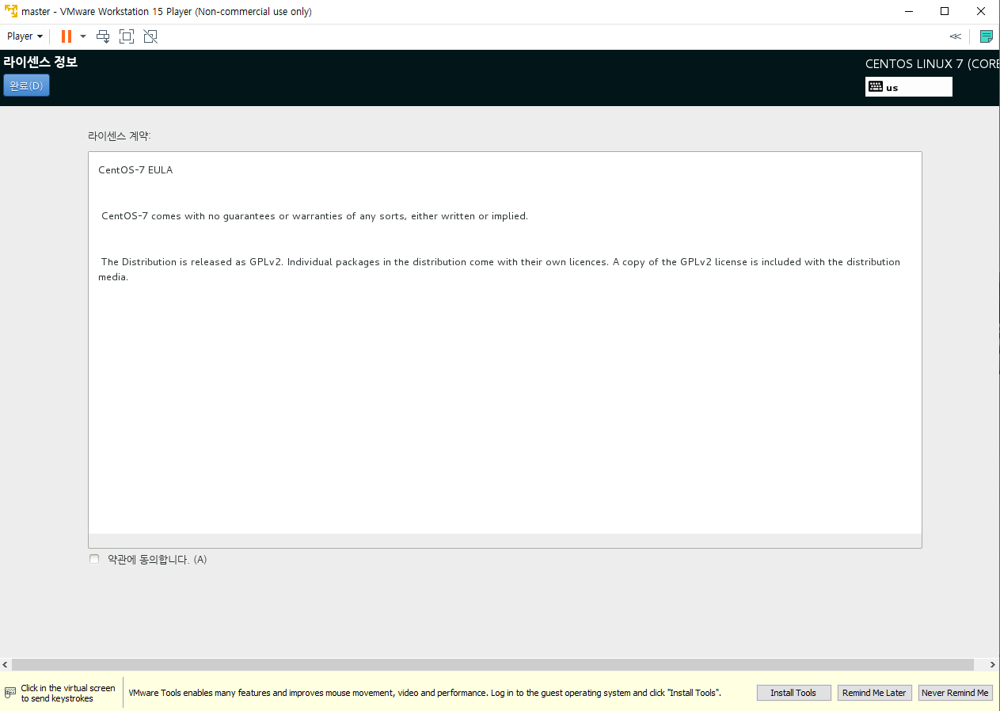 

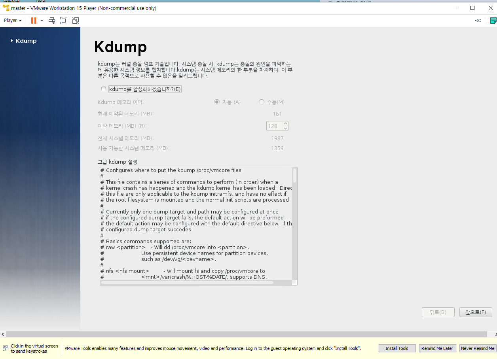 

* 자동 Update 사용 안함 설정

>  update 를 수동으로 설정

 

 

​	이후 닫기버튼

 

​	 # 는 admin 계정

​	\는 사용자 계정


### yum 업데이트 방지 설정

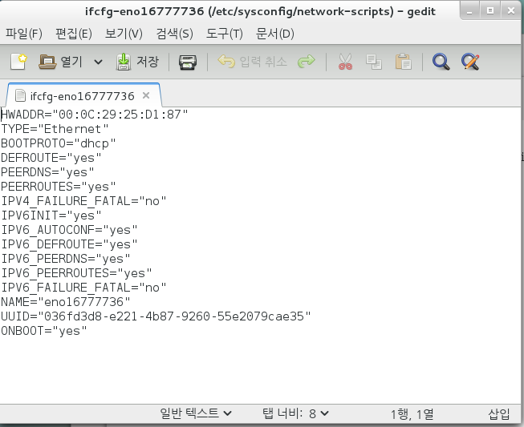


```
ost ~]# gedit /etc/sysconfig/network-scripts/ifcfg-eno16777736 
Fontconfig warning: Directory/file mtime in the future. New fonts may not be detected.
[root@localhost ~]# systemctl restart network
[root@localhost ~]# ifconfig
eno16777736: flags=4163<UP,BROADCAST,RUNNING,MULTICAST>  mtu 1500
        inet 192.168.111.110  netmask 255.255.255.0  broadcast 192.168.111.255
        inet6 fe80::20c:29ff:fe25:d187  prefixlen 64  scopeid 0x20<link>
        ether 00:0c:29:25:d1:87  txqueuelen 1000  (Ethernet)
        RX packets 13278  bytes 19402442 (18.5 MiB)
        RX errors 0  dropped 0  overruns 0  frame 0
        TX packets 3326  bytes 211040 (206.0 KiB)
        TX errors 0  dropped 0 overruns 0  carrier 0  collisions 0

lo: flags=73<UP,LOOPBACK,RUNNING>  mtu 65536
        inet 127.0.0.1  netmask 255.0.0.0
        inet6 ::1  prefixlen 128  scopeid 0x10<host>
        loop  txqueuelen 0  (Local Loopback)
        RX packets 12  bytes 1076 (1.0 KiB)
        RX errors 0  dropped 0  overruns 0  frame 0
        TX packets 12  bytes 1076 (1.0 KiB)
        TX errors 0  dropped 0 overruns 0  carrier 0  collisions 0

virbr0: flags=4099<UP,BROADCAST,MULTICAST>  mtu 1500
        inet 192.168.122.1  netmask 255.255.255.0  broadcast 192.168.122.255
        ether f6:fa:59:d0:2e:cc  txqueuelen 0  (Ethernet)
        RX packets 0  bytes 0 (0.0 B)
        RX errors 0  dropped 0  overruns 0  frame 0
        TX packets 0  bytes 0 (0.0 B)
        TX errors 0  dropped 0 overruns 0  carrier 0  collisions 0

```

```
[root@localhost ~]# gedit /etc/yum.repos.d/CentOS-Base.repo 
[root@localhost ~]# gedit /etc/yum.repos.d/CentOS-Sources.repo
[root@localhost ~]# mv /etc/yum.repos.d/CentOS-Base.repo /etc/yum.repos.d/CentOS-Base.repo.bak
```

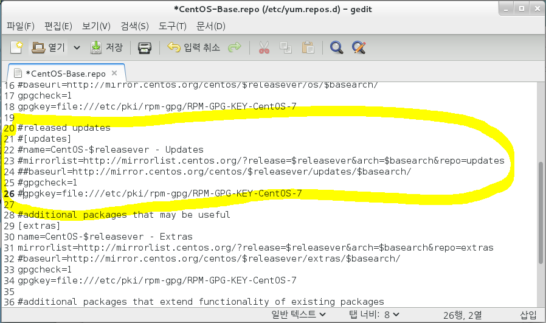

업데이트 부위 주석처리

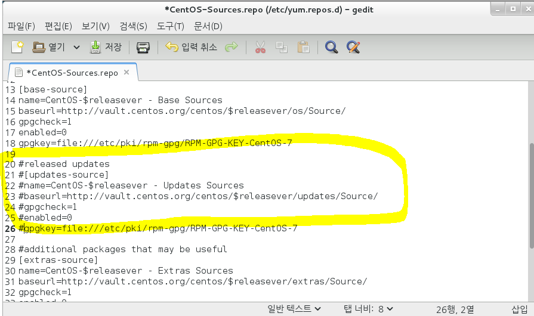

```
[root@localhost ~]# gedit /etc/yum.repos.d/CentOS-Base.repo 
[root@localhost ~]# gedit /etc/yum.repos.d/CentOS-Sources.repo
[root@localhost ~]# mv /etc/yum.repos.d/CentOS-Base.repo /etc/yum.repos.d/CentOS-Base.repo.bak
```

```
[root@localhost ~]# cd /etc/yum.repos.d/

[root@localhost yum.repos.d]# wget http://download.hanbit.co.kr/centos/7/CentOS-Base.repo
--2020-02-24 10:42:45--  http://download.hanbit.co.kr/centos/7/CentOS-Base.repo
Resolving download.hanbit.co.kr (download.hanbit.co.kr)... 218.38.58.196
Connecting to download.hanbit.co.kr (download.hanbit.co.kr)|218.38.58.196|:80... connected.
HTTP request sent, awaiting response... 200 OK
Length: 218 [text/plain]
Saving to: ‘CentOS-Base.repo’

100%[======================================>] 218         --.-K/s   in 0s      

2020-02-24 10:42:45 (48.0 MB/s) - ‘CentOS-Base.repo’ saved [218/218]

[root@localhost yum.repos.d]# rm -f *.repo~[root@localhost yum.repos.d]# yum clean allLoaded plugins: fastestmirror, langpacks
Cleaning repos: base extras
Cleaning up everything
Cleaning up list of fastest mirrors
```

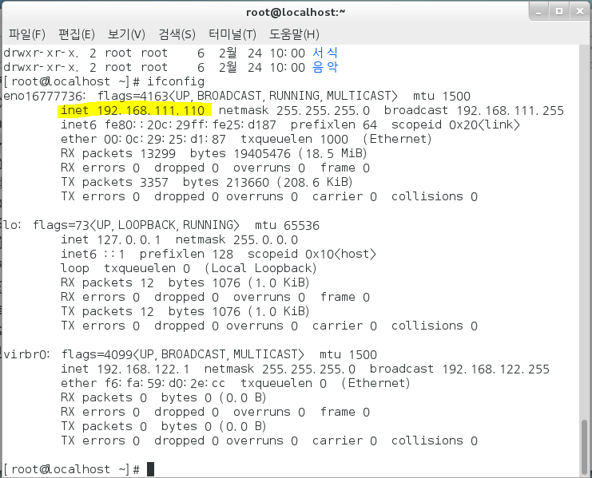


### selinux 방지 설정

```
[root@localhost ~]# gedit /etc/sysconfig/selinux
```


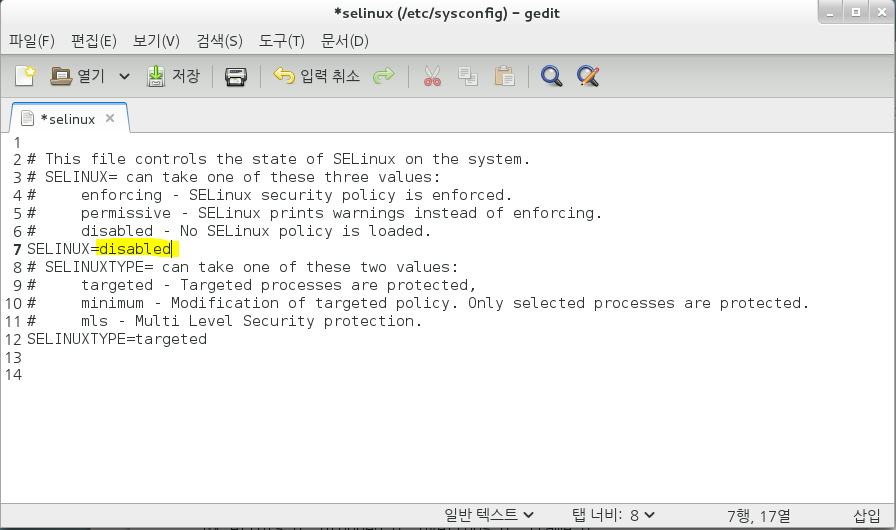

### 방화벽 해제

```
[root@localhost ~]# systemctl status firewalld
[root@localhost ~]# systemctl stop firewalld
[root@localhost ~]# systemctl disable firewalld
rm '/etc/systemd/system/dbus-org.fedoraproject.FirewallD1.service'
rm '/etc/systemd/system/basic.target.wants/firewalld.service'
[root@localhost ~]# systemctl disable firewalld
[root@localhost ~]# systemctl restart network
```

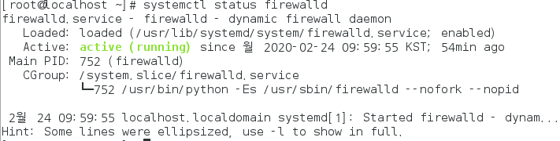

### jdk 설치

1. 다운로드 폴더에 jdk 설치 파일 붙여넣기

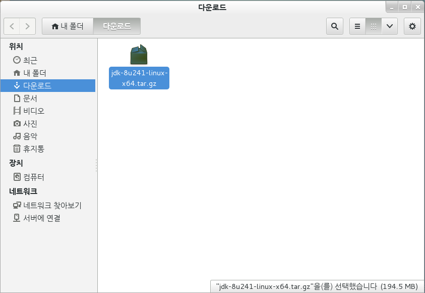 

```

[root@localhost ~]# rpm -qa | grep jdk
java-1.7.0-openjdk-headless-1.7.0.51-2.4.5.5.el7.x86_64
java-1.7.0-openjdk-1.7.0.51-2.4.5.5.el7.x86_64
[root@localhost ~]# yum remove java

     mv /root/다운로드/jdk-8u241-linux-x64.tar.gz .
     ls
     tar xvfz jdk-8u241-linux-x64.tar.gz 
     ls -l
     ln -s jdk1.8.0_241 jdk1.8
     ls -l
     java -version
     gedit /etc/profile
```

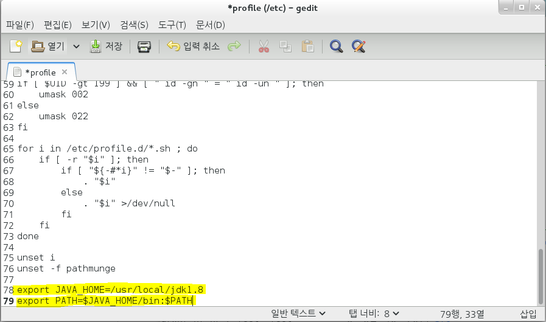

```
[root@localhost local]# gedit /etc/profile
[root@localhost local]# source /etc/pro
profile    profile.d/ profile~   protocols  
[root@localhost local]# source /etc/profile    ==> 환경변수 수정후에는 해당 명령어 해줘야 적용됨
[root@localhost local]# reboot
```

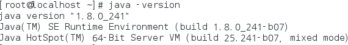

```
[root@localhost ~]# java -version
java version "1.8.0_241"
Java(TM) SE Runtime Environment (build 1.8.0_241-b07)
Java HotSpot(TM) 64-Bit Server VM (build 25.241-b07, mixed mode)

[root@localhost ~]# echo $PATH
/usr/local/jdk1.8/bin:/usr/local/bin:/usr/local/sbin:/usr/bin:/usr/sbin:/bin:/sbin:/root/bin
   ===========PATH 변수 경로==============
```


### 하둡 계정 설정

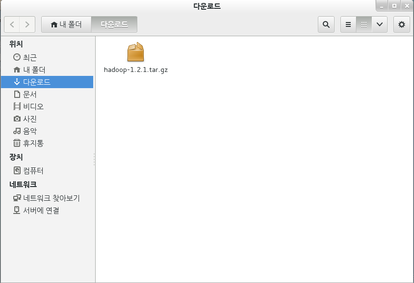

해당 파일 다운로드에 붙여넣기

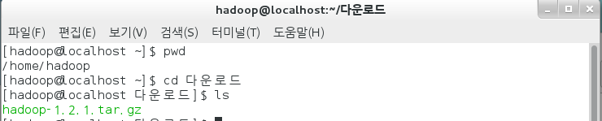

로그아웃 - root계정 접속

* 호스트 이름 변경

```
[root@localhost ~]# hostname
localhost.localdomain
[root@localhost ~]# hostnamectl set-hostname master
[root@localhost ~]# hostname
master
```

vm 종료


## vm 복사  Setting

> 원본파일 복사 붙여넣기하여 3개 만들기 -> vmware 실행 - open vitual machin
>
> 아래 순서 3번 반복

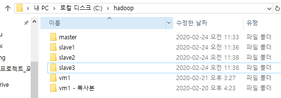

### Virvual machine name 변경

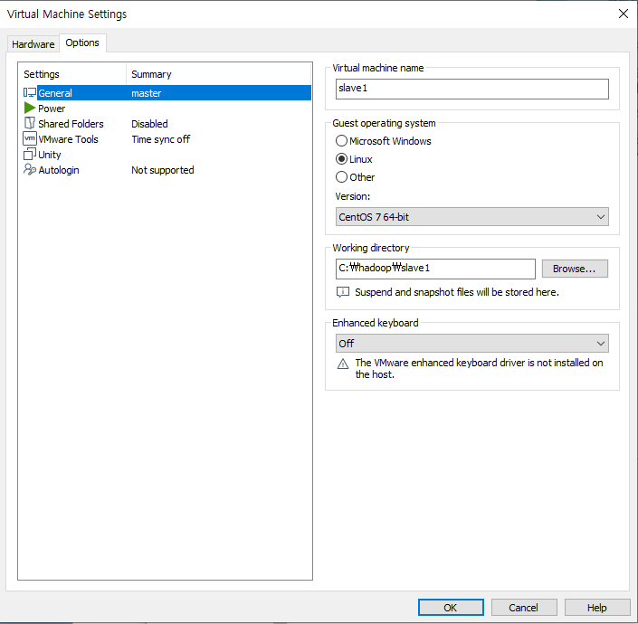

### MAC Address 변경

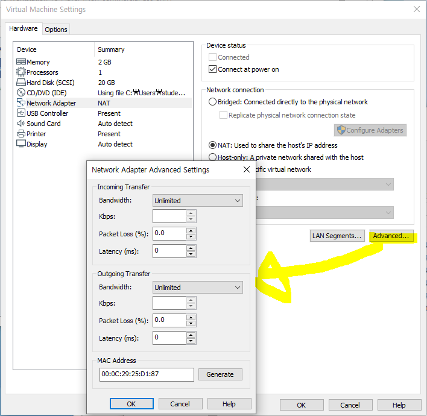

```
slave1  00:50:56:24:0E:F8

slave2 00:50:56:22:D9:62

slave2 00:50:56:29:88:30
```

### slave1실행 play

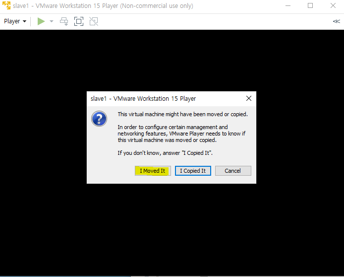


### MAC , IP 수정

```
[root@master ~]# gedit /etc/sysconfig/network-scripts/ifcfg-eno16777736
```

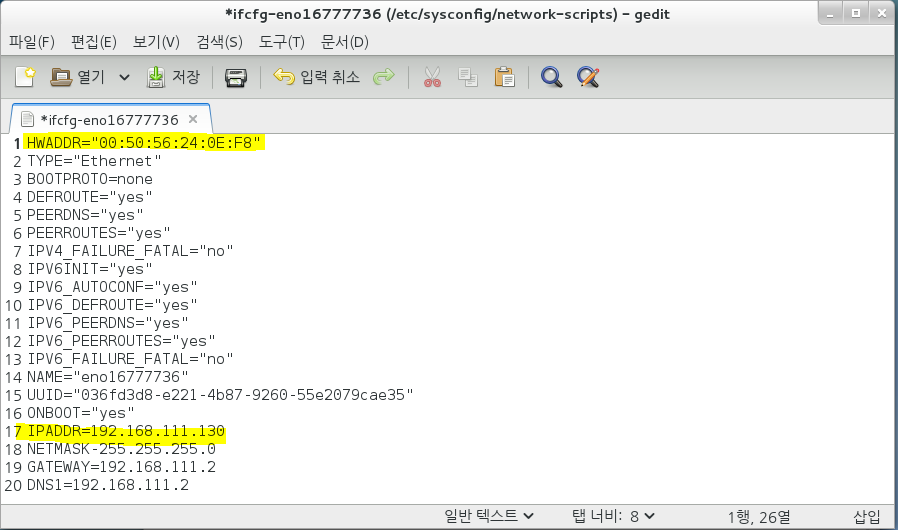

### VM 이름 변경

```
[root@master ~]# hostname
master
[root@master ~]# hostnamectl set-hostname slave1
[root@master ~]# hostname    ==> 재부핑하면 master에서 slave1로 변경 된다.
slave1
[root@master ~]# systemctl restart network
```

slave2

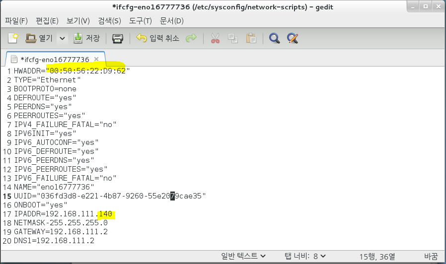

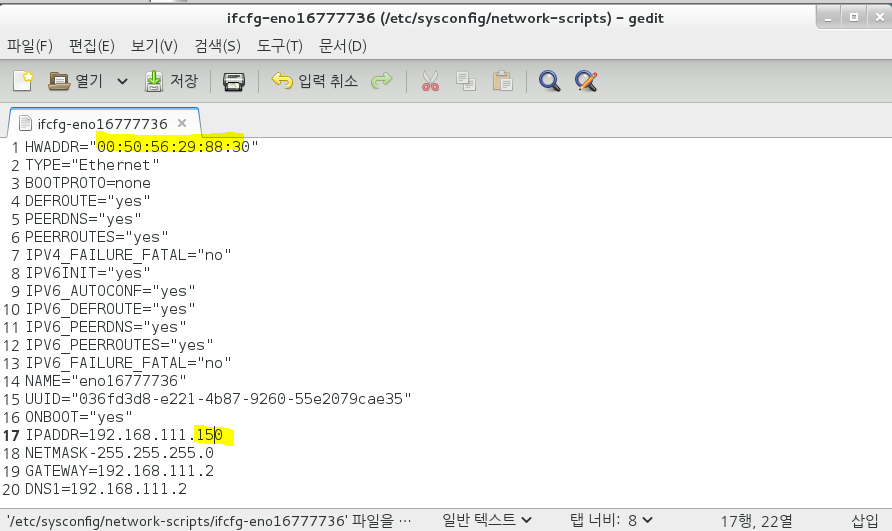

```
[root@master ~]# gedit /etc/sysconfig/network-scripts/ifcfg-eno16777736
[root@master ~]# hostname
master
[root@master ~]# hostnamectl set-hostname slave3
[root@master ~]# hostname
slave3
[root@master ~]# systemctl restart netword
Failed to issue method call: Unit netword.service failed to load: No such file or directory.
[root@master ~]# systemctl restart network
[root@master ~]# ifconfig
eno16777736: flags=4163<UP,BROADCAST,RUNNING,MULTICAST>  mtu 1500
        inet 192.168.111.150  netmask 255.255.255.0  broadcast 192.168.111.255
        inet6 fe80::250:56ff:fe29:8830  prefixlen 64  scopeid 0x20<link>
        ether 00:50:56:29:88:30  txqueuelen 1000  (Ethernet)
        RX packets 26  bytes 5220 (5.0 KiB)
        RX errors 0  dropped 0  overruns 0  frame 0
        TX packets 101  bytes 12481 (12.1 KiB)
        TX errors 0  dropped 0 overruns 0  carrier 0  collisions 0

lo: flags=73<UP,LOOPBACK,RUNNING>  mtu 65536
        inet 127.0.0.1  netmask 255.0.0.0
        inet6 ::1  prefixlen 128  scopeid 0x10<host>
        loop  txqueuelen 0  (Local Loopback)
        RX packets 10  bytes 980 (980.0 B)
        RX errors 0  dropped 0  overruns 0  frame 0
        TX packets 10  bytes 980 (980.0 B)
        TX errors 0  dropped 0 overruns 0  carrier 0  collisions 0

virbr0: flags=4099<UP,BROADCAST,MULTICAST>  mtu 1500
        inet 192.168.122.1  netmask 255.255.255.0  broadcast 192.168.122.255
        ether f2:05:22:9c:15:36  txqueuelen 0  (Ethernet)
        RX packets 0  bytes 0 (0.0 B)
        RX errors 0  dropped 0  overruns 0  frame 0
        TX packets 0  bytes 0 (0.0 B)
        TX errors 0  dropped 0 overruns 0  carrier 0  collisions 0

```


## 설정이 완료되면 slave 1,2,3, master root 계정 접속

```
[root@slave3 ~]# gedit /etc/hosts
```

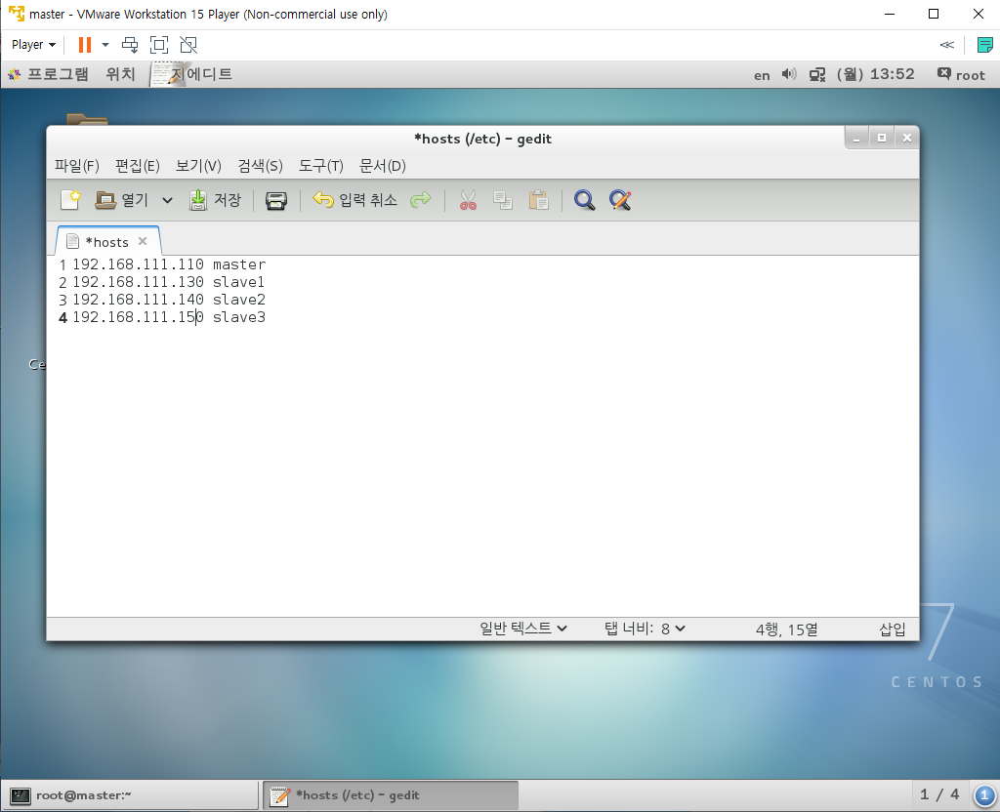

```
192.168.111.110 master
192.168.111.130 slave1
192.168.111.140 slave2
192.168.111.150 slave3
```

해당 문구 slave1,2,3, master 에 동일하게 설정

```
[root@master ~]# systemctl restart network
```

* ping 명령어 확인하여 통신 확인

```
[root@master ~]# ping slave1
PING slave1 (192.168.111.130) 56(84) bytes of data.
64 bytes from slave1 (192.168.111.130): icmp_seq=1 ttl=64 time=0.512 ms
64 bytes from slave1 (192.168.111.130): icmp_seq=2 ttl=64 time=0.529 ms
^C
--- slave1 ping statistics ---
15 packets transmitted, 15 received, 0% packet loss, time 14054ms
rtt min/avg/max/mdev = 0.320/0.609/0.731/0.148 ms
[root@master ~]# ping slave2
PING slave2 (192.168.111.140) 56(84) bytes of data.
64 bytes from slave2 (192.168.111.140): icmp_seq=1 ttl=64 time=0.671 ms
64 bytes from slave2 (192.168.111.140): icmp_seq=2 ttl=64 time=0.686 ms
^C
--- slave2 ping statistics ---
3 packets transmitted, 3 received, 0% packet loss, time 2001ms
rtt min/avg/max/mdev = 0.671/0.683/0.693/0.023 ms
[root@master ~]# ping slave3
PING slave3 (192.168.111.150) 56(84) bytes of data.
64 bytes from slave3 (192.168.111.150): icmp_seq=1 ttl=64 time=0.593 ms
64 bytes from slave3 (192.168.111.150): icmp_seq=2 ttl=64 time=0.680 ms
^C
--- slave3 ping statistics ---
3 packets transmitted, 3 received, 0% packet loss, time 2005ms
rtt min/avg/max/mdev = 0.593/0.667/0.729/0.060 ms

```

* ssh 이용하여 원격 접속

master 에서 slave1 접속(=telnet)

> Telnet - 원격 접속

```
[root@master ~]# ssh slave1
The authenticity of host 'slave1 (192.168.111.130)' can't be established.
ECDSA key fingerprint is bb:aa:d5:c0:18:c5:ad:d3:cc:0a:6c:ac:8b:b2:ca:e6.
Are you sure you want to continue connecting (yes/no)? yes
Warning: Permanently added 'slave1,192.168.111.130' (ECDSA) to the list of known hosts.
root@slave1's password: 
Last login: Mon Feb 24 13:47:41 2020
[root@slave1 ~]# who
root     :0           2020-02-24 13:47 (:0)
root     pts/0        2020-02-24 13:50 (:0)
root     pts/1        2020-02-24 13:59 (master)
[root@slave1 ~]# whoami
root
[root@slave1 ~]# exit   =>> slave1 종료
logout
Connection to slave1 closed.
[root@master ~]# 
```

* who 계정정보

* whoami 계정명


## 하둡 계정 접속 & 설치

### ssh key

* 하둡 계정간에 접속

* 공인 인증서에서 사용

ssh-keygen -t rea  ==> -t는 type

* key 생성

```
[hadoop@master ~]$ ssh-keygen -t rsa
Generating public/private rsa key pair.
Enter file in which to save the key (/home/hadoop/.ssh/id_rsa): 
Created directory '/home/hadoop/.ssh'.
Enter passphrase (empty for no passphrase): 
Enter same passphrase again: 
Your identification has been saved in /home/hadoop/.ssh/id_rsa.
Your public key has been saved in /home/hadoop/.ssh/id_rsa.pub.
The key fingerprint is:
01:44:92:06:49:79:bb:b1:a8:1b:e3:62:bf:2f:02:7b hadoop@master
The key's randomart image is:
+--[ RSA 2048]----+
| .o+.++          |
|  o +. .         |
|   o .  .        |
|    o    .       |
|   . +  S        |
|. . o            |
|+o               |
|==E.             |
|++oo+.           |
+-----------------+
[hadoop@master ~]$ 

```

```
[hadoop@master ~]$ ssh-copy-id -i /home/hadoop/.ssh/id_rsa hadoop@slave1
The authenticity of host 'slave1 (192.168.111.130)' can't be established.
ECDSA key fingerprint is bb:aa:d5:c0:18:c5:ad:d3:cc:0a:6c:ac:8b:b2:ca:e6.
Are you sure you want to continue connecting (yes/no)? yes
/usr/bin/ssh-copy-id: INFO: attempting to log in with the new key(s), to filter out any that are already installed
/usr/bin/ssh-copy-id: INFO: 1 key(s) remain to be installed -- if you are prompted now it is to install the new keys
hadoop@slave1's password:  

Number of key(s) added: 1

Now try logging into the machine, with:   "ssh 'hadoop@slave1'"
and check to make sure that only the key(s) you wanted were added.

[hadoop@master ~]$ ssh hadoop@slave1
Last login: Mon Feb 24 14:15:29 2020
[hadoop@slave1 ~]$ exit
logout
Connection to slave1 closed.
[hadoop@master ~]$ 

```

hadoop@slave1's password:hadoop 로 입력 

동일하게 slave2 ,3 에도 적용


### Hadoop 설치

```
pwd
   15  mv 다운로드/hadoop-1.2.1.tar.gz .
   16  ls
   17  tar xvfz hadoop-1.2.1.tar.gz 
   18  ls

```

Master, slave1,2,3 동일하게 압출파일 이동 - 압축풀기

````
[hadoop@slave1 ~]$ pwd
/home/hadoop
[hadoop@slave1 ~]$ mv 다운로드/hadoop-1.2.1.tar.gz .
[hadoop@slave1 ~]$ ls
hadoop-1.2.1.tar.gz  공개  다운로드  문서  바탕화면  비디오  사진  서식  음악
[hadoop@slave1 ~]$ tar xvfz hadoop-1.2.1.tar.gz 
[hadoop@slave1 ~]$ ls
hadoop-1.2.1         공개      문서      비디오  서식
hadoop-1.2.1.tar.gz  다운로드  바탕화면  사진    음악
````

### hadoop파일 편집

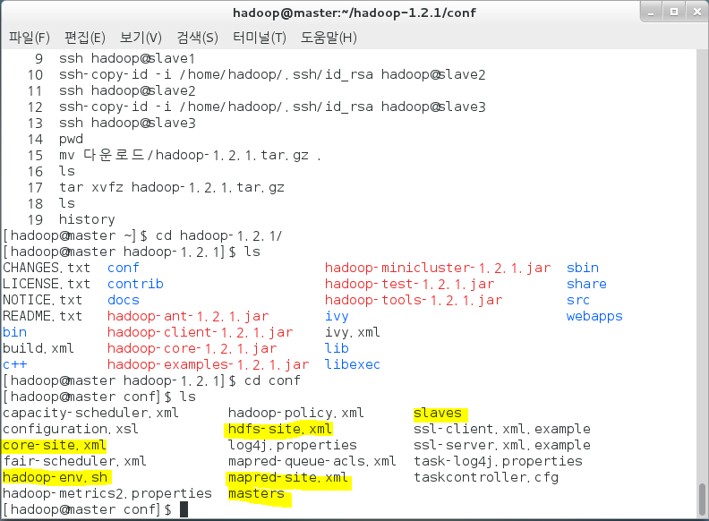

1. hadoop-emv. sh 

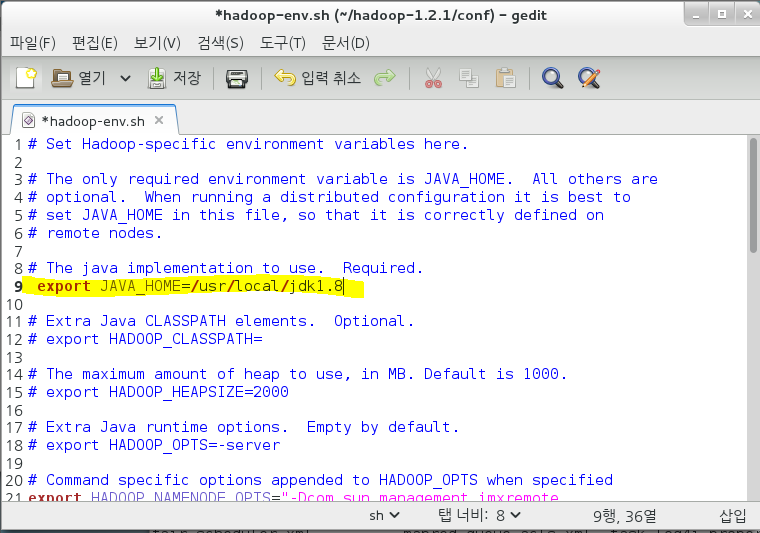

​			디렉토리 경로 변경

2. masters

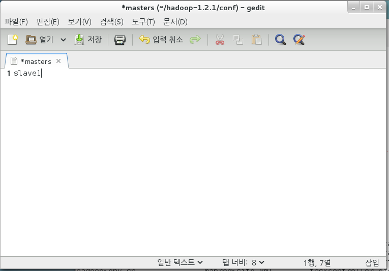

​			마스터가 죽었을때 slave1이 대신해줌 보조로 도와주는 역할을 설정

3. slaves

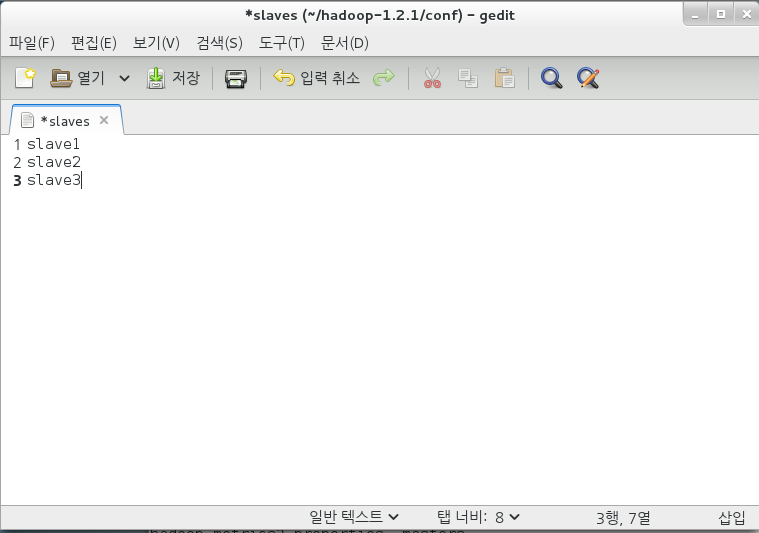

4. 하둡 저장 디렉토리 생성

```
[hadoop@master conf]$ mkdir /home/hadoop/hadoop-data
[hadoop@master conf]$ cd /home/hadoop/
[hadoop@master ~]$ ls
hadoop-1.2.1         hadoop-data  다운로드  바탕화면  사진  음악
hadoop-1.2.1.tar.gz  공개         문서      비디오    서식
[hadoop@master ~]$ 
```

5. core-site.xml

```
hodoop 을 저장할 임시 디렉토리 경로
```

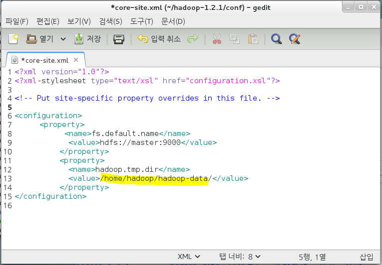


6. hdfs-site.xml

```
dfs.replication 의 한개 파일을 3대로 복사한다는 의미
```


7. mapred-site.xml

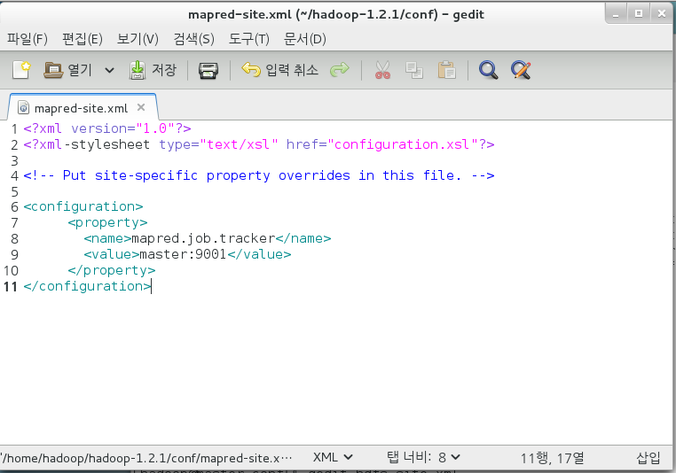

```xml
gedit hadoop-1.2.1/conf/core-site.xml

	<configuration>
  	  <property>
    	    <name>fs.default.name</name>
            <value>hdfs://master:9000</value>
          </property>
          <property>
            <name>hadoop.tmp.dir</name>
            <value>/home/hadoop/hadoop-data/</value>
          </property>
</configuration>

gedit hadoop-1.2.1/conf/hdfs-site.xml

	<configuration>
  	  <property>
    	    <name>dfs.replication</name>
     	    <value>3</value>
  	  </property>
  	  <property>
    	    <name>dfs.http.address</name>
    	    <value>master:50070</value>
  	  </property>
  	  <property>
    	    <name>dfs.secondary.http.address</name>
    	    <value>slave1:50090</value>
  	  </property>
</configuration>

gedit hadoop-1.2.1/conf/mapred-site.xml

 	<configuration>
  	  <property>
   	    <name>mapred.job.tracker</name>
   	    <value>master:9001</value>
  	  </property>
</configuration>
```


### Master hadoop 파일 복사/붙여넣기

* master 에서 설정한 파일 slave1,2,3, 에 붙여넣는 작업

> scp ==> ssh cp 와 같음

```
[hadoop@master conf]$ scp hadoop-env.sh hadoop@slave1:/home/hadoop/hadoop-1.2.1/conf
hadoop-env.sh                                       100% 2430     2.4KB/s   00:00 
[hadoop@master conf]$ scp *-site.xml hadoop@slave1:/home/hadoop/hadoop-1.2.1/conf
core-site.xml                                       100%  436     0.4KB/s   00:00    
hdfs-site.xml                                       100%  503     0.5KB/s   00:00    
mapred-site.xml                                     100%  285     0.3KB/s   00:00    
[hadoop@master conf]$ scp hadoop-env.sh hadoop@slave2:/home/hadoop/hadoop-1.2.1/conf
hadoop-env.sh                                       100% 2430     2.4KB/s   00:00  
[hadoop@master conf]$ scp *-site.xml hadoop@slave2:/home/hadoop/hadoop-1.2.1/conf
core-site.xml                                       100%  436     0.4KB/s   00:00    
hdfs-site.xml                                       100%  503     0.5KB/s   00:00    
mapred-site.xml                                     100%  285     0.3KB/s   00:00    
[hadoop@master conf]$ scp hadoop-env.sh hadoop@slave3:/home/hadoop/hadoop-1.2.1/conf
hadoop-env.sh                                       100% 2430     2.4KB/s   00:00    
[hadoop@master conf]$ scp *-site.xml hadoop@slave3:/home/hadoop/hadoop-1.2.1/conf
core-site.xml                                       100%  436     0.4KB/s   00:00    
hdfs-site.xml                                       100%  503     0.5KB/s   00:00    
mapred-site.xml                                     100%  285     0.3KB/s   00:00    
```

### profile 설정

> hadoop 계정에만 프로필 설정 아래처럼 하지 않으면 모든 계정에 적용 되기때문.
>
> -l 은 숨긴 파일 표시
* 하둡 계정에 프로필 설정

```
[hadoop@master conf]$ gedit /home/hadoop/.bash_profile 
하둡 계정만 영향을 받음
```

* 모든 계정에 프로필 설정

```
 /etc/profile3  ==> 모든 계정에 적용
```

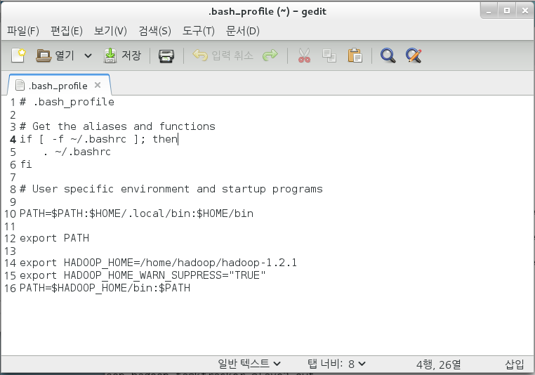

```
# .bash_profile

# Get the aliases and functions
if [ -f ~/.bashrc ]; then
	. ~/.bashrc
fi

# User specific environment and startup programs

PATH=$PATH:$HOME/.local/bin:$HOME/bin

export PATH

export HADOOP_HOME=/home/hadoop/hadoop-1.2.1
export HADOOP_HOME_WARN_SUPPRESS="TRUE"
PATH=$HADOOP_HOME/bin:$PATH
```


```
[hadoop@master conf]$ source /home/hadoop/.bash_profile
[hadoop@master conf]$ echo $PATH
/home/hadoop/hadoop-1.2.1/bin:/usr/local/jdk1.8/bin:/usr/local/bin:/usr/local/sbin:/usr/bin:/usr/sbin:/bin:/sbin:/home/hadoop/.local/bin:/home/hadoop/bin:/home/hadoop/.local/bin:/home/hadoop/bin

```

* /home/hadoop/hadoop-1.2.1/bin:/usr/local 이것처럼 jdk앞에 경로가 붙어있으면 완료

# Hadoop Start

```
[hadoop@master conf]$ hadoop namenode -format
Warning: $HADOOP_HOME is deprecated.

20/02/24 15:38:02 INFO namenode.NameNode: STARTUP_MSG: 
/************************************************************
STARTUP_MSG: Starting NameNode
STARTUP_MSG:   host = master/192.168.111.110
STARTUP_MSG:   args = [-format]
STARTUP_MSG:   version = 1.2.1
STARTUP_MSG:   build = https://svn.apache.org/repos/asf/hadoop/common/branches/branch-1.2 -r 1503152; compiled by 'mattf' on Mon Jul 22 15:23:09 PDT 2013
STARTUP_MSG:   java = 1.8.0_241
************************************************************/
20/02/24 15:38:03 INFO util.GSet: Computing capacity for map BlocksMap
20/02/24 15:38:03 INFO util.GSet: VM type       = 64-bit
20/02/24 15:38:03 INFO util.GSet: 2.0% max memory = 1013645312
20/02/24 15:38:03 INFO util.GSet: capacity      = 2^21 = 2097152 entries
20/02/24 15:38:03 INFO util.GSet: recommended=2097152, actual=2097152
20/02/24 15:38:03 INFO namenode.FSNamesystem: fsOwner=hadoop
20/02/24 15:38:03 INFO namenode.FSNamesystem: supergroup=supergroup
20/02/24 15:38:03 INFO namenode.FSNamesystem: isPermissionEnabled=true
20/02/24 15:38:03 INFO namenode.FSNamesystem: dfs.block.invalidate.limit=100
20/02/24 15:38:03 INFO namenode.FSNamesystem: isAccessTokenEnabled=false accessKeyUpdateInterval=0 min(s), accessTokenLifetime=0 min(s)
20/02/24 15:38:03 INFO namenode.FSEditLog: dfs.namenode.edits.toleration.length = 0
20/02/24 15:38:03 INFO namenode.NameNode: Caching file names occuring more than 10 times 
20/02/24 15:38:04 INFO common.Storage: Image file /home/hadoop/hadoop-data/dfs/name/current/fsimage of size 112 bytes saved in 0 seconds.
20/02/24 15:38:04 INFO namenode.FSEditLog: closing edit log: position=4, editlog=/home/hadoop/hadoop-data/dfs/name/current/edits
20/02/24 15:38:04 INFO namenode.FSEditLog: close success: truncate to 4, editlog=/home/hadoop/hadoop-data/dfs/name/current/edits
20/02/24 15:38:05 INFO common.Storage: Storage directory /home/hadoop/hadoop-data/dfs/name has been successfully formatted.
20/02/24 15:38:05 INFO namenode.NameNode: SHUTDOWN_MSG: 
/************************************************************
SHUTDOWN_MSG: Shutting down NameNode at master/192.168.111.110
************************************************************/
[hadoop@master conf]$ 
```

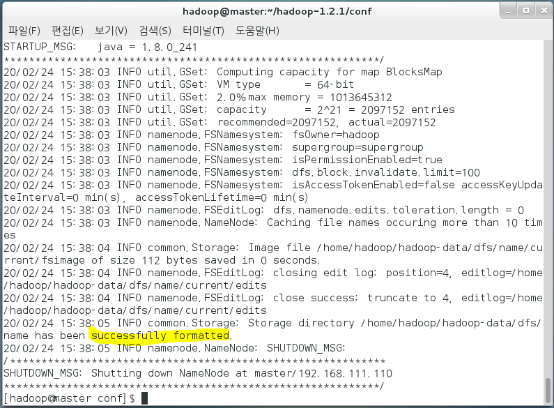

```
[hadoop@master conf]$ start-all.sh 
Warning: $HADOOP_HOME is deprecated.

starting namenode, logging to /home/hadoop/hadoop-1.2.1/libexec/../logs/hadoop-hadoop-namenode-master.out
slave1: starting datanode, logging to /home/hadoop/hadoop-1.2.1/libexec/../logs/hadoop-hadoop-datanode-slave1.out
slave2: starting datanode, logging to /home/hadoop/hadoop-1.2.1/libexec/../logs/hadoop-hadoop-datanode-slave2.out
slave3: starting datanode, logging to /home/hadoop/hadoop-1.2.1/libexec/../logs/hadoop-hadoop-datanode-slave3.out
slave1: starting secondarynamenode, logging to /home/hadoop/hadoop-1.2.1/libexec/../logs/hadoop-hadoop-secondarynamenode-slave1.out
starting jobtracker, logging to /home/hadoop/hadoop-1.2.1/libexec/../logs/hadoop-hadoop-jobtracker-master.out
slave1: starting tasktracker, logging to /home/hadoop/hadoop-1.2.1/libexec/../logs/hadoop-hadoop-tasktracker-slave1.out
slave2: starting tasktracker, logging to /home/hadoop/hadoop-1.2.1/libexec/../logs/hadoop-hadoop-tasktracker-slave2.out
slave3: starting tasktracker, logging to /home/hadoop/hadoop-1.2.1/libexec/../logs/hadoop-hadoop-tasktracker-slave3.out
[hadoop@master conf]$ jps
10132 Jps
9992 JobTracker
9818 NameNode
[hadoop@master conf]$ 

```

### jsp

* master

```
[hadoop@master conf]$ jps
10132 Jps
9992 JobTracker
9818 NameNode
```

* slave1

```
10119 Jps
9833 SecondaryNameNode
9771 DataNode
9948 TaskTracker
```

* slave2

```
[hadoop@slave2 ~]$ jps
9523 DataNode
9795 Jps
9654 TaskTracker
```

* slave3

```
[hadoop@slave3 ~]$ jps
9537 TaskTracker
9435 DataNode
9692 Jps
```


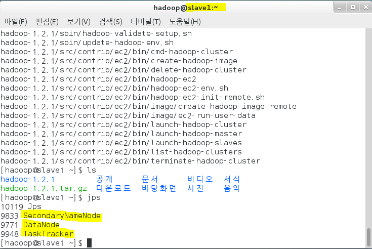

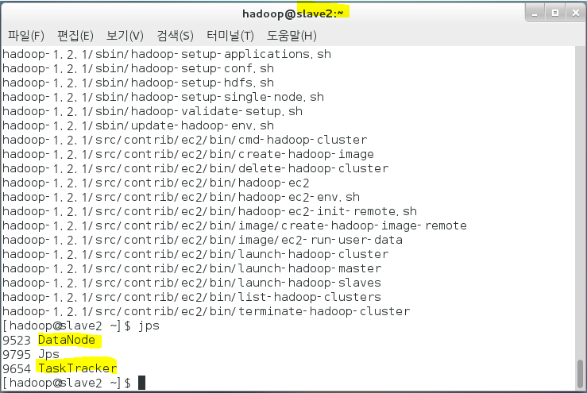

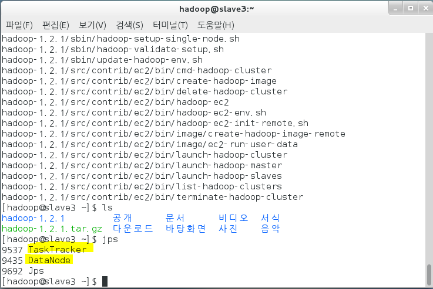

# hadoop Stop

```
[hadoop@master conf]$ stop-all.sh 
stopping jobtracker
slave1: stopping tasktracker
slave3: stopping tasktracker
slave2: stopping tasktracker
stopping namenode
slave3: stopping datanode
slave1: stopping datanode
slave2: stopping datanode
slave1: stopping secondarynamenode
[hadoop@master conf]$ 

```

