# Hadoop

* 선형확장을 지원
  * 데이터 사용의증가를 보면서 추후에 용량증가가 용이하다.
* 분석치리에 사용
  * Map/Reduce를 이용해서 대용량의 데이터 분석 가능
* API기반의 파일처리 System
* Immutable file system
  * ex) Log Data
  * 파일이 한번 저장되면 변경이 되지 않는것을 가정한다.
    * 하둡버전이 올라가면서 API를 통해 Append, Delete기능이 추가 되었다.
* Master Slave 구조를 가진다
  * Master - slave에 저장된 데이터 경로를 알려준다
    * Master가 고장나면 전체 파일시스템을 사용할 수 없다. =  SPOF(Single Point of Failure)
    * Secondary Master를 병행하여 문제 해결
  * Slave - 데이터 저장 용도

## Hadoop System 구조

* Master(Name node) - Secondary Name node
  * Slave(data node)
    * Disk
  * Slave(data node)
    * Disk
  * Slave(data node)
    * Disk

### [HDFS](https://yookeun.github.io/java/2015/05/24/hadoop-hdfs/)

* 하둡 분산형 파일시스템
  * Hadoop Distributed FileSystem
* 블록 주고의 파일 시스템으로, 저장하는 파일은 특정 사이즈의 블록으로 나눠져 분산된 서버에 저장
* 하나의 블록은 기본적으로 3개로 복제되며 각각 다른 HDFS의 노드에 분산 저장됩니다.

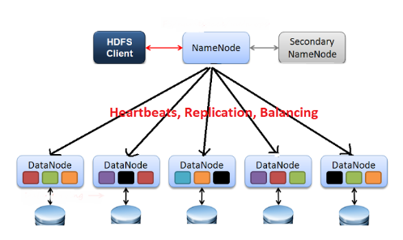

* NameNode
  * HDFS의 모든 데이터를 관리하고 HDFS클라이언트가 이를 이용하여 저장된 파일에 접근 할수 있다.
* Hadoop 어플리케이션
  * HDFS에 파일 저장하거나, 저장된 파일을 읽기 위해 HDFS클라이언트를 사용하며, 클라ㅏ이언트 API형태로 사용자에게 제공
* DataNode
  * 주기적으로 NameNode에게 블록 리포트(노드에 저장되어 있는 블록의 정보) 를 전송하고 이를 통해 NameNode는 DataNode가 정상 동작하는지 확인
* HDFS 클라이언트
  * NameNode에 접속해서 원하는 파일이 저장된 블록의 위치를 확인하고, 해당 블록이 저장된 DataNode에서 직접 데이터

### 파일 저장 Flow

* Hadoop Distributed FileSystem

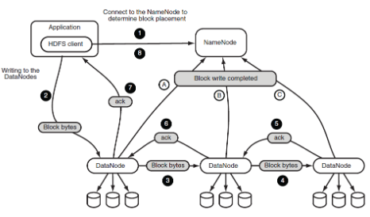

* 파일저장 Flow
  1. 어플리케이션이 HDFS 클라이언트에게 파일 저장을 요청하면, HDFS 클라이언트는 NameNode에게 파일 블록들이 저장될 경로 생성을 요청함. NameNode는 해당 파일 경로가 존재하지 않으면 경로를 생성한 후, 다른 클라이언트가 해당 경로를 수정하지 못하도록 Lock을 설정 그 후, NameNode는 클라이언트에게 해당 파일 블록들을 저장할 DataNode의 목록을 반환.
  2. 클라이언트는 첫 번째 DataNode에게 데이터를 전송.
  3. 첫 번째 DataNode는 데이터를 로컬에 저장한 후, 데이터를 두 번째 DataNode로 전송.
  4. 두 번째 DataNode는 데이터를 로컬에 저장한 후, 데이터를 세 번째 DataNode로 전송.
  5. 로컬에 데이터를 저장하였으면 자기에게 데이터를 넘겨준 DataNode에게 데이터의 로컬 저장이 완료 되었음을 응답(Ack).
  6. 로컬에 데이터를 저장하였으면 자기에게 데이터를 넘겨준 DataNode에게 데이터의 로컬 저장이 완료 되었음을 응답(Ack).
  7. 첫 번째 DataNode는 클라이언트에게 파일 저장이 완료 되었음을 응답.

### 파일 읽기Flow

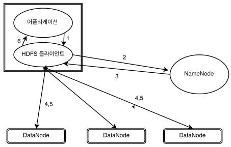

* 파일읽기 Flow
  1. 어플리케이션이 클라이언트에게 파일 읽기를 요청.
  2. 클라이언트는 NameNode에게 요청된 파일이 어떤 블록에 저장되어 있는지 정보를 요청.
  3. 메타데이터를 통해 파일이 저장된 블록 리스트를 반환.
  4. 클라이언트는 DataNode에 접근하여 블록 조회 요청.
  5. DataNode는 클라이언트에게 요청된 블록을 전송.
  6. 클라이언트를 어플리케이션에 데이터를 전달

### MapReduce

* 대용량의 데이터처리를 위한 분산 프로그래밍 모델이자 software framework
* 대량의 데이터를 병렬로 분석할 수 있으며 프로그래머는 Map과 Reduce라는 두개의 method를 직접 장성해 주성
  * Map 
    * 흩어져있는 데이터를 연관성이 있는 데이터로 key, value형태로 분류하는 작업을 지칭
  * Reduce
    * Map에서 출력된 데이터에서 중복된 데이터를 제거하고 원하는 데이터를 추출하는 작업을 수행

* 문자열 데이터에 포함된 단어의 빈도수를 출력하는 과정

  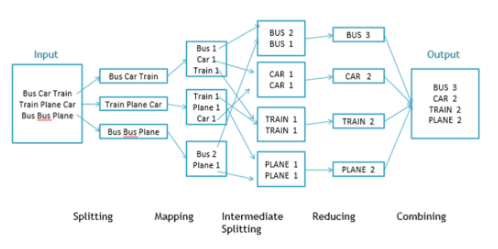

  1. Splitting
     * 문자열 데이터를 라인별로 나눕니다
  2. Mapping
     * 라인별로 문자열을 입력받아 Key, value형테로 출력
  3. Intermediate Splitting(Shuffling)
     * 같은 key를 가지는 데이터끼리 분류
  4. Reducing
     * 각 key별로 빈도수를 합산해서 출력
  5. Combinig
     * Reduce메소드의 출력 데이터를 합쳐서 HDFS에 저장


 

## VMwrar Setting

### VMware pro 설치 및Setting

[Download](https://www.vmware.com/kr/products/workstation-pro/workstation-pro-evaluation.html)


* VMwarePro 실행 
  * Create
    * 가상머신을 총 4개 만든다.
    * 가상 머신의 이름은 Hadoop01~Hadoop04 까지 사용한다
      * 하나의 가상머신을 만들고 나머지 가상머신은 Clone이용해 만들어 줄거다.


* 메모리 추가


### CentOS Setting

* [CenoOS DOWNLOAD](http://mirror.kakao.com/centos/7.8.2003/isos/x86_64/)


* Setting - CentOS IOS 경로 입력 - Powor Start - install - 언어선택(한국어)
* 네스워크 및 호스트명 - 네트워크연결(켬) 으로 설정


* 소프트웨어- 소프트웨어 설치 - GNOME 데스크탑 선택 - 호환성 라이브러리  & 개발용도구 선택
  * GNOME 설정은 사용의 편의성을 위해 Check해준다


* 설치대상 -  파티션 설정 체크 - 표준파티션 선택  - +눌러 생성 - 변경사항 적용


* 파티션 설정
  * swap - 2GB
  * /boot - 1GB
  * /home - 10GB
  * / - 용량을 지정하지 않으면 나머지 모든 용량을 자동으로 할당
* swap


* /boot
  * 부팅에 필요


* /home
  * 저장될 데이터
* /
  * Linux시스템 저장 공간


* 설치시작 - root 계정 암호설정(q1w2e3) - 사용자 생성 (ID-hadooptest PW-q1w2e3)


### Clone

* My Computer - 우Click - Manage - clone -Create full clone - name 설정/ 경로 설정


### System setting

> Hadoop 2.9.2 Version
>
> Java 8 ver 설치 (각각의 서버마다 설치가 되어야한다)

* Hadoop01 - Name Node (host name = namenode)
* Hadoop02 - Data Node (host name = datanode01)
* Hadoop03 - Data Node (host name = datanode02)
* Hadoop04 - Data Node  (host name = datanode03)

#### Mode

1. Standalone
   * 단일 노드
2. pseudo distributed 
   * 단일 node에서 cluster
3. Full distributed
   * 2대 이상의 Node를 Cluster로 구성

#### 명령어

바탕화면

* rpm -qa | grep java
  * 자바 version 확인
* yum remove xxxxxxx
  * 3가지 remove
  * yum remove javapackages-tools-3.4.1-11.el7.noarch
  * yum remove python-javapackages-3.4.1-11.el7.noarch
  * yum remove tzdata-java-2018e-3.el7.noarch

 

#### 공유폴더 설정

```
공유폴더 설정은 윈도우에서 공유폴더를 하나 생성한 후 폴더의 속성 > 공유 > 고급공유에서 선택한 폴더공유를 체크하고 권한부분에서 eveyone에 모든 권한을 부여합니다.

VMware 가상머신 설정에서 option 탭에서 아래의 그림과 같이 설정합니다. 설정이 끝나면 VMware Tool을 설치합니다. VM 메뉴의 Install VMware Tools를 선택하면 VMware Tools가 CD형식으로 바탕화면에 나타나고 /run/media/root/VMware Tools/ 디렉토리로 이동하면 VMwareTools-10.3.21-14772444.tar.gz 파일을 확인할 수 있습니다.

해당 파일을 root 계정의 home으로 복사한 후 아래의 명령을 이용하여 해당 파일의 압축을 풀고 설치 shell script를 실행하면 VMware tool을 설치할 수 있습니다.

tar zxvf VMwareTools-10.3.21-14772444.tar.gz

VMware Tool가 설치되어야 /mnt/hgfs폴더가 생성되고 그 안에 윈도우에서 공유한 공유폴더가 보여지게 됩니다..
```

* Window 에서 설정
  * 공유 폴더 생성
  * 공유폴더 속성 -공유 - 고급공유 - 선택한 폴더공유 Check - 권한 - 모든권한 허용 check

 

* VMware 에서 설정

  * hadoop01 - setting - options tab - shared Folder - Always enable - add - 폴더 설정
  * 설정하고 Linux에 /mnt 경로에 표시됨

   

* 공유폴도 환경 설정

```
# sudo mkdir your_shared_folder

# sudo vmware-hgfsclient

# sudo vmhgfs-fuse your_shared_folder
```


#### java install

* 기존 설치된 JAVA 삭제

```
rpm -qa | grep java

결과로 출력된 파일 중 javapackages-tools-3.4.1-11.el7.noarch, python-javapackages-3.4.1-11.el7.noarch, tzdata-java-2018e-3.el7.noarch 3개에 대해서 삭제를 진행합니다.
```

```
um remove javapackages-tools-3.4.1-11.el7.noarch
yum remove python-javapackages-3.4.1-11.el7.noarch
yum remove tzdata-java-2018e-3.el7.noarch
```


* JDK 압출풀기

```
tar zxvf xxxxxxx
```

* JDK 파일 경로 이동

```
mv jdk1.8.0_251 /usr/local/java
```

* vi /etc/profile
  * vi 편집기 에서 아래쪽에 4줄 삽입
    * i - 수정
    * esc -> :wq - 종료
    * esc -> :q! - 저장 안하고 종료

```
export JAVA_HOME=/usr/local/java
export HADOOP_HOME=/usr/local/hadoop
export CLASSPATH=$JAVA_HOME/lib:$CLASSPATH
PATH=$PATH:$JAVA_HOME/bin:$HADOOP_HOME/bin:$HADOOP_HOME/sbin
```

* 변경된 Profile 적용

```
source /etc/profile
```

* 버젼확인
  * java -version

```
java -version
java version "1.8.0_251"
```


#### SSH 설정

* CentOS를 설치하면 방화벽이 켜져있다.
  * Hadoop을 이용하기 위해 방화벽을 해제하고
  * OS를 시작할때 방화벽을 켜지 않도록 설정이 필요하다

* 공개키와 개인키 방식의 암호화를 이용한 통신
  * 공개키 - 암호화힐떄 사용하는 key
* 공개키는 복호화를 할 수 없다.
  * 공개가 가능
  * 공개키는 사람들에게 나눠주는 키이고 개인키는 유출되면 안된다
* Hadoop01
  * 공개키01
  * 개인키01
* Hadoop02
  * 공개키02
    * Hadoop01에게 공개키02를 넘겨주고 Hadoop01은 이 키를 가지고 암호화하여 Hadoop02에게 다시 전달한다(복호화)
    * Hadoop02는 개인키02를 가지고 암호화된 키를 풀어 사용한다.
  * 개인키02


* Address
* Hadoop01

```
[root@localhost java]# ifconfig
ens33: flags=4163<UP,BROADCAST,RUNNING,MULTICAST>  mtu 1500
        inet 192.168.111.128  netmask 255.255.255.0  broadcast 192.168.111.255
        inet6 fe80::8b2e:8628:f2ae:8259  prefixlen 64  scopeid 0x20<link>
        ether 00:0c:29:57:41:77  txqueuelen 1000  (Ethernet)
        RX packets 477  bytes 70877 (69.2 KiB)
        RX errors 0  dropped 0  overruns 0  frame 0
        TX packets 215  bytes 22912 (22.3 KiB)
        TX errors 0  dropped 0 overruns 0  carrier 0  collisions 0
```

* Hadoop02

```
inet 192.168.111.131
```

* Hadoop03

```
inet 192.168.111.129
```

* Hadoop04

```
inet 192.168.111.130
```


* vi /etc/hosts

```
127.0.0.1   localhost localhost.localdomain localhost4 localhost4.localdomain4
::1         localhost localhost.localdomain localhost6 localhost6.localdomain6
192.168.111.128 namenode       ipAddress/name
192.168.111.131 datanode01
192.168.111.129 datanode02
192.168.111.130 datanode03
```

* 이름설정
  * vi /etc/hostname
    * namenode
    * datanode01
    * datanode02
    * datanode03
* 공개키 개인키 설정
  *  ssh-keygen

```
[root@namenode ~]# ssh-keygen
Generating public/private rsa key pair.
Enter file in which to save the key (/root/.ssh/id_rsa): 
Created directory '/root/.ssh'.
Enter passphrase (empty for no passphrase): 
Enter same passphrase again: 
Your identification has been saved in /root/.ssh/id_rsa.
Your public key has been saved in /root/.ssh/id_rsa.pub.
The key fingerprint is:
SHA256:wqce53RhinhK2x5mpeppRMnBRQ6cobSrn3TS9TjrJYA root@namenode
The key's randomart image is:
+---[RSA 2048]----+
|  .oo=o          |
| . o=o           |
|  o. o.          |
|   o+.           |
|  E.. + S o      |
| . ..+ X o .     |
|. o.= & * .      |
| o =.@ @ .       |
|  oo*o* .        |
+----[SHA256]-----+
[root@namenode ~]# 

```

* id_rsa : 개인키
* id_rsa.pub: 공개키

```
[root@namenode ~]# cd /root/.ssh/
[root@namenode .ssh]# ls
id_rsa  id_rsa.pub
[root@namenode .ssh]# 

```

* 공개키 복사

  * Hadoop01 에서만 공개키를 복사한다
  * cp id_rsa.pub authorized_keys

  ```
  [root@namenode .ssh]# ls
  authorized_keys  id_rsa  id_rsa.pub
  ```

  * 파일 내용
    * cat authorized_keys

  ```
  [root@namenode .ssh]# cat authorized_keys 
  ssh-rsa AAAAB3NzaC1yc2EAAAADAQABAAABAQCeXVXOB2Po44053DurpDCyqC7gA58r6FQwJptfVwo0MTt6l1r3Prph11TtqXnpSyHfKrFmxXb4yviRgkfuMtlYNWvxu6ZveR2gnLDkJL612FOLCIGNaERAbOLkzKUp30d9kR6uIxuUMHrVUnsjczSgvjY6LPnC3btywyJJaPOdOLzYziuLjJrkZSrEfBNXWInIa5JQl0rR7DY7oJCresw5J/y19JSQ/HM2/7Cs22dO1WEbJSUSrqOnLoWhsH0/US1fARACBSNmkKjJbi3BaUGCr/fMJIZN2xqSvMxNaCSdylyj0CvNwm7Zn7eUbX7t6iU7YvtwCBhkjC4kbEhuwfWP root@namenode
  ```

  * ssh-copy-id root@namenode
    * Hadoop01,02,03 에 동일하게 코드 작성 하고 root비밀번호 입력

  ```
  [root@dataname01 .ssh]# ssh-copy-id root@namenode
  The authenticity of host 'namenode (192.168.111.128)' can't be established.
  ECDSA key fingerprint is SHA256:FHu+eDadfQVpqy688f/SFFCfFkZANaru0orm5mso+b0.
  ECDSA key fingerprint is MD5:3f:02:c2:4d:1c:72:3c:9f:e1:ea:13:8b:a1:8a:80:2b.
  Are you sure you want to continue connecting (yes/no)? yes
  /usr/bin/ssh-copy-id: INFO: attempting to log in with the new key(s), to filter out any that are already installed
  /usr/bin/ssh-copy-id: INFO: 1 key(s) remain to be installed -- if you are prompted now it is to install the new keys
  root@namenode's password: 
  Permission denied, please try again.
  root@namenode's password: 
  
  Number of key(s) added: 1
  
  Now try logging into the machine, with:   "ssh 'root@namenode'"
  and check to make sure that only the key(s) you wanted were added.
  
  [root@dataname01 .ssh]# 
  ```

  * 공개키 취합 확인
    * Hadoop01에서

  ```
  [root@namenode .ssh]# cat authorized_keys 
  ssh-rsa AAAAB3NzaC1yc2EAAAADAQABAAABAQCeXVXOB2Po44053DurpDCyqC7gA58r6FQwJptfVwo0MTt6l1r3Prph11TtqXnpSyHfKrFmxXb4yviRgkfuMtlYNWvxu6ZveR2gnLDkJL612FOLCIGNaERAbOLkzKUp30d9kR6uIxuUMHrVUnsjczSgvjY6LPnC3btywyJJaPOdOLzYziuLjJrkZSrEfBNXWInIa5JQl0rR7DY7oJCresw5J/y19JSQ/HM2/7Cs22dO1WEbJSUSrqOnLoWhsH0/US1fARACBSNmkKjJbi3BaUGCr/fMJIZN2xqSvMxNaCSdylyj0CvNwm7Zn7eUbX7t6iU7YvtwCBhkjC4kbEhuwfWP root@namenode
  ssh-rsa AAAAB3NzaC1yc2EAAAADAQABAAABAQDpoMZGigGJJIFGqWtSBFb6cn+yljtOO/GtOHpgnr9YqN2ktw4O0KgXxOdE7tkDPhnsF1UKjTtVJX2BDc9Xb5zr/u5s0dqfiXxIqvU1AS478HdpsKLKVuEYZkxPodv4Ey5JrAGks+mS6sH2KqobgDj75Z5ViSV70Z7G3wS+WjRwS9FHLbk+8vPzQ8oNBHtSBPuTbXwV1WPOKppYuOFXPsfuro2KZZ+6ubs5pAG1wRbyiet9X88o1z8U6oFRherLaA6fnOwEuypxLUKbQWCBAynMduZxzs8KbDYv8QEMznEfcm0RxOHfnvZZ0eiBqJ1fNVTxNY8yBEwDEFKEQfmlSZFZ root@dataname01
  ssh-rsa AAAAB3NzaC1yc2EAAAADAQABAAABAQDkh340a3PXv+q6x/ZNxDzyUx6i6w7IzzCjeUgstmY0sBygbdCMuuVyIh8ckRWx8hHiWlnucGrHF5mjopKL+/Pb/eQGaLwLENnGHSXFLBTw2Br3mzsNLZt2mCatGGFKZ7hO2l1kzl1qqLJHqANG28dt+mlxNXdV+HQkzxvmsjKEsGZ2Ua7PIHuhIaYo0KxW2lXGFQXfdQrobTspt3IPMVhhIxEaFQbtYdRNzFRTCxRjYIDbgF0ijuDG21xkL9BAI5dlVRQZXUuvaPHnxY8+s6+x1l3oSknd6JoRoiO5MZyE9qCupPWua7wN27qYgWUW6N6DKPHx85EuXuORo28DHgwz root@datanode02
  ssh-rsa AAAAB3NzaC1yc2EAAAADAQABAAABAQCbKd4H72ZMMTaDjpgxj6Ih/G2hyIo77Z7UZMFXcQjL5OlNDiukKmt/WbHBplOuo+g8Qyl7RW1/nROKejIAB3v6csjzcESovsIxMebIVA1pVCvoWmsBUgogjlMkK7mHKngyl6r6oO10yUDmzwdss1kOjZBq9NFlXJ7xPnhrzKS0qYmY+rxqOeNvYwsUU74on5cFa+BRgGdD1h38P4ejzrXb0exHt/cZkD/RSgP9XcVIq14WqZmWDS9u9e+gWKDwhjSu7m06PB6s8LqyORws2107xddp5u2iXg4I6Mye55re/UtWGN5dwgjQMp2TDKaBIXTWfoSMiI12xy3TYnldu0gT root@datanode03
  [root@namenode .ssh]# 
  
  ```

  * scp -rp
    * 암호화된 파일 복사
    * datanode01,02,03을 동일하게  아래 코드 적용해준다

  ```
  [root@namenode .ssh]# ls
  authorized_keys  id_rsa  id_rsa.pub
  [root@namenode .ssh]# scp -rp authorized_keys root@datanode01:~/.ssh/authorized_keys
  The authenticity of host 'datanode01 (192.168.111.131)' can't be established.
  ECDSA key fingerprint is SHA256:FHu+eDadfQVpqy688f/SFFCfFkZANaru0orm5mso+b0.
  ECDSA key fingerprint is MD5:3f:02:c2:4d:1c:72:3c:9f:e1:ea:13:8b:a1:8a:80:2b.
  Are you sure you want to continue connecting (yes/no)? yes
  Warning: Permanently added 'datanode01,192.168.111.131' (ECDSA) to the list of known hosts.
  root@datanode01's password: 
  authorized_keys                               100% 1586     1.6MB/s   00:00  
  ```

  * Hadoop01 에서 02로 데이터 전달
    * 처음 통신할떄는 아래처럼 여부를 물어본다 

  ```
  [root@dataname01 .ssh]# ssh datanode02 date
  The authenticity of host 'datanode02 (192.168.111.129)' can't be established.
  ECDSA key fingerprint is SHA256:FHu+eDadfQVpqy688f/SFFCfFkZANaru0orm5mso+b0.
  ECDSA key fingerprint is MD5:3f:02:c2:4d:1c:72:3c:9f:e1:ea:13:8b:a1:8a:80:2b.
  Are you sure you want to continue connecting (yes/no)? yes
  Warning: Permanently added 'datanode02,192.168.111.129' (ECDSA) to the list of known hosts.
  2020. 05. 21. (목) 00:39:36 KST
  ```

* 방화벽 끄기

  * systemctl stop firewalld

* 방화벽 서비스 중지

  * systemctl disable firewalld

## Hadoop Download

* hadoopp2.9.2.tar file  home directory 로이동

```
mv hadoopp2.9.2.tar /home/
```

* 압출풀기

```
tar zxvf hadoopp2.9.2.tar
```

* mv hadoop-2.9.2 /usr/local/hadoop
  * 해당 경로 가서 확인하기
* hadoop에서 사용할 디렉토리 생성
  * 하둡시스템 데이터 저장 - 모든 System에 하위 명령어처럼 폴더를 만든다
  * namedond, datanode01,02,03

```
mkdir -p /home/hadoop/hdfs/data
mkdir -p /home/hadoop/hdfs/temp
mkdir -p /home/hadoop/hdfs/name - 메타 데이터
```

* 환경설정파일 수정

  * 환경설정 파일 경로 /usr/local/hadoop/etc/hadoop/

  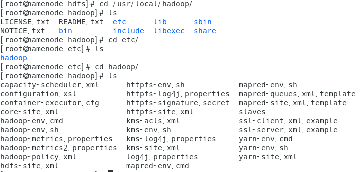

  * 제공된 설정파일을 Hadoop설정 디렉토리에 복사 한다

  ```
  [root@namenode Shared_Folder]# ls
  Hadoop_config  jdk-8u251-linux-x64.tar.gz
  [root@namenode Shared_Folder]# cd Hadoop_config/
  [root@namenode Hadoop_config]# ls
  core-site.xml  hdfs-site.xml    masters  yarn-env.sh
  hadoop-env.sh  mapred-site.xml  slaves   yarn-site.xml
  [root@namenode Hadoop_config]# cp * /usr/local/hadoop/etc/hadoop/
  cp: overwrite `/usr/local/hadoop/etc/hadoop/core-site.xml'? yes
  cp: overwrite `/usr/local/hadoop/etc/hadoop/hadoop-env.sh'? yes
  cp: overwrite `/usr/local/hadoop/etc/hadoop/hdfs-site.xml'? yes
  cp: overwrite `/usr/local/hadoop/etc/hadoop/slaves'? yes
  cp: overwrite `/usr/local/hadoop/etc/hadoop/yarn-env.sh'? yes
  cp: overwrite `/usr/local/hadoop/etc/hadoop/yarn-site.xml'? yes
  ```

  * 설정 파일 변경 확인

    * hadoop-env.sh

    * masters

      * secondary namanode 지정
        * datanode01로 지정

    * slaves

      * datanode를 지정
        * datanode들을 지정해준다

    * vi core-site.xml

      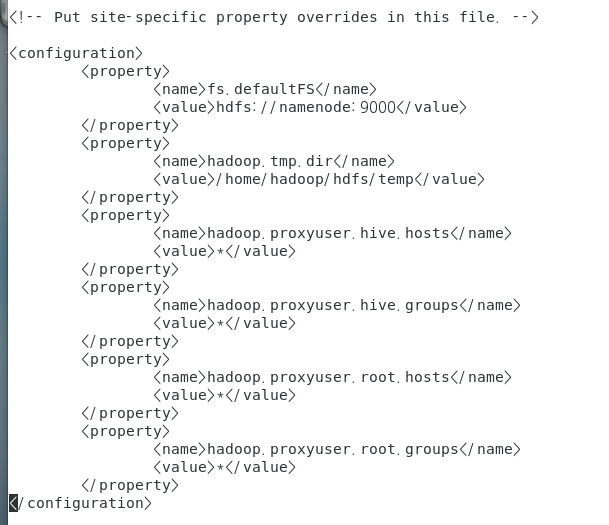

      * 하이브를 연결하려면 아래 4개 프로퍼티가 필요

    *  vi hdfs-site.xml

```

```

* 설정 완료후 각 slave Hadoop(datanode0n) 에 복사

  * scp 명령어 이용

  ```
  scp -r /usr/local/hadoop root@datanode01:/usr/local
  scp -r /usr/local/hadoop root@datanode02:/usr/local
  scp -r /usr/local/hadoop root@datanode03:/usr/local
  ```

  ```
  scp /etc/profile root@datanode01:/etc/profile
  scp /etc/profile root@datanode02:/etc/profile
  scp /etc/profile root@datanode03:/etc/profile
  ```

* 모든 복사 완료후 version 확인 (모든 mode에서 확인)

  * java -version
  * hadoop version

```
[root@namenode ~]# java -version
java version "1.8.0_251"
Java(TM) SE Runtime Environment (build 1.8.0_251-b08)
Java HotSpot(TM) 64-Bit Server VM (build 25.251-b08, mixed mode)
[root@namenode ~]# hadoop version
Hadoop 2.9.2
Subversion https://git-wip-us.apache.org/repos/asf/hadoop.git -r 826afbeae31ca687bc2f8471dc841b66ed2c6704
Compiled by ajisaka on 2018-11-13T12:42Z
Compiled with protoc 2.5.0
From source with checksum 3a9939967262218aa556c684d107985
This command was run using /usr/local/hadoop/share/hadoop/common/hadoop-common-2.9.2.jar
```

## Hadoop System start

* namenode 에서만 작업한다.
  * 통신을 통해 알아서 하둡시스템 구성해준다
* 파일 시스템 포멧

```
hadoop namenode -format
```

* 하둡 시작
  * stop-all.sh 중지

```
start-all.shs
```

* 상태확인

  * 리눅스에서 webBrowser 에서 확인

    * 주소에 - localhost:50070

    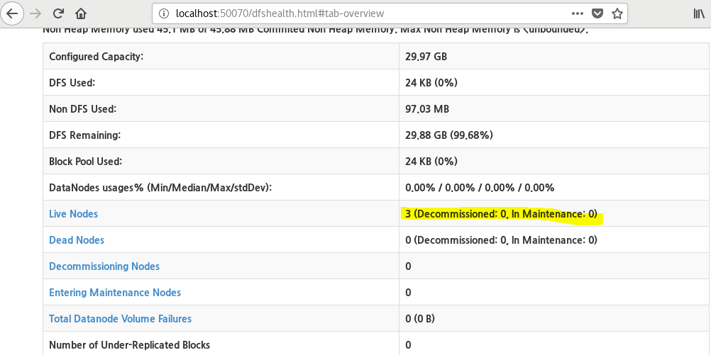 

  * 콘솔창에서 **jps명령어** 이용한 확인

  ```
  jps
  ```

  * namenode
    * ResourceManager
    * NameNode
      * 위 두개 표시되어야 한다

  ```
  [root@namenode ~]# jps
  20754 ResourceManager     
  21028 Jps
  20472 NameNode
  ```

  * datanode01
    * SecondaryNameNode 이기떄문에 "19779 SecondaryNameNode" 표시 되어야한다.

  ```
  [root@dataname01 ~]# jps
  19842 NodeManager
  19779 SecondaryNameNode
  20022 Jps
  19688 DataNode
  ```

  * datanode02

  ```
  [root@datanode02 ~]# jps
  19925 Jps
  19662 DataNode
  19775 NodeManager
  ```

  * datanode03

  ```
  [root@datanode03 ~]# jps
  19827 NodeManager
  19722 DataNode
  20010 Jps
  ```


### Hadoop Directory Create

* file create

```
hadoop fs -mkdir /test
```

* directory listing

```
hadoop fs -ls /
```

* 하둡 시스템 파일 저장

  ```
  hadoop fs -put hello.txt /test
  ```

  * test 결과 확인

  ```
  [root@namenode ~]# vi hello.txt
  [root@namenode ~]# hadoop fs -put hello.txt /test
  [root@namenode ~]# hadoop fs -ls /test
  Found 1 items
  -rw-r--r--   3 root supergroup          6 2020-05-21 20:55 /test/hello.text
  ```

### Hadoop System Start

1. Java program 으로 Hadoop에 데이터 저장

   * file system에 직접 접근해서 처리

     * java program이 가상머신 안에 있어야 한다

     [mvn](https://mvnrepository.com/artifact/org.apache.hadoop/hadoop-core/1.2.1)

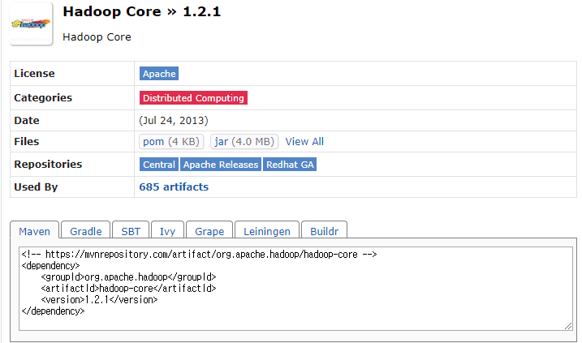

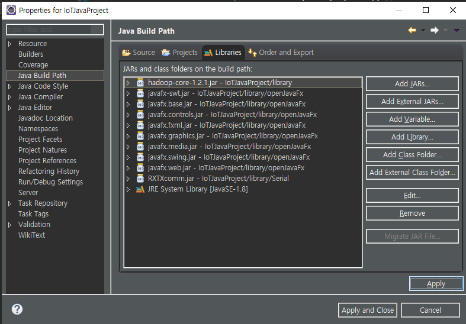

* 프로젝트 우클릭 - Export - 해당 프로젝트 클릭 Jar file - Browse (xxx.jar)- finish

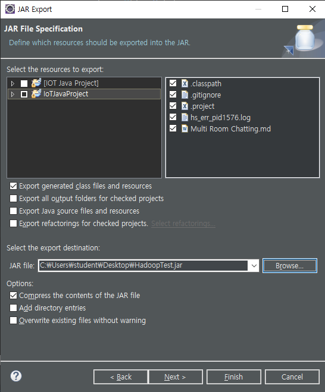

* 공유 폴더로 압축한 프로젝트 jar파일 옮긴다
* yarn
  * 작업들을 실행시켜줄 수 있는 module
  * yarn (실행타입)(실행시킬 파일)(실행시킬 클래스)

```
yarn jar HadoopTest.jar JavaHadoop.Exam01_SimpleFileReadWrite
```

```
////////////////실행 화면////////////////
[root@namenode shared_folder]# cd Shared_Folder/
[root@namenode Shared_Folder]# ls
HadoopTest.jar  Hadoop_config  jdk-8u251-linux-x64.tar.gz
[root@namenode Shared_Folder]# cp HadoopTest.jar /home/
[root@namenode Shared_Folder]# cd
[root@namenode ~]# ls
anaconda-ks.cfg  initial-setup-ks.cfg  다운로드  바탕화면  사진  음악
hello.txt        공개                  문서      비디오    서식
[root@namenode ~]# cd /home/
[root@namenode home]# ls
HadoopTest.jar  hadoop  hadoop-2.9.2.tar.gz  hadootest
[root@namenode home]# yarn jar HadoopTest.jar JavaHadoop.Exam01_SimpleFileReadWrite
Data==no Sound

```

### Hive 이용한 Hadoop System

1. 외부에서(Host PC-wondow) Hadoop에 접근해서 사용
   * Hive
     * mysql을 가상머신에 설치 해야한다.

* mySQL 파일 복사해 넣기

```
[root@namenode ~]# cp /mnt/your_shared_folder/shared_folder/Shared_Folder/mysql-co* ~
[root@namenode ~]# ls
anaconda-ks.cfg                                공개      사진
hello.txt                                      다운로드  서식
initial-setup-ks.cfg                           문서      음악
mysql-community-release-el7-5.noarch.rpm       바탕화면
mysql-connector-java-commercial-5.1.7-bin.jar  비디오

```

* rmp 등록

```
[root@namenode ~]# rpm -ivh mysql-community-release-el7-5.noarch.rpm
```

* yum install

```
yum install mysql-server
```

* mysql Server 기동

```
systemctl start mysqld
```

* mysqld Server Status

```
systemctl status mysqld
```

```
[root@namenode ~]# systemctl status mysqld
● mysqld.service - MySQL Community Server
   Loaded: loaded (/usr/lib/systemd/system/mysqld.service; enabled; vendor preset: disabled)
   Active: active (running) since 목 2020-05-21 23:27:45 KST; 22s ago
  Process: 25290 ExecStartPost=/usr/bin/mysql-systemd-start post (code=exited, status=0/SUCCESS)
  Process: 25222 ExecStartPre=/usr/bin/mysql-systemd-start pre (code=exited, status=0/SUCCESS)
 Main PID: 25289 (mysqld_safe)
    Tasks: 23
   CGroup: /system.slice/mysqld.service
           ├─25289 /bin/sh /usr/bin/mysqld_safe --basedir=/usr
           └─25455 /usr/sbin/mysqld --basedir=/usr --datadir=/var/lib/mysql -...

 5월 21 23:27:44 namenode mysql-systemd-start[25222]: which will also give y...
 5월 21 23:27:44 namenode mysql-systemd-start[25222]: databases and anonymou...
 5월 21 23:27:44 namenode mysql-systemd-start[25222]: strongly recommended f...
 5월 21 23:27:44 namenode mysql-systemd-start[25222]: See the manual for mor...
 5월 21 23:27:44 namenode mysql-systemd-start[25222]: Please report any prob...
 5월 21 23:27:44 namenode mysql-systemd-start[25222]: The latest information...
 5월 21 23:27:44 namenode mysql-systemd-start[25222]: http://www.mysql.com
 5월 21 23:27:44 namenode mysqld_safe[25289]: 200521 23:27:44 mysqld_safe L....
 5월 21 23:27:44 namenode mysqld_safe[25289]: 200521 23:27:44 mysqld_safe S...l
 5월 21 23:27:45 namenode systemd[1]: Started MySQL Community Server.
Hint: Some lines were ellipsized, use -l to show in full.
```

* 부팅 할때마다 실행하게 설정

```
systemctl enable mysqld
```

### #

* 접속 계정 Create

```
ID/PW ==> hive/hive
```

```
mysql -u root
```

* 계정 Create

```
create user hive identified by "hive";
create user hive@localhost identified by "hive";
```

* DB Create

```
create database hivedb;
```

* 사용자 DB 권한 부여

```
grant all privileges on hivedb.* to hive;
grant all privileges on hivedb.* to hive@localhost;
```

* 권한 설정 적용

```
flush privileges;
```

* mySQL Consol 종료

```
exit;
```

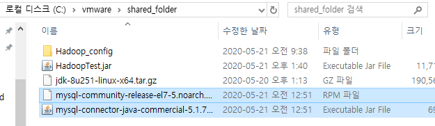


* hive 설치

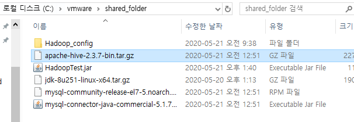

```
[root@namenode ~]# cp /mnt/your_shared_folder/shared_folder/Shared_Folder/apache-hive-2.3.7-bin.tar.gz ~
[root@namenode ~]# ls
anaconda-ks.cfg                                다운로드
apache-hive-2.3.7-bin.tar.gz                   문서
hello.txt                                      바탕화면
initial-setup-ks.cfg                           비디오
mysql-community-release-el7-5.noarch.rpm       사진
mysql-connector-java-commercial-5.1.7-bin.jar  서식
공개      
```

* 압축 풀기

```
tar zxvf apache-hive-2.3.7-bin.tar.gz
```

* 이동

```
mv apache-hive-2.3.7-bin /usr/local/hive
```

* 환경설정

```
vi /etc/profile
export HIVE_HOME=/usr/local/hive
PATH=$PATH:$HIVE_HOME/bin
```

* 환경설정 재 설정

```
source /etc/profile
```

* java프로그램이 mysql에 연동하기 위한 JDBC Driver jar파일을 Hive에 복사

```
cp mysql-connector-java-commercial-5.1.7-bin.jar /usr/local/hive/lib/
```

```
[root@namenode ~]# ls
anaconda-ks.cfg                                다운로드
apache-hive-2.3.7-bin.tar.gz                   문서
hello.txt                                      바탕화면
initial-setup-ks.cfg                           비디오
mysql-community-release-el7-5.noarch.rpm       사진
mysql-connector-java-commercial-5.1.7-bin.jar  서식
공개                                           음악
[root@namenode ~]# cp mysql-connector-java-commercial-5.1.7-bin.jar /usr/local/hive/lib/

```

* hive가 사용할 HDFS 디렉토리를 생성

```
hadoop fs -mkdir /tmp
hadoop fs -mkdir -p /user/hive/warehouse
```

* 파일 확인

```
[root@namenode ~]# hadoop fs -ls /
Found 4 items
drwxr-xr-x   - root supergroup          0 2020-05-21 20:55 /test
-rw-r--r--   3 root supergroup         10 2020-05-21 23:10 /test.txt
drwxr-xr-x   - root supergroup          0 2020-05-22 00:10 /tmp
drwxr-xr-x   - root supergroup          0 2020-05-22 00:11 /user

```

* 권한 설정

```
hadoop fs -chmod g+w /tmp
hadoop fs -chmod g+w /user/hive/warehouse
```

```
[root@namenode ~]# hadoop fs -chmod g+w /tmp
[root@namenode ~]# hadoop fs -chmod g+w /user/hive/warehouse
[root@namenode ~]# hadoop fs -ls /
Found 4 items
drwxr-xr-x   - root supergroup          0 2020-05-21 20:55 /test
-rw-r--r--   3 root supergroup         10 2020-05-21 23:10 /test.txt
drwxrwxr-x   - root supergroup          0 2020-05-22 00:10 /tmp
drwxr-xr-x   - root supergroup          0 2020-05-22 00:11 /user

```

* 환경설정


* 공유폴더에서 파일 가져오기

```
[root@namenode ~]# cp /mnt/your_shared_folder/shared_folder/Shared_Folder/hive_config/* ~
[root@namenode ~]# ls
anaconda-ks.cfg                                공개
apache-hive-2.3.7-bin.tar.gz                   다운로드
hello.txt                                      문서
hive-env.sh                                    바탕화면
hive-site.xml                                  비디오
initial-setup-ks.cfg                           사진
mysql-community-release-el7-5.noarch.rpm       서식
mysql-connector-java-commercial-5.1.7-bin.jar  음악

```

* 파일 복사

```
[root@namenode ~]# cp hive* /usr/local/hive/conf/
[root@namenode ~]# cd /usr/local/hive/conf/
[root@namenode conf]# ls
beeline-log4j2.properties.template    hive-site.xml
hive-default.xml.template             ivysettings.xml
hive-env.sh                           llap-cli-log4j2.properties.template
hive-env.sh.template                  llap-daemon-log4j2.properties.template
hive-exec-log4j2.properties.template  parquet-logging.properties
hive-log4j2.properties.template

```

* hive-env.sh 
  * 수정 없음

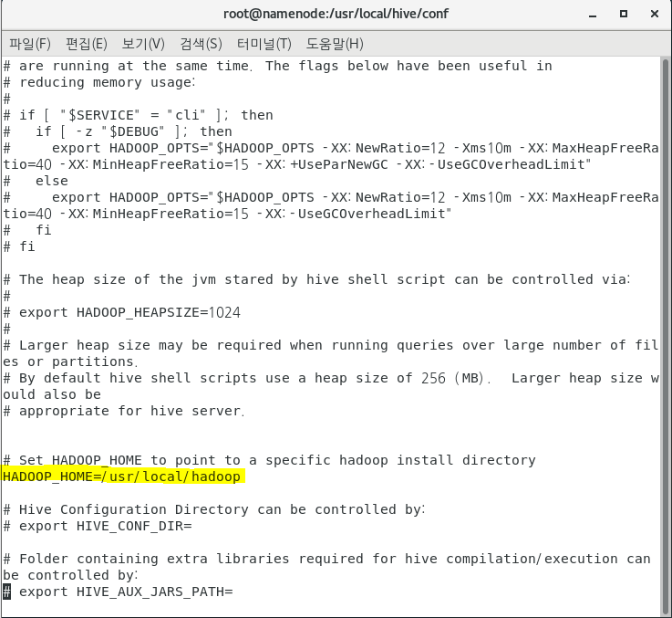


* hive-site.xml 수정
  * ip 주소 수정
    * namenode 에서 ifconfig 로 확인

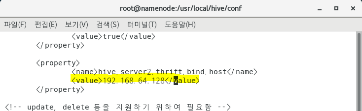

```
<property>
                <name>hive.server2.thrift.bind.host</name>
                <value>192.168.111.128</value>
        </property>
```

* Hive 2.1 초기화 실행 code

```
schematool -dbType mysql -initSchema
```

```
[root@namenode conf]# schematool -dbType mysql -initSchema
SLF4J: Class path contains multiple SLF4J bindings.
SLF4J: Found binding in [jar:file:/usr/local/hive/lib/log4j-slf4j-impl-2.6.2.jar!/org/slf4j/impl/StaticLoggerBinder.class]
SLF4J: Found binding in [jar:file:/usr/local/hadoop/share/hadoop/common/lib/slf4j-log4j12-1.7.25.jar!/org/slf4j/impl/StaticLoggerBinder.class]
SLF4J: See http://www.slf4j.org/codes.html#multiple_bindings for an explanation.
SLF4J: Actual binding is of type [org.apache.logging.slf4j.Log4jLoggerFactory]
Metastore connection URL:	 jdbc:mysql://localhost:3306/hivedb?createDatabaseIfNotExist=true
Metastore Connection Driver :	 org.apache.derby.jdbc.EmbeddedDriver
Metastore connection User:	 hive
Starting metastore schema initialization to 2.3.0
Initialization script hive-schema-2.3.0.mysql.sql
Initialization script completed
schemaTool completed
```

* hive 실행

```
hive 
```

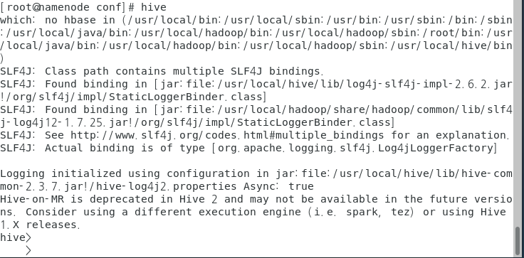

* Hive table create

```
create table mytlb(seq int, contents string);
```

```
hive> 
    > create table mytlb(seq int, contents string);
OK
Time taken: 5.951 seconds
hive> 

```

* Table 확인

```
select count(*) from mytlb;
```

```
hive> select count(*) from mytlb;
OK
0
Time taken: 1.937 seconds, Fetched: 1 row(s)
hive> 
```


* 최종 동작 확인

  * Host PC(window)에 Eclipse에서 java 프로그램을 이용해 Hive로 연결하고Hive 가 Hadoop에 연결 하도록 처리

    1. Network Setting

       * Edit - Virtual Network Editor

       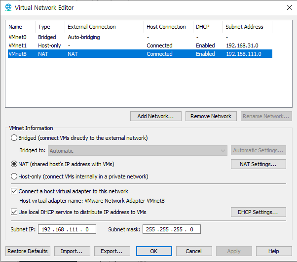

    2. Hive Server Start

       * hiveserver2

       ```
       [root@namenode ~]# hiveserver2
       ```

       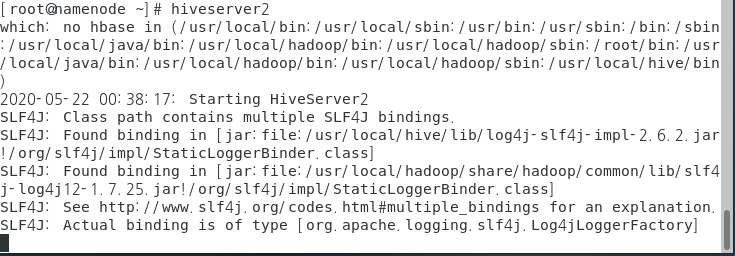

    3. Java Program 작성 해서 Hive에 접속

       * Maven Project 생성

       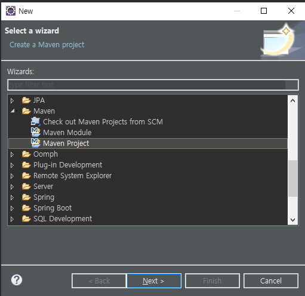

       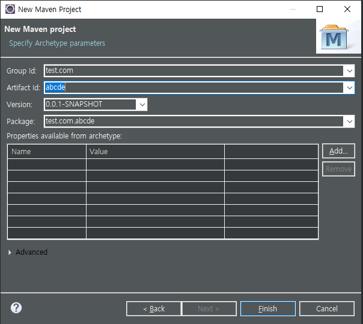

       * 제공된 pom.xml 파일 내용을 이용해서 pom.xml수정
       * 아래코드 삽입
         * java -version 확인해서 Java 버전 과 동일하게 적어준다

       ```xml
       <dependency>
                   <groupId>org.apache.hive</groupId>
                   <artifactId>hive-jdbc</artifactId>
                   <version>0.12.0</version>
       	</dependency>
       	<dependency>
                   <groupId>jdk.tools</groupId>
                   <artifactId>jdk.tools</artifactId>
                   <version>1.8.0_221</version>	
                   <scope>system</scope>
                   <systemPath>C:/Program Files/Java/jdk1.8.0_221/lib/tools.jar</systemPath>	
       	</dependency>
       	<dependency>                                                                                                                                       
           	<groupId>org.apache.hadoop</groupId>                                                                                        
           	<artifactId>hadoop-common</artifactId>                                                                                                         
           	<version>3.2.0</version>                                                                          
       	</dependency>  
       ```

       

    4. java sorce

    ```java
    public class App 
    {
        public static void main( String[] args )
        {
            Connection con = null;
            ResultSet rs = null;
            try {
            	// 1.Driver Loading
            	String driver = "org.apache.hive.jdbc.HiveDriver";
    			Class.forName(driver);
    			
    			// 2. DB 접속 (Hive를 통해서 접속)
    			String url = "jdbc:hive2://192.168.111.128:10000/hivedb";
    			String id = "hive";
    			String pw = "hive";
    			
    			con = DriverManager.getConnection(url,id,pw);
    			// 3.Statement 생성
    			String sql = "select count(*) from mytlb";
    			Statement stmt = con.createStatement();
    			
    			// 4. Query 실행
    			rs = stmt.executeQuery(sql);
    			
    			// 5.결과처리
    			rs.next();
    			int count = rs.getInt(1); //count(*) 값을 가져온다
    			System.out.println("count=="+count);
    			
    			// 6.resource 해제
    			rs.close();
    			stmt.close();
    			con.close();
    			
    		} catch (Exception e) {
    			System.out.println("Exception=="+e);
    		}
        }
    }
    ```


## Reference

[HDFS Basic](https://yookeun.github.io/java/2015/05/24/hadoop-hdfs/)

[moonBlog](https://moon9342.github.io/)

