# Hadoop

* 선형확장을 지원
  * 데이터 사용의증가를 보면서 추후에 용량증가가 용이하다.
* 분석치리에 사용
  * Map/Reduce를 이용해서 대용량의 데이터 분석 가능
* API기반의 파일처리 System
* Immutable file system
  * ex) Log Data
  * 파일이 한번 저장되면 변경이 되지 않는것을 가정한다.
    * 하둡버전이 올라가면서 API를 통해 Append, Delete기능이 추가 되었다.
* Master Slave 구조를 가진다
  * Master - slave에 저장된 데이터 경로를 알려준다
    * Master가 고장나면 전체 파일시스템을 사용할 수 없다. =  SPOF(Single Point of Failure)
    * Secondary Master를 병행하여 문제 해결
  * Slave - 데이터 저장 용도

## Setting

[Dowon](https://www.vmware.com/kr/products/workstation-pro/workstation-pro-evaluation.html)


* VMwarePro 실행 
  * Create

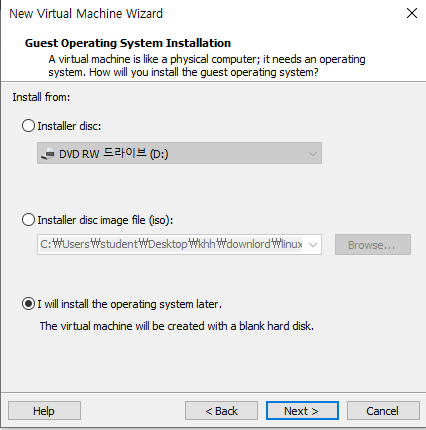

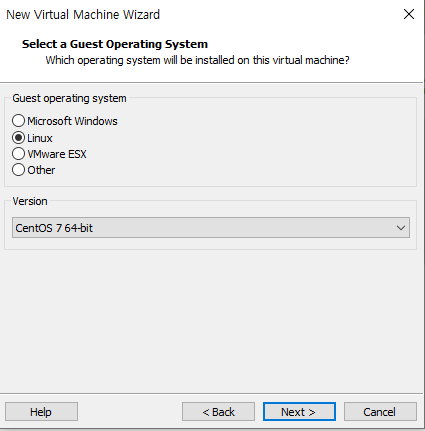

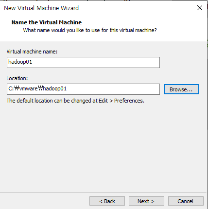

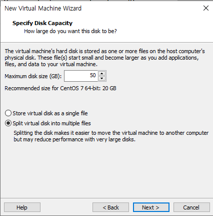

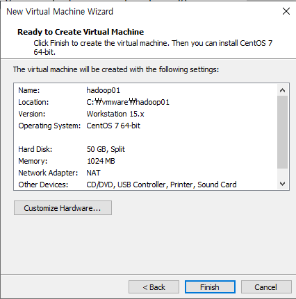

* 메모리 추가

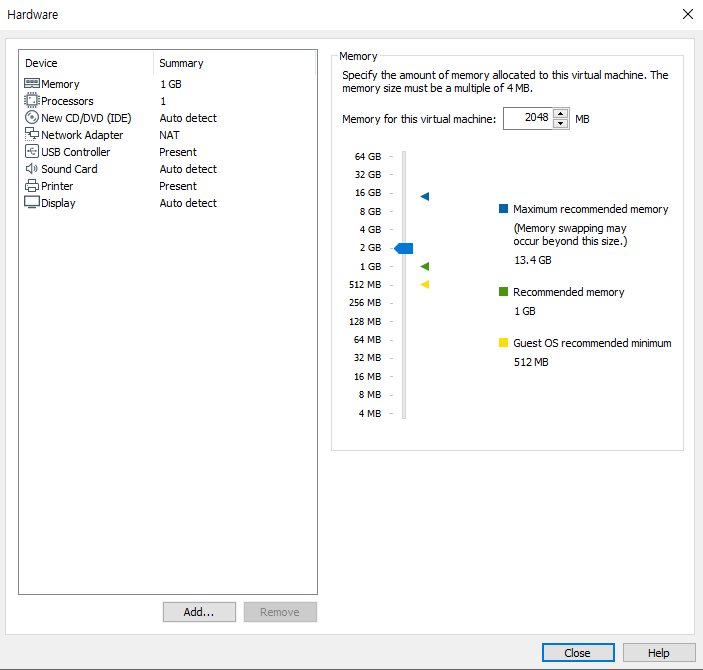

* [CenoOS DOWNLOAD](http://mirror.kakao.com/centos/7.8.2003/isos/x86_64/)

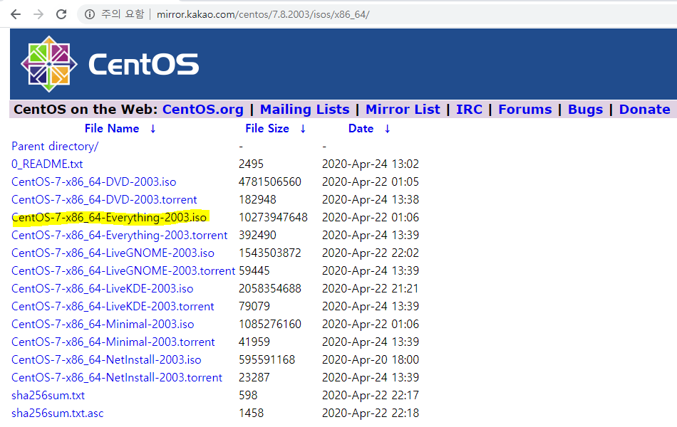

## CentOS Setting

* Setting - CentOS IOS 경로 입력 - Powor Start - install - 언어 - 한국어 선택 
* 네스워크 -  켬

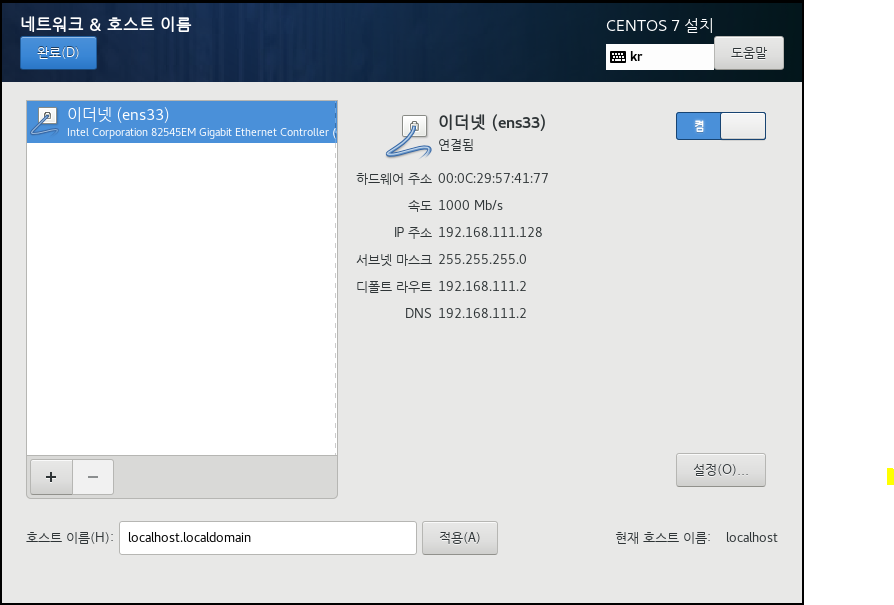

* 소프트웨어 - GNOME 데스크탑 선택 - 호환성 라이브러리  & 개발용도구 선택

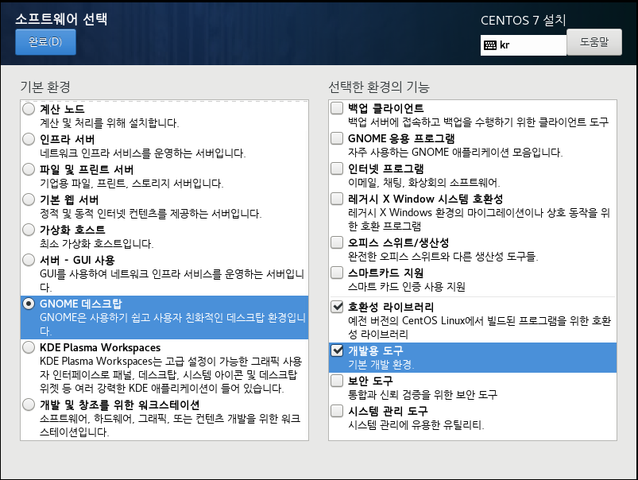

* 설치대상 -  파티션 설정 체크 - 표준파티션 선택  - +눌러 생성 - 변경사항 적용

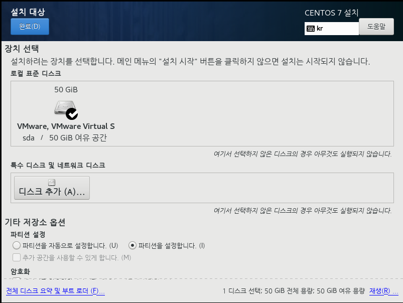

* swap

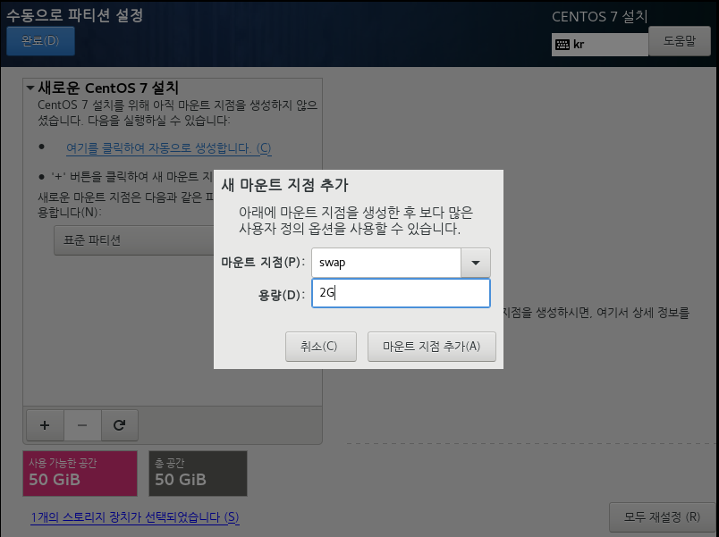

* /boot
  * 부팅 필요한

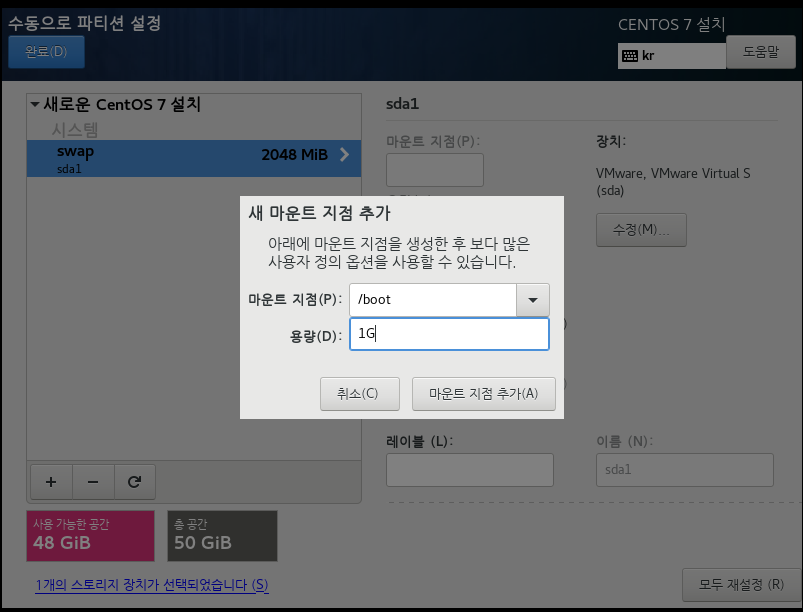

* /home
  * 저장될 데이터
* /
  * Linux시스템 저장 공간

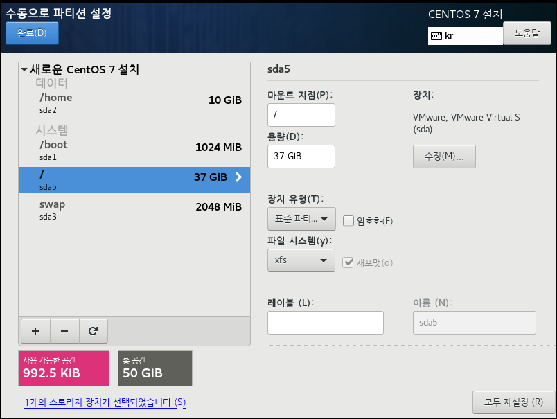

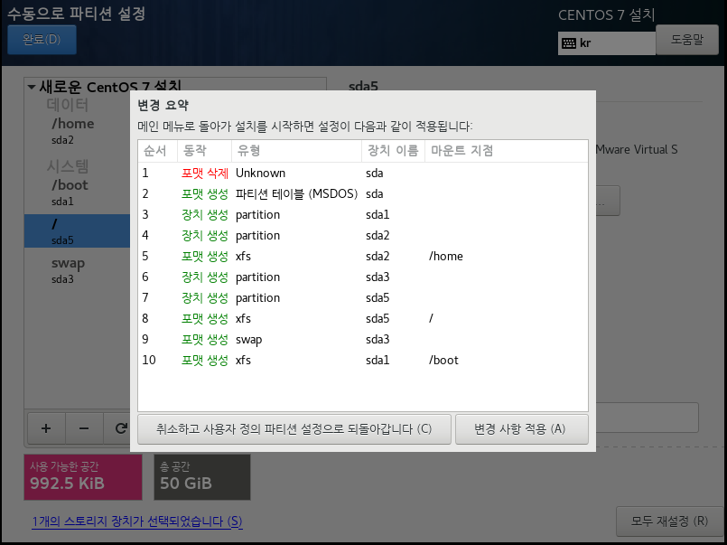

* 설치시작 - 암호설정(q1w2e3) - 사용자 생성 (ID-hadooptest PW-q1w2e3)

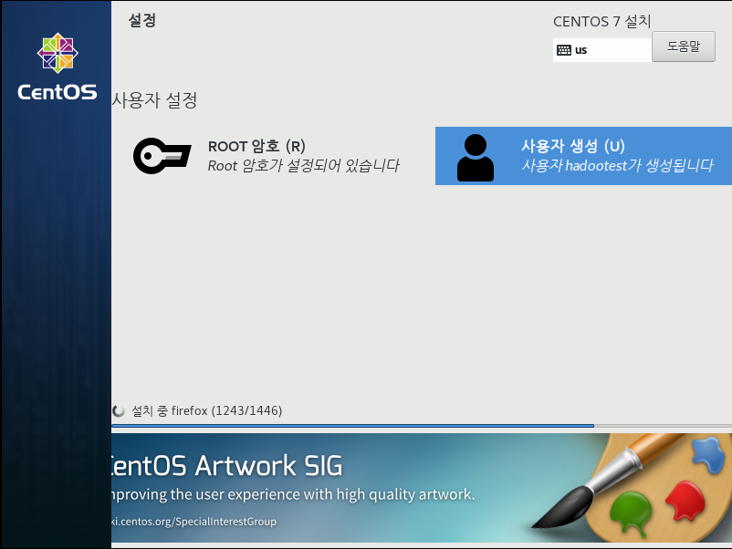

## Clone

* My Computer - 우Click - Manage - clone -Create full clone - name 설정/ 경로 설정


## 구조


### Hadoop System 구조

* Master(Name node) - Secondary Name node
  * Slave(data node)
    * Disk
  * Slave(data node)
    * Disk
  * Slave(data node)
    * Disk

### [HDFS](https://yookeun.github.io/java/2015/05/24/hadoop-hdfs/)


## Start???????

> Hadoop 2.9.2 Version
>
> Java 8 ver 설치 (각각의 서버마다 설치가 되어야한다)

* Hadoop01 - Name Node (host name = namenode)
* Hadoop02 - Data Node (host name = datanode01)
* Hadoop03 - Data Node (host name = datanode02)
* Hadoop04 - Data Node  (host name = datanode03)

### Mode

1. Standalone
   * 단일 노드
2. pseudo distributed 
   * 단일 node에서 cluster
3. Full distributed
   * 2대 이상의 Node를 Cluster로 구성

### 명령어

바탕화면

* rpm -qa | grep java
  * 자바 version 확인
* yum remove xxxxxxx
  * 3가지 remove
  * yum remove javapackages-tools-3.4.1-11.el7.noarch
  * yum remove python-javapackages-3.4.1-11.el7.noarch
  * yum remove tzdata-java-2018e-3.el7.noarch

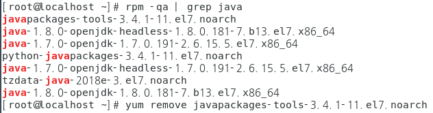 

### 공유폴더 설정

* Window 에서 설정
  * 공유 폴더 생성
  * 공유폴더 속성 -공유 - 고급공유 - 선택한 폴더공유 Check - 권한 - 모든권한 허용 check

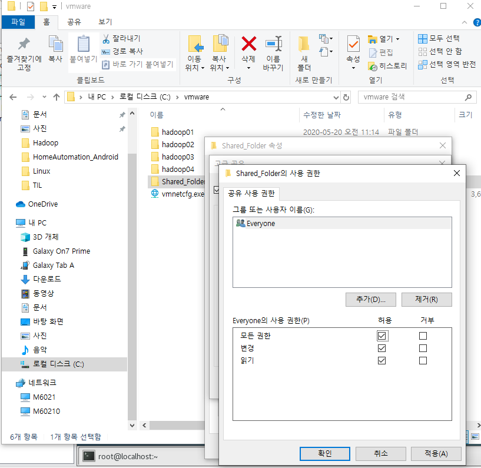 

* VMware 에서 설정

  * hadoop01 - setting - options tab - shared Folder - Always enable - add - 폴더 설정
  * 설정하고 Linux에 /mnt 경로에 표시됨

  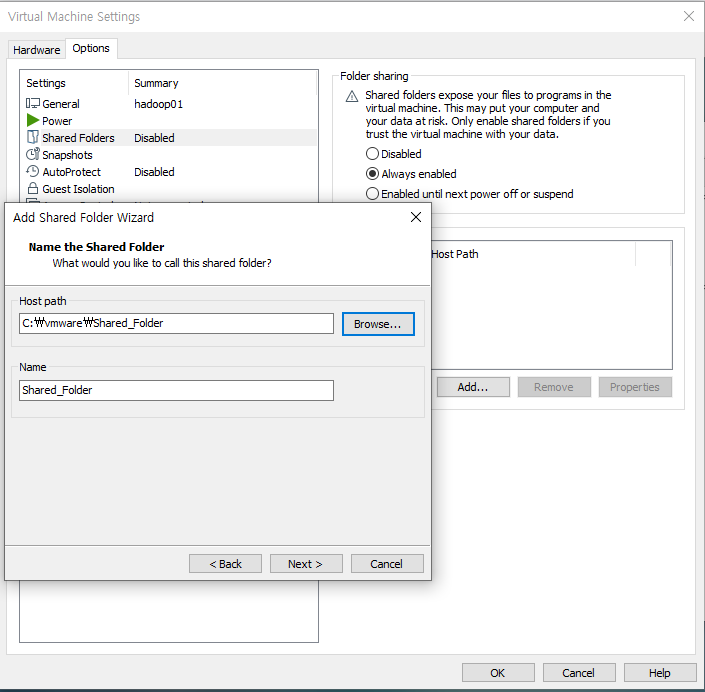 

* 공유폴도 환경 설정

```
# sudo mkdir your_shared_folder

# sudo vmware-hgfsclient

# sudo vmhgfs-fuse your_shared_folder
```


### java install

* JDK 압출풀기

```
tar zxvf xxxxxxx
```

* JDK 파일 경로 이동

```
mv jdk1.8.0_251 /usr/local/java
```

* vi /etc/profile
  * vi 편집기 에서 아래쪽에 4줄 삽입
    * i - 수정
    * esc -> :wq - 종료
    * esc -> :q! - 저장 안하고 종료

```
export JAVA_HOME=/usr/local/java
export HADOOP_HOME=/usr/local/hadoop
export CLASSPATH=$JAVA_HOME/lib:$CLASSPATH
PATH=$PATH:$JAVA_HOME/bin:$HADOOP_HOME/bin:$HADOOP_HOME/sbin
```

* source /etc/profile

```

```

* 버젼확인
  * java -version

```
java -version
java version "1.8.0_251"
```


### SSH 설정

* CentOS를 설치하면 방화벽이 켜져있다.
  * Hadoop을 이용하기 위해 방화벽을 해제하고
  * OS를 시작할때 방화벽을 켜지 않도록 설정이 필요하다

* 공개키와 개인키 방식의 암호화를 이용한 통신
  * 공개키 - 암호화힐떄 사용하는 key
* 공개키는 복호화를 할 수 없다.
  * 공개가 가능
  * 공개키는 사람들에게 나눠주는 키이고 개인키는 유출되면 안된다
* Hadoop01
  * 공개키01
  * 개인키01
* Hadoop02
  * 공개키02
    * Hadoop01에게 공개키02를 넘겨주고 Hadoop01은 이 키를 가지고 암호화하여 Hadoop02에게 다시 전달한다(복호화)
    * Hadoop02는 개인키02를 가지고 암호화된 키를 풀어 사용한다.
  * 개인키02


* Address
* Hadoop01

```
[root@localhost java]# ifconfig
ens33: flags=4163<UP,BROADCAST,RUNNING,MULTICAST>  mtu 1500
        inet 192.168.111.128  netmask 255.255.255.0  broadcast 192.168.111.255
        inet6 fe80::8b2e:8628:f2ae:8259  prefixlen 64  scopeid 0x20<link>
        ether 00:0c:29:57:41:77  txqueuelen 1000  (Ethernet)
        RX packets 477  bytes 70877 (69.2 KiB)
        RX errors 0  dropped 0  overruns 0  frame 0
        TX packets 215  bytes 22912 (22.3 KiB)
        TX errors 0  dropped 0 overruns 0  carrier 0  collisions 0
```

* Hadoop02

```
inet 192.168.111.131
```

* Hadoop03

```
inet 192.168.111.129
```

* Hadoop04

```
inet 192.168.111.130
```


* vi /etc/hosts

```
127.0.0.1   localhost localhost.localdomain localhost4 localhost4.localdomain4
::1         localhost localhost.localdomain localhost6 localhost6.localdomain6
192.168.111.128 namenode       ipAddress/name
192.168.111.131 datanode01
192.168.111.129 datanode02
192.168.111.130 datanode03
```

* 이름설정
  * vi /etc/hostname
    * namenode
    * datanode01
    * datanode02
    * datanode03
* 공개키 개인키 설정
  *  ssh-keygen

```
[root@namenode ~]# ssh-keygen
Generating public/private rsa key pair.
Enter file in which to save the key (/root/.ssh/id_rsa): 
Created directory '/root/.ssh'.
Enter passphrase (empty for no passphrase): 
Enter same passphrase again: 
Your identification has been saved in /root/.ssh/id_rsa.
Your public key has been saved in /root/.ssh/id_rsa.pub.
The key fingerprint is:
SHA256:wqce53RhinhK2x5mpeppRMnBRQ6cobSrn3TS9TjrJYA root@namenode
The key's randomart image is:
+---[RSA 2048]----+
|  .oo=o          |
| . o=o           |
|  o. o.          |
|   o+.           |
|  E.. + S o      |
| . ..+ X o .     |
|. o.= & * .      |
| o =.@ @ .       |
|  oo*o* .        |
+----[SHA256]-----+
[root@namenode ~]# 

```

* id_rsa : 개인키
* id_rsa.pub: 공개키

```
[root@namenode ~]# cd /root/.ssh/
[root@namenode .ssh]# ls
id_rsa  id_rsa.pub
[root@namenode .ssh]# 

```

* 공개키 복사

  * Hadoop01 에서만 공개키를 복사한다
  * cp id_rsa.pub authorized_keys

  ```
  [root@namenode .ssh]# ls
  authorized_keys  id_rsa  id_rsa.pub
  ```

  * 파일 내용
    * cat authorized_keys

  ```
  [root@namenode .ssh]# cat authorized_keys 
  ssh-rsa AAAAB3NzaC1yc2EAAAADAQABAAABAQCeXVXOB2Po44053DurpDCyqC7gA58r6FQwJptfVwo0MTt6l1r3Prph11TtqXnpSyHfKrFmxXb4yviRgkfuMtlYNWvxu6ZveR2gnLDkJL612FOLCIGNaERAbOLkzKUp30d9kR6uIxuUMHrVUnsjczSgvjY6LPnC3btywyJJaPOdOLzYziuLjJrkZSrEfBNXWInIa5JQl0rR7DY7oJCresw5J/y19JSQ/HM2/7Cs22dO1WEbJSUSrqOnLoWhsH0/US1fARACBSNmkKjJbi3BaUGCr/fMJIZN2xqSvMxNaCSdylyj0CvNwm7Zn7eUbX7t6iU7YvtwCBhkjC4kbEhuwfWP root@namenode
  ```

  * ssh-copy-id root@namenode
    * Hadoop01,02,03 에 동일하게 코드 작성 하고 root비밀번호 입력

  ```
  [root@dataname01 .ssh]# ssh-copy-id root@namenode
  The authenticity of host 'namenode (192.168.111.128)' can't be established.
  ECDSA key fingerprint is SHA256:FHu+eDadfQVpqy688f/SFFCfFkZANaru0orm5mso+b0.
  ECDSA key fingerprint is MD5:3f:02:c2:4d:1c:72:3c:9f:e1:ea:13:8b:a1:8a:80:2b.
  Are you sure you want to continue connecting (yes/no)? yes
  /usr/bin/ssh-copy-id: INFO: attempting to log in with the new key(s), to filter out any that are already installed
  /usr/bin/ssh-copy-id: INFO: 1 key(s) remain to be installed -- if you are prompted now it is to install the new keys
  root@namenode's password: 
  Permission denied, please try again.
  root@namenode's password: 
  
  Number of key(s) added: 1
  
  Now try logging into the machine, with:   "ssh 'root@namenode'"
  and check to make sure that only the key(s) you wanted were added.
  
  [root@dataname01 .ssh]# 
  ```

  * 공개키 취합 확인
    * Hadoop01에서

  ```
  [root@namenode .ssh]# cat authorized_keys 
  ssh-rsa AAAAB3NzaC1yc2EAAAADAQABAAABAQCeXVXOB2Po44053DurpDCyqC7gA58r6FQwJptfVwo0MTt6l1r3Prph11TtqXnpSyHfKrFmxXb4yviRgkfuMtlYNWvxu6ZveR2gnLDkJL612FOLCIGNaERAbOLkzKUp30d9kR6uIxuUMHrVUnsjczSgvjY6LPnC3btywyJJaPOdOLzYziuLjJrkZSrEfBNXWInIa5JQl0rR7DY7oJCresw5J/y19JSQ/HM2/7Cs22dO1WEbJSUSrqOnLoWhsH0/US1fARACBSNmkKjJbi3BaUGCr/fMJIZN2xqSvMxNaCSdylyj0CvNwm7Zn7eUbX7t6iU7YvtwCBhkjC4kbEhuwfWP root@namenode
  ssh-rsa AAAAB3NzaC1yc2EAAAADAQABAAABAQDpoMZGigGJJIFGqWtSBFb6cn+yljtOO/GtOHpgnr9YqN2ktw4O0KgXxOdE7tkDPhnsF1UKjTtVJX2BDc9Xb5zr/u5s0dqfiXxIqvU1AS478HdpsKLKVuEYZkxPodv4Ey5JrAGks+mS6sH2KqobgDj75Z5ViSV70Z7G3wS+WjRwS9FHLbk+8vPzQ8oNBHtSBPuTbXwV1WPOKppYuOFXPsfuro2KZZ+6ubs5pAG1wRbyiet9X88o1z8U6oFRherLaA6fnOwEuypxLUKbQWCBAynMduZxzs8KbDYv8QEMznEfcm0RxOHfnvZZ0eiBqJ1fNVTxNY8yBEwDEFKEQfmlSZFZ root@dataname01
  ssh-rsa AAAAB3NzaC1yc2EAAAADAQABAAABAQDkh340a3PXv+q6x/ZNxDzyUx6i6w7IzzCjeUgstmY0sBygbdCMuuVyIh8ckRWx8hHiWlnucGrHF5mjopKL+/Pb/eQGaLwLENnGHSXFLBTw2Br3mzsNLZt2mCatGGFKZ7hO2l1kzl1qqLJHqANG28dt+mlxNXdV+HQkzxvmsjKEsGZ2Ua7PIHuhIaYo0KxW2lXGFQXfdQrobTspt3IPMVhhIxEaFQbtYdRNzFRTCxRjYIDbgF0ijuDG21xkL9BAI5dlVRQZXUuvaPHnxY8+s6+x1l3oSknd6JoRoiO5MZyE9qCupPWua7wN27qYgWUW6N6DKPHx85EuXuORo28DHgwz root@datanode02
  ssh-rsa AAAAB3NzaC1yc2EAAAADAQABAAABAQCbKd4H72ZMMTaDjpgxj6Ih/G2hyIo77Z7UZMFXcQjL5OlNDiukKmt/WbHBplOuo+g8Qyl7RW1/nROKejIAB3v6csjzcESovsIxMebIVA1pVCvoWmsBUgogjlMkK7mHKngyl6r6oO10yUDmzwdss1kOjZBq9NFlXJ7xPnhrzKS0qYmY+rxqOeNvYwsUU74on5cFa+BRgGdD1h38P4ejzrXb0exHt/cZkD/RSgP9XcVIq14WqZmWDS9u9e+gWKDwhjSu7m06PB6s8LqyORws2107xddp5u2iXg4I6Mye55re/UtWGN5dwgjQMp2TDKaBIXTWfoSMiI12xy3TYnldu0gT root@datanode03
  [root@namenode .ssh]# 
  
  ```

  * scp -rp
    * 암호화된 파일 복사
    * datanode01,02,03을 동일하게  아래 코드 적용해준다

  ```
  [root@namenode .ssh]# ls
  authorized_keys  id_rsa  id_rsa.pub
  [root@namenode .ssh]# scp -rp authorized_keys root@datanode01:~/.ssh/authorized_keys
  The authenticity of host 'datanode01 (192.168.111.131)' can't be established.
  ECDSA key fingerprint is SHA256:FHu+eDadfQVpqy688f/SFFCfFkZANaru0orm5mso+b0.
  ECDSA key fingerprint is MD5:3f:02:c2:4d:1c:72:3c:9f:e1:ea:13:8b:a1:8a:80:2b.
  Are you sure you want to continue connecting (yes/no)? yes
  Warning: Permanently added 'datanode01,192.168.111.131' (ECDSA) to the list of known hosts.
  root@datanode01's password: 
  authorized_keys                               100% 1586     1.6MB/s   00:00  
  ```

  * Hadoop01 에서 02로 데이터 전달
    * 처음 통신할떄는 아래처럼 여부를 물어본다 

  ```
  [root@dataname01 .ssh]# ssh datanode02 date
  The authenticity of host 'datanode02 (192.168.111.129)' can't be established.
  ECDSA key fingerprint is SHA256:FHu+eDadfQVpqy688f/SFFCfFkZANaru0orm5mso+b0.
  ECDSA key fingerprint is MD5:3f:02:c2:4d:1c:72:3c:9f:e1:ea:13:8b:a1:8a:80:2b.
  Are you sure you want to continue connecting (yes/no)? yes
  Warning: Permanently added 'datanode02,192.168.111.129' (ECDSA) to the list of known hosts.
  2020. 05. 21. (목) 00:39:36 KST
  ```

* 방화벽 끄기

  * systemctl stop firewalld

* 방화벽 서비스 중지

  * systemctl disable firewalld


## Reference

[HDFS Basic](https://yookeun.github.io/java/2015/05/24/hadoop-hdfs/)

