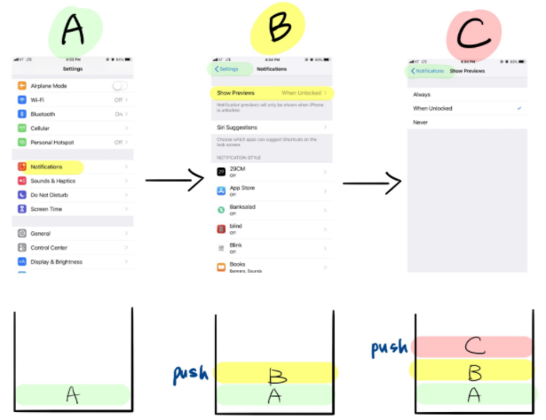
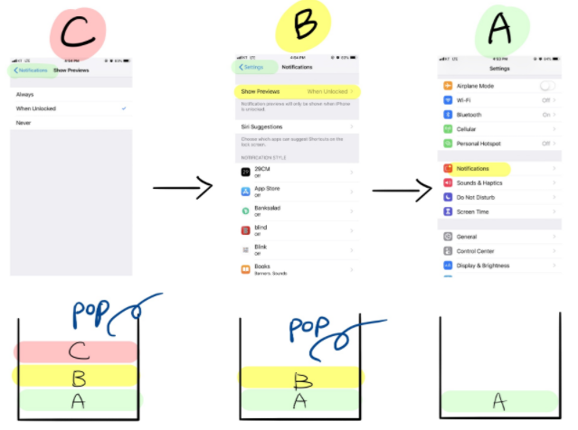
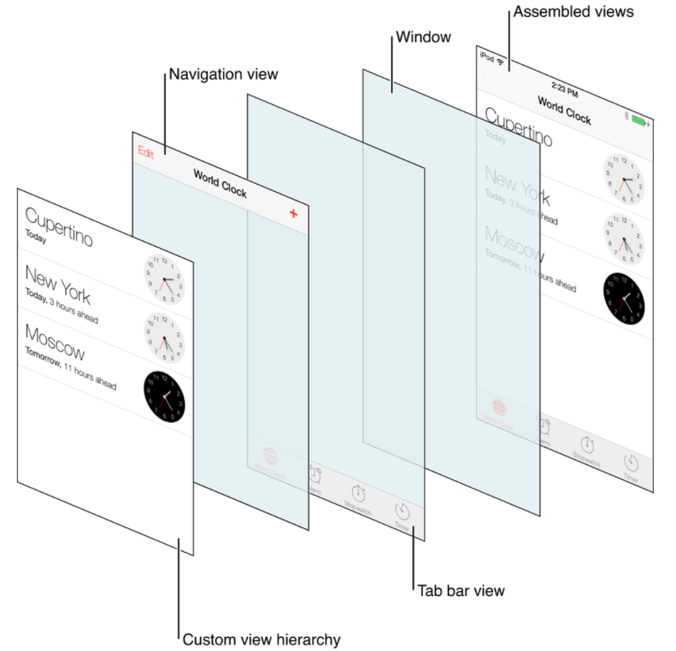

# NavigationController

## Navigation View Controller

> * 계층구조로 구성된 content를 순차적으로 보여주는 container view controller
> * stack 구조로 구현되어 있다
>   * navigation stack
> * 계층 구조 탐색으로 App content를 보여주기에 적절하다.
> * 한번에 한 child view controller의 content만 보여진다.

* tree 구조처럼 상위 카테고리에서 점차 하위 카테고리로 넓어져 가는 구조를 표현
* 상위 카테고리로 돌아가기 위해서는 가장 최근 보여진 vc부터 연순으로 거쳐 가야된다.
  * LIFO(Last In First Out)특성의 stack 구조가 이를 구현하기에 적절
* Navigation Controller의 pop/push method를 사용하여 보여지는 child view controller를 변경

## 구성

## Navigation Bar - UI NavigationBar

## Reference

[https://daheenallwhite.github.io/ios/2019/07/25/Navigation-Controller/](https://daheenallwhite.github.io/ios/2019/07/25/Navigation-Controller/)

