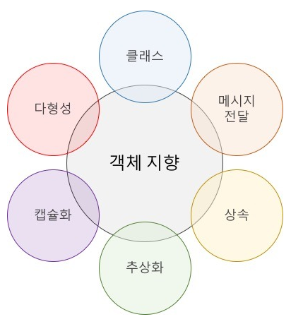

# JAVA

## Object Oriented Programming

 

* 이미 작성한 코드에 대한 재사용성이 높다

* 설계 원칙
  1. SRP(Single Responsibility Principle) - 단일 책임
     * 클래스는 단 하나의 책임을 가져야 하며 클래스를 변경하는 이유는 단하나의 이유여야 한다
  2. OCP(Opne - Closed Principle) - 계방 - 페쇄
     * 확장에는 열려 있어야 하고 변경에는 닫혀 있어야 한다
  3. LSP(Liskov Substitution Principle) - 리스코프 치환
     * 상위 타입의 객체를 하위 타입의 객체로 치환해도 상위 타입을 사용하는 프로그램은 정상적으로 동작해야 한다
  4. ISP(Interface Segregation Principle) - 인터페이스 분리
     * 인터페이스는 그 인터페이스를 사용하는 클라이언트를 기준으로 분리해야 한다
  5. DIP(Dependency Inversion Principle) - 의존 역전
     * 고수준 모듈은 저수준 모듈의 구현에 의존해서는 안된다

