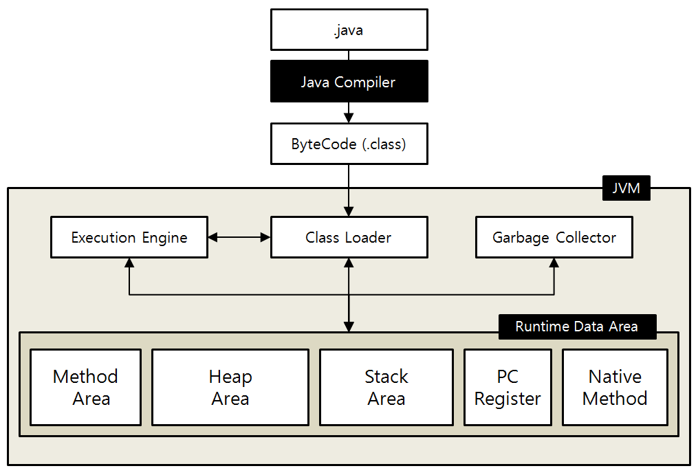
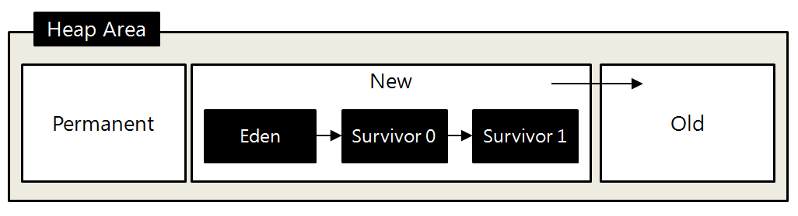

# JAVA

## Object Oriented Programming

 

* 이미 작성한 코드에 대한 재사용성이 높다

* 설계 원칙
  1. SRP(Single Responsibility Principle) - 단일 책임
     * 클래스는 단 하나의 책임을 가져야 하며 클래스를 변경하는 이유는 단하나의 이유여야 한다
  2. OCP(Opne - Closed Principle) - 계방 - 페쇄
     * 확장에는 열려 있어야 하고 변경에는 닫혀 있어야 한다
  3. LSP(Liskov Substitution Principle) - 리스코프 치환
     * 상위 타입의 객체를 하위 타입의 객체로 치환해도 상위 타입을 사용하는 프로그램은 정상적으로 동작해야 한다
  4. ISP(Interface Segregation Principle) - 인터페이스 분리
     * 인터페이스는 그 인터페이스를 사용하는 클라이언트를 기준으로 분리해야 한다
  5. DIP(Dependency Inversion Principle) - 의존 역전
     * 고수준 모듈은 저수준 모듈의 구현에 의존해서는 안된다

*  특징
  * 자료 추상화
    *  불필요한 정보는 숨기고 중요한 정보만을 표현함으로써 프로그램을 간단히 만드는 것
    * 추상 자료형은 자료형의 자료 표현과 자료형의 연산을캡슐화한 것으로 접근 제어를 통해서 자료형의 정보를 은닉할 수 있다.
    * 클래스 - 추상 자료형
    * 인스턴스 - 객체
    * 메소드 - 추상자료형에서 정의된 연산
    * 생성자 - 메소드의 호출
  * 상속
    * 새로운 클래스가 기존의 클래스의 자료와 연산을 이용할 수 있게 하는 기능
    * 상속을 통해서 기존의 클래스를 상속받은 하우 ㅣ클래스를 이용해 프로그램의 요구에 맞추어 클래스를 수정할 수 있고 클래스 간의 종속 관계를 형성함으로써 객체를 조직화할 수 있다.
  * 다중 상속
    * 클래스가 2개 이상의 클래스로부터 상속받을 수 있게 하는 기능.
    * 클래스들의 기능이 동시에 필요할 때 용이하나 클래스의 상속 관계에 혼란을 줄 수 있다
    * JAVA는 지원하지 않는다
  * 다형성
    * 어떤 한 요소에 여러 개념을 넣어 놓는 것
    * 오버라이딩(overriding)
      * 같은 이름의 메소드가 여러 클레스에서 다른 기능을 하는것
    * 오버로딩
      * 같은 이름의 메소드가 인자의 개수나 자료형에 따라서 다른 기능을 하는것

## Java 메모리 구조

1. Excution Engine

   * Runtime Data Area에 배치된 바이트 코드를 명령어 단위로 실행한다.

2. Class Loader

   * Runtime 시 바이트코드를 로딩한다.

3.  Garbage Collector

   * heap을 사용 가능한 만큼 자유롭게 사용하고, 더 이상 사용되지 않는 object들은 GC 프로세스가 메모리에서 제거한다.
   *  Heap영역의 object 중 stack에서 도달불가능한(unreachable) object는 garbage collection의 대상이 된다.

4. Method Area(Static Area = Class Area = Code Area)

   * java compiler가 일차적으로 컴파일한 바이트코드를 class Loader를 통해 읽어 저장하는 영역
   * 클래스/인터페이스에 대한 상수 pool,  맴버변수, static 변수, 생성자와 메소드를 저장

5. Stack Area

   * 기본 타입(primitive type)변수가 저장되는 영역
   * Heap Area에 생성된 객체의 주소가 참조 타입 변수에 할당된다
   * 각 Thread는 자신만의 Static Area를 가진다
   * CPU에서 LIFO 형식으로 관리된다
   * 함수가 종료되면 모든 변수가 스텍에서 POP-OUT된다

6. Heep Area

   * JVM이 관리하는 프로그램에서 데이터를 저장하기 위하여 동적으로 할당하여 사용하는 메모리 영역
   * 모든 Object type은 Heep에 저장되며, 하나의 heep만 존재한다
   * Garbage Collector를 통해 메모리가 반환

   

   *  Permanent : 생성된 객체들의 주소 값이 저장된 공간
   * New Area
     * Eden : 객체들이 최초로 생성되는 공간
     * Survivor : Eden에서 참조되는 객체들이 저장되는 공간
   * Old Area : New Area에서 일정시간이상 참조되고 있는 객체들이 저장되는 공간