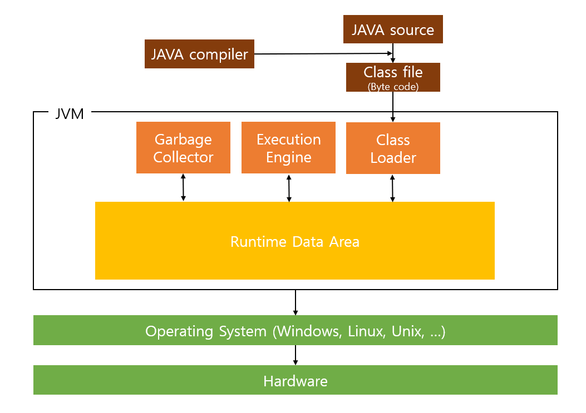

# JVM

> Java Virtual Machine - java 가상머신
>
> 자바 애플리케이션을 클래스 로더를 통해 일어 들여 자바 API와 함께 실행
>
> JVM은 JAVA와 OS사이에서 **중개자 역할**을 수행하여 JAVA가 OS에 구애받지않고 재사용을 가능하게 해준다.
>
> **메모리관리(Garbage collection)을 수행**
>
> **스텍기반의 가상머신**

## JAVA프로그램 실행 과정

1. 프로그램이 실행되면 JVM은 OS로부터 이 프로그램이 필요로 하는 메모리를 할당받으며, JVM은 이 메모리를 용도에 따라 여러 영역으로 나누어 관리
2. 자바 컴파일러가 자바 소스코드를 읽어들여 자바 바이트코드로 변환
3. Class Loader를 통해 class 파일들을 JVM으로 로딩
4. 로딩된 class파일들은 Execution engine을 통해 해석
5. 해석된 바이트코드는 Runtime Data Areas에 배치되어 실질적인 수행이 이루어지게 된다.
   * 이러한 실행고정 속에서 JVM은 필요에 따라 Thread Synchroniztion과 GC같은 관리작업을 수행

## JVM구성

* Class Loader

  * .class파일을 로드하고, 링크를 통해 배치하는 작업을 수행하는 모듈
  * .jar 파일 내 저장된 클래스드을 JVM위에 탑재하고 사용하지 않는 클래스들은 메모리에서 삭제
  * 컴파일 타임이 아니라런타임에 참조한다
    * 클래스를 처음으로 참조할 때, 해당 클래스를 로드하고 링크한며 그 역할을 클래스 로더가 수행

* Execution Engine

  * 클래스를 실행시키는 역할 클래스 로더가 JVM내의 런타임 데이터 영역에 바이트 코드를 배치시키고 이것은 실행엔진에 의해 실행
  *  Execution은 바이트코드를 실제로 JVM내부에서 기계가 실행할 수 있는 형테로 변경한다
    * Interpreter
      * 실행 엔진은 자바 바이트 코드를 명령어 단위로 읽어서 실행한다.
      * 한줄 씩 수행하기 때문에 느리다는 단점이 있다.
    * JIN(Just In Time)
      * 인터프리터 방식의 단점을 보완하기 위해 도입된 JIT컴파일러이다.
      * **인터프리터 방식으로 실행하다가 적절한 시점에 바이트코드 전테를 컴파일하여 네이티브 코드로 변경**하고, 이후에는 인터프리팅 하지 않고 네이티브 코드로 직접 실행하는 방식이다.
      * 네이티브 코드는 **캐시에 보관하기 때문에 한 번 컴파일된 코드는 빠르게 수행**하게 된다.
      * JIT컴파일러가 컴파일하는 과정은 바이트코드를 인터프리팅하는 것보다 오래걸리므로 한 번만 실행되는 코드라면 컴파일하지 않고 인터프리팅하는 것이유리하다. 따라서 JIT 컴파일러를 사용하는 **JVM들은 내부적으로 해당 메서드가 얼마나 자주 수행되는지 체크하고 일정 정도르 ㄹ넘을 때에만 컴파일을 수행**

* Garbage collector

  * GC를 수행하는 모듈(Thread)

* Runtime Data Area

  

  * 프로그램을 수행하기 위해 OS에서 할당받은 메모리 공간

  * PC Register

    * Thread가 시작될 때 생성되며 생성될 때마다 생성되는 공간으로 스레드마다 하나씩 존재
    * **어떤 부분을 어떤 명령으로 실행해야할 지에 대한 기록을 하는 부분을 현제 수행중인 JVM명령의 주소를 갖는다.**
  
  * JVM stack
  
    * 프로그램 실행과전에서 임시로 할당 되었다가 메서드를 빠져나가면 소멸되는 특성의 데이터를 저장하기 위한 영역
    * 각종 형테의 변수나 임시 데이터, 스레드나 메소드의 정보를 저장
  
  * Native method stack
  
    * 자바 프로그램이 컴파일되어 생성되는 바이트 코드가 아닌 실제 생성할 수 있는 기계어로 작성된 프로그램을 실행시키는 영역
  
  * Method Area
  
    * 클래스 정보를 처음 메로리 공간에 올릴 때 **초기화되는 대상을 저장하기 위한 메모리공간**
    * Runtime Constant Pool이라는 별도의 관리 영역도 함께 존재한다. 이는 **상수 자료형을 저장하고 중복을 막는 역할을 수행.**
  
  * Heap
  
    
  
    * 객체를 저장하는 가상 메모리
    * new연산자로 생성된 객체와 배열을 저장
    * Permanent Generation
      * 생성된 객체들의 정보의 주소값이 저장된 공간
      * Class loader에 의해 load되는 Class, Method등에 대한 Meta정보가 저장되는 영역이고 JVM에 의해 사용
    * New/Young Generation
      * Eden - 객체들이 최초로 생성되는 공간
      * Survivor - Eden에서 참조되는 객체들이 저장되는 공간
    * Old
      * New area에서 일정 시간 참조되고 있는 살아남은 객체들이 저장되는 공간 Eden영역에 객체가 가득차게 되면 첫번째 GC가 발생
      * Eden영역에 있는 값들을 Survivor1역역에 복사하고 이 영역을 제외한 나머지 영역의 객체를 삭제

## Reference

[https://asfirstalways.tistory.com/158](https://asfirstalways.tistory.com/158)