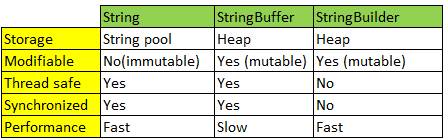
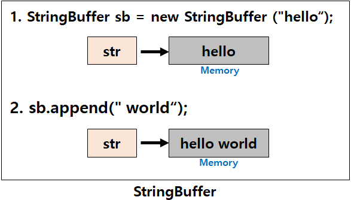

# String&StringBuffer

> * String
>   * 불변(immutable)의 속성을 같는다
>   * 문자열 연산이 적고 멀티쓰레드 환경일 경우 사용
> * StringBuffer/StringBuilder
>   * 가변성(mutable)을 가진다
>   * StringBuffer
>     * 문자열 연산이 많고 멀티쓰레드 환경일 경우
>   * StringBuilder
>     * 문자열 연산이 많고 단일쓰레드이거나 동기화를 고려하지 않아도 되는경우

* String, StringBuffer, StringBuilder 비교




## String

```java
String str = "hello";
str = str + " world";
```

* "hello" 값을 가지고 있던 String 클래스의 참조변수 str이 가리키는 곳에 저장된 "hello"에 " world"문자열을 더해 "hello world"로 변경한 것으로 착각할 수 있다

* 기존 "hello"값이 들어가 있던 String 클래스의 참조변수 str이 "hello world"라는 값을 가지고 있는 `새로운 메모리 영역을 가리키게 변경`되고 처음 선언했던 "hello"로 값이 할당되어 있던 메모리 영역은 garbage 영역으로 넘어가 있다가 GC(Garbage Collection)에 의해 사라지게 되는 것 이다.

* String class는 불변하기 때문에 **문자열을 수정하는 시점에 새로운 String 인스턴스가 생성**된다

  

* 변하지 않는 문자열을 자주 읽어들이는 경우 String을 사용하면 좋은 성능을 기대할 수 있다

* 문자열추가, 수정, 삭제 등의 연산이 빈번하게 발생하는 알고리즘에  String class를 사용하면 **Heep영역에 많은 임시 Garbage가 생성 되어 Heep메모리가 부족**으로 어플리케이션 성능에 치명적인 영향을 끼치게 된다


## StringBuffer/StringBuilder

* append(), delete() 등의 API를 이용하여 `동일 객체 내에서 문자열을 변경하는 것이 가능`하다

```java
StringBuffer stringBuffer = new StringBuffer("hello");
stringBuffer.append(" world");
```



* StringBuffer vs StringBuilder
  *  차이점
    * 동기화의 유무
    *  StringBuffer 
      * 동기화 키워드를 지원하여 멀티쓰레드 환경에서 안전하다(thread-safe)
    * StringBuilder
      * 동기화를 지원하지 않기때문에 멀티쓰레드 환경에서 사용하는 것은 적합하지 않지만 동기화를 고려하지 않는 단일쓰레드에서의 성능이 뛰어나다