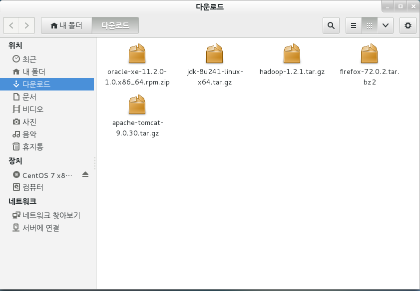

# Linux jdk 설치

1. 리눅스 설치시 openjdk 1.7 내장
2. 삭제
3. 새로운 버전 설치(rpm, yum, tar)
4. (환경변수 path 등록)
   * java.exe 
   * javac.exe
5. .hadoop

> virtual machine setting - Options - Shared Folders - (Always enablede check) - add..- Hostpath에 붙여넣을 파일이 존재하는 경로를 지정 - readOnly check


> VMware Workstation 
>
> 위치 - 다운로드 -아래 사진처럼 5개 파일 붙여넣기



```
[root@localhost ~]# java version
bash: java: 명령을 찾을 수 없습니다...
[root@localhost ~]# cd 다운로드
[root@localhost 다운로드]# ls -l
합계 690568
-rwxrw-rw- 1 root root  11026056  2월 18 08:36 apache-tomcat-9.0.30.tar.gz
-rwxrw-rw- 1 root root  66348863  2월 18 08:38 firefox-72.0.2.tar.bz2
-rwxrw-rw- 1 root root  63851630  2월 18 08:38 hadoop-1.2.1.tar.gz
-rwxrw-rw- 1 root root 194545143  2월 18 08:38 jdk-8u241-linux-x64.tar.gz
-rwxrw-rw- 1 root root 315891481  2월 18 08:38 oracle-xe-11.2.0-1.0.x86_64.rpm.zip
tar: Exiting with failure status due to previous errors
[root@localhost 다운로드]# tar xfvz jdk-8u241-linux-x64.tar.gz

[root@localhost 다운로드]# mv jdk1.8.0_241 /usr/local/jdk1.8
[root@localhost 다운로드]# ls -l
합계 636396
-rwxrw-rw- 1 root root  11026056  2월 18 08:36 apache-tomcat-9.0.30.tar.gz
-rwxrw-rw- 1 root root  66348863  2월 18 08:38 firefox-72.0.2.tar.bz2
-rwxrw-rw- 1 root root  63851630  2월 18 08:38 hadoop-1.2.1.tar.gz
-rwxrw-rw- 1 root root 194545143  2월 18 08:38 jdk-8u241-linux-x64.tar.gz
-rwxrw-rw- 1 root root 315891481  2월 18 08:38 oracle-xe-11.2.0-1.0.x86_64.rpm.zip
[root@localhost 다운로드]# cd /usr/local/jdk1.8
[root@localhost jdk1.8]# pwd
/usr/local/jdk1.8
[root@localhost jdk1.8]# cd bin
[root@localhost bin]# java -version
bash: java: 명령을 찾을 수 없습니다...
[root@localhost bin]# gedit /etc//profile
```

```
프로파일에 아래 4줄 profile에 저장

export JAVA_HOME=/usr/local/jdk1.8
export PATH=$PATH:$JAVA_HOME/bin
export JAVA_OPTS="-Dfile.encoding=UTF-9"
export CLASSPATH="."
```


```
[root@localhost bin]# echo $PATH
/usr/local/bin:/usr/local/sbin:/usr/bin:/usr/sbin:/bin:/sbin:/root/bin
[root@localhost bin]# echo $JAVA_HOME

[root@localhost bin]# source /etc/profile    ///실행을 해줘야 저장한게 적용이 된다.
[root@localhost bin]# echo $JAVA_HOME
/usr/local/jdk1.8
[root@localhost bin]# java -version
java version "1.8.0_241"
Java(TM) SE Runtime Environment (build 1.8.0_241-b07)
Java HotSpot(TM) 64-Bit Server VM (build 25.241-b07, mixed mode)

[root@localhost bin]# cd /
[root@localhost /]# pwd
/
[root@localhost /]# java -version
java version "1.8.0_241"
Java(TM) SE Runtime Environment (build 1.8.0_241-b07)
Java HotSpot(TM) 64-Bit Server VM (build 25.241-b07, mixed mode)
```

진행 코드

```
[root@localhost ~]# cd 다운로드

[root@localhost 다운로드]# tar xfvz jdk-8u241-linux-x64.tar.gz

[root@localhost 다운로드]# mv jdk1.8.0_241 /usr/local/jdk1.8

[root@localhost 다운로드]# cd /usr/local/jdk1.8

[root@localhost jdk1.8]# cd bin

[root@localhost bin]# gedit /etc//profile

프로파일에 아래 4줄 profile에 저장
export JAVA_HOME=/usr/local/jdk1.8
export PATH=$PATH:$JAVA_HOME/bin
export JAVA_OPTS="-Dfile.encoding=UTF-9"
export CLASSPATH="."

[root@localhost bin]# echo $PATH

[root@localhost bin]# source /etc/profile

[root@localhost bin]# echo $JAVA_HOME
```


