# Linux 명령어

* cd (change directory)
* ls
* wget - 다운로드
* yum 다운로드+설치

```
(/etc/yum.repos.d/*.repo 파일)  = /앞에 c드라이브 안적어줘도 됨.
```

* gedit

windoiws = 폴더

linux = 디렉토리(폴더)

* pwd - 현제 작업중인 디렉토리 명

```
[root@localhost network-scripts]# pwd
/etc/sysconfig/network-scripts
```


## 버전 확인

* cat /etc/redhat-release

```
[root@localhost network-scripts]# cat /etc/redhat-release 
CentOS Linux release 7.0.1406 (Core)
```

## /...

* /root -->root 계정 관련 저장 디렉토리

* /hone/사용자계정/해당 계정 관련 저장 디렉토리

* /etc/xxx:설정파일 젖아 디렉토리

* /usr/...: 모든 계정 사용 가능한 디렉토리

## system 종료

* shutdown -P now - 지금 시스템 종료

* halt -p - 지금 시스템 종료

* init 0 - 지금 시스템 종료

* poweroff - 지금 시스템 종료

* shutdown -P +10 - 10분 뒤 시스템 종료

## system 재시작

* shutdown -r now

* **reboot** - 설정파일 변경 사항 반영(가장 많이 사용)

* init 6 ==> (0~6)**런레벨** 값을 넣을 수 있다.

## 런레벨

> 기본 값이 5로 설정 되어 있어 재푸팅하면 Graphic 화면이 가장 먼져 나온다.

0. Power Off - 종료 모드
1. Rescue - 시스템 복구모드
2. Multi-User -  사용X
3. Mulit-User - 텍스트 모드의 다중 사용자 모드
4. Multi -User - 사용X
5. Graphical - 그래픽 모드의 다중 사용자 모드
6. Reboot - 설정파일 변경 반영하여 재시작

## 자동완성과 히스토리

* Tab 키를 누르면 명령어나 파일 명 자동 완성 시켜줌

* history -지금까지 썻던 명령어 표시
* history -c - 썻던 명령어 삭제

## 파일정보 확인

* ls 파일명 - 파일 정보 확인

* cat 파일명 - 파일 내용 출력(입력X)

* gedit 파일명 - 파일 내용 출력(입력O)

* vi 파일명 = gedit

## 도움말 사용

> man (명령어)  ==> man (manual)
>
> 리눅스에 체계화된 도움말
>
> window + space 는 한/영 바꾸는 key

man ls

* ls -l

```
[root@localhost ~]# pwd
/root
[root@localhost ~]# ls
anaconda-ks.cfg       공개      문서      비디오  서식
initial-setup-ks.cfg  다운로드  바탕화면  사진    음악
[root@localhost ~]# ls -l
합계 8
-rw-------. 1 root root 1365  2월 18  2020 anaconda-ks.cfg  앞에 d가 없으면 파일명이다(d가 있으면 디렉토리)
-rw-r--r--. 1 root root 1582  2월 18 11:11 initial-setup-ks.cfg
drwxr-xr-x. 2 root root    6  2월 18 11:12 공개
drwxr-xr-x. 2 root root    6  2월 18 11:12 다운로드
drwxr-xr-x. 2 root root    6  2월 18 11:12 문서
drwxr-xr-x. 2 root root    6  2월 18 11:12 바탕화면
drwxr-xr-x. 2 root root    6  2월 18 11:12 비디오
drwxr-xr-x. 2 root root    6  2월 18 11:12 사진
drwxr-xr-x. 2 root root    6  2월 18 11:12 서식
drwxr-xr-x. 2 root root    6  2월 18 11:12 음악
```

## 기본 명령어

* ls

  * -a 현제 디렉토리의 목록

  ```
  [root@localhost ~]# ls -a
  .              .bash_profile  .dbus      all.cfg               다운로드  서식
  ..             .bashrc        .esd_auth  anaconda-ks.cfg       문서      음악
  .ICEauthority  .cache         .local     initial-setup-ks.cfg  바탕화면
  .bash_history  .config        .mozilla   sample.txt            비디오
  .bash_logout   .cshrc         .tcshrc    공개                  사진
  ```

  * -l 현재 디렉토리의 목록을 자세히 보여줌

  ```
  [root@localhost ~]# ls -l
  합계 16
  -rw-r--r--  1 root root 5894  2월 18 15:25 all.cfg
  -rw-------. 1 root root 1365  2월 18  2020 anaconda-ks.cfg
  -rw-r--r--. 1 root root 1582  2월 18 11:11 initial-setup-ks.cfg
  -rw-r--r--  1 root root    0  2월 18 14:44 sample.txt
  drwxr-xr-x. 2 root root    6  2월 18 11:12 공개
  drwxr-xr-x. 2 root root    6  2월 18 15:12 다운로드
  drwxr-xr-x. 2 root root    6  2월 18 14:51 문서
  drwxr-xr-x. 2 root root    6  2월 18 11:12 바탕화면
  drwxr-xr-x. 2 root root    6  2월 18 11:12 비디오
  drwxr-xr-x. 2 root root    6  2월 18 11:12 사진
  drwxr-xr-x. 2 root root    6  2월 18 11:12 서식
  drwxr-xr-x. 2 root root    6  2월 18 11:12 음악
  ```

* cd

  ```
  [root@localhost ~]# cd /etc/sysconfig
  [root@localhost sysconfig]# pwd
  /etc/sysconfig
  [root@localhost sysconfig]# cd ..
  [root@localhost etc]# pwd
  /etc
  [root@localhost etc]# cd ..
  [root@localhost /]# pwd
  /
  [root@localhost /]# cd etc/sysconfig
  [root@localhost sysconfig]# pwd
  /etc/sysconfig
  [root@localhost sysconfig]# cd /root
  [root@localhost ~]# pwd
  /root
  [root@localhost ~]# cd etc/sysconfig
  bash: cd: etc/sysconfig: 그런 파일이나 디렉터리가 없습니다    cd /root/ect ... 라고 생각해서 파일을 찾지 못하는거다.
  ```

* pwd

  현재 위치 확인

  ```
  [root@localhost ~]# pwd
  /root
  ```

  

* rm - 파일+디렉토리(하위디렉토리)삭제.

  * rm -fr/ 하드디스크를 다 제거하는 명령어 (사용해서는 안된다.)
  * rmdir - 디렉토리 삭제(비어있는 디렉토리만 삭제)
  * mkdir - 디렉토리 삭제 (비어있는 디렉토리만 삭제)

  ```
  [root@localhost ~]# mkdir testdir
  [root@localhost ~]# ls
  anaconda-ks.cfg       sample.txt  공개      문서      비디오  서식
  initial-setup-ks.cfg  testdir     다운로드  바탕화면  사진    음악
  [root@localhost ~]# touch testdir/test.txt
  [root@localhost ~]# gedit testdir/test.txt
  Fontconfig warning: Directory/file mtime in the future. New fonts may not be detected.
  [root@localhost ~]# ls testdir/test.txt
  testdir/test.txt
  [root@localhost ~]# gedit testdir/test.txt
  [root@localhost ~]# rmdir testdir
  rmdir: failed to remove `testdir': 디렉터리가 비어있지 않음
  [root@localhost ~]# rm testdir
  rm: cannot remove `testdir': 디렉터리입니다
  [root@localhost ~]# rm -r testdir
  rm: descend into directory `testdir'? y
  rm: remove 일반 파일 `testdir/test.txt'? y
  rm: remove 일반 파일 `testdir/test.txt~'? y
  rm: remove 디렉토리 `testdir'? y
  [root@localhost ~]# ls
  anaconda-ks.cfg       sample.txt  다운로드  바탕화면  사진  음악
  initial-setup-ks.cfg  공개        문서      비디오    서식
  [root@localhost ~]# 
  ```

* cat  _ 파일의 내용을 화면에 보여줌

> 1. cat 파일명1 파일명2 > 파일명3(내용 삭제) ==> 파일명3에 내용을 지우고 파일1,2,를 3에 저장
>
> 2. cat 파일명1 파일명2 >> 파일명3(내용 삭제X) ==> 파일명3에 내용을 지우지 않고 파일1,2,를 3에 저장

1. 

```
[root@localhost ~]# cat anaconda-ks.cfg initial-setup-ks.cfg > all.cfg
```

2. 

```
[root@localhost ~]# cat anaconda-ks.cfg initial-setup-ks.cfg >> all.cfg
```


* cp

  ```
  [root@localhost ~]# cp sample.txt /root/다운로드
  [root@localhost ~]# ls sample.txt
  sample.txt
  [root@localhost ~]# ls
  anaconda-ks.cfg       sample.txt  다운로드  바탕화면  사진  음악
  initial-setup-ks.cfg  공개        문서      비디오    서식
  [root@localhost ~]# cd /root/다운로드
  [root@localhost 다운로드]# ls sample.txt
  sample.txt
  [root@localhost 다운로드]# 
  ```

* touch

  * 크기가 0인 파일을 만들때 사용.

  ```
  [root@localhost ~]# touch sample.txt
  [root@localhost ~]# ls -l sample.txt
  -rw-r--r-- 1 root root 0  2월 18 14:44 sample.txt
  ```

* mv

  ```
  [root@localhost 다운로드]# mv sample.txt /root/문서
  [root@localhost 다운로드]# pwd
  /root/다운로드
  [root@localhost 다운로드]# ls
  [root@localhost 다운로드]# ls /root/문서
  sample.txt
  ```

* head 

  > 위에서부터 10줄만 보여줌

  ```
  [root@localhost ~]# head 10 all.cfg 
  head: cannot open `10' for reading: 그런 파일이나 디렉터리가 없습니다
  ==> all.cfg <==
  #version=RHEL7
  # System authorization information
  auth --enableshadow --passalgo=sha512
  
  # Use CDROM installation media
  cdrom
  # Run the Setup Agent on first boot
  firstboot --enable
  ignoredisk --only-use=sda
  # Keyboard layouts
  
  ```

* tail 

  > 뒤에서 10줄 보여줘

  ```
  [root@localhost ~]# tail 10 all.cfg 
  tail: cannot open `10' for reading: 그런 파일이나 디렉터리가 없습니다
  ==> all.cfg <==
  @print-client
  @ruby-runtime
  @virtualization-client
  @virtualization-hypervisor
  @virtualization-tools
  @web-server
  @x11
  
  %end
  ```

  

* more

* file\

  > 파일에 대한 정보 출력

  ```
  [root@localhost ~]# file all.cfg 
  all.cfg: ASCII text
  ```


* clear

> 화면 reset


## 사용자 관리 파일속성

> 사용권한 3가지 (파일마다 다르게 적용 가능)
>
> 1. r - read
> 2. w - write
> 3. x - execute
>
> * 사용자 생성/그룹 변경은 **root** 계정만 사용가능

```
-rw-r--r--  1 root root 5894  2월 18 15:25 all.cfg
(root rPwjd)-rw-  (root계정과 같은 그룹에 속한 사용자가있으면)r--  (다른 사용자 그룹도)r--

```

* r - read
* w - write
* x - execute

### 파일/디렉토리 허가권 (사용권한)

* chmod 000(rwx)
  * r =  4
  * w = 2
  * x = 1
  * 0 = -
  
  > -rw-r--r--  1 root root   42  2월 19 11:18 sample.txt 에서  -rwxr--r--  1 root root   53  2월 19 11:25 sample.txt로 접근 권한 변경
  
  ```
  [root@localhost ~]# cat sample.txt
  root가 생성한 파일 입니다.
  ls -l
  [root@localhost ~]# echo "test"
  test
  [root@localhost ~]# echo "test" >>sample.txt
  [root@localhost ~]# cat sample.txt
  root가 생성한 파일 입니다.
  ls -l
  test
  [root@localhost ~]# /root/sample.txt
  bash: /root/sample.txt: 허가 거부
  [root@localhost ~]# chmod 744 sample.txt
  [root@localhost ~]# cat sample.txt
  root가 생성한 파일 입니다.
  ls -l
  test
  [root@localhost ~]# echo "test2" >>sample.txt
  [root@localhost ~]# cat sample.txt
  root가 생성한 파일 입니다.
  ls -l
  test
  test2
  [root@localhost ~]# /root/sample.txt
  /root/sample.txt: line 1: $'root\352\260\200': command not found
  합계 20
  -rw-r--r--  1 root root 5894  2월 18 15:25 all.cfg
  -rw-------. 1 root root 1365  2월 18 19:58 anaconda-ks.cfg
  -rw-r--r--. 1 root root 1582  2월 18 11:11 initial-setup-ks.cfg
  -rwxr--r--  1 root root   53  2월 19 11:25 sample.txt
  -rw-r--r--  1 root root    0  2월 19 11:16 sample.txt~
  drwxr-xr-x. 2 root root    6  2월 18 11:12 공개
  drwxr-xr-x. 2 root root    6  2월 18 15:12 다운로드
  drwxr-xr-x. 2 root root    6  2월 18 14:51 문서
  drwxr-xr-x. 2 root root    6  2월 18 11:12 바탕화면
  drwxr-xr-x. 2 root root    6  2월 18 11:12 비디오
  drwxr-xr-x. 2 root root    6  2월 18 11:12 사진
  drwxr-xr-x. 2 root root    6  2월 18 11:12 서식
  drwxr-xr-x. 2 root root    6  2월 18 11:12 음악
  /root/sample.txt: line 4: test2: command not found
  [root@localhost ~]# 
  ```
  
  

### 파일/디렉토리 소유권한

* chmod xxx xxx..

  ```
  chmod 777 test  ==> r -4 , w.-2, x -1
  
  * rwx rwx rwx
  
  chmod 644 test 
  
  * rw- r-- r--
  ```

  #### 사용자 변경

* chown 

  > root 만 사용 가능함

  ```
  chown centos test  ==>소유 권한이 centos로 넘어감
  ```

  ```
  [root@localhost ~]# chown centos sample.txt
  [root@localhost ~]# ls -l
  합계 20
  -rw-r--r--  1 root   root 5894  2월 18 15:25 all.cfg
  -rw-------. 1 root   root 1365  2월 18 19:58 anaconda-ks.cfg
  -rw-r--r--. 1 root   root 1582  2월 18 11:11 initial-setup-ks.cfg
  -rwxr--r--  1 centos root   53  2월 19 11:25 sample.txt
  -rw-r--r--  1 root   root    0  2월 19 11:16 sample.txt~
  drwxr-xr-x. 2 root   root    6  2월 18 11:12 공개
  drwxr-xr-x. 2 root   root    6  2월 18 15:12 다운로드
  drwxr-xr-x. 2 root   root    6  2월 18 14:51 문서
  drwxr-xr-x. 2 root   root    6  2월 18 11:12 바탕화면
  drwxr-xr-x. 2 root   root    6  2월 18 11:12 비디오
  drwxr-xr-x. 2 root   root    6  2월 18 11:12 사진
  drwxr-xr-x. 2 root   root    6  2월 18 11:12 서식
  drwxr-xr-x. 2 root   root    6  2월 18 11:12 음악
  ```

  

  #### 사용자 그룹 변경

* chgroup xxx xxx

  ```
  chgroup user test
  ```

  ```
  [root@localhost ~]# chgrp centos sample.txt
  [root@localhost ~]# ls -l
  합계 20
  -rw-r--r--  1 root   root   5894  2월 18 15:25 all.cfg
  -rw-------. 1 root   root   1365  2월 18 19:58 anaconda-ks.cfg
  -rw-r--r--. 1 root   root   1582  2월 18 11:11 initial-setup-ks.cfg
  -rwxr--r--  1 centos centos   53  2월 19 11:25 sample.txt
  -rw-r--r--  1 root   root      0  2월 19 11:16 sample.txt~
  drwxr-xr-x. 2 root   root      6  2월 18 11:12 공개
  drwxr-xr-x. 2 root   root      6  2월 18 15:12 다운로드
  drwxr-xr-x. 2 root   root      6  2월 18 14:51 문서
  drwxr-xr-x. 2 root   root      6  2월 18 11:12 바탕화면
  drwxr-xr-x. 2 root   root      6  2월 18 11:12 비디오
  drwxr-xr-x. 2 root   root      6  2월 18 11:12 사진
  drwxr-xr-x. 2 root   root      6  2월 18 11:12 서식
  drwxr-xr-x. 2 root   root      6  2월 18 11:12 음악
  ```

  


* whoami

사용자가누군지 표시

```
[centos@localhost ~]$ whoami
centos
```

* su -

> root 계정에서 다른 계정으로 로그인 하는 방법

```
[root@localhost ~]# whoami
root
[root@localhost ~]# su - centos
마지막 로그인: 수  2월 19 09:25:59 KST 2020 일시 :0
[centos@localhost ~]$ whoami
centos
[centos@localhost ~]$ 
```


### 사용자와 그룹

* 사용자 확인

  ```
  [root@localhost ~]# gedit /etc/passwd
  ```

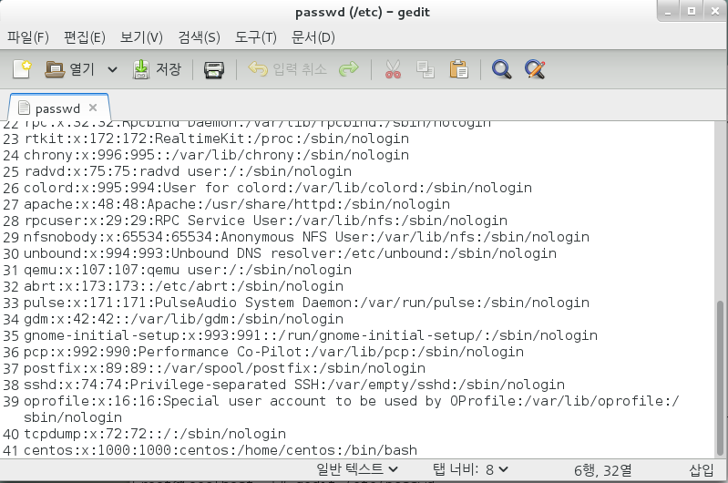

* 인코딩 암호 확인

  ```
  [root@localhost ~]# gedit /etc/shadow
  ```

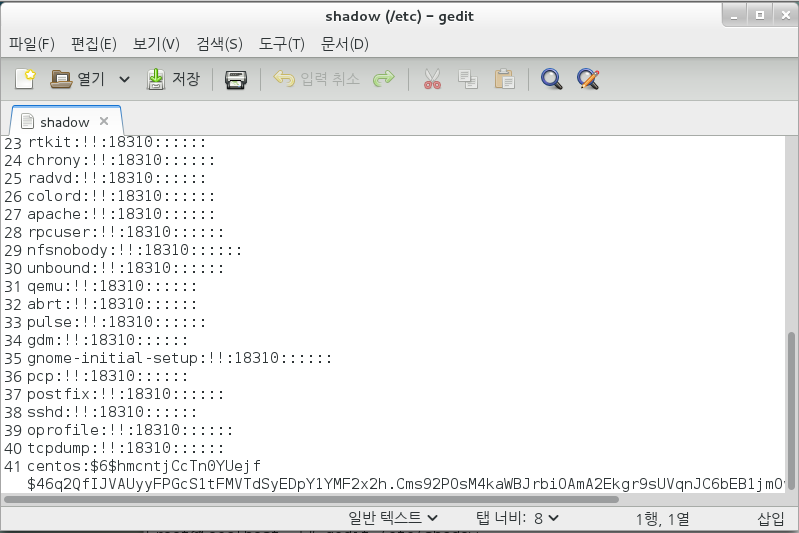

>  !! 는 암호가 없음을 나타냄

* 사용자 그룹 확인

  ```
  [root@localhost ~]# gedit /etc/group
  ```

  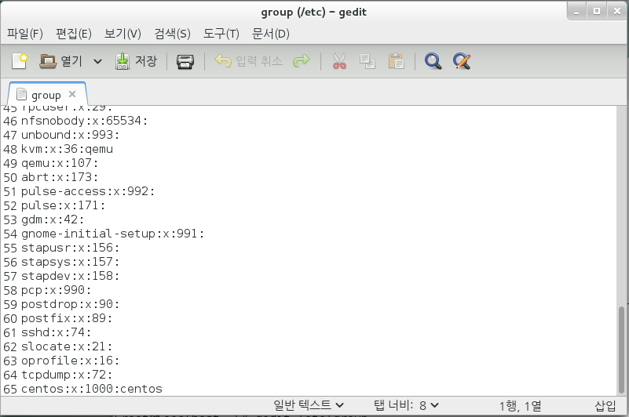


### user 생성

* useradd xxxxx

```
[root@localhost ~]# useradd testuser1
[root@localhost ~]# su - testuser1
[testuser1@localhost ~]$ whoami
testuser1
[testuser1@localhost ~]$ cat /etc/passwd


centos:x:1000:1000:centos:/home/centos:/bin/bash
testuser1:x:1001:1001::/home/testuser1:/bin/bash       ==1001 은 식별자 값이다==  
```

* 암호설정  passwd 계정명

  > 암호 설정은 root 계정에서 사용 가능
  >
  > * 비밀번호 설정은 8자이상
  > * 아이디와 중복되면 안됨
  > * root계정에서 설정하는건 위 2가지 사항 무시 가능

  ```
  [root@localhost ~]# whoami
  root
  [root@localhost ~]# passwd testuser1
  testuser1 사용자의 비밀 번호 변경 중
  새  암호:                                 ==1234==
  잘못된 암호: 암호는 8 개의 문자 보다 짧습니다
  새  암호 재입력:
  passwd: 모든 인증 토큰이 성공적으로 업데이트 되었습니다.
  [root@localhost ~]# 
  
  ```

* usermod -g root testuser1 (사용자 그룹변경)

  ```
  [root@localhost ~]# usermod -g root testuser1
  [root@localhost ~]# gedit /etc/passwd
  ```

  ```
  centos:x:1000:1000:centos:/home/centos:/bin/bash
  testuser1:x:1001:0::/home/testuser1:/bin/bash   1001:0 뒤에 0은 그룹 아이디 이다 (0은 root그룹임)
  ```

  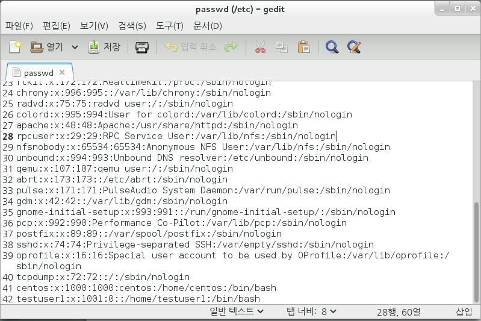

  

### user 삭제

> userdel user아이디 ==>사용자 삭제 (/home/testuser1 디렉토리는 삭제 되지 않는다)
>
> -r 을 함께 써줘야 디렉토리도 같이 삭제됨 (디렉토리가 남아있으면 해당 아이디로 다시 계정 생성이 안됨)

* userdel -r user아이디

  ```
  [root@localhost ~]# groupdel testuser1
  [root@localhost ~]# userdel testuser1
  [root@localhost ~]# useradd testuser1
  useradd: 경고: 홈디렉터리가 이미 있습니다.
  skel 디렉터리에서 파일을 복사하지 않습니다.
  메일함 파일을 만드는 중: 파일이 있습니다
  [root@localhost ~]# userdel -r testuser1    ==디렉토리 삭제==
  [root@localhost ~]# useradd testuser1
  ```

  user생성후 그룹을 root로 변경해서 기존에 생성된 그룹testusr1을 삭제후 user를 삭제 해야한아 (그룹을 제거 안하면 문제가 발생)

### yum

* 다운로드 + 설치 해주는 명령어
* yum -y install  == -y 는 무조건 설치하라는 명령어(yes)
* yum remeve == 제거
* yum info 페키지 이름 == 패키지의 요악 정보를 보여준다.
* yum clean all == yum 저장소 초기화(yum작업이 끝난후 해주는게 좋다)

```
[root@localhost ~]# yum -y install system-config-users
Loaded plugins: fastestmirror, langpacks
base                                                     | 3.6 kB     00:00     
extras                                                   | 2.9 kB     00:00     
Loading mirror speeds from cached hostfile
Resolving Dependencies
--> Running transaction check
---> Package system-config-users.noarch 0:1.3.5-2.el7 will be installed
--> Processing Dependency: system-config-users-docs for package: system-config-users-1.3.5-2.el7.noarch
--> Running transaction check
---> Package system-config-users-docs.noarch 0:1.0.9-6.el7 will be installed
--> Finished Dependency Resolution

Dependencies Resolved

================================================================================
 Package                        Arch         Version           Repository  Size
================================================================================
Installing:
 system-config-users            noarch       1.3.5-2.el7       base       337 k
Installing for dependencies:
 system-config-users-docs       noarch       1.0.9-6.el7       base       308 k

Transaction Summary
================================================================================
Install  1 Package (+1 Dependent package)

Total download size: 645 k
Installed size: 3.3 M
Downloading packages:
(1/2): system-config-users-1.3.5-2.el7.noarch.rpm          | 337 kB   00:01     
(2/2): system-config-users-docs-1.0.9-6.el7.noarch.rpm     | 308 kB   00:02     
--------------------------------------------------------------------------------
Total                                              304 kB/s | 645 kB  00:02     
Running transaction check
Running transaction test
Transaction test succeeded
Running transaction
  Installing : system-config-users-docs-1.0.9-6.el7.noarch                  1/2 
  Installing : system-config-users-1.3.5-2.el7.noarch                       2/2 
  Verifying  : system-config-users-1.3.5-2.el7.noarch                       1/2 
  Verifying  : system-config-users-docs-1.0.9-6.el7.noarch                  2/2 

Installed:
  system-config-users.noarch 0:1.3.5-2.el7                                      

Dependency Installed:
  system-config-users-docs.noarch 0:1.0.9-6.el7                                 

Complete!

```

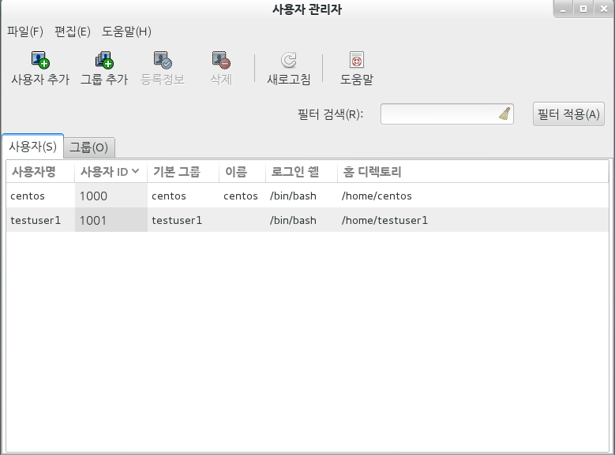


```
[root@localhost ~]# ls -l
합계 16
-rw-r--r--  1 root root 5894  2월 18 15:25 all.cfg
-rw-------. 1 root root 1365  2월 18 19:58 anaconda-ks.cfg
-rw-r--r--. 1 root root 1582  2월 18 11:11 initial-setup-ks.cfg
-rw-r--r--  1 root root    0  2월 18 14:44 sample.txt
drwxr-xr-x. 2 root root    6  2월 18 11:12 공개
drwxr-xr-x. 2 root root    6  2월 18 15:12 다운로드
drwxr-xr-x. 2 root root    6  2월 18 14:51 문서
drwxr-xr-x. 2 root root    6  2월 18 11:12 바탕화면
drwxr-xr-x. 2 root root    6  2월 18 11:12 비디오
drwxr-xr-x. 2 root root    6  2월 18 11:12 사진
drwxr-xr-x. 2 root root    6  2월 18 11:12 서식
drwxr-xr-x. 2 root root    6  2월 18 11:12 음악
 사용권한     소유자 그룹  크기     저장 날자
```

### 링크

> 바로가기 단축 아이콘(원본 파일이나 디렉토리 가리키는 참조 아이콘)
>
> 파일 이름이 길때 사용

> ln 원본 링크이름 ==> hardlink
>
> ln -s 원본 링크이름 ==>symbolic(soft link)
>
> * alias ls 도 ls 링크와 같은 킹크역할을 하지만 터미털이 종료되면 사라진다(다시 설정해줘야함.)

* 하드링크
  * 사본 개념
  * 원본 파일에 inode값을 그대로 가진다
  * 파일에만 가능하고 디렉토리에 링크 불가하다
  * 원본 파일이 지워져도 사용 가능하다
* 소프트 링크(symbolic link)
  * 원본을 참조하는 개념
  * 원본 파일 이름이 바뀌게 되면 링크로 값을 찾아올수 없다.
  * 파일과 디렉토리 둘다 링크가 가능하다.
  * 원본 파일이 삭제,이름변경,경로변경 되면 사용 불가.

```
[root@localhost ~]# ls -il
합계 16
137957232 -rw-r--r--  1 root root 5894  2월 18 15:25 all.cfg
137984571 -rw-------. 1 root root 1365  2월 18 19:58 anaconda-ks.cfg
137956577 -rw-r--r--. 1 root root 1582  2월 18 11:11 initial-setup-ks.cfg
137957227 -rw-r--r--  1 root root    0  2월 19 11:16 sample.txt~
271139569 drwxr-xr-x. 2 root root    6  2월 18 11:12 공개
    15834 drwxr-xr-x. 2 root root    6  2월 18 15:12 다운로드
404556435 drwxr-xr-x. 2 root root    6  2월 18 14:51 문서
404556433 drwxr-xr-x. 2 root root    6  2월 18 11:12 바탕화면
271139570 drwxr-xr-x. 2 root root    6  2월 18 11:12 비디오
137956600 drwxr-xr-x. 2 root root    6  2월 18 11:12 사진
137956599 drwxr-xr-x. 2 root root    6  2월 18 11:12 서식
    15835 drwxr-xr-x. 2 root root    6  2월 18 11:12 음악
inode 값
```

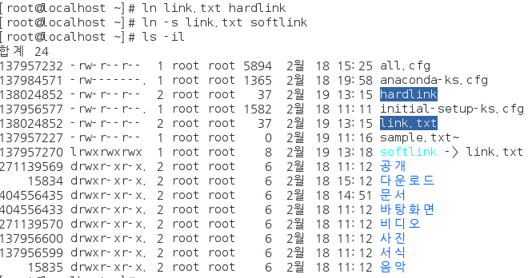

```
[root@localhost ~]# ln link.txt hardlink
[root@localhost ~]# ln -s link.txt softlink
[root@localhost ~]# ls -il
합계 24
137957232 -rw-r--r--  1 root root 5894  2월 18 15:25 all.cfg
137984571 -rw-------. 1 root root 1365  2월 18 19:58 anaconda-ks.cfg
138024852 -rw-r--r--  2 root root   37  2월 19 13:15 hardlink
137956577 -rw-r--r--. 1 root root 1582  2월 18 11:11 initial-setup-ks.cfg
138024852 -rw-r--r--  2 root root   37  2월 19 13:15 link.txt
137957227 -rw-r--r--  1 root root    0  2월 19 11:16 sample.txt~
137957270 lrwxrwxrwx  1 root root    8  2월 19 13:18 softlink -> link.txt
271139569 drwxr-xr-x. 2 root root    6  2월 18 11:12 공개
    15834 drwxr-xr-x. 2 root root    6  2월 18 15:12 다운로드
404556435 drwxr-xr-x. 2 root root    6  2월 18 14:51 문서
404556433 drwxr-xr-x. 2 root root    6  2월 18 11:12 바탕화면
271139570 drwxr-xr-x. 2 root root    6  2월 18 11:12 비디오
137956600 drwxr-xr-x. 2 root root    6  2월 18 11:12 사진
137956599 drwxr-xr-x. 2 root root    6  2월 18 11:12 서식
    15835 drwxr-xr-x. 2 root root    6  2월 18 11:12 음악
```

```
[root@localhost ~]# rm link.txt
rm: remove 일반 파일 `link.txt'? y
[root@localhost ~]# ls -il
합계 20
137957232 -rw-r--r--  1 root root 5894  2월 18 15:25 all.cfg
137984571 -rw-------. 1 root root 1365  2월 18 19:58 anaconda-ks.cfg
138024852 -rw-r--r--  1 root root   48  2월 19 13:25 hardlink
137956577 -rw-r--r--. 1 root root 1582  2월 18 11:11 initial-setup-ks.cfg
137957227 -rw-r--r--  1 root root    0  2월 19 11:16 sample.txt~
137957270 lrwxrwxrwx  1 root root    8  2월 19 13:18 softlink -> link.txt
271139569 drwxr-xr-x. 2 root root    6  2월 18 11:12 공개
    15834 drwxr-xr-x. 2 root root    6  2월 18 15:12 다운로드
404556435 drwxr-xr-x. 2 root root    6  2월 18 14:51 문서
404556433 drwxr-xr-x. 2 root root    6  2월 18 11:12 바탕화면
271139570 drwxr-xr-x. 2 root root    6  2월 18 11:12 비디오
137956600 drwxr-xr-x. 2 root root    6  2월 18 11:12 사진
137956599 drwxr-xr-x. 2 root root    6  2월 18 11:12 서식
    15835 drwxr-xr-x. 2 root root    6  2월 18 11:12 음악
[root@localhost ~]# cat hardlink
링크 테스트 중입니다
ls -il
test
test2
[root@localhost ~]# cat softlink
cat: softlink: 그런 파일이나 디렉터리가 없습니다
[root@localhost ~]# 

```


### 설치(RPM)

1. rpm 

   1. rpm

      * *.rpm 파일 설치/삭제/설치정보확인

      * 설치 == rpm -Uvh *.rpm

        * U:붙으면 신규 / 없으면 업그레이드
        * v :설치 과정 출력
        * h:######???

        ```
        [root@localhost ~]# cd /run/media/root/CentOS\ 7\ x86_64/Packages/
        [root@localhost Packages]# pwd
        /run/media/root/CentOS 7 x86_64/Packages
        [root@localhost Packages]# pwd
        /run/media/root/CentOS 7 x86_64/Packages
        [root@localhost Packages]# ls mc*
        mc-4.8.7-8.el7.x86_64.rpm               mcstrans-0.3.4-5.el7.x86_64.rpm
        mcelog-1.0-0.12.2577aeb.el7.x86_64.rpm
        [root@localhost Packages]# rpm -qip mc-4.8.7-8.el7.x86_64.rpm
        경고: mc-4.8.7-8.el7.x86_64.rpm: Header V3 RSA/SHA256 Signature, key ID f4a80eb5: NOKEY
        Name        : mc
        Epoch       : 1
        Version     : 4.8.7
        Release     : 8.el7
        Architecture: x86_64
        Install Date: (not installed)
        Group       : System Environment/Shells
        Size        : 5921725
        License     : GPLv3+
        Signature   : RSA/SHA256, 2014년 07월 04일 (금) 오후 12시 45분 00초, Key ID 24c6a8a7f4a80eb5
        Source RPM  : mc-4.8.7-8.el7.src.rpm
        Build Date  : 
        Build Host  : worker1.bsys.centos.org
        Relocations : (not relocatable)
        Packager    : CentOS BuildSystem <http://bugs.centos.org>
        Vendor      : CentOS
        URL         : http://www.midnight-commander.org/
        Summary     : User-friendly text console file manager and visual shell
        Description :
        Midnight Commander is a visual shell much like a file manager, only
        with many more features. It is a text mode application, but it also
        includes mouse support. Midnight Commander's best features are its
        ability to FTP, view tar and zip files, and to poke into RPMs for
        specific files.
        [root@localhost Packages]# rpm -Uvh mc-4.8.7-8.el7.x86_64.rpm
        경고: mc-4.8.7-8.el7.x86_64.rpm: Header V3 RSA/SHA256 Signature, key ID f4a80eb5: NOKEY
        준비 중...                         ################################# [100%]
        Updating / installing...
           1:mc-1:4.8.7-8.el7                 ################################# [100%]
        [root@localhost Packages]# mc
        ```

      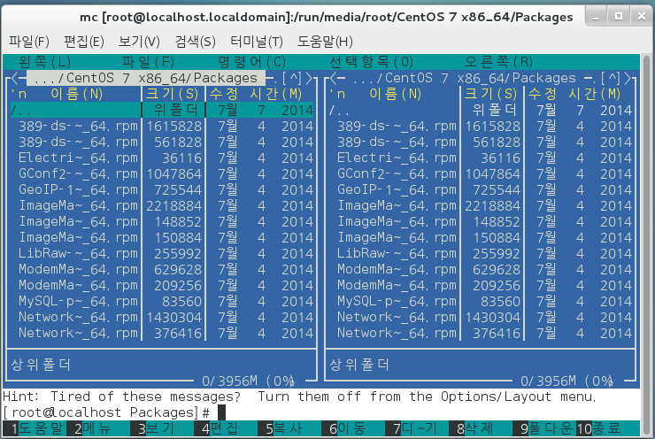

      ​									파일관리자(탐색기)

      * rpm 의존성 문제(Dependencies)

      ```
      [root@localhost Packages]# rpm -Uvh mysql-connector-odbc-5.2.5-6.el7.x86_64.rpm 
      경고: mysql-connector-odbc-5.2.5-6.el7.x86_64.rpm: Header V3 RSA/SHA256 Signature, key ID f4a80eb5: NOKEY
      오류: Failed dependencies:
      	libodbc.so.2()(64bit) is needed by mysql-connector-odbc-5.2.5-6.el7.x86_64
      	libodbcinst.so.2()(64bit) is needed by mysql-connector-odbc-5.2.5-6.el7.x86_64
      ```

      yum install

      ```
      [root@localhost Packages]# yum install mysql-connector-odbc
      ```

      

      * 삭제 == rpm -e*. 

        > mc: 뒤에 여려 문구가 이어도 mc라는 rpm이름만 적어주면 된다.

        ```
        [root@localhost Packages]# rpm -e mc
        [root@localhost Packages]# rpm -qa mc
        [root@localhost Packages]# mc
        bash: /usr/bin/mc: 그런 파일이나 디렉터리가 없습니다
        ```

        yum remove

        ```
        [root@localhost Packages]# yum remove mysql-connector-odbc
        ```

        

      * rpm -qa jdk* ==jdk 로 시작되는거 찾아줘  

        ```
        *jdk, *jdk*, jdk*
        
        [root@localhost ~]# rpm -qa *jdk*
        java-1.7.0-openjdk-headless-1.7.0.51-2.4.5.5.el7.x86_64
        java-1.7.0-openjdk-1.7.0.51-2.4.5.5.el7.x86_64
        ```

        ```
        [root@localhost Packages]# rpm -qa mc
        mc-4.8.7-8.el7.x86_64
        ```

      * rpm -qip *.rpm == 미설치 프로그램 정보 조회

        * 패키지이름, 버젼 , url 다운로드

   2. yum (rpm 단점**(의존성)**때문에 나온 yum )

      1. 의존성 파일과 함께 자동으로 같이 설치 해준다.
      2. rpm 명령어 설치파일이 미리 내컴퓨터에 있어야하지만 yum은 다운로드+설치 가 함께 된다.

      ```
      yum install 패키지카일명
      
      gedit /etc/yum.repos.d
      ```

   


### 압축

```
1 파일 압축 == 파일 1개만 압축
	*.gz
	*bz
2.압축 파일 묶기.
```

1. tar

   압축

   * tar c /root/*.* root.tar.gz
   * tar cf /root/*.* rroot.tar.gz
   * tar cfv /root/*.* root.tar.gz
   * tar cfvz /root/*.* root.tar.gz

   압축풀기

   * tar xfvz /root/*.* root.tar.gz /root/backup

2. zip

3. unzip

### 파일 위치 찾기

1. which -환경변수 등록된 경로상에 파일명으로, PATH

2. whereis - 실행, 소스 파일 

3. **find** -제약 없이 모든 파일을 찾을수 있는 명령어.

   ```
   find /root -name jdk*   ==>root 경로에 이름으로 jdk 가 들어간
   find / -name CentOS*DVD.iso
   find /root -perm 777
   find /root -user centos
   find /-user centos | more  == 왼쪽으로 실항하고 오른쪽처럼 결과를 출력해 라는 의미
   find / -user centos >> more.txt
   ```

4. rpm -qa rmp 파일명

5. 한페이지 보여주기

   1. cat /etc/passwd
   2. more /etc/passwd
   3. tail -5/etc/passwd
   4. head 5/etc/passwd


## Linux jdk 설치

1. 리눅스 설치시 openjdk 1.7 내장
2. 삭제
3. 새로운 버전 설치(rpm, yum, tar)
4. (환경변수 path 등록)
   * java.exe 
   * javac.exe
5. .hadoop

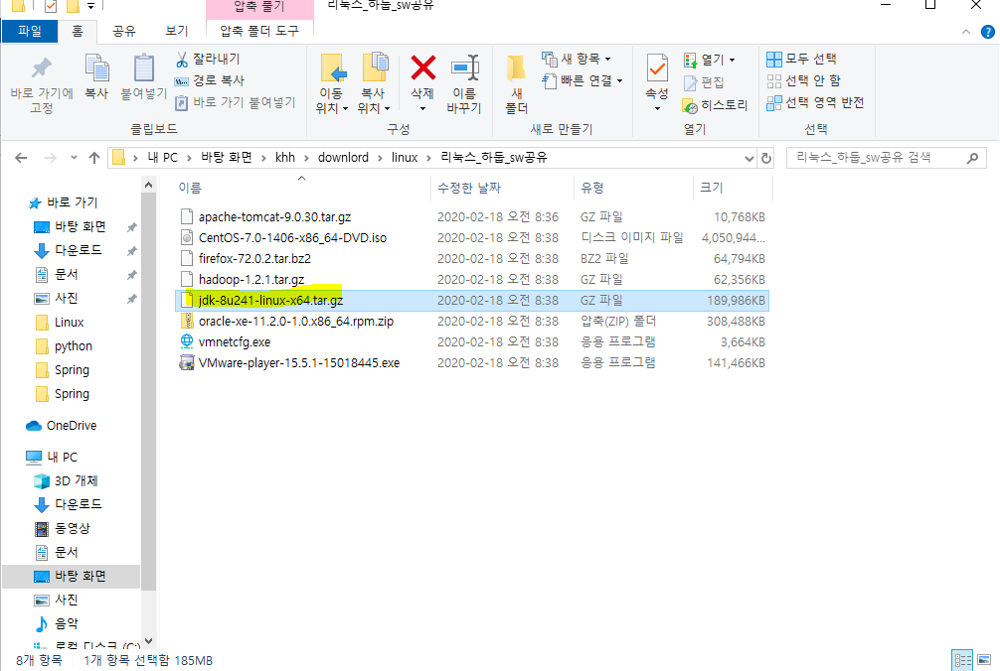

복사해서 아래에 붙여넣기

경로 위치-다운로드

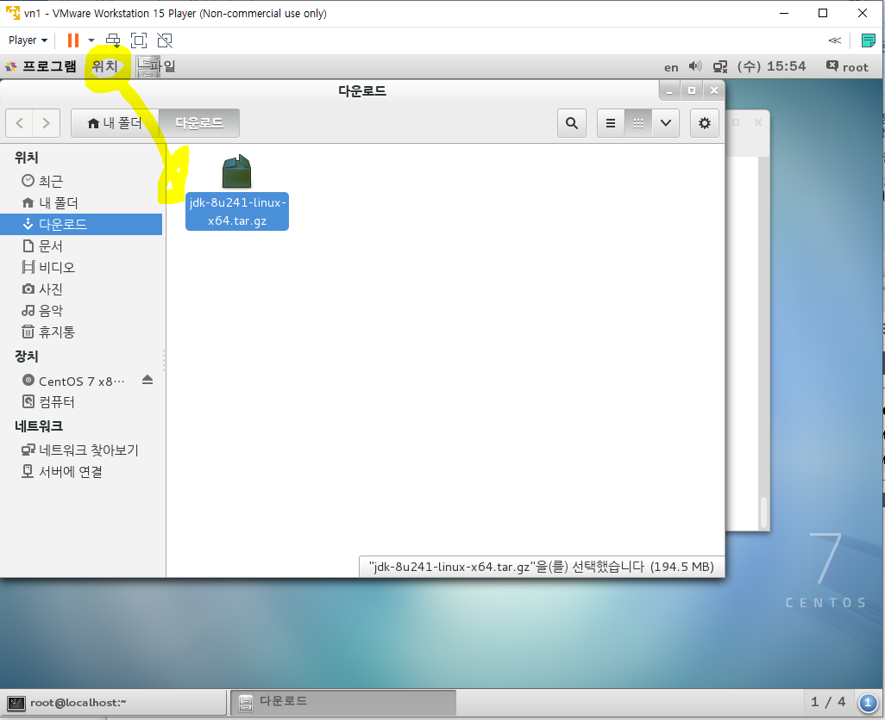

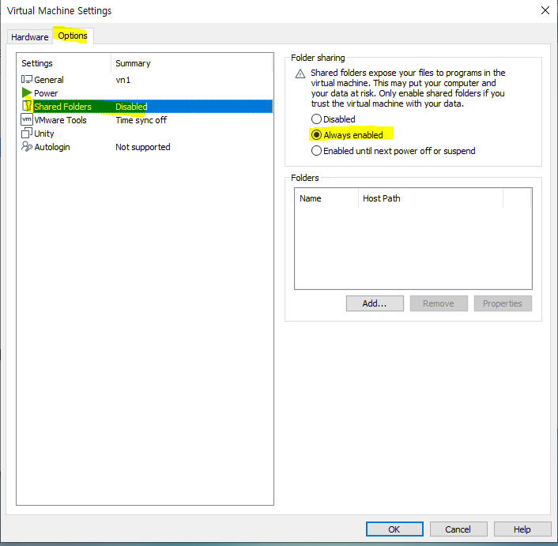

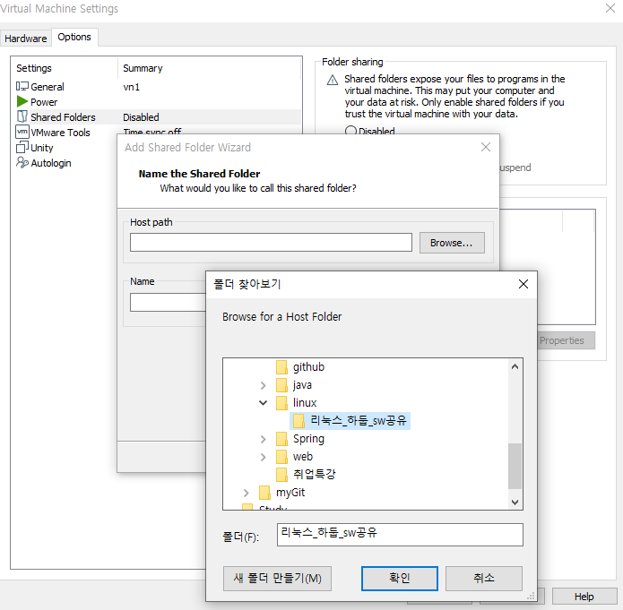

read only 체크하고

```
[root@localhost ~]# java version
bash: java: 명령을 찾을 수 없습니다...
[root@localhost ~]# cd 다운로드
[root@localhost 다운로드]# ls -l
합계 690568
-rwxrw-rw- 1 root root  11026056  2월 18 08:36 apache-tomcat-9.0.30.tar.gz
-rwxrw-rw- 1 root root  66348863  2월 18 08:38 firefox-72.0.2.tar.bz2
-rwxrw-rw- 1 root root  63851630  2월 18 08:38 hadoop-1.2.1.tar.gz
-rwxrw-rw- 1 root root 194545143  2월 18 08:38 jdk-8u241-linux-x64.tar.gz
-rwxrw-rw- 1 root root 315891481  2월 18 08:38 oracle-xe-11.2.0-1.0.x86_64.rpm.zip
tar: Exiting with failure status due to previous errors
[root@localhost 다운로드]# tar xfvz jdk-8u241-linux-x64.tar.gz


[root@localhost 다운로드]# mv jdk1.8.0_241 /usr/local/jdk1.8
[root@localhost 다운로드]# ls -l
합계 636396
-rwxrw-rw- 1 root root  11026056  2월 18 08:36 apache-tomcat-9.0.30.tar.gz
-rwxrw-rw- 1 root root  66348863  2월 18 08:38 firefox-72.0.2.tar.bz2
-rwxrw-rw- 1 root root  63851630  2월 18 08:38 hadoop-1.2.1.tar.gz
-rwxrw-rw- 1 root root 194545143  2월 18 08:38 jdk-8u241-linux-x64.tar.gz
-rwxrw-rw- 1 root root 315891481  2월 18 08:38 oracle-xe-11.2.0-1.0.x86_64.rpm.zip
[root@localhost 다운로드]# cd /usr/local/jdk1.8
[root@localhost jdk1.8]# pwd
/usr/local/jdk1.8
[root@localhost jdk1.8]# cd bin
[root@localhost bin]# gedit /etc//profile

```

```
프로파일에 아래 4줄 저장

export JAVA_HOME=/usr/local/jdk1.8
export PATH=$PATH:$JAVA_HOME/bin
export JAVA_OPTS="-Dfile.encoding=UTF-9"
export CLASSPATH="."
```

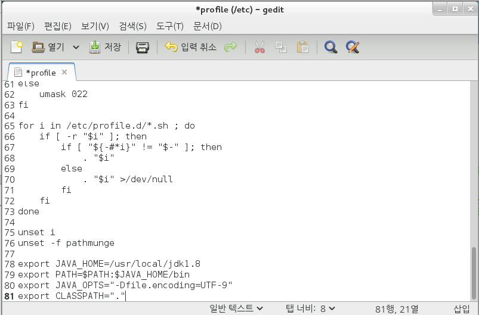

```
[root@localhost 다운로드]# cd /usr/local/jdk1.8
[root@localhost jdk1.8]# pwd
/usr/local/jdk1.8
[root@localhost jdk1.8]# cd vin
bash: cd: vin: 그런 파일이나 디렉터리가 없습니다
[root@localhost jdk1.8]# cd bin
[root@localhost bin]# java -version
bash: java: 명령을 찾을 수 없습니다...
[root@localhost bin]# gedit /etc//profile
[root@localhost bin]# echo $PATH
/usr/local/bin:/usr/local/sbin:/usr/bin:/usr/sbin:/bin:/sbin:/root/bin
[root@localhost bin]# echo $JAVA_HOME

[root@localhost bin]# source /etc/profile
[root@localhost bin]# echo $JAVA_HOME
/usr/local/jdk1.8
[root@localhost bin]# java -version
java version "1.8.0_241"
Java(TM) SE Runtime Environment (build 1.8.0_241-b07)
Java HotSpot(TM) 64-Bit Server VM (build 25.241-b07, mixed mode)

[root@localhost bin]# cd /
[root@localhost /]# pwd
/
[root@localhost /]# java -version
java version "1.8.0_241"
Java(TM) SE Runtime Environment (build 1.8.0_241-b07)
Java HotSpot(TM) 64-Bit Server VM (build 25.241-b07, mixed mode)
[root@localhost /]# 

```


