# Linux

> Cento OS 7
>
> VM = virtual box/ vmware
>
> windows - 가상 컴퓨터 역할을 하는 프로그램 설치 + Linux + hadoop

* 실제 컴퓨터 os = wiondows(host os)
* 가상 컴퓨터 os = linux(guest os)

## 환경설정

[vmware](https://www.vmware.com/kr/products/workstation-player/workstation-player-evaluation.html)

> vmwareplayer.exe 실행 설치 - VMware Workstaion 실행

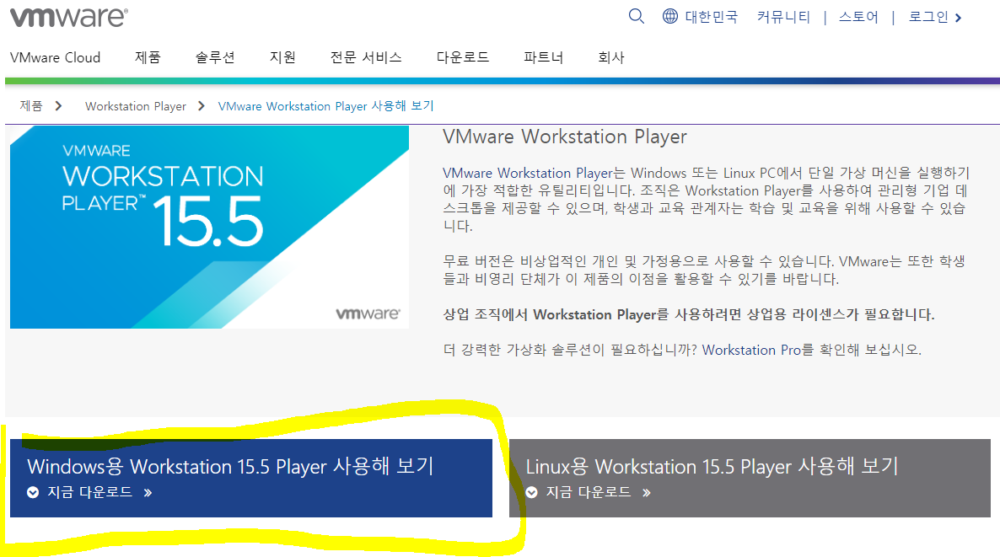

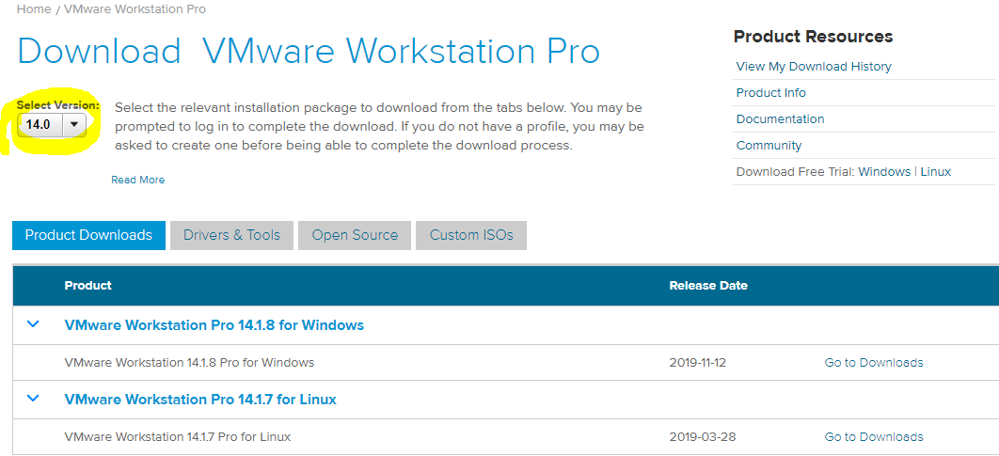

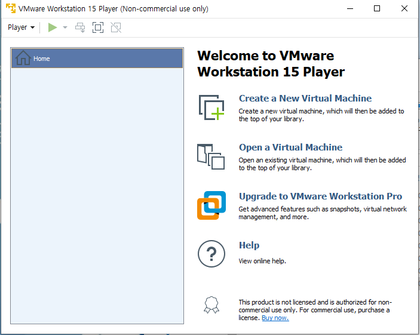


## 가상머신 만들기

> C드라이브에 hadoop forder 만들기

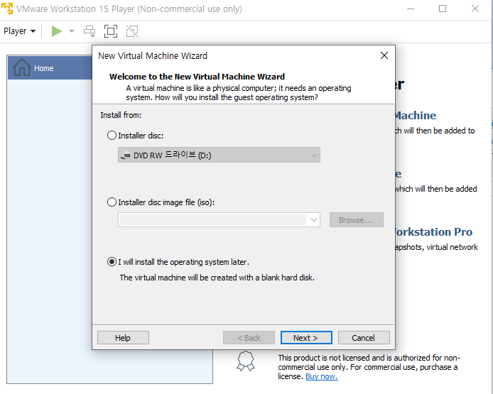

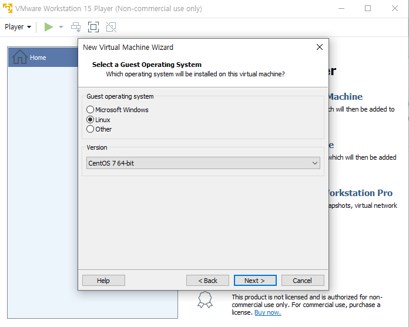

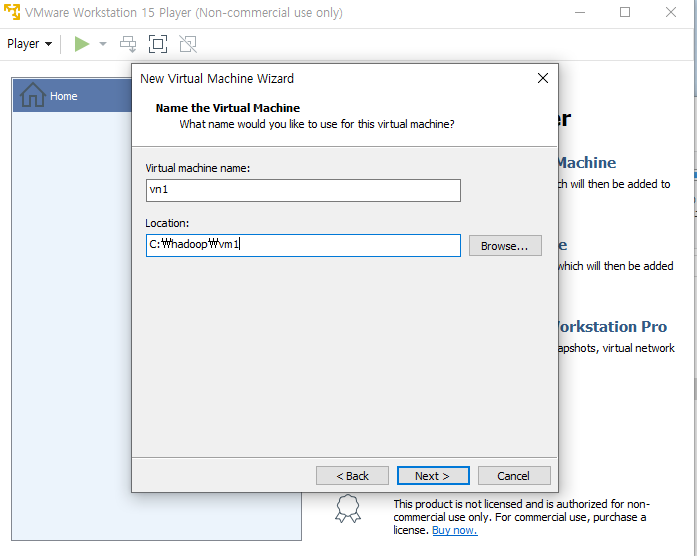

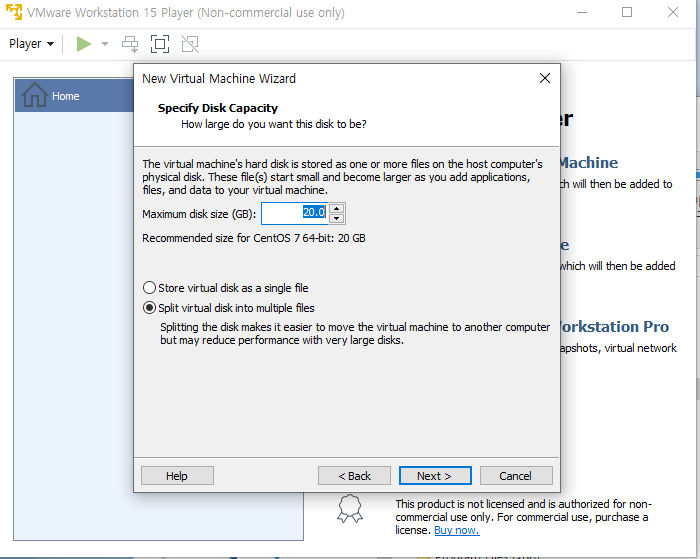

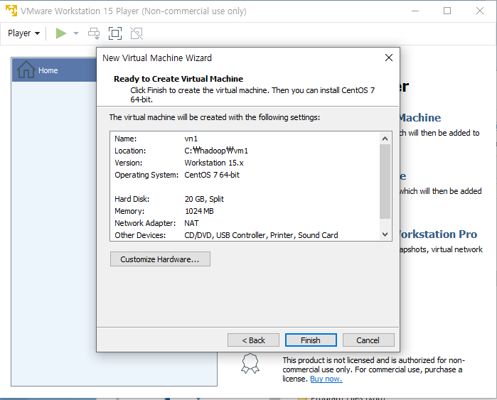

* scsi 서버용 하드

네트워크 설정

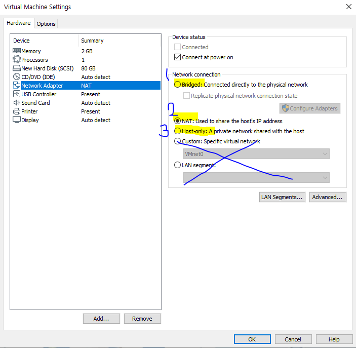


ctrl+Art - 마우스 활성화

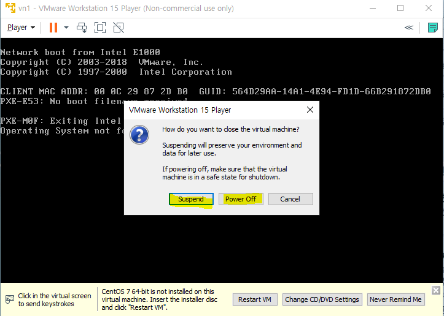

* Suspend - 종료후 재시작시 이전 값 유지
* Power off - 종료 전 값 유지 안하고 새로 시작

### Network 구성

```
C:\Users\student>ipconfig

Windows IP 구성


이더넷 어댑터 이더넷 5:

   연결별 DNS 접미사. . . . :
   링크-로컬 IPv6 주소 . . . . : fe80::9547:2d1f:fc8f:1af1%9
   IPv4 주소 . . . . . . . . . : 70.12.60.100
   서브넷 마스크 . . . . . . . : 255.255.255.0
   기본 게이트웨이 . . . . . . : 70.12.60.1

이더넷 어댑터 VMware Network Adapter VMnet1:

   연결별 DNS 접미사. . . . :
   링크-로컬 IPv6 주소 . . . . : fe80::c86a:3c96:e581:743b%28
   IPv4 주소 . . . . . . . . . : 192.168.31.1
   서브넷 마스크 . . . . . . . : 255.255.255.0
   기본 게이트웨이 . . . . . . :

이더넷 어댑터 VMware Network Adapter VMnet8:  ==>**host 와 guest 들에 통신을 도와주는 역할(VMnet8)**

   연결별 DNS 접미사. . . . :
   링크-로컬 IPv6 주소 . . . . : fe80::c9da:d6a5:2dda:4c69%29
   IPv4 주소 . . . . . . . . . : 192.168.203.1
   서브넷 마스크 . . . . . . . : 255.255.255.0
   기본 게이트웨이 . . . . . . :

C:\Users\student>
```

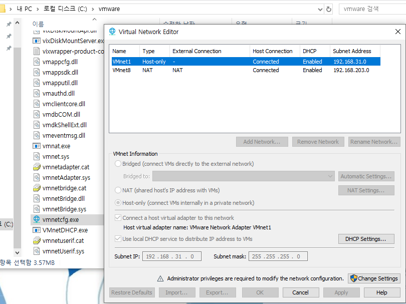

> p.68에 1-59를 이렇게 실행한다.

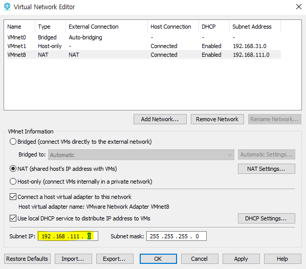

```
C:\Users\student>ipconfig
Windows IP 구성
이더넷 어댑터 이더넷 5:

   연결별 DNS 접미사. . . . :
   링크-로컬 IPv6 주소 . . . . : fe80::9547:2d1f:fc8f:1af1%9
   IPv4 주소 . . . . . . . . . : 70.12.60.100
   서브넷 마스크 . . . . . . . : 255.255.255.0
   기본 게이트웨이 . . . . . . : 70.12.60.1

이더넷 어댑터 VMware Network Adapter VMnet1:

   연결별 DNS 접미사. . . . :
   링크-로컬 IPv6 주소 . . . . : fe80::c86a:3c96:e581:743b%28
   IPv4 주소 . . . . . . . . . : 192.168.31.1
   서브넷 마스크 . . . . . . . : 255.255.255.0
   기본 게이트웨이 . . . . . . :

이더넷 어댑터 VMware Network Adapter VMnet8:

   연결별 DNS 접미사. . . . :
   링크-로컬 IPv6 주소 . . . . : fe80::c9da:d6a5:2dda:4c69%29
   IPv4 주소 . . . . . . . . . : 192.168.111.1  ==> 위에 작업을 하면 주소가 바뀜을 알수 있다.
   서브넷 마스크 . . . . . . . : 255.255.255.0
   기본 게이트웨이 . . . . . . :

C:\Users\student>
```


## Cento OS 7 설치

[http://archive.kernel.org/](http://archive.kernel.org/centos-vault/7.0.1406/isos/x86_64/)

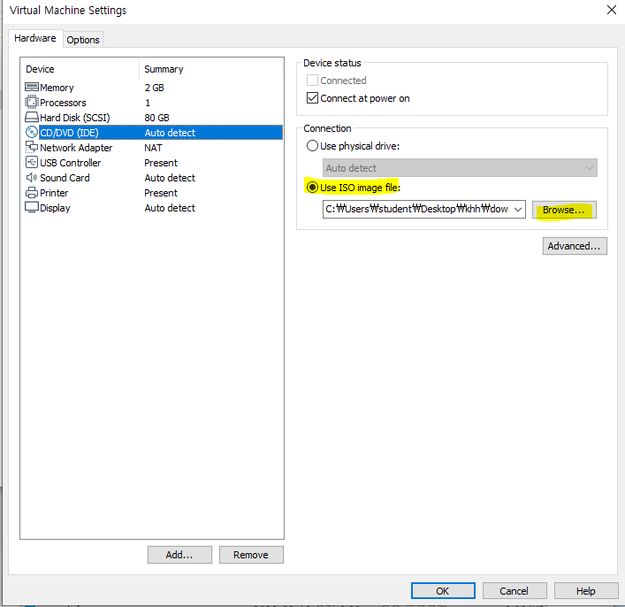

> 위 홈페이지에서 다운로드된 iso 파일 경로 지정해주기
>
> play로 vm1실행하고 위에써 선택후 엔터 하면 아래 화면이 뜬다.

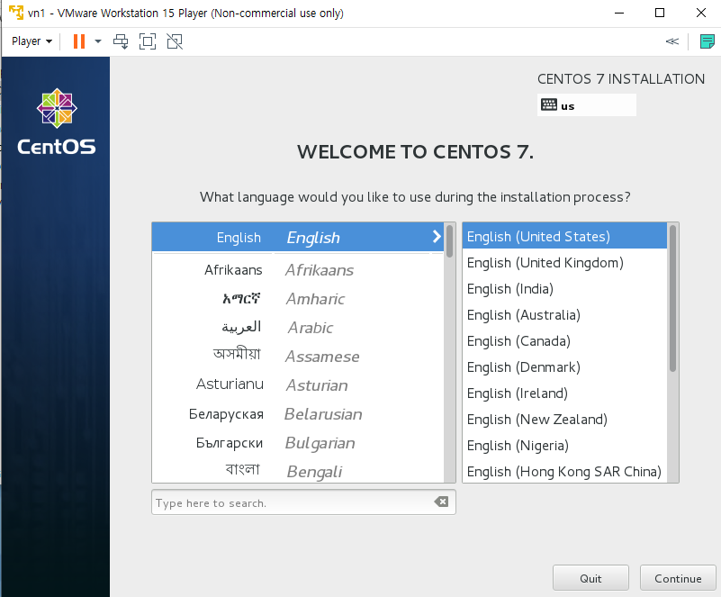

> 언어 선택후 다음 넘기고 키보드 click 하면 아래 화면 생성

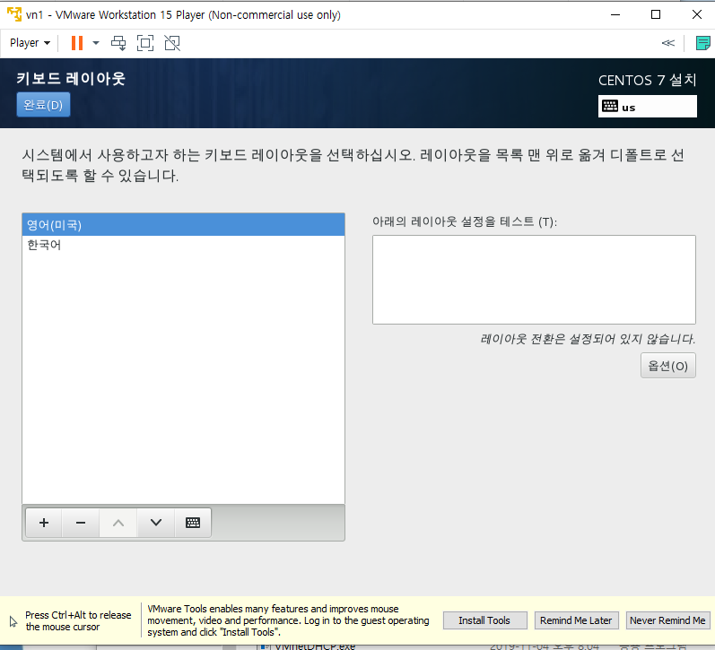

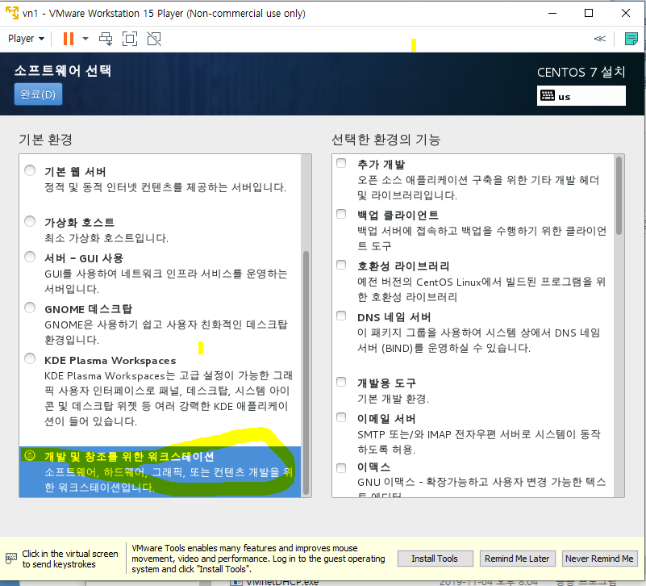


> 두번 click vkxltus tjfwjd 

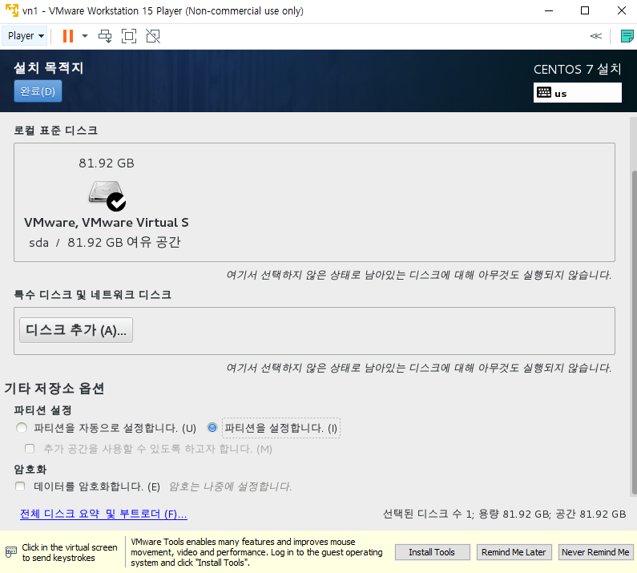

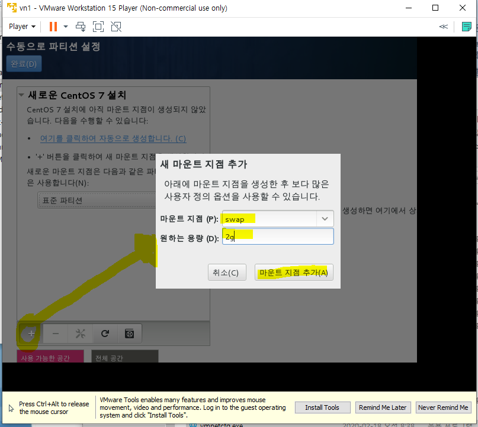

* swap - 여유 공간으로 가져가겠다.

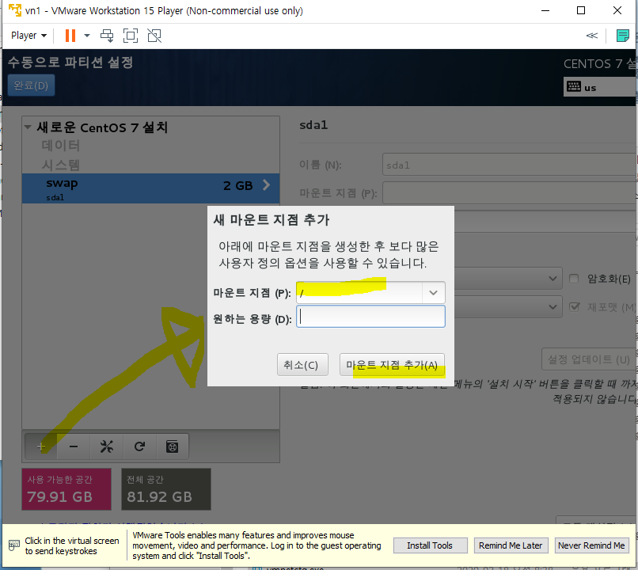

> 변경이 끝난후 설치 시작 버튼을 click 한다.

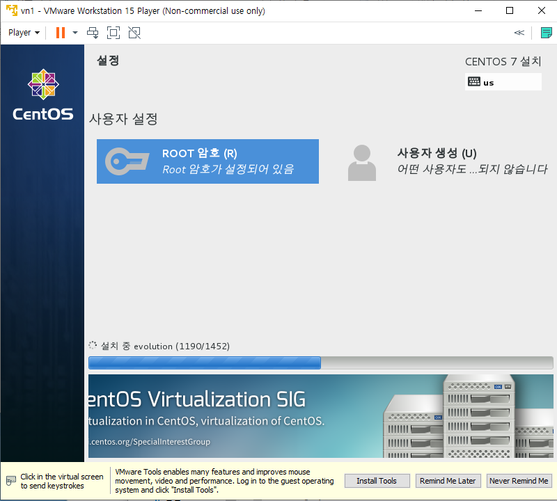

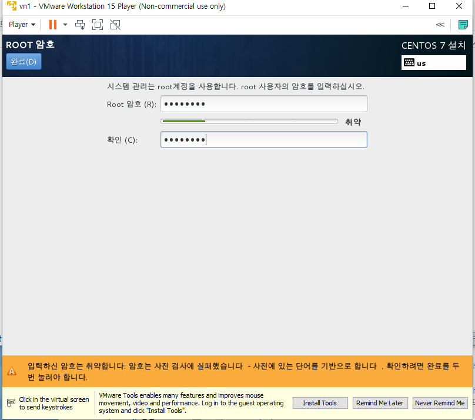

비밀번호(root계정) - password

계정 생성 - centos/centos

kdump 화면에서 kdump를 활성화하시겠습니까를 체크 해제후 다음으로 넘긴다.


## 자동 Update 사용 안함 설정

>  update 를 수동으로 설정

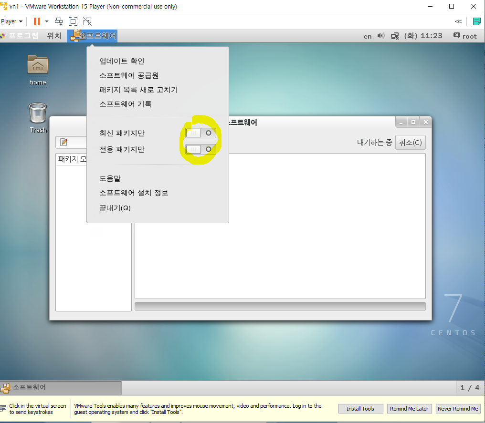

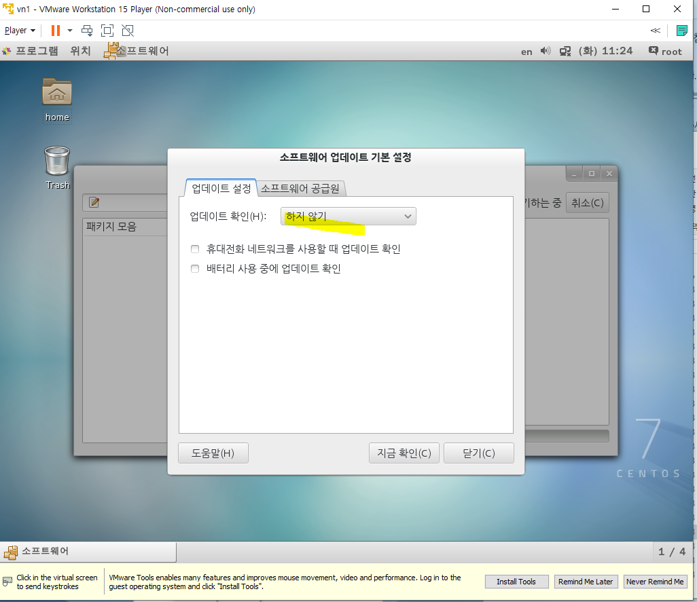

​					이후 닫기버튼


​					 # 는 admin 계정

​					 \는 사용자 계정

## 

```
[root@localhost ~]# cd /etc/yum.repos.d
[root@localhost yum.repos.d]# ls
CentOS-Base.repo  CentOS-Debuginfo.repo  CentOS-Sources.repo  CentOS-Vault.repo
[root@localhost yum.repos.d]# gedit CentOS-Base.repo
```

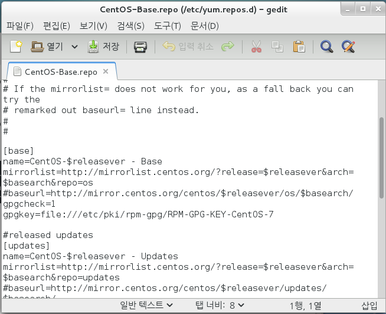

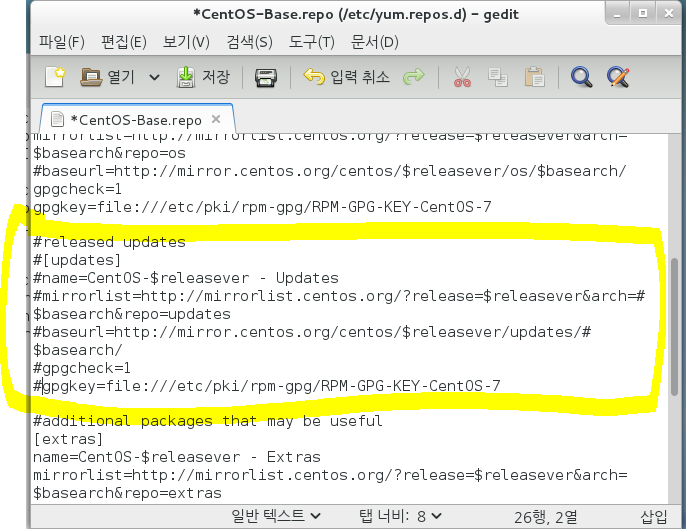

> 주석처리

```
^[[1;5C[root@localhost yum.repos.d]# gedit CentOS-Sources.repo
```

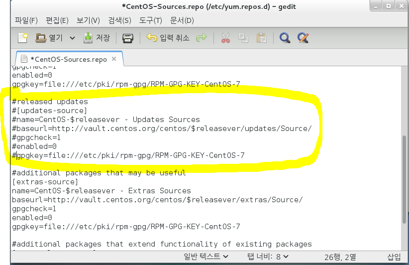

```
^[[BAnother app is currently holding the yum lock; waiting for it to exit...
  The other application is: PackageKit
    Memory :  40 M RSS (441 MB VSZ)
    Started: Tue Feb 18 11:43:19 2020 - 01:56 ago
    State  : Sleeping, pid: 5068
^Z
[1]+  Stopped                 yum clean all
[root@localhost yum.repos.d]# ps -ef | grep yum
root       5050   4947  0 11:40 pts/0    00:00:00 /usr/bin/python /bin/yum clean all
root       5068   2082  1 11:43 ?        00:00:01 /usr/bin/python /usr/share/PackageKit/helpers/yum/yumBackend.py get-updates none
root       5093   4947  0 11:45 pts/0    00:00:00 grep --color=auto yum
[root@localhost yum.repos.d]# kill -9 5068
[root@localhost yum.repos.d]# ps -ef | grep yum
root       5050   4947  0 11:40 pts/0    00:00:00 /usr/bin/python /bin/yum clean all
root       5104   4947  0 11:46 pts/0    00:00:00 grep --color=auto yum
[root@localhost yum.repos.d]# yum clean all
Loaded plugins: fastestmirror, langpacks
Cleaning repos: base extras
Cleaning up everything
Cleaning up list of fastest mirrors
[root@localhost yum.repos.d]# 

yom err - y 해결 방법
```


### NAT 방식 _(VMNET8 )

> 192.168.111.(0~255)

VM 컴퓨터 + host 컴퓨터들

* Network 설정

```
[root@localhost yum.repos.d]# ifconfig
eno16777736: flags=4163<UP,BROADCAST,RUNNING,MULTICAST>  mtu 1500
        inet 192.168.111.128  netmask 255.255.255.0  broadcast 192.168.111.255  
        
        inet 192.168.111.128 에 뒤에 128은 자동적으로 할당되어 자동적으로 바뀌게된다
        
        inet6 fe80::20c:29ff:fe87:2db0  prefixlen 64  scopeid 0x20<link>
        ether 00:0c:29:87:2d:b0  txqueuelen 1000  (Ethernet)
        RX packets 23494  bytes 30306371 (28.9 MiB)
        RX errors 0  dropped 0  overruns 0  frame 0
        TX packets 10532  bytes 807224 (788.3 KiB)
        TX errors 0  dropped 0 overruns 0  carrier 0  collisions 0

lo: flags=73<UP,LOOPBACK,RUNNING>  mtu 65536
        inet 127.0.0.1  netmask 255.0.0.0
        inet6 ::1  prefixlen 128  scopeid 0x10<host>
        loop  txqueuelen 0  (Local Loopback)
        RX packets 8  bytes 656 (656.0 B)
        RX errors 0  dropped 0  overruns 0  frame 0
        TX packets 8  bytes 656 (656.0 B)
        TX errors 0  dropped 0 overruns 0  carrier 0  collisions 0

virbr0: flags=4099<UP,BROADCAST,MULTICAST>  mtu 1500
        inet 192.168.122.1  netmask 255.255.255.0  broadcast 192.168.122.255
        ether 2a:8c:53:f0:ec:6b  txqueuelen 0  (Ethernet)
        RX packets 0  bytes 0 (0.0 B)
        RX errors 0  dropped 0  overruns 0  frame 0
        TX packets 0  bytes 0 (0.0 B)
        TX errors 0  dropped 0 overruns 0  carrier 0  collisions 0

```

* ip 자동 할당 수정

```
[root@localhost yum.repos.d]# cd /etc/sysconfig/network-scripts
[root@localhost network-scripts]# 
[root@localhost network-scripts]# pwd
/etc/sysconfig/network-scripts
[root@localhost network-scripts]# gedit ifcfg-eno16777736 
```

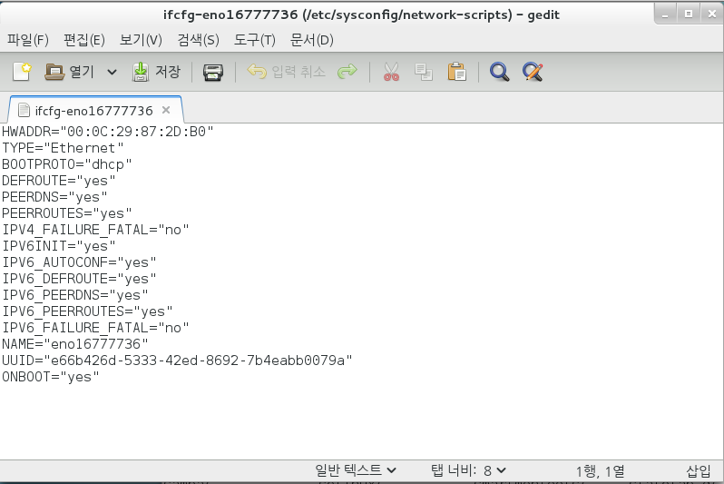

```
HWADDR="00:0C:29:87:2D:B0"
TYPE="Ethernet"
BOOTPROTO=none  =====
DEFROUTE="yes"
PEERDNS="yes"
PEERROUTES="yes"
IPV4_FAILURE_FATAL="no"
IPV6INIT="yes"
IPV6_AUTOCONF="yes"
IPV6_DEFROUTE="yes"
IPV6_PEERDNS="yes"
IPV6_PEERROUTES="yes"
IPV6_FAILURE_FATAL="no"
NAME="eno16777736"
UUID="e66b426d-5333-42ed-8692-7b4eabb0079a"
ONBOOT="yes"
IPADDR=192.168.111.100  =====
NETMASK=255.255.255.0  =====
GATEWAY=192.168.111.2  ====
DNS1=192.168.111.2  ====
```

* 수정후

> inet 192.168.111.128 => inet 192.168.111.100

```
[root@localhost network-scripts]# systemctl restart network
[root@localhost network-scripts]# ifconfig
eno16777736: flags=4163<UP,BROADCAST,RUNNING,MULTICAST>  mtu 1500
        inet 192.168.111.100  netmask 255.255.255.0  broadcast 192.168.111.255
        inet6 fe80::20c:29ff:fe87:2db0  prefixlen 64  scopeid 0x20<link>
        ether 00:0c:29:87:2d:b0  txqueuelen 1000  (Ethernet)
        RX packets 23517  bytes 30310626 (28.9 MiB)
        RX errors 0  dropped 0  overruns 0  frame 0
        TX packets 10571  bytes 812299 (793.2 KiB)
        TX errors 0  dropped 0 overruns 0  carrier 0  collisions 0

lo: flags=73<UP,LOOPBACK,RUNNING>  mtu 65536
        inet 127.0.0.1  netmask 255.0.0.0
        inet6 ::1  prefixlen 128  scopeid 0x10<host>
        loop  txqueuelen 0  (Local Loopback)
        RX packets 12  bytes 1076 (1.0 KiB)
        RX errors 0  dropped 0  overruns 0  frame 0
        TX packets 12  bytes 1076 (1.0 KiB)
        TX errors 0  dropped 0 overruns 0  carrier 0  collisions 0

virbr0: flags=4099<UP,BROADCAST,MULTICAST>  mtu 1500
        inet 192.168.122.1  netmask 255.255.255.0  broadcast 192.168.122.255
        ether 2a:8c:53:f0:ec:6b  txqueuelen 0  (Ethernet)
        RX packets 0  bytes 0 (0.0 B)
        RX errors 0  dropped 0  overruns 0  frame 0
        TX packets 0  bytes 0 (0.0 B)
        TX errors 0  dropped 0 overruns 0  carrier 0  collisions 0

[root@localhost network-scripts]# 

```


## 보안 설정

```
[root@localhost network-scripts]# gedit /etc/sysconfig/selinux
```

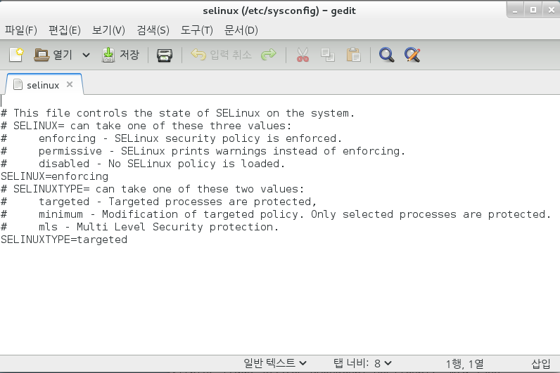

```
# This file controls the state of SELinux on the system.
# SELINUX= can take one of these three values:
#     enforcing - SELinux security policy is enforced.
#     permissive - SELinux prints warnings instead of enforcing.
#     disabled - No SELinux policy is loaded.
SELINUX=disabled
# SELINUXTYPE= can take one of these two values:
#     targeted - Targeted processes are protected,
#     minimum - Modification of targeted policy. Only selected processes are protected. 
#     mls - Multi Level Security protection.
SELINUXTYPE=targeted 
```

