# Tomcat 설치


## 파이어폭스 설치

> 최신 버전으로 적용

```
[root@localhost ~]# pwd
/root
[root@localhost ~]# cd 다운로드
[root@localhost 다운로드]# ls
apache-tomcat-9.0.30.tar.gz  jdk-8u241-linux-x64.tar.gz
firefox-72.0.2.tar.bz2       oracle-xe-11.2.0-1.0.x86_64.rpm.zip
hadoop-1.2.1.tar.gz
[root@localhost 다운로드]# tar cvf firefox-72.0.2.tar.bz2 
				.
			압축풀기
				.

[root@localhost 다운로드]# ls -l
합계 636400
-rwxrw-rw- 1 root root  11026056  2월 18 08:36 apache-tomcat-9.0.30.tar.gz
drwxr-xr-x 8 root root      4096  2월 20 15:09 firefox
-rwxrw-rw- 1 root root  66348863  2월 18 08:38 firefox-72.0.2.tar.bz2
-rwxrw-rw- 1 root root  63851630  2월 18 08:38 hadoop-1.2.1.tar.gz
-rwxrw-rw- 1 root root 194545143  2월 18 08:38 jdk-8u241-linux-x64.tar.gz
-rwxrw-rw- 1 root root 315891481  2월 18 08:38 oracle-xe-11.2.0-1.0.x86_64.rpm.zip

```

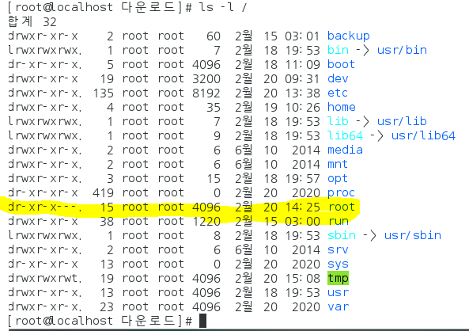

root 안에 파일이있으면 다른 사용자가 사용 불가능 ==>

```
[root@localhost 다운로드]# cd /root/다운로드
[root@localhost 다운로드]# ls -l
합계 636400
-rwxrw-rw- 1 root root  11026056  2월 18 08:36 apache-tomcat-9.0.30.tar.gz
drwxr-xr-x 8 root root      4096  2월 20 15:09 firefox
-rwxrw-rw- 1 root root  66348863  2월 18 08:38 firefox-72.0.2.tar.bz2
-rwxrw-rw- 1 root root  63851630  2월 18 08:38 hadoop-1.2.1.tar.gz
-rwxrw-rw- 1 root root 194545143  2월 18 08:38 jdk-8u241-linux-x64.tar.gz
-rwxrw-rw- 1 root root 315891481  2월 18 08:38 oracle-xe-11.2.0-1.0.x86_64.rpm.zip
[root@localhost 다운로드]# mv firefox /user/local
mv: cannot move `firefox' to `/user/local': 그런 파일이나 디렉터리가 없습니다
[root@localhost 다운로드]# mv firefox /usr/local
[root@localhost 다운로드]# ls -l /usr/local
합계 8
drwxr-xr-x. 2 root  root     6  6월 10  2014 bin
drwxr-xr-x. 2 root  root     6  6월 10  2014 etc
drwxr-xr-x  8 root  root  4096  2월 20 15:09 firefox
drwxr-xr-x. 2 root  root     6  6월 10  2014 games
drwxr-xr-x. 2 root  root     6  6월 10  2014 include
drwxr-xr-x  7 10143 10143 4096 12월 11 19:39 jdk1.8
drwxr-xr-x. 2 root  root     6  6월 10  2014 lib
drwxr-xr-x. 2 root  root     6  6월 10  2014 lib64
drwxr-xr-x. 2 root  root     6  6월 10  2014 libexec
drwxr-xr-x. 2 root  root     6  6월 10  2014 sbin
drwxr-xr-x. 5 root  root    46  2월 18 19:53 share
drwxr-xr-x. 2 root  root     6  6월 10  2014 src
[root@localhost 다운로드]# ln -s /usr/local/firefox/firefox /usr/local/bin

[root@localhost 다운로드]# cd /usr/local/bin
[root@localhost bin]# ls -l
합계 0
lrwxrwxrwx 1 root root 26  2월 20 15:15 firefox -> /usr/local/firefox/firefox
[root@localhost bin]# firefox -version
Mozilla Firefox 72.0.2
[root@localhost bin]# firefox

(firefox:19336): GLib-GObject-WARNING **: g_object_get_valist: object class `GtkSettings' has no property named `gtk-decoration-layout'

(/usr/local/firefox/firefox-bin:19569): GLib-GObject-WARNING **: g_object_get_valist: object class `GtkSettings' has no property named `gtk-decoration-layout'

(/usr/local/firefox/firefox-bin:19584): GLib-GObject-WARNING **: g_object_get_valist: object class `GtkSettings' has no property named `gtk-decoration-layout'

(/usr/local/firefox/firefox-bin:19659): GLib-GObject-WARNING **: g_object_get_valist: object class `GtkSettings' has no property named `gtk-decoration-layout'

(/usr/local/firefox/firefox-bin:19765): GLib-GObject-WARNING **: g_object_get_valist: object class `GtkSettings' has no property named `gtk-decoration-layout'
```

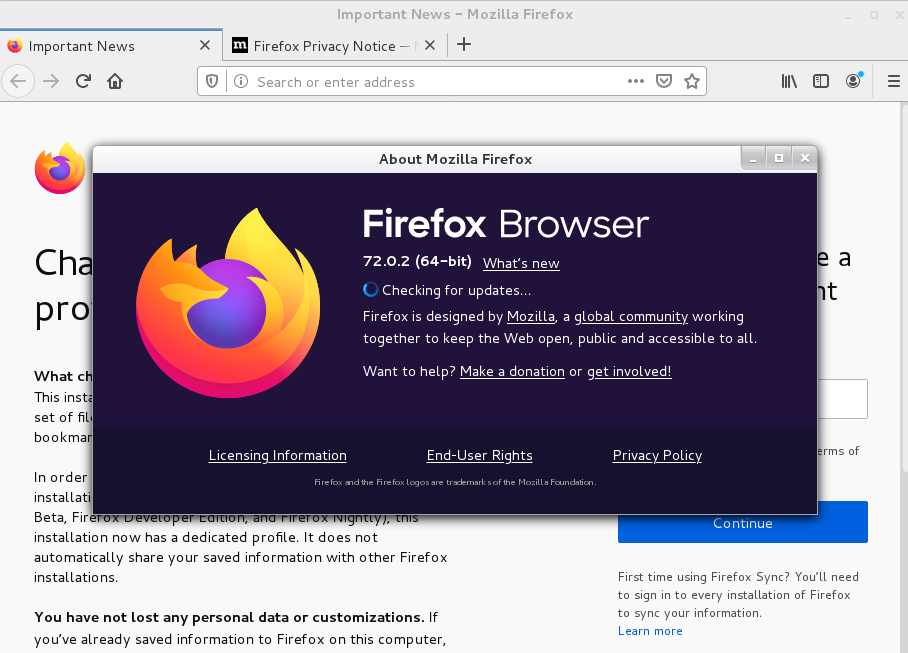

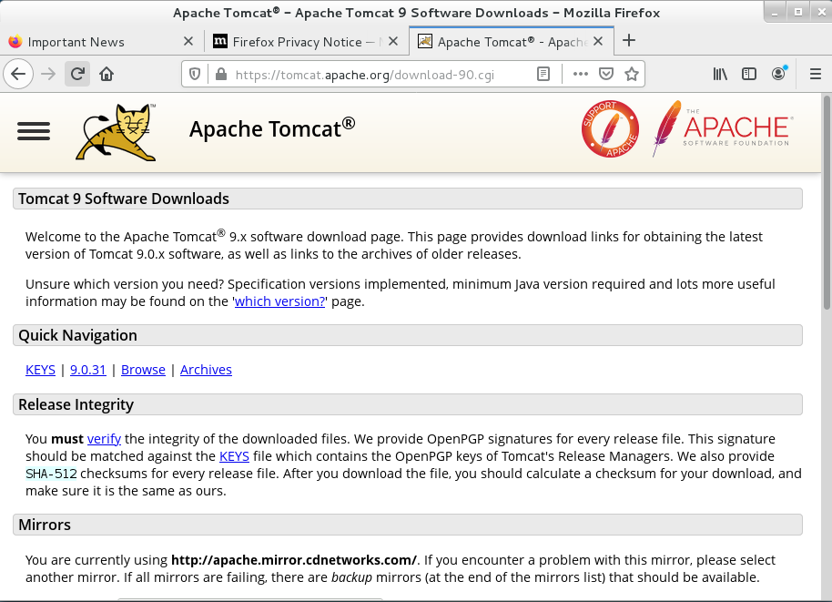


## firefox 충돌 에러 발생시

1. /root/다운로드/압축해제(파이어폭스)
2. ./root/다운로드/firefox/firefox


## Tomcat 설치

> 다운로드 폴더에서 압축 풀기 후 경로이동 

```
[root@localhost ~]# mv /root/다운로드/tomcat9 /usr/local
[root@localhost ~]# ls -l /usr/local/
합계 12
drwxr-xr-x.  2 root  root    20  2월 20 15:15 bin
drwxr-xr-x.  2 root  root     6  6월 10  2014 etc
drwxr-xr-x  10 root  root  4096  2월 20 15:21 firefox
drwxr-xr-x.  2 root  root     6  6월 10  2014 games
drwxr-xr-x.  2 root  root     6  6월 10  2014 include
drwxr-xr-x   7 10143 10143 4096 12월 11 19:39 jdk1.8
drwxr-xr-x.  2 root  root     6  6월 10  2014 lib
drwxr-xr-x.  2 root  root     6  6월 10  2014 lib64
drwxr-xr-x.  2 root  root     6  6월 10  2014 libexec
drwxr-xr-x.  2 root  root     6  6월 10  2014 sbin
drwxr-xr-x.  5 root  root    46  2월 18 19:53 share
drwxr-xr-x.  2 root  root     6  6월 10  2014 src
drwxr-xr-x   9 root  root  4096  2월 20 15:49 tomcat9
 ////////////////Tomcat 시작///////////////
[root@localhost ~]# /usr/local/tomcat9/bin/startup.sh 
Using CATALINA_BASE:   /usr/local/tomcat9
Using CATALINA_HOME:   /usr/local/tomcat9
Using CATALINA_TMPDIR: /usr/local/tomcat9/temp
Using JRE_HOME:        /usr/local/jdk1.8
Using CLASSPATH:       /usr/local/tomcat9/bin/bootstrap.jar:/usr/local/tomcat9/bin/tomcat-juli.jar
Tomcat started.      ====> 이 부분 확인

////////////////Tomcat 종료////////////////
[root@localhost ~]# /usr/local/tomcat9/bin/shutdown.sh 
Using CATALINA_BASE:   /usr/local/tomcat9
Using CATALINA_HOME:   /usr/local/tomcat9
Using CATALINA_TMPDIR: /usr/local/tomcat9/temp
Using JRE_HOME:        /usr/local/jdk1.8
Using CLASSPATH:       /usr/local/tomcat9/bin/bootstrap.jar:/usr/local/tomcat9/bin/tomcat-juli.jar

```

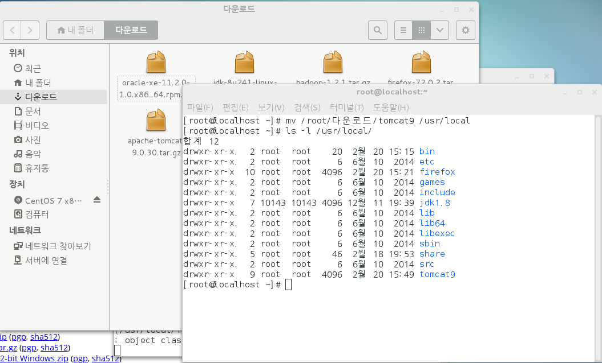

http://localhost:8080 검색 => 아래 화면 출력

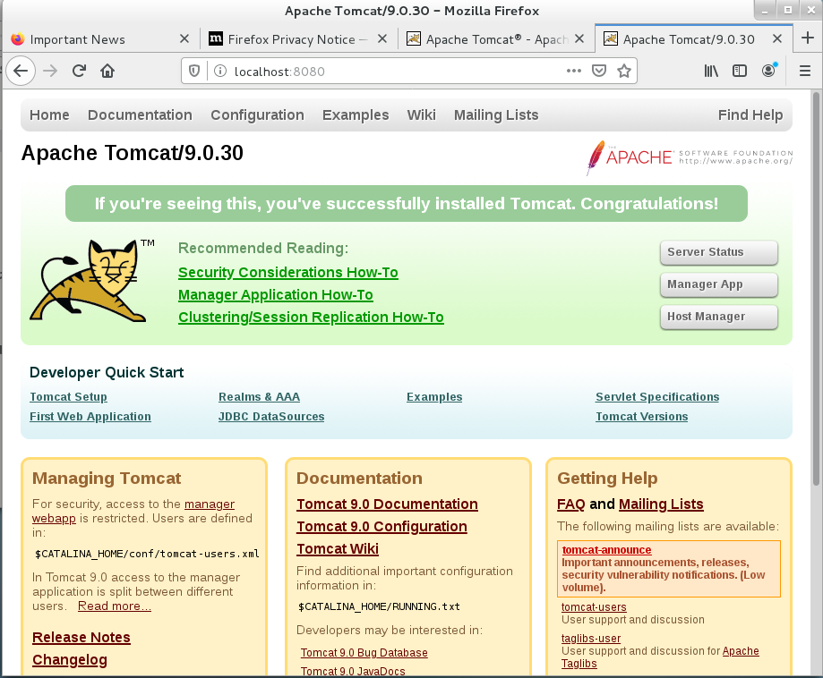


# 톰켓 접속

* /usr/local/tomcat9/bin/startup.sh 

```
[root@localhost ~]# /usr/local/tomcat9/bin/startup.sh 
Using CATALINA_BASE:   /usr/local/tomcat9
Using CATALINA_HOME:   /usr/local/tomcat9
Using CATALINA_TMPDIR: /usr/local/tomcat9/temp
Using JRE_HOME:        /usr/local/jdk1.8
Using CLASSPATH:       /usr/local/tomcat9/bin/bootstrap.jar:/usr/local/tomcat9/bin/tomcat-juli.jar
Tomcat started.
```

* Linux web(tomcat) server 접속

```
http://localhost:8080
http://192.168.111.100:8080/
```

방화벽 기본설정

##  port 번호 변경

> 8080 -->9090

```
[root@localhost ~]# gedit /usr/local/tomcat9/conf/server.xml 
[root@localhost ~]# /usr/local/tomcat9/bin/shutdown.sh 
Using CATALINA_BASE:   /usr/local/tomcat9
Using CATALINA_HOME:   /usr/local/tomcat9
Using CATALINA_TMPDIR: /usr/local/tomcat9/temp
Using JRE_HOME:        /usr/local/jdk1.8
Using CLASSPATH:       /usr/local/tomcat9/bin/bootstrap.jar:/usr/local/tomcat9/bin/tomcat-juli.jar
[root@localhost ~]# /usr/local/tomcat9/bin/startup.sh 
Using CATALINA_BASE:   /usr/local/tomcat9
Using CATALINA_HOME:   /usr/local/tomcat9
Using CATALINA_TMPDIR: /usr/local/tomcat9/temp
Using JRE_HOME:        /usr/local/jdk1.8
Using CLASSPATH:       /usr/local/tomcat9/bin/bootstrap.jar:/usr/local/tomcat9/bin/tomcat-juli.jar
Tomcat started.
```

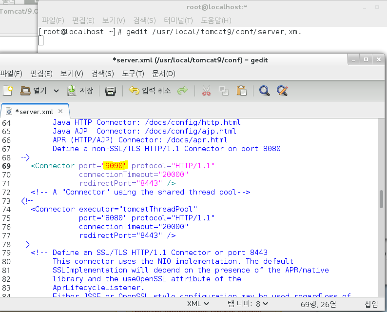


# 방화벽 상태확인/변경

* status firewalld - 방화벽 상태 확인

```
[root@localhost ~]# systemctl status firewalld
firewalld.service - firewalld - dynamic firewall daemon
   Loaded: loaded (/usr/lib/systemd/system/firewalld.service; enabled)
   Active: active (running) since 목 2020-02-20 09:31:18 KST; 24h ago
 Main PID: 749 (firewalld)
   CGroup: /system.slice/firewalld.service
           └─749 /usr/bin/python -Es /usr/sbin/firewalld --nofork --nopid

 2월 20 09:31:18 localhost.localdomain systemd[1]: Started firewalld - dynam...
 2월 20 13:16:38 localhost.localdomain firewalld[749]: 2020-02-20 13:16:38 E...
 2월 20 13:16:38 localhost.localdomain firewalld[749]: 2020-02-20 13:16:38 E...
 2월 20 13:17:17 localhost.localdomain firewalld[749]: 2020-02-20 13:17:17 E...
 2월 20 13:37:53 localhost.localdomain firewalld[749]: 2020-02-20 13:37:53 E...
 2월 20 13:37:53 localhost.localdomain firewalld[749]: 2020-02-20 13:37:53 E...
 2월 20 13:38:03 localhost.localdomain firewalld[749]: 2020-02-20 13:38:03 E...
Hint: Some lines were ellipsized, use -l to show in full.
```

## firewall-config - gui

### 방화벽 해제(window환경에서 접근 가능)

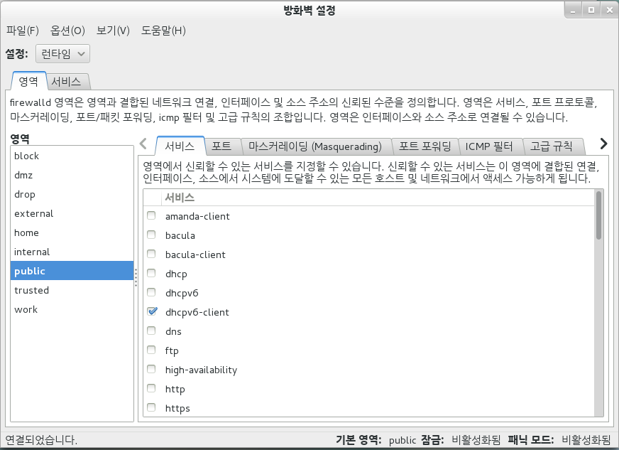

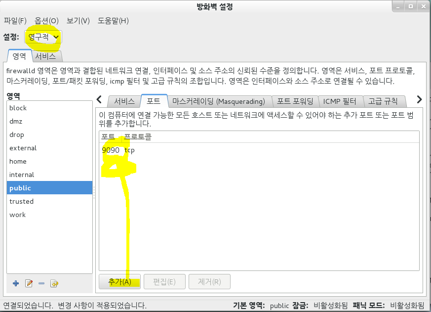

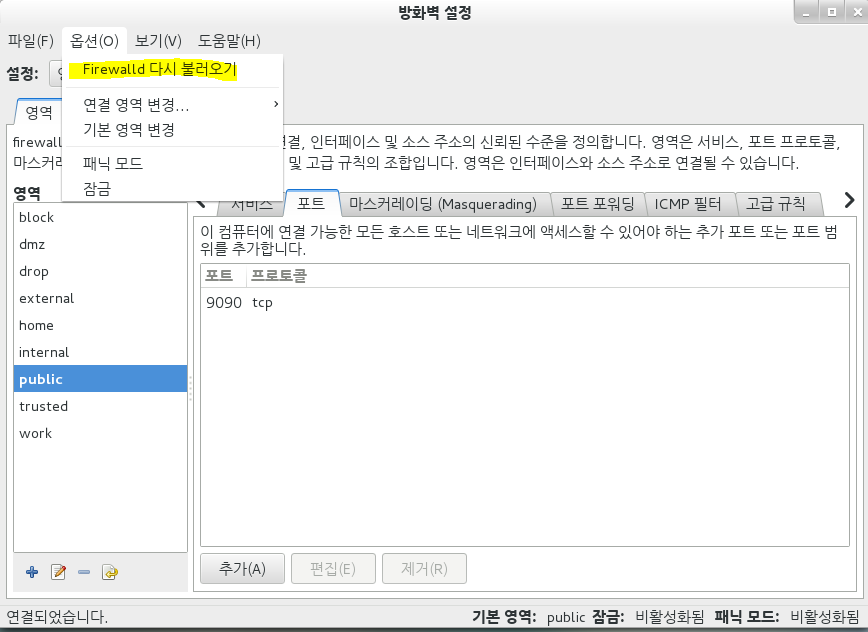

```
systemctl restart firewalld  ==>위 다시불러오기오와 같음
```

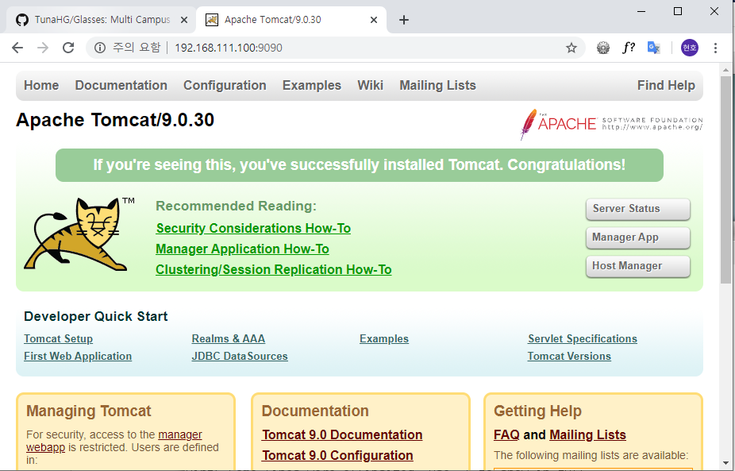

## firewall-cmd -cui

# 디플로이

## window 개발 - Linux 실행_디플로이

* 디플로이 Test

dynamicWebProject 생성 - test.jsp 파일 생성

우클릭 -export -Web -WRA file 

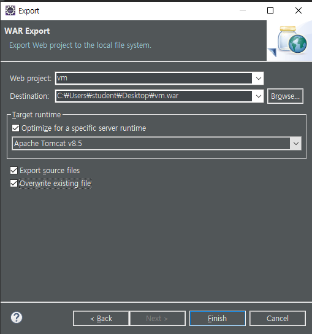 

xx.war 파일을 vmwrae에 붙여넣기함

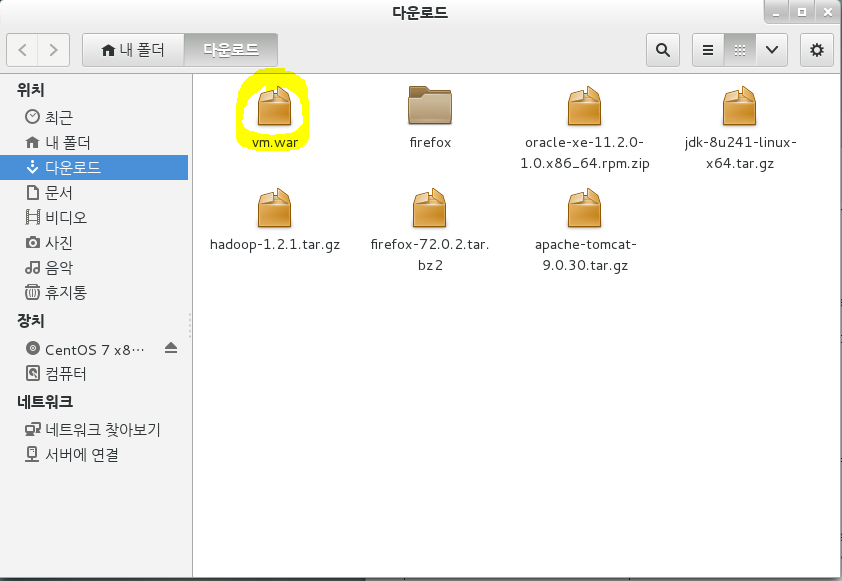

```
[root@localhost ~]# mv /root/다운로드/vm.war /usr/local/tomcat9/webapps/
[root@localhost ~]# cd /usr/local/tomcat9/webapps/
[root@localhost webapps]# ls -l
합계 12
drwxr-x---  3 root root 4096  2월 20 15:49 ROOT
drwxr-x--- 15 root root 4096  2월 20 15:49 docs
drwxr-x---  6 root root   78  2월 20 15:49 examples
drwxr-x---  5 root root   82  2월 20 15:49 host-manager
drwxr-x---  5 root root   97  2월 20 15:49 manager
drwxr-x---  4 root root   50  2월 21 10:30 vm  //톰켓이 실행되어있으면 알아서 압축을 해제해준다
-rw-------  1 root root  966  2월 21 10:27 vm.war
```

* Tomcat 폴더 에 xx.war 압축 파일이 존재할때 Tomcat이 실행 되어 있으면 알아서 압축을 해제해 준다.

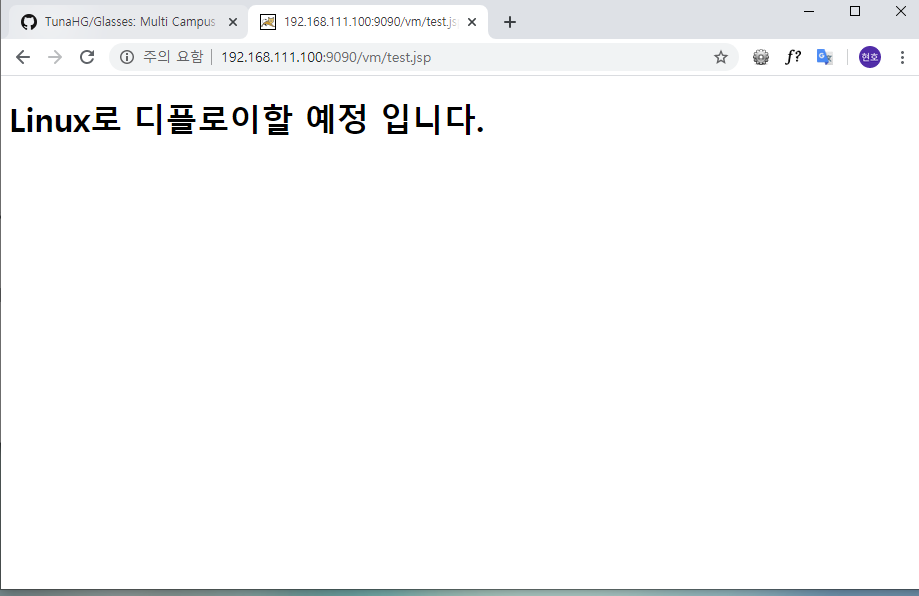

​							Linux환경에서 실행(winodw 에서 Linux 서버 접속 확인)

### window sprinng mvc 파일 --> Linux

```
[root@localhost ~]# mv /root/다운로드/spring.war /usr/local/tomcat9/webapps/
You have new mail in /var/spool/mail/root

[root@localhost webapps]# /usr/local/tomcat9/bin/startup.sh 
Using CATALINA_BASE:   /usr/local/tomcat9
Using CATALINA_HOME:   /usr/local/tomcat9
Using CATALINA_TMPDIR: /usr/local/tomcat9/temp
Using JRE_HOME:        /usr/local/jdk1.8
Using CLASSPATH:       /usr/local/tomcat9/bin/bootstrap.jar:/usr/local/tomcat9/bin/tomcat-juli.jar
Tomcat started.
[root@localhost webapps]# ls -l
합계 13672
drwxr-x---  3 root root     4096  2월 20 15:49 ROOT
drwxr-x--- 15 root root     4096  2월 20 15:49 docs
drwxr-x---  6 root root       78  2월 20 15:49 examples
drwxr-x---  5 root root       82  2월 20 15:49 host-manager
drwxr-x---  5 root root       97  2월 20 15:49 manager
drwxr-x---  5 root root       51  2월 21 10:51 spring
-rw-r--r--  1 root root 13986445  2월 21 10:47 spring.war
drwxr-x---  4 root root       50  2월 21 10:30 vm
-rw-------  1 root root      966  2월 21 10:27 vm.war
[root@localhost webapps]# 

```

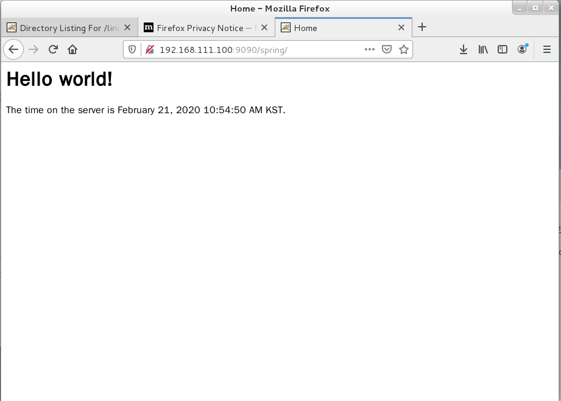

​							LInux firefox 에서 실행 화면