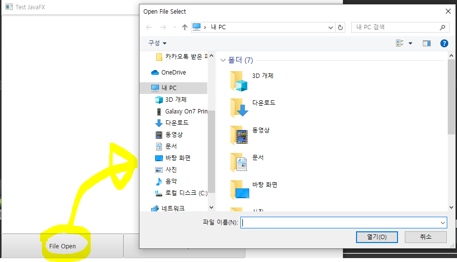

# Java IO

* java IO (입력/출력)
* Stream을 이용해 처리
  * data를 받아들이고 보낼 수 있는 통로
* Java프로그램의 표준출력(도스창) 에 문자열을 출력하고 싶다면 Java프로그램과 연결된 도스창에 대한 Stream이 존재 해야한다.

## Stream

* class가 존재 => 객체를 만들어서 method를 이용해서 데이터의 입출력 수행

* Stream은 2가지 종류가 있다.
  * 기본적이지만 단점으로 성능이 좋지 않다
  * Stream은 결합해서 더 좋은 Stream 을 만들 수 있다.

### InputStream

* 기본적인 입력 Stream

*  효율이 좋지 않으며 문자열을 읽어들이기에 좋지 않다.

  * InputStreamReader 을 이용해 문제점 보완
  * BufferedReader
    * BufferedReader를 이용하면 readLine() method를 이용할 수 있다.=> 한 줄을 받을 수 있음
    * 예외 상황이 발생할 수 있기때문에 try catch 를 해줘야함

  ```java
  InputStreamReader inputStreamReader = new InputStreamReader(System.in); 
  BufferedReader bufferedReader = new BufferedReader(inputStreamReader);
  // BufferedReader를 이용하면 readLine() method를 이용할 수 있다.=> 한 줄을 받을 수 있음
  try {
      String msg = bufferedReader.readLine();
      System.out.println("입력받은 문자열은:" +msg);
  } catch (IOException e) {
      // TODO Auto-generated catch block
      e.printStackTrace();
  }
  ```

* FileChooser 이용한 파일 열기 처리

```java
openBtn = new Button("File Open"); // button에 쓰일TExt ("")
		openBtn.setPrefSize(250, 50);
		openBtn.setOnAction(e -> {
			// 파일 열기 처리
			// 1.textArea초기화
			textArea.clear();
			// 2.Open할 파일을 선택 => File Chooser을 이용
			FileChooser fileChooser = new FileChooser();
			fileChooser.setTitle("Open File Select");
			// 파일 선택창에서 원하는 파일을 선택한 후 오픈 버튼을 누르면 파일 객체 생성
			File file = fileChooser.showOpenDialog(primaryStage);
			// Stream을 생성
			try {
				FileReader fileReader = new FileReader(file);
				BufferedReader bufferedReader = new BufferedReader(fileReader);
				String line = "";

				while ((line = bufferedReader.readLine()) != null) {
					printMsg(line);
				}

			} catch (FileNotFoundException e1) {
				e1.printStackTrace();
			} catch (IOException e2) {
				e2.printStackTrace();
			}
```




* 구조화된 데이터 처리(저장)
  * 파일에 Hashmap 데이터 저장


### OutputStream

* 기본적인 출력 Stream

  * PrintWriter
    * 대표적 출력 Stream

  ```java
  // 1. 로직처리를 통해 만들어진 데이터 구조 준비. => HashMap로 가정해서 진행
  Map<String, String> map = new HashMap<String, String>();
  map.put("1", "볶음밥");
  map.put("2", "갈비탕");
  map.put("2", "순대");
  map.put("3", "삼겹살");
  
  // 위 정보 Data를 File에 저장 => file에 어떤 방식으로 저장할지 결정(문자열형태로 저장 가정)
  File file = new File("asset/StringData.txt"); //  => 폴더/파일명
  // 대표적인 Stream : PrintWriter
  try {
      PrintWriter printWriter = new PrintWriter(file);
      printWriter.println("요것은 뭘까요????");
      printWriter.flush(); // 데이터를 보내주는 method
      printWriter.close(); // Stream을 닫음
  } catch (FileNotFoundException e) {
      // TODO Auto-generated catch block
      e.printStackTrace();
  }
  ```

  * Object Stream
    * Stream을 통해서 일반 문자열이 아닌 객체자체를 전달할 수 있다.
    * Object Serialization

  ```java
  Map<String, String> map = new HashMap<String, String>();
  map.put("1", "볶음밥");
  map.put("2", "갈비탕");
  map.put("2", "순대");
  map.put("3", "삼겹살");
  
  File file = new File("asset/StringData.txt"); // => 폴더/파일명
  FileOutputStream fos;
  // 대표적인 Stream : PrintWriter
  try {
      fos = new FileOutputStream(file); // 일반적잉 용도 STream저장
  
      ObjectOutputStream oos = new ObjectOutputStream(fos);
      //객체 직렬화를 통해서 저장하기를 원하는 객체를 Stream 을 통해서 보낼 수 있다.
      oos.writeObject(map);
      oos.flush();
      oos.close();
      fos.close();
  
  } catch (FileNotFoundException e) {
      // TODO Auto-generated catch block
      e.printStackTrace();
  } catch (IOException e) {
      // TODO Auto-generated catch block
      e.printStackTrace();
  }
  ```

  


