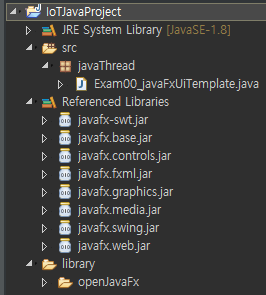
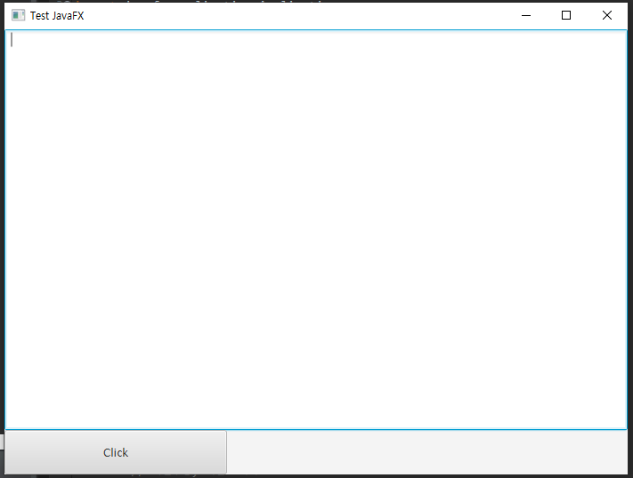

# Network Program

## Java Thread

> * 독립적 실행흐름
>   1. Thread class를 직접 상속해 사용
>   2.  Runnable Interface구현한 객체를 이용해 Thread생성

### JavaFX

* FX library  Download(JAR File)

  * project File right Click - new - property - Java build path -  library - Add JARs (JAR File찾아 경로 선택) - Apply

     

* Application class 상속

  ```java
  import javafx.application.Application;
  ```

  * start() method Override

    ```java
    @Override
    	public void start(Stage arg0) throws Exception {
    	}
    ```

* BorderPane

  * 동,서,남,북,중앙 으로 구성

* Java FX 화면 및 Code

 

```java
package javaThread;

import javafx.application.Application;
import javafx.event.ActionEvent;
import javafx.event.Event;
import javafx.event.EventHandler;
import javafx.scene.Scene;
import javafx.scene.control.Button;
import javafx.scene.control.TextArea;
import javafx.scene.layout.BorderPane;
import javafx.scene.layout.FlowPane;
import javafx.stage.Stage;

// javaFX 를 이용한 화면 UI 생성
// JavaFX library 활용
// 1.Application이라는 class 상속해서 우리 class를 define한다
// 2.Application이 가지고있는 start() abstract method를 overriding.

public class Exam00_javaFxUiTemplate extends Application {

	TextArea textArea;
	Button button;

	public static void main(String[] args) {
		// 화면에 창을 띄운다
		launch(); // 실행되면 start()가 호출
	}

	@SuppressWarnings("unchecked")
	@Override
	public void start(Stage primaryStage) throws Exception {
		// 화면구성, 이벤트 처리
		// 기본 layout 생성 => BorderPane(동,서,남,북,중앙 으로 구성)으로 생성
		BorderPane root = new BorderPane();
		root.setPrefSize(700, 500);// BorderPane ㅢㅇ size 설정(px 단위로 가로, 세로 길이 설정)

		textArea = new TextArea(); // 글 상자 생성
		root.setCenter(textArea); // BorderPane Center에 textArea 위치

		button = new Button("Click"); // button에 쓰일TExt ("")
		button.setPrefSize(250, 50);
		// button click event 처리
		button.setOnAction(new EventHandler() {
			@Override
			public void handle(Event arg0) {
				System.out.println("Button Clicked");
			}
		});

		// 일반 Panel 하나 생성 = > LinearLayout처럼 동장
		FlowPane flowPane = new FlowPane();
		flowPane.setPrefSize(700, 50);
		flowPane.getChildren().add(button); // FlowPane에 Button을 부착
		
		root.setBottom(flowPane); //전체 화면의 아래부분에 FlowPane 부착
		
		// Scene(장면) 필요하다.
		//primaryStage 라는 큰 창에 Scene 붙고 그 위에 BorderLayout이 올라온다 , BorderPane을 포함하는 장면이다
		Scene scene = new Scene(root); 
		primaryStage.setScene(scene); // window(primaryStage) 화면을 Scene로 설정
		primaryStage.setTitle("Test JavaFX");
		// window Close(X 버튼) 눌렀을때 어떻게 할지 
		primaryStage.setOnCloseRequest(new EventHandler() {
			@Override
			public void handle(Event arg0) {
				System.out.println("종료");
				System.exit(0); // 0 => program 강제종료
			}
		}); 
		primaryStage.show();
	}
}
```

#### Lambda

* Java 8 에서 제공하는 Java Lambda식을 이용
* 아래 Code를 Lambda 식 으로변경

```java
button.setOnAction(new EventHandler() {
    @Override
    public void handle(Event arg0) {
        System.out.println("Button Clicked");
    }
});
```

* Lambda Code
  * class 명, method 명 지움

```java
button.setOnAction(arg0 -> {
    System.out.println("Button Clicked");
	}
);
```

#### 동기화 처리

```java
button.setOnAction(arg0 -> {
			System.out.println("Button Clicked");
//				//동기화가 일어나지 않아 잘못된 결과를 나타낼 수 있다. (Thread 동가화 필요)
//				//직접 UI Component를 제어하는 방법은 좋지 않다.
//				textArea.appendText("Button Clicked"+"\n");
				//Thread 를 이용해서 메시지 출력하는 방식으로 이용.
				//runnable객체를 구현한 interface호출 
				//UI Component를 제어할때 Thread를 이용해서 제어해야 동기화 문제를 해결할 수있다.
//				Platform.runLater(new Runnable() { 
//				
//					@Override
//					public void run() {
//						// TODO Auto-generated method stub
//						textArea.appendText("Button Clicked"+"\n");
//					}
//				});
				// Lambda 식
			Platform.runLater(() -> {
				textArea.appendText("Button Clicked"+"\n");
			}
		);
	}
);
```


### Java Thread

* Thread.currentThread().getName() 
  * 현제 실행중인 Thread reference를 알아보는 방법

```java
package javaThread;

import javafx.application.Application;
import javafx.application.Platform;
import javafx.event.ActionEvent;
import javafx.event.Event;
import javafx.event.EventHandler;
import javafx.scene.Scene;
import javafx.scene.control.Button;
import javafx.scene.control.TextArea;
import javafx.scene.layout.BorderPane;
import javafx.scene.layout.FlowPane;
import javafx.stage.Stage;

public class Exam01_ThreadBasic extends Application {

	TextArea textArea;
	Button button;

	public static void main(String[] args) {
		// 현제 사용되는 Thread의 이름을 출력
		System.out.println(Thread.currentThread().getName()); //현제 수행중인 Thread 찾아옴
		launch(); 
	}
	@Override
	public void start(Stage primaryStage) throws Exception {
		System.out.println(Thread.currentThread().getName()); //현제 수행중인 Thread 찾아옴
		
		BorderPane root = new BorderPane();
		root.setPrefSize(700, 500);

		textArea = new TextArea(); 
		root.setCenter(textArea); 

		button = new Button("Click"); 
		button.setPrefSize(250, 50);

		button.setOnAction(arg0 -> {
				printMsg("Button Clicked");
			}
		);
		FlowPane flowPane = new FlowPane();
		flowPane.setPrefSize(700, 50);
		flowPane.getChildren().add(button); 

		root.setBottom(flowPane); 

		Scene scene = new Scene(root);
		primaryStage.setScene(scene); 
		primaryStage.setTitle("Test JavaFX");
		
		primaryStage.setOnCloseRequest(e -> {
				System.out.println("종료");
				System.exit(0); 
			}
		);
		primaryStage.show();
	}
	
	public void printMsg(String msg) {
		Platform.runLater(() -> {
			System.out.println(Thread.currentThread().getName()); //현제 수행중인 Thread 찾아옴
			textArea.appendText(msg+"\n");
			}
		);
	}
}
```


## Java I/O


java Network, java IO , java Thread

