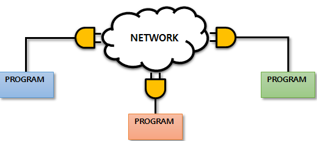
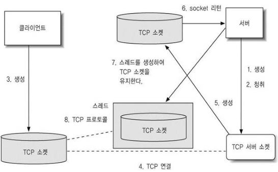

# Network

* 유선, 무선을 이용해서 데이터 통신을 하기 위해 컴퓨터를 논리적, 물리적으로 묶어놓은 형태

## network 형태

> 크기에 따라서 여러가지 형태로 구분
>
> **트레픽을 최소화** 하기 위해 구분

1. LAN - Local Area Network
   * 근거리 통신망(집, 사무실)
2. WAN - Wide Area Network
   * 광역 통신망
3. MAN - Metropoitan Area Network
   * 도시 지역 통신망(도시 하나의 단위)

## Internet

* Internet - Network of Network
  * 물리적인 네트워크 형태

### Service

* Internet 을 사용하기 위해서는 그 위에서 동작하는 Service가 있어야 한다.
  1. Web
  2. EMAIL
  3. Torrent
  4. Streaming
* Interntet위에서 각각의 서비스가 동작하려면 각 컴퓨터들이 서로를 인지할수 있는 수단이 필요
  * 각 컴퓨터마다 주소를 부여할 필요가 있다.
    * NIC - Network Interface Card => LAN Card
    * LAN Card에 IP Adress를 부여
      * IPv4 => xxx.xxx.xxx.xxx 
        * 초창기에 사용, 초기에는 문제없이 사용, 시간이 자나면서 주소수가 모자라지게됨
      * IPv6
        * 기존 주소를 확장해 만들어 짐

### IP Address(IPv4)

* LAN Card에 부여된 논리적 주소
  * 논리적 주소만으로는 컴퓨터간의 통신을 할 수 없다.
  * 물리적인 주소가 있어야 통신을 할수 있으며 이 **물리적 주소**를 **MAC Address**라고 한다
    * 내부적으로 논리적인 주소가 물리적 주소로 변환해 Network 사용
  * 논리적 주소 - 변경이 가능한 주소(IP주소)
  * 물리적 주소 - NIC에 고정이 되어있어 변경이 불가(MAC 주소)
* IP Address를 이용해서 특정 컴퓨터를 찾을 수 있다.
  * 숫자이기 때문에 기억하기가 쉽지 않아 도메인 네임을 사용
    * DNS(Domain Name System)를 도입  => www.goolge.com

* IP Address를 알아야 통신하고자 하는 상대방 컴퓨터를 인지 할 수 있다.
  * Protocol필요
    * TCP, IP ,ARP, TELNET, FTF, HTTP
  * Port - 컴퓨터내에 동작하고 있는 프로그램을 지칭하는 숫자
    * 숫자 0 ~ 65635 범위를 가지는 숫자 (Program에 할당된 번호)
    * 0 ~ 1023번까지는 예약이 되어 있다.
* 컴퓨터간 데이터를 주고 받으러면
  1. Protocol을 알아야한다
  2. IP Address를 알아야한다.
  3. Port 번호를 알아야한다

## Socket

* Network프로그램이 어려워 등장
* 복잡한 네트워크 처리
* 데이터를 송수신할 수 있도록 네트워크 환경에 연결할 수 있게 만들어진 연결부



* Output Stream
* Input Stream

### ServerSocket

* Server Socket Constructior는 TCP Port 를 parameter로 받는다

  ```java
  ServerSocket server = new ServerSocket(5556);
  ```

* accept()
  * Client의 Socket 객체가 생성될 떄까지 blocking되는 method
  * Client의 Socket 객체가 생성되면 Server에서 Client와 통신을할 수 있는 Socket 객체를 반환 
* close()
  * ServerSocket 객체를 닫는다
* getLocalPort()
  * ServerSocket 객체가 가지고 있는 Port Number 반환
* getSoTimout()
  * ServerSocket 클래스의 accept() method가 유효할 수 있는 시간을 mm/s로 반환 (0이면 무한대)
* isClosed()
  * ServerSocket 객체의 닫힘 상태 반환
* setSoTimeout(int timeout)
  * ServerSocket 클래스의 accept() 메서드가 유요할 수 있는 시간을 mm/s로 설정
  * 시간이 지나면 Java.net.SocketTimeoutExeption 발생
    * 해당 Exception 이 발생해도 ServierSocket객체는 계속 유지 된다.


## Java Network

* 프로그램은 CS구조를 자긴자 (Client Server)

   

* JavaNetwork 기본 예제

  * client

  ```java
  try {
      Socket socket = new Socket("localhost",5556);
      BufferedReader br = new BufferedReader(new InputStreamReader(socket.getInputStream())); //입력 Stream
      String msg = br.readLine();
      printMsg(msg);
      br.close(); //Stream close
      socket.close(); //socket close
  } catch (UnknownHostException e1) {
      e1.printStackTrace();
  } catch (IOException e1) {
      e1.printStackTrace();
  }
  ```

  * Server

  ```java
  try {
      ServerSocket server = new ServerSocket(5556);
      System.out.println("Server Create");
      // 2.Client 의 적속을 기다리기 위한 Method 호출
      // Client socket에 연결 
      Socket socket = server.accept(); // Blocking method => Client가 접속할때 까지 대기
      System.out.println("Client Connection");
      // 3.Socket이 생셩되면 데이터 입출력하기 위해 Stream을 생성
      String date = (new Date()).toLocaleString(); //현재 시간 구함
      PrintWriter out = new PrintWriter(socket.getOutputStream());
      out.println(date);
      out.flush();
      out.close(); //stream close
      socket.close(); //Client와 연결된 socket close
      server.close(); //ServerSocket close
  } catch (IOException e) {
      e.printStackTrace();
  } 
  ```

* Echo Program 예제

  * 클라이언트가 데이터를 서버에 전송
  * 서버가 데이터를 받아서 다시 클라이언트에게 전송
  * 전송받은 데이터를 TextArea에 출력
  * 위 작업 반복 (클라이언트가 EXIT를 입력 할떄까지)

  ```java
  EchoClient.class
  
  connButton.setOnAction(e -> {
      try {
          // 연결되면 TextArea의 내용 지운다
          textArea.clear();
          socket = new Socket("localhost", 5556);
          printMsg("Server Connection Success");
          textField.setDisable(false); // 입력상자 활성화
          printWriter = new PrintWriter(socket.getOutputStream());
          bufferedReader = new BufferedReader(
              new InputStreamReader(socket.getInputStream())); // 입력
  
      } catch (UnknownHostException e1) {
          e1.printStackTrace();
      } catch (IOException e1) {
          e1.printStackTrace();
      }
  });
  
  textField = new TextField();
  textField.setPrefSize(400, 50);
  textField.setDisable(true); // textField를 처음에 사용할수 없게 설정
  //Enter 를 치면 Action
  textField.setOnAction(e -> {
      String msg = textField.getText();
      printWriter.println(msg);
      printWriter.flush();
      textField.clear();
      if(!msg.equals("@EXIT")) {
          try {
              String revString = bufferedReader.readLine();
              printMsg(revString);
          } catch (IOException e1) {
              e1.printStackTrace();
          }
      }else {
          printMsg("Servier Connection END");
          textField.setDisable(true);
          if(printWriter != null) {
              printWriter.close(); //OutputStream close
          }
          if(bufferedReader != null) {
              try {
                  bufferedReader.close();
              } catch (IOException e1) {
                  e1.printStackTrace();
              } //InputStream close
          }
          if(socket != null) {
              try {
                  socket.close();
              } catch (IOException e1) {
                  e1.printStackTrace();
              } //Client와 연결된 socket close
          }
      }
  });
  ```

  ```java
  EchoServer.class
  
  try {
      ServerSocket server = new ServerSocket(5556);
      System.out.println("Server Create");
      // .Client 의 적속을 기다리기 위한 Method 호출
      // Client socket에 연결 
      Socket socket = server.accept(); // Blocking method => Client가 접속할때 까지 대기
      System.out.println("Client Connection");
      // 3.Socket이 생셩되면 데이터 입출력하기 위해 Stream을 생성
  
      BufferedReader bufferedReader = new BufferedReader(
          new InputStreamReader(socket.getInputStream())); //입력 Stream			
      PrintWriter printWriter = new PrintWriter(socket.getOutputStream());
      String msg = "";
      while(true) {
          msg = bufferedReader.readLine();  //클라이언트로 부터 데이터를 받아오는게 없으면 해당 Line에 멈춰있다.
          if(msg == null || msg.equals("@EXIT")) {
              break;
          }
          printWriter.println(msg);
          printWriter.flush();
      }
      if(printWriter != null) {
          printWriter.close(); //OutputStream close
      }
      if(bufferedReader != null) {
          bufferedReader.close(); //InputStream close
      }
      if(socket != null) {
          socket.close(); //Client와 연결된 socket close
      }
      if(server != null) {
          server.close(); //ServerSocket close
      }
      System.out.println("Server END");
  } catch (IOException e) {
      e.printStackTrace();
  } 
  ```

## Multi Echo Program

> 1 : N 통신



* Server Program이 accept() 작업을 반복하고 Input/outputStream 작업을 Thread에 할항 해준다
* Thread Pool을 생성
  * 제한된 Thread를 가지고 있는 Pool이아니라 필요한 갯수만큼 Thread를 가지고 있는 Thread Pool 생성

```java
ExecutorService executorService = Executors.newCachedThreadPool();
```

* Runnalble객체 

```java
Runnable runnable = new Runnable() {
    @Override
    public void run() {
    }
};

람다식
Runnable runnable = ()-> {	
};
```

### Code

* server 
  * Client의 TCP요청을 받아 Socket 객체를 생성하고 Socket을 유지하기 위한 Thread생성 Class
* Runnable
  * 각각의 Client의 Socket객체를 유지하기 위한 class
* Client
  * JavaFX를 이용한 체팅

* Server

```java
package network;
public class Exam03_MultiEchoServer extends Application {
	TextArea textArea;
	Button serverStartBtn;
	Button serverStopBtn;
	ServerSocket server;
	Socket socket;
	//Thread Pool을 생성(제한된 Thread를 가지고 있는 Pool이아니라 필요한 갯수만큼 Thread를 가지고 있는 Thread Pool 생성)
	ExecutorService executorService = Executors.newCachedThreadPool();
	int i = 0;

	public static void main(String[] args) {
		// 화면에 창을 띄운다
		launch(); // 실행되면 start()가 호출
	}
	@Override
	public void start(Stage primaryStage) throws Exception {
		BorderPane root = new BorderPane();
		root.setPrefSize(700, 500);
		textArea = new TextArea(); 
		root.setCenter(textArea); 

		serverStartBtn = new Button("Server Start"); 
		serverStartBtn.setPrefSize(150, 40);
		serverStartBtn.setOnAction(e -> {
			printMsg("[Server Start]");
			/**
			 * while 로 의해 무한 loop가 돌기떄문에 별도의 thread로 Event처리를 해줘야 한다.
			 * ExecutorService(Thread Pool)을 이용해서 Thread를 실행
			 */
			Runnable runnable = ()-> {
				try {
					server= new ServerSocket(5555); //ServerSocket이 있어야 서버역할을 할 수 있다.
					while(true) {
						printMsg("[new Client Connection]");
						//클라이언트와 연결된 소케을가지고 별도의 Thread가 실행
						socket = server.accept(); //Client가 접속되면 accept가 풀려 동작
						//Thread 실행 code
						Exam03_EchoRunnalbe echoRunnalbe = new Exam03_EchoRunnalbe(socket);
						executorService.execute(echoRunnalbe);
					}
				} catch (IOException e1) {
					e1.printStackTrace();
				}
			};
			executorService.execute(runnable);
		});

		serverStopBtn = new Button("Server Stop"); 
		serverStopBtn.setPrefSize(150, 40);
		serverStopBtn.setOnAction(e -> {
			try {
				socket.close();
				server.close();
			} catch (IOException e1) {
				e1.printStackTrace();
			}
			executorService.shutdownNow();
		});
		FlowPane flowPane = new FlowPane();
		flowPane.setPrefSize(700, 40);
		flowPane.setPadding(new Insets(10,10,10,10)); // 상,하,좌,우 Padding
		flowPane.setHgap(10); // Horizontal gap 10 pixel 간격
		flowPane.getChildren().add(serverStartBtn);
		flowPane.getChildren().add(serverStopBtn);

		root.setBottom(flowPane); // 전체 화면의 아래부분에 FlowPane 부착

		Scene scene = new Scene(root);
		primaryStage.setScene(scene); // window(primaryStage) 화면을 Scene로 설정
		primaryStage.setTitle("Multi Echo Server");
		primaryStage.setOnCloseRequest(e -> {
			System.out.println("echoServer 종료");
			System.exit(0); // 0 => program 강제종료
		});
		primaryStage.show();
	}
	
	//TextArea에 특정 문자열을 편하게 출력하기 위해 하나의 method를 만들어 사용
	public void printMsg(String msg) {
		Platform.runLater(() -> {
			textArea.appendText(msg + "\n");
		});
	}
}

```

* Client

```java
package network;

public class Exam03_MultiEchoClient extends Application {
	TextArea textArea;
	TextField textField;
	Button connButton;
	Socket socket;
	PrintWriter printWriter;
	BufferedReader bufferedReader;

	public static void main(String[] args) {
		// 화면에 창을 띄운다
		launch(); // 실행되면 start()가 호출
	}

	@Override
	public void start(Stage primaryStage) throws Exception {

		BorderPane root = new BorderPane();
		root.setPrefSize(700, 500);

		textArea = new TextArea();
		root.setCenter(textArea);

		connButton = new Button("Server Connection");
		connButton.setPrefSize(250, 50);
		connButton.setOnAction(e -> {
			try {
				// 연결되면 TextArea의 내용 지운다
				textArea.clear();
				socket = new Socket("localhost", 5555);
				printMsg("Server Connection Success");
				textField.setDisable(false); // 입력상자 활성화
				printWriter = new PrintWriter(socket.getOutputStream());
				bufferedReader = new BufferedReader(
                    new InputStreamReader(socket.getInputStream())); // 입력
			} catch (UnknownHostException e1) {
				e1.printStackTrace();
			} catch (IOException e1) {
				e1.printStackTrace();
			}
		});
		textField = new TextField();
		textField.setPrefSize(400, 50);
		textField.setDisable(true); // textField를 처음에 사용할수 없게 설정
		// Enter 를 치면 Action
		textField.setOnAction(e -> {
			String msg = textField.getText();
			printWriter.println(msg);
			printWriter.flush();
			textField.clear();
			if (!msg.equals("@EXIT")) {
				try {
					String revString = bufferedReader.readLine();
					printMsg(revString);
				} catch (IOException e1) {
					e1.printStackTrace();
				}
			} else {
				printMsg("Servier Connection END");
				textField.setDisable(true);
				if (printWriter != null) {
					printWriter.close(); // OutputStream close
				}
				if (bufferedReader != null) {
					try {
						bufferedReader.close();
					} catch (IOException e1) {
						e1.printStackTrace();
					} // InputStream close
				}
				if (socket != null) {
					try {
						socket.close();
					} catch (IOException e1) {
						e1.printStackTrace();
					} // Client와 연결된 socket close
				}
			}
		});

		FlowPane flowPane = new FlowPane();
		flowPane.setPrefSize(700, 50);
		flowPane.getChildren().add(connButton);
		flowPane.getChildren().add(textField);

		root.setBottom(flowPane);

		Scene scene = new Scene(root);
		primaryStage.setScene(scene);
		primaryStage.setTitle("Echo Network Program");

		primaryStage.setOnCloseRequest(e -> {
			System.out.println("EchoClient END");
			System.exit(0); // 0 => program 강제종료
		});
		primaryStage.show();
	}

	public void printMsg(String msg) {
		Platform.runLater(() -> {
			textArea.appendText(msg + "\n");
		});
	}
}
```

* Runnable

```java
package network;

import java.io.BufferedReader;
import java.io.IOException;
import java.io.InputStreamReader;
import java.io.PrintWriter;
import java.net.Socket;

public class Exam03_EchoRunnalbe implements Runnable {
	Socket socket;
	BufferedReader bufferedReader;
	PrintWriter printWriter;

	public Exam03_EchoRunnalbe(Socket socket) {
		this.socket = socket;
		try {
			this.bufferedReader = new BufferedReader(
                new InputStreamReader(socket.getInputStream()));
			this.printWriter = new PrintWriter(socket.getOutputStream());
		} catch (IOException e) {
			e.printStackTrace();
		}
	}
	@Override
	public void run() {
		String msg = "";
		while (true) {
			try {
				msg = bufferedReader.readLine();
				if (msg == null || msg.equals("@EXIT")) {
					break;
				}
				printWriter.println(msg);
				printWriter.flush();
			} catch (IOException e) {
				e.printStackTrace();
			}
		}
	}
}

```


# 참고 사이트

[Networ Socket](https://recipes4dev.tistory.com/153)

[ServerSocket 참고](https://zion437.tistory.com/135)