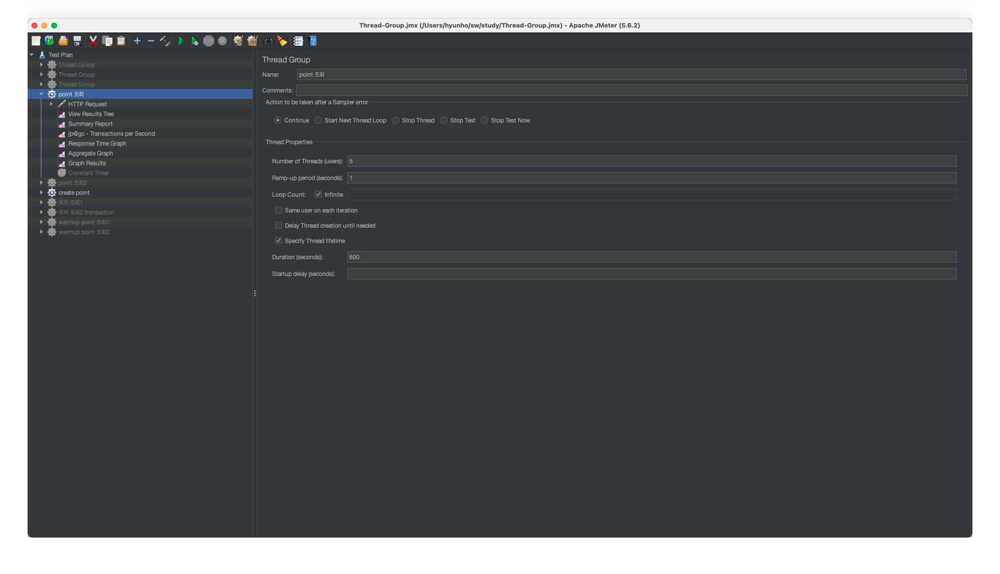
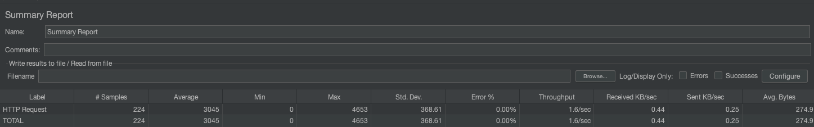

# JMeter

## Thread Group

JMeter에서 Thread Group 설정은 성능 테스트를 위해 가상 사용자를 생성하고 행동을 시뮬레이션하는 데 사용됩니다. 

위 이미지에 기반하여 각 설정에 대해 설명하겠습니다.

- **Name**: Thread Group의 이름을 설정합니다. 
- **Action to be taken after a Sampler error**:
  - **Continue**: 샘플러 에러가 발생해도 계속해서 테스트를 진행
  - **Start Next Thread Loop**: 현재 스레드를 중단하고 다음 스레드 루프를 시작.
  - **Stop Thread**: 현재 스레드를 중단.
  - **Stop Test**: 전체 테스트를 중단.
  - **Stop Test Now**: 즉시 전체 테스트를 중단.
- **Thread Properties**:
  - **Number of Threads (users)**: 동시에 실행될 가상 사용자(스레드)의 수(여기서는 5로 설정되어 있어, JMeter가 5개의 스레드를 생성합니다.)
  - **Ramp-up period (seconds)**: 스레드가 시작하는 데 걸리는 시간(초)입니다. 1초의 램프업 기간은 모든 스레드가 거의 동시에 시작됨을 의미합니다.
  - **Loop Count**: 테스트를 몇 번 반복할지 설정합니다. `Infinite` 체크박스가 선택되어 있으면 테스트는 무한 반복됩니다.
- **Specify Thread lifetime**:
  - **Duration (seconds)**: 스레드가 실행될 최대 시간(초)입니다.
  - **Startup delay (seconds)**: 스레드가 시작되기 전에 지연될 시간(초)입니다. (여기서는 10초로 설정되어 있으면, 첫 스레드가 시작된 후 10초 후에 나머지 스레드가 시작됩니다.)

## Summary Report

Summary Report는 성능 테스트 결과의 개요를 보여주는 지표들을 포함하고 있습니다

- **# Samples**: 테스트 중에 실행된 요청의 총 수입니다.
- **Average**: 모든 요청의 평균 응답 시간(밀리초)입니다. 
- **Min**: 모든 요청 중 최소 응답 시간(밀리초)입니다.
- **Max**: 모든 요청 중 최대 응답 시간(밀리초)입니다. 
- **Std. Dev.**: 응답 시간의 표준 편차(시간의 변동성)를 나타냅니다. (낮을수록 일관된 응답 시간을 의미)
- **Error **: 요청 실패 비율입니다.
- **Throughput**: 초당 처리량으로, 테스트 기간 동안 평균적으로 처리된 요청의 수입니다.(TPS)
- **Received KB/sec**: 서버에서 클라이언트로 초당 전송된 데이터의 평균 크기(KB)입니다.
- **Sent KB/sec**: 클라이언트에서 서버로 초당 전송된 데이터의 평균 크기(KB)입니다.
- **Avg. Bytes**: 평균 요청 크기(바이트)입니다. 

이러한 지표들은 API의 성능, 안정성 및 처리량을 평가하는 데 유용하며, 성능 튜닝이 필요한 영역을 식별하는 데 도움을 줍니다. (예를 들어, 평균 응답 시간이 높으면 서버의 응답 속도를 향상시킬 필요가 있을 수 있으며, 처리량이 낮으면 서버의 처리 능력을 증가시키는 조치를 고려해야 할 수 있습니다.)

