# 부하테스트
> jmeter

## jemeter 설치및 실행(mac os)
* 설치
```bash
brew install jmeter
```
* 실행
```bash
open /usr/local/bin/jmeter
```


## mysql connection information

connections 상태 (연결된 수)
```sql
mysql> SHOW STATUS LIKE 'Threads_connected';
+-------------------+-------+
| Variable_name     | Value |
+-------------------+-------+
| Threads_connected | 80    |
+-------------------+-------+
```
최대 connections 수
```sql
mysql> SHOW VARIABLES LIKE '%max_connection%';
+------------------------+-------+
| Variable_name          | Value |
+------------------------+-------+
| max_connections        | 151   |
| mysqlx_max_connections | 100   |
+------------------------+-------+
```
이건 기억 안난다..
```sql
mysql> SHOW VARIABLES LIKE '%max_allowed_packet%';
+----------------------------+------------+
| Variable_name              | Value      |
+----------------------------+------------+
| max_allowed_packet         | 67108864   |
| mysqlx_max_allowed_packet  | 67108864   |
| replica_max_allowed_packet | 1073741824 |
| slave_max_allowed_packet   | 1073741824 |
+----------------------------+------------+
```

## spring boot TreadPool, ConnectionsPool 설정
```yaml
spring:
# thread pool
  task:
    execution:
      pool:
        core-size: 80   # 기본 스레드 수
        max-size: 100    # 최대 스레드 수
        queue-capacity: 100  # 작업 대기열 용량
        keep-alive: 60s  # 초과 스레드 유지 시간

  datasource:
  # connections pool
    hikari:
      maximum-pool-size: 80
      minimum-idle: 10
      connection-timeout: 30000
      idle-timeout: 600000
      max-lifetime: 1800000
```


## Spring JVM 모니터링
> spring - prometheus - grafana

prometheus와 grafana는 docker container로 구성하였습니다.

### 1. Spring Boot에 Prometheus 의존성 추가.
의존성 추가
```bash
dependencies {
    implementation 'org.springframework.boot:spring-boot-starter-actuator'
    implementation 'io.micrometer:micrometer-registry-prometheus'
    implementation 'io.micrometer:micrometer-core'
}
```
application.yml 설정
```yaml
management:
  endpoints:
    web:
      exposure:
        include: prometheus
  metrics:
    export:
      prometheus:
        enabled: true
```
의존성 추가와 yml 설정을 하고 apllication 실행 후 `http://localhost:8080/actuator`로 접속하면 다음과 같이 정보를 확인 할 수 있습니다.
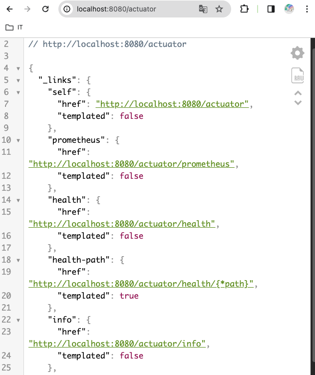

### 2. Prometheus, Grafana를 Docker Compose로 만들기
docker-compose파일 생성
```yaml
version: '3'

services:
  prometheus:
    image: prom/prometheus
    container_name: test-prometheus
    volumes:
      - ./prometheus.yml:/etc/prometheus/prometheus.yml
    ports:
      - "9090:9090"

  grafana:
    image: grafana/grafana
    container_name: test-grafana
    ports:
      - "3000:3000"
```
prometheus 설정 파일 생성
> 로컬 환경에서 실행 중인 Spring application을 타겟으로 하는 설정 파일입니다.
```yaml
global:
  scrape_interval: 15s

scrape_configs:
  - job_name: 'spring-boot'
    metrics_path: '/actuator/prometheus'
    static_configs:
      - targets: ['host.docker.internal:8080']
```
여기서 host.docker.internal은 Docker가 실행되는 호스트 시스템을 가리키는 특수 DNS 이름입니다. 이를 통해 컨테이너가 호스트 시스템의 네트워크 서비스에 접근할 수 있습니다.

```bash
└── APM
    ├── docker-compose.yml
    └── prometheus.yml
```
위에서 생성한 파일 폴더구조는 다음과 같으며, docker-compose를 생성한 위치에서 `docker-compose up`명령어를 실행시켜줍니다.
명령우 입력후 `docker ps`명령어로 container가 실행 되어있는지 확인 합니다.
```bash
 -MacBook-Pro  ~  docker ps
CONTAINER ID   IMAGE                        COMMAND                  CREATED        STATUS        PORTS                               NAMES
xxxxxxxxxxxx   grafana/grafana              "/run.sh"                3 hours ago    Up 3 hours    0.0.0.0:3000->3000/tcp              test-grafana
xxxxxxxxxxxx   prom/prometheus              "/bin/prometheus --c…"   3 hours ago    Up 3 hours    0.0.0.0:9090->9090/tcp              test-prometheus
```

Prometheus 확인
`http://localhost:9090` 접속하면 prometheus가 적용된걸 확인 할 수 있습니다.
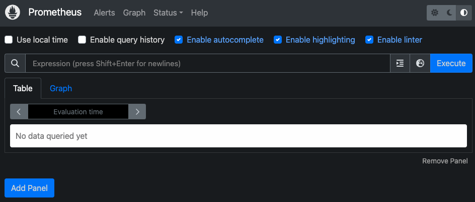
status-targets
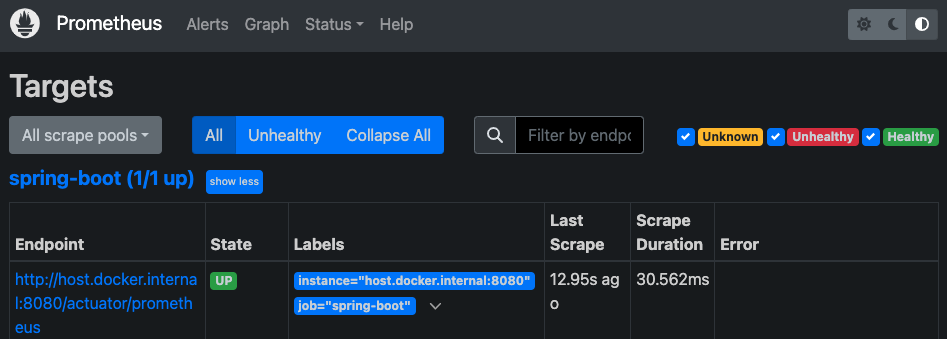

Grafana 설정
1. 브라우저에서 http://localhost:3000 주소로 Grafana 대시보드에 접속합니다.(기본 사용자 이름은 admin, 비밀번호도 admin입니다.)

2. 데이터 소스 추가: Prometheus를 데이터 소스로 추가합니다. URL은 http://prometheus:9090로 설정합니다.
   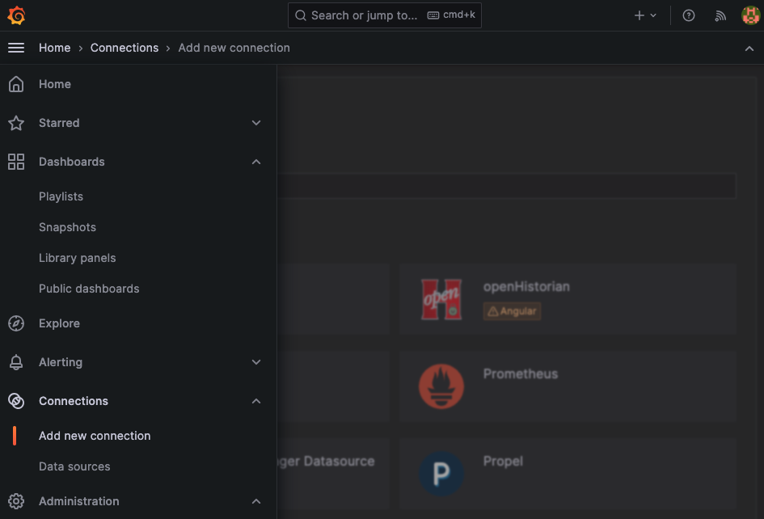
   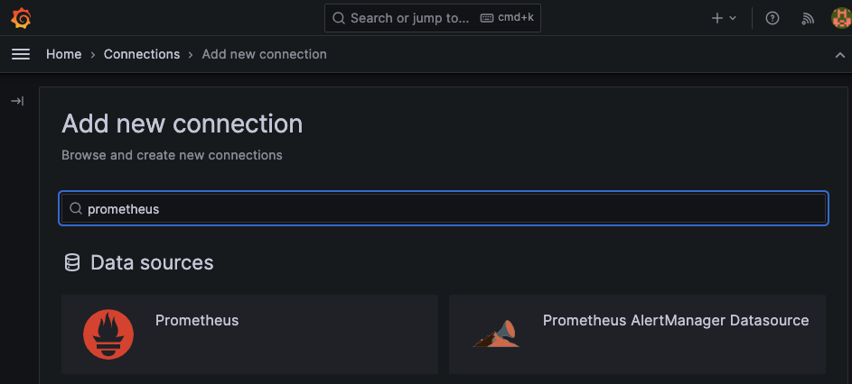
   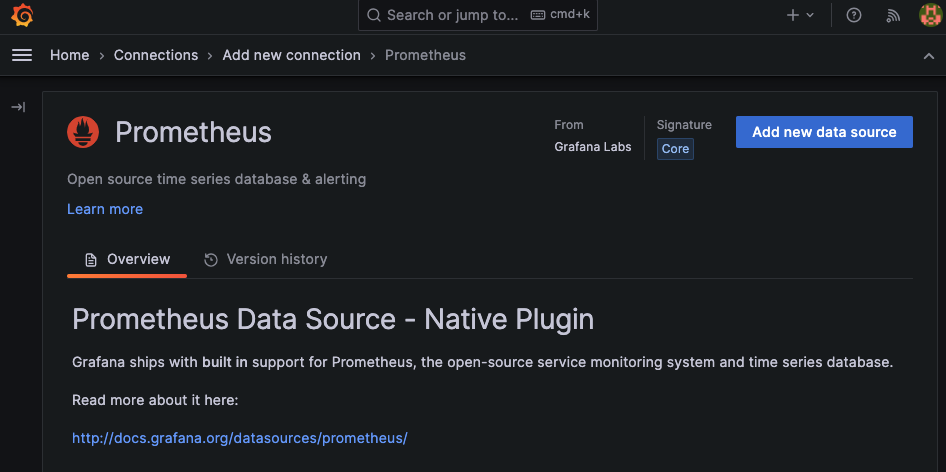
   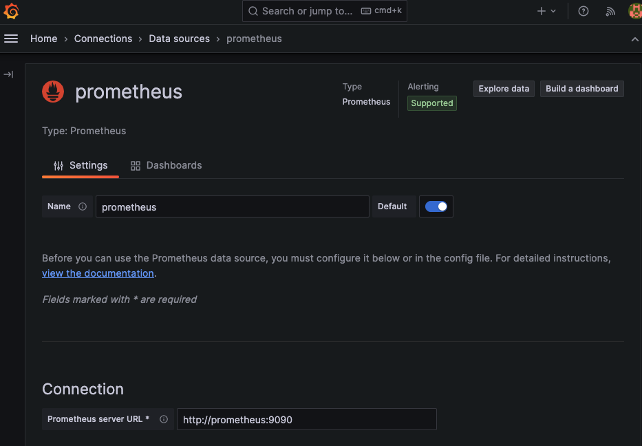
   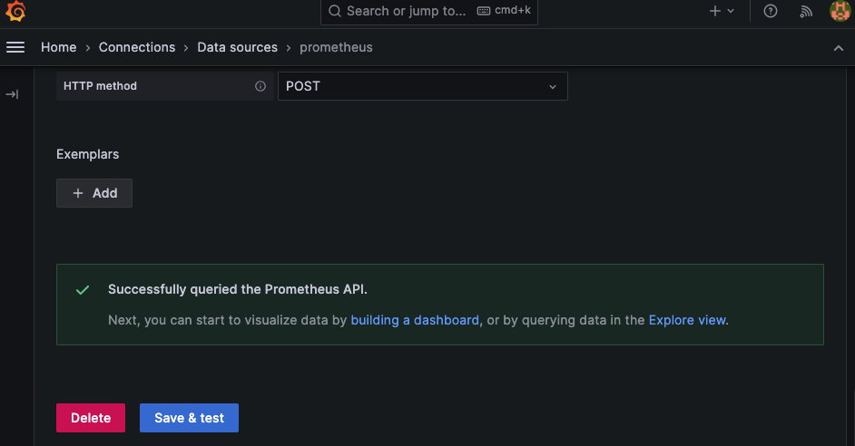

3. 대시보드 설정: Grafana에서 Prometheus 데이터 소스를 이용하여 대시보드를 생성하거나, 이미 만들어진 대시보드 템플릿을 사용합니다.
   위 `+`버튼을 누르고 import dashboard를 누르면 다음과 같은 화면이 나옵니다.
   load에 ID or URL을 임력후 load를 하면 적용이됩니다.
   ([GrafanaLabs](https://grafana.com/grafana/dashboards/19004-spring-boot-statistics/)해당 사이트에서 Dashboard template을 확인 할 수있습니다.)

   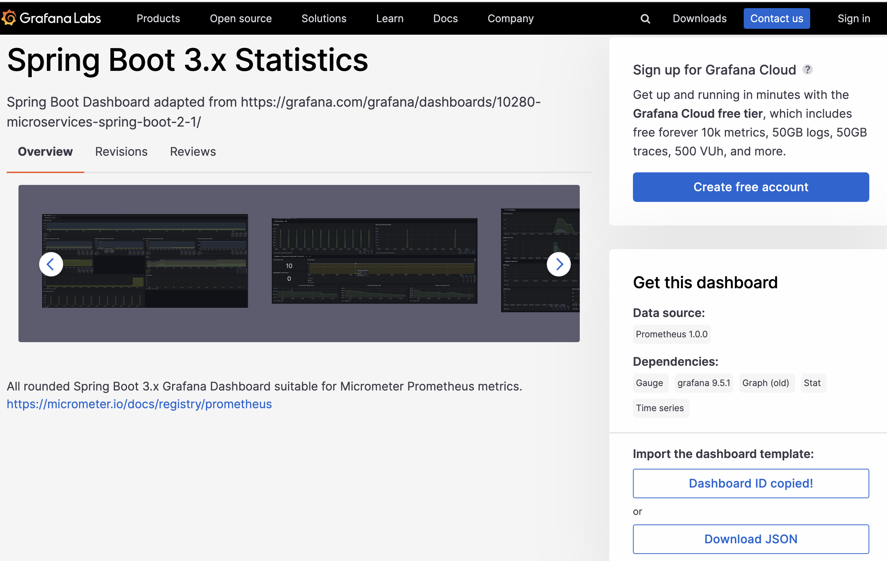
   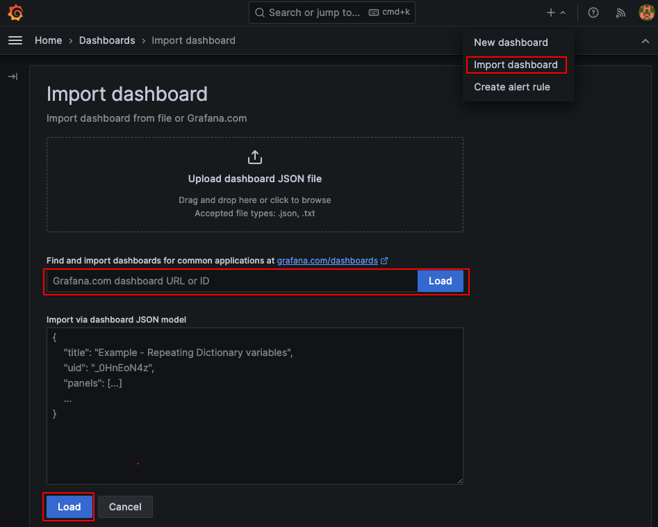
   

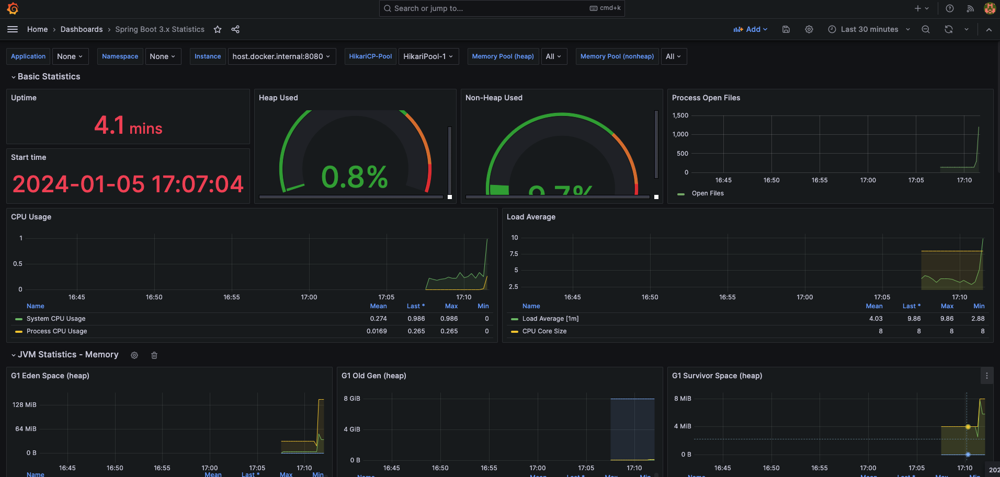